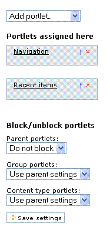

============================
6. Administración de Porlets
============================

Una introducción al uso y administración de porlets.

6.1. Jerarquía de Portlets
==========================

Los Portlets usan un enfoque de jerarquía básica para determinar como y por
que aparecen en cada sección de su sitio.

.. image:: images/portlet_block.GIF
    :alt: portlet_block.gif

Los Portlets usan un enfoque de jerarquía básica. Por defecto los Portlets
que usted asigne en la raíz (pagina de inicio) del sitio se propagaran por
todas las sub-secciones de este. Si usted desea un conjunto distinto de
Portlets para una sub-sección en particular, tiene que usar el control de
**Bloquear/No bloquear**, para "bloquear" los Portlets padres. Cuando usted
bloquea Porlets debe agregar explícitamente todos los Portlets que usted
desea ver en la pagina hija.

.. image:: images/image_preview_012.png
    :alt: hierarchy.gif

Como puede ver en este diagrama los Portlets están representados en azul bajo
cada titulo de Pagina.

Observe que hay dos Portlets designados a la Home page (Pagina de inicio):
navegation (Navegación) y recent items (Elementos recientes). Los mismos
portlets aparecen en la pagina About (Acerca) debido a la jerarquía de
Portlets.

No obstante, en la pagina Documentation (Documentación) añadimos un tercer
Portlet - el Portlet Collection (Colección) Aquí se permiten los Portlets
padres pero en adición, agregamos específicamente el Portlet de Colección.

En **ambas** paginas Tutorials (Tutoriales) y Vídeos hemos bloqueado los
Portlets padres ya que no queremos que el Portlet de Colección se muestra en
la pagina de Documentación. Cuando bloqueamos Portlets padres debemos re-
agregar **cada uno** de los Portlets en la pagina hija. En este caso se re-
agregaron los Portlets de Navegación y Búsqueda a ambas paginas.

Recuerde que las paginas hijas solo heredan de la pagina directamente encima
de ellas. En este ejemplo si agregamos una pagina llamada *Personal* bajo la
pagina Acerca y permitimos los Portlets padres sin agregar ninguno adicional,
esta mostrara los mismos Portlets de la pagina Acerca mostrados también en la
Pagina de inicio. Sin embargo, no piense que estos se heredaron de la Pagina
de inicio. Si quisiéramos agregar el Portlet de Búsqueda a la pagina Acerca,
nuestra pagina Personal entonces reflejaría los Portlets contenidos en la
pagina Acerca y no la Pagina de inicio.

6.2. Administrando Portlets
===========================

Como agregar, remover, y reorganizar Portlets.

Para empezar a administrar Portlets debe encontrar el **enlace para
Administrar portlets**, generalmente localizado a lo ultimo de las columnas
de los lados. En esta sección de Administrar Portlets, usted puede crear
nuevos Portlets, remover Portlets, y reorganizarlos.

.. image:: images/portlet_managelink.GIF
    :alt: portlet_managelink.gif
Haciendo clic en el enlace le llevara a una nueva pantalla que le permitirá
editar Portlets. La otra manera de obtener esta pantalla es añadiendo
/@@manage-portlets a la dirección URL de la pagina a la cual le queremos
editar los Portlets. Por ejemplo para editar los Portlets de la pagina Acerca
de, la dirección URL tendría que terminar de la siguiente manera:
www.myplonesite.org/about/@@manage-portlets.

Agregar un Portlet
------------------

Agregar un Portlet es tan simple como hacer clic en el menú desplegable
**Agregar portlet** y escoger aquel que usted desea agregar. En esta sección
cubriremos las distintas opciones disponibles.

Editando un Portlet existente
-----------------------------

 Para editar las propiedades de un Portlet existente, simplemente haga clic
 en el nombre de este. En el ejemplo de la izquierda, si quisiéramos editar
 las propiedades del Portlet Navigation (Navegación), se hace clic en
 *Navegación*. Cada tipo de Portlet tendrá diferentes opciones de
 configuración disponibles.

Reorganizando Portlets
----------------------

Para reorganizar sus Portlets. simplemente haga clic en la **flecha que
apunta hacia arriba o hacia abajo**. Esto afectara el orden en que se
muestran los Portlets en su pagina.

Removiendo Portlets
-------------------

Para remover un Portlet. haga clic en la **"X" roja **asociada a su nombre.

Como puede observar en la pantalla de Administrar Portlets, usted puede
trabajar con Portlets a la izquierda y a la derecha de su pagina. Esto se
debe a que hay dos columnas para ubicar a los Portlets; una columna izquierda
y una derecha. **Los Portlets aparecerán solo en el lado de la pantalla en
que usted los ubico**.

Usted puede agregar mas de un Portlet del mismo tipo en una pagina. No existe
ningún limite para el numero de veces que utiliza el mismo Portlet en un
pagina, así como no hay limite para el numero de Portlets en una pagina.

6.3. Tipos de Portlets
======================

Descripción de cada tipo de Portlet.

Existen distintos tipos de Portlets para escoger. Los denominaciones para los
distintos tipos de Portlets, a veces, puede ser confuso. Además algunos
pueden configurarse a través del opción Administrar Portlets y otros
requieren configuración a través de la ZMI (Interfaz de Administración de
Zope ), o creando primero otros elementos de contenido. A continuación una
básica descripción del uso y funcionalidad de cada tipo de Portlet
disponible.

Navegación
----------

El Portlet de Navegación **le permite a los usuarios navegar su sitio ** con
facilidad por medio de un "mapa estructurado del sitio" o un árbol de
navegación. Usted tiene la opción de mostrar la navegación general del sitio
o mostrar solo el contenido de la carpeta actual. En LearnPlone.Org usted
puede ver un ejemplo del Portlet de Navegación en la columna izquierda. A
medida que profundice en el sitio, el árbol seguirá creciendo. Hay varias
opciones de configuración disponibles que afectaran el comportamiento del
Portlet de Navegación.

Calendario
----------

El Portlet de Calendario es muy sencillo, lo que hace es mostrar un
calendario en su sitio. Este Portlet no tiene opciones de personalizacion. Si
usted tiene Eventos publicados en su sitio; los días en los cuales este
evento ocurrirá estarán en negrita en el Calendario y serán un enlace al
evento correspondiente de su sitio.

Clásico
------

Un Portlet Clásico se refiere a la forma en que los Portlets eran usados en
versiones mas viejas de Plone: antes de Plone 3. Usted debe crear una
plantilla de Pagina en la Interfaz de Administración de Zope y de manera
adecuada configurar la ruta y el macro para habilitar el Portlet. Esto
requiere un conocimiento técnico de la Interfaz de Administración de Zope y
TALES.

Colección
---------

El Portlet de Colección le permitirá **mostrar los resultados de una
Colección**. Usted debe tener una Colección previamente creada para agregar
este portlet, luego debe especificar la Colección que quiera usar. Esta es
una manera genial de resumir los resultados de una Colección importante, de
modo que sea fácilmente visible para el publico. Para instrucciones de como
crear un Portlet de Colección siga este `Como-hacer`_.

Eventos
-------

El Portlet de Eventos **muestra Eventos próximos**, en el caso de que usted
tenga Eventos en su sitio. Usted puede determinar cuantos Eventos quiere
mostrar y cuales basados en el Estado de Publicación.

Entrar
------

El Portlet de Inicio de sesión es otro que no es personalizable y simplemente
**muestra un campo para Inicio de sesión** que le permitirá a usuarios
registrados acceder al sitio. Una vez que el usuario haya iniciado sesión,
este Portlet no aparecerá.

Noticias
--------

El Portlet de Noticias funciona exactamente como el Portlet de Eventos. No
obstante en vez de mostrar Eventos, **muestra Noticias recientes**. Una vez
mas usted puede escoger cuantas Noticias quiere mostrar y filtrarlos basados
en su Estado.

Fuente RSS
----------

El Portlet de Fuente RSS le permite hacer un enlace a una Fuente RSS, escoger
el numero de elementos a mostrar, y especificar el tiempo máximo de intento
de recarga de fuente.

Elementos recientes
-------------------

El Portlet de Elementos recientes muestra un **numero personalizable de
Elementos recientes**, listados por Titulo. Estos son determinados por su
ultima fecha de modificación.

Lista de revisión
-----------------

El Portlet de Lista de Revisión mostrara una **lista de elementos que han
sido enviados a revisión**. Si usted esta usando un ciclo de enviar y revisar
(y ha establecido de manera correcta roles globales para sus usuarios), esta
es una manera excelente para que los revisores puedan ver el contenido con el
que tienen que trabajar. Este Portlet solo aparece para aquellos que han
iniciado sesión, es decir, que no esta disponible para el publico.

Búsqueda
--------

El Portlet de Búsqueda ubicara un cuadro de búsqueda en su columna de
Portlet. Este cuadro de búsqueda buscara títulos, descripciones, y contenido
de elementos en su sitio refiriéndose al texto introducido. Tiene la opción
de habilitar Live Search, que es una característica que le mostrara
sugerencias de búsqueda en tiempo real, si el navegador web soporta
JavaScript.

Texto estático
--------------

El Portlet de Texto estático le permite ingresar contenido tal como si fuera
un elemento de Pagina normal. Esto es útil para agregar hiperenlaces a
diferentes sitios o cualquier información que vaya a cambiar. Un ejemplo de
este Portlet seria el "Still Stumped?" ("¿Aun no entiende?") ubicado en la
parte derecha de este sitio. Para información en Portlets de texto estático
vea el Como-hacer de `Portlets estáticos`_.

Créditos de esta sección
------------------------

.. sectionauthor:: Luis Sumoza <lsumoza@gmail.com>
.. codeauthor:: Leonardo J. Caballero G. <lcaballero@cenditel.gob.ve>

