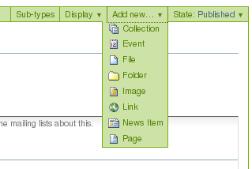
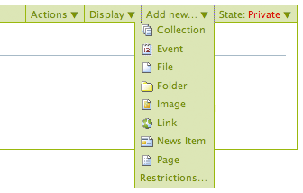
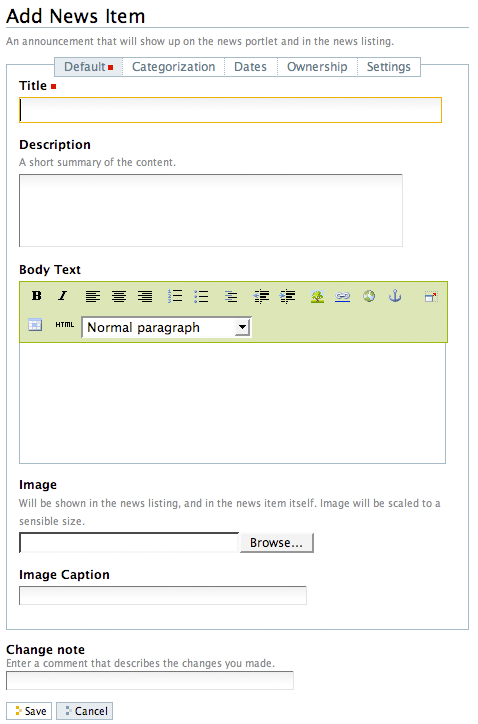
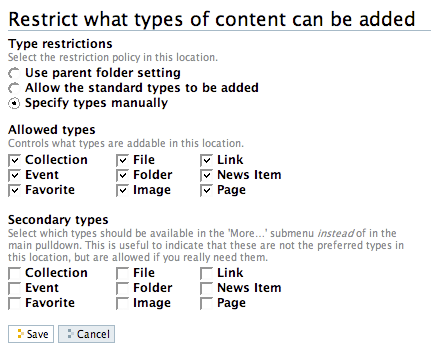

======================
2. Agregando Contenido
======================

Como agregar tipos de contenidos básicos a sitios web Plone

2.1. Agregando Nuevo Contenido
==============================

Una descripción general de como agregar nuevos elementos de contenidos en
Plone, incluyendo definiciones de cada tipo de contenido estándar.

Los nuevos contenidos son agregados vía el menú desplegable **Agregar elemento**:

Agregar contenido en Plone se hace de manera *agradable*, lo que quiere
decir que usted debe navegar a la sección de su sitio web Plone en donde
quiere que el nuevo contenido resida antes de usar el menú desplegable
**Agregar elemento**. Por supuesto usted puede cortar, copiar y pegar
elementos de contenido desde una sección a otra si es necesario.

Tipos de Contenido
------------------

En Plone, usted puede usar un numero de **Tipos de Contenido** para publicar
ciertos tipos de contenido. Por ejemplo, para subir una imagen usted puede
usar el tipo de contenido **Imagen**. La siguiente es una lista de tipos de
contenidos disponibles en el orden de su aparición, y para que se usa cada
uno:

Colección Las Colecciones son usadas para agrupar y mostrar contenido basado
en una serie de **criterios** los cuales puede definir. Estas trabajan como
una consulta a una base de datos.
Evento Un evento es un tipo de contenido como una pagina especial para
publicar información acerca de un evento (como una recaudación de fondos,
parrillada, etc). Este tipo de contenido tiene una función que le permite al
visitante del sitio agregar el evento a su calendario de escritorio con el
estándar iCal o vCal. Este formato es soportado por aplicaciones como: Google
Calendar, Outlook, Sunbird y otros.
Para agregar un evento a su calendario, haga clic en el enlace vCal o iCal al
lado del texto "Agregar evento al calendario" en la vista principal de un
elemento de evento.

.. image:: images/image_preview.jpeg
    :alt: Tabla resumen de Eventos

Desde Plone 3.3 usted puede obtener también todos los eventos en una carpeta
en un solo paso (actualmente solo disponible en formato iCal). Para descargar
el archivo iCal, agregue *@@ics_view* al final de la dirección URL de la
carpeta que contiene los eventos. Por ejemplo, si usted quiere obtener todos
los eventos dentro de la carpeta *Eventos* en el raíz de su sitio, vaya a
*http://misitio.com/events/@@ics_view*. Hay maneras para proveer un enlace a
este calendario iCal dentro de la Interfaz de usuario en futuras
publicaciones.Archivo Un archivo en Plone es cualquier archivo binario que
usted desee subir con la intención de que este sea descargado por los
visitantes de su sitio. Ejemplos comunes son archivos PDF, Documentos de
ofimática como MS Word y Hojas de Calculo.
Carpeta La carpetas trabajan en Plone muy parecido a como lo hacen las
carpetas en su computadora. Usted puede usar carpetas para organizar su
contenido, y dar a su sitio web Plone una estructura de navegación.
Imagen El tipo de contenido Imagen es usado para subir archivos de imagen
(JPG, GIF, PNG) que usted puede insertarlas dentro de paginas u otro tipos de
contenidos de tipo pagina.
Enlace También asociado como el 'Objeto enlace'; no confundirlos con los
enlaces que usted crea vía Kupu, editor visual de paginas Plone. El tipo de
contenido Enlace es regularmente usado para incluir un enlace a un sitio web
externo en la navegación y otros usos especializados.
Noticia Este tipo de contenido es similar al Evento, solamente que estos
elementos son especialmente para publicar noticias. Usted puede también
adjuntar una imagen miniatura a una Noticia, la cual aparecerá en la vista de
resumen en la carpeta al lado del resumen de la Noticia.
Pagina
Una Pagina en Plone es uno contenidos disponibles mas simples. uselas para
escribir la mayor parte de sus paginas web en el sitio Web Plone.

Nota: Dependiendo de que productos adicionales tenga usted instalado, tendrá
mas opciones en su menú desplegable **Agregar elemento** de las que
aparecen aquí. Para mas información acerca de esos tipos de contenidos
adicionales, consulte la documentación del Producto adicional a utilizar.

Titulo
------

Todos los tipos de contenidos en Plone tiene dos campos en común: **Titulo**
y **Descripción.**

El **Titulo** de los elementos de contenido, incluyendo carpetas, imágenes,
paginas, etc., puede ser cualquier cosa que usted quiera -- puede usar
cualquier carácter del teclado, incluyendo espacios. Los **Títulos** son
parte de la dirección web para cada elemento creado en Plone. La dirección
web, también conocida como URL, son las escritas en el navegador web para ir
a una ubicación especifica en un sitio web (o navegando a través del sitio),
como:

www.misitio.com/acerca/personal/sally/bio

o

www.misitio.com/imágenes/mariposas/skippers/long-tailed-skippers

Las direcciones web *si* tienen restricciones sobre los caracteres del
teclado permitidos, y los espacios no son permitidos. Plone hace el buen
trabajo de mantener las direcciones web correctas mediante el uso de
direcciones muy similares al **Titulo** que usted eligió, convirtiéndolas a
minúsculas, y sustituyendo guiones por espacios y otras puntuaciones.

En Plone nos referimos a la dirección web de un elemento como **nombre
corto**. Cuando usted use la función **Renombrar**, usted puede ver el nombre
corto junto con el titulo.

Los campos variaran en relación al tipo de contenido. Por ejemplo, el tipo de
contenido Enlace tiene el campo de dirección URL. El tipo de contenido
Archivo tiene el campo de Archivo, así continua con todos los campos.

Descripción
-----------

La **Descripción** aparece al tope de las paginas, justo abajo del Titulo.
Las descripciones regularmente son usadas en conjunción con una variante de
vistas de Carpeta y Colección (como un Estándar o Resumen). La Descripción
también aparece en los resultados de búsquedas vía el motor de búsqueda
nativa de Plone.

2.2. Agregando Carpetas
=======================

Agregar carpetas a un sitio web Plone es la forma básica de controlar la
organización del contenido.

Sin duda usted ha creado carpetas (directorios) guardadas en el disco duro de
su computadora. Las computadoras personales usan una jerarquía de carpetas
para organizar y estructurar los archivos y programas en el disco duro. Las
carpetas de Plone son esencialmente idénticas, excepto que son creadas en un
sitio web Plone para organizar contenido en el sistema de almacenamiento que
trae Plone.

Las carpetas son agregadas haciendo clic en el menú **Agregar elemento**
(usted necesita haber iniciado sesión para ver el menú **Agregar elemento**).
Seleccione **Carpeta** desde el menú desplegable:

Después de hacer clic para agregar una Carpeta usted vera el panel *Agregar Carpeta*:

.. image:: images/addfolder.png
  :alt:

Rellene el **Titulo**, que es requerido como lo indica el cuadrado rojo. La
**Descripción** es opcional; usted siempre puede volver al panel de edición
si necesita agregar una descripción para la carpeta. Las descripciones son
útiles cuando un visitante del sitio usa la herramienta de búsqueda incluida
con Plone - los resultados se mostraran con ambos, el Titulo y la Descripción
del elemento.

Usted notara también pestañas en la parte superior:

-   *Predeterminado*, para ingresar los campos Titulo y Descripción,
-   *Categorización,* para especificar las categorías que se aplican a la
    carpeta (tal vez las conozca como *palabras claves*),
-   *Fechas*, para configurar el periodo de tiempo durante el cual la
    carpeta debería estar disponible para ser vista en el sitio web,
-   *Propietario*, para especificar el creador y/o contribuidores al
    elemento de contenido,
-   *Configuración,* para permitir comentarios acerca del elemento y si
    este se muestra en el menú de navegación del sitio web.

Estas pestañas son estándar, por lo tanto las vera cuando haga clic en otros
tipos de contenido. Estas pestañas serán analizadas en otra sección de este
manual de usuario.

Asegúrese de hacer clic en el botón **Guardar** al final de la pagina cuando
haya terminado. Esto completara el proceso de creación de una carpeta.

.. image:: images/lights-camera-action_002.png
  :alt: lights-camera-action.png

Ver un vídeo sobre como `agregar una carpeta`_ en Plone 2 (significativamente diferente).

2.3. ¿Que hay en un nombre web?
===============================

Los elementos individuales de contenido en un sitio web Plone tienen
direcciones web distintas. Plone crea estas automáticamente basándose en el
titulo que usted elija.

¿Que hay en un nombre web?
--------------------------

El **Titulo** de los elementos de contenido, incluyendo carpetas, imágenes,
paginas, etc., puede ser cualquier cosa que usted quiera -- puede usar
cualquier carácter del teclado, incluyendo espacios. Los **Títulos** se
vuelven parte de la dirección web de cada elemento que usted crea en Plone.
Las direcciones web, también conocidas como URL, son las que usted escribe en
un navegador web para ir a una posición especifica en un sitio web (o
navegando a través del sitio), como:

www.misitio.com/acerca/personal/sally/bio

o

www.misitio.com/imágenes/mariposas/skippers/long-tailed-skippers

Las direcciones web *si* tienen restricciones sobre los caracteres del
teclado permitidos, y los espacios no son permitidos. Plone hace el buen
trabajo de mantener las direcciones web correctas mediante el uso de
direcciones muy similares al **Titulo** que usted eligió, convirtiéndolas a
minúsculas, y sustituyendo guiones por espacios y otras puntuaciones.

Para ilustrar tomemos cada una de estas direcciones web y divida cada una en
las partes que las componen: ::

    www.misitio.com/acerca/personal/sally/bio
        ^
        nombre del sitio web
                       ^
                       una carpeta llamada Acerca
                             ^
                             una carpeta llamada Personal
                                       ^
                                       una carpeta llamada Sally    
                                            ^
                                            una carpeta llamada Bio

En este ejemplo Plone cambio cada titulo de carpeta a minúscula, por ejemplo,
de Personal a personal. Usted no tiene que preocuparse por esto. Plone se
encarga de las direcciones web; usted solo escribe los títulos de la forma
que quiera.

Y, para el segundo ejemplo: ::

    www.misitio.com/imágenes/mariposas/skippers/long-tailed-skippers
        ^
        nombre del sitio web
                       ^
                       una carpeta llamada Imágenes
                              ^
                              una carpeta llamada Mariposas
                                          ^
                                          una carpeta llamada Skippers
                                                           ^
                                                           una carpeta llamada Long-Tailed Skippers

Este ejemplo es similar al primero, ilustrando una conversión a minúscula del
titulo de cada carpeta a la parte correspondiente de la dirección web. Note
el caso de la carpeta llamada Long-tailed Skippers. Plone mantiene el guión,
ya que este es permitido en el titulo y como parte de la dirección web, pero
cambio el espacio entre las palabras Tailed y Skippers por un guión en la
dirección web, así como también conversión a minúsculas.

En Plone nos referimos a la dirección web de un elemento como **nombre
corto**. Cuando usted use la función **Renombrar**, usted puede ver el nombre
corto junto con el titulo.

2.4. Agregando imágenes
=======================

Agregar imágenes a un sitio web Plone es una tarea básica que puede
involucrar un poco de trabajo en su computadora local, pero es esencial
porque las fotografías, mapas y gráficos personalizados son muy importantes
en los sitios web.

    `Preparando imágenes para la Web`_

    **Recuerde usar formatos de archivos que sean estándares para la web para cada una de las imágenes. Los formatos aceptados incluyen: JPG, JPEG, GIF, y PNG. No use formatos BMP o TIFF ya que estos no son completamente compatibles con los navegadores web.**

Cuando este listo para agregar una imagen use el menú desplegable *Agregar
elemento* (usted solo vera el menú *Agregar elemento* después de iniciar
sesión):

.. image:: images/addnewmenu.png
  :alt:

Después de hacer clic para agregar una **Imagen** usted vera el panel
*Agregar Imagen*:

.. image:: images/addimage.png
  :alt:

Ahí se encuentran los campos Titulo y Descripción (campo como "espacio para
introducir datos") como cuando agrego una Carpeta anteriormente, y en la
parte inferior hay un lugar para subir una imagen. Veamos los tres campos de
entrada individualmente:

-   *Titulo* - Use el texto que usted quiera, incluso con espacios y
    puntuación (Plone se encarga de generar la dirección web).

-   *Descripción* - Siempre es una buena idea, pero totalmente opcional.
    Deje el campo vacío si quiere.

-   *Imagen* - El campo Imagen es una caja de entrada de texto con un
    botón de examinar...Aquí no tiene que escribir nada; solo haga clic en el
    botón examinar...y podrá buscar la imagen en su computadora que quiera
    subir (*Recordar*: Usted necesita *recordar* donde tiene las imágenes en
    su computadora).

Para las imágenes, como mínimo, escribe el titulo y busca esta en su
computadora local, luego hace clic en el botón **Guardar** en la parte
inferior para subir la imagen al sitio web Plone. Usted tendrá que esperar
algunos segundos hasta que termine de subirse la imagen (o un minuto mas o
menos si tiene una conexión web lenta). Se mostrara una visualización previa
de la imagen subida cuando la imagen haya cargado por completo.

2.5. Agregando Paginas
======================

Las paginas en Plone varían considerablemente, pero son una "pagina web" de
un orden u otro.

Para agregar una pagina use el menú *Agregar elemento* en una carpeta:

Seleccione **Pagina** en el menú desplegable y usted vera el panel *Agregar
Pagina*:

.. image:: images/editpagepanelplone3.png
  :alt:

Los campos **Titulo** y **Descripción** se encuentran en la parte de arriba.
Rellene cada uno de ellos apropiadamente. Hay un campo *Nota sobre el cambio*
al final de la sección, este es también un campo estándar que es muy útil
para almacenar memos útiles que describen los cambios a un documento a medida
que se hacen. Esto es beneficioso para paginas en las cuales puede estar
colaborando con otros.

El panel del medio, **Cuerpo del texto**, es donde esta la acción para las
paginas. El software usado para hacer Paginas en Plone, genéricamente llamado
*editor visual* y específicamente una herramienta llamada *Kupu*, es una
característica muy importante permitiéndole hacer edición WYSIWYG. La edición
WYSIWYG -- del ingles *What You See Is What You Get* que se traduce como "Lo
que ves es lo que obtienes" -- describe como funciona el software de
procesamiento de palabras. Cuando usted hace un cambio, como poner una
palabra en negrita, usted ve el texto en negrita inmediatamente. Lo que usted
ve es el texto en negrita - Plone se encarga de la parte HTML.

La gente generalmente se siente cómoda con la características WYSIWYG de los
procesadores de texto típicos. Nosotros describiremos esto aquí. Su
administrador del sitio también puede habilitar el tan llamado `lenguaje de marcado`_ 
para su sitio.

.. image:: images/lights-camera-action_002.png
  :alt: lights-camera-action.png

Ver un vídeo de Plone 2 donde se `usa el editor visual para editar el texto de cuerpo de una pagina`_.

Descripción de la barra de herramientas y iconos en el editor Kupu 1.4.x
------------------------------------------------------------------------

Nota: Kupu es una pieza de software incrustada en Plone que se usa como
editor visual predeterminado -- usted no vera el nombre de Kupu en ningún
lado cuando este editando contenidos.

Una barra de herramientas típica de Kupu luce como esta:

.. image:: images/image_large.png
    :alt: kupu-grab

El formato de texto es normalmente definido en HTML, pero algunos sitios
ofrecen texto estructurado o otros lenguajes de marcado para edición de
paginas.

Los iconos son:

-   negrita,

-   itálica,

-   alineación a la izquierda,

-   alineación centrada,

-   alineación a la derecha,

-   lista numerada,

-   lista no ordenada,

-   lista de definiciones,

-   disminuir el nivel de la cita a la izquierda (bloque),

-   aumentar el nivel de la cita a la derecha (bloque),

-   insertar imagen (el icono "árbol"),

-   insertar un enlace interno (el icono "cadena"; hace un enlace a otra
    pagina en el mismo sitio),

-   insertar un enlace externo (el icono "mundo"; hace un enlace a una
    pagina web o recurso externo al sitio),

-   insertar anclas (el icono "ancla"; hace un enlace a una sección
    especifica de una pagina web),

-   insertar una tabla (agrega una tabla con filas y columnas),

-   cambiar entre editor visual y vista HTML (el icono "HTML"; si usted
    conoce HTML, edita directamente el HTML de la pagina),

-   y un menú de lista desplegable para estilos de textos.

Imágenes
--------

Coloque el cursor de su ratón sobre el texto de una pagina, luego haga clic
en el icono "árbol". Este panel mostrara una ventana emergente:

.. image:: images/image_large_002.png
  :alt: insert-image-current-folder.png

Haga clic en "Carpeta actual" del lado izquierdo del panel, si no esta ya
resaltada. La carpeta actual es la carpeta que contiene la pagina que usted
esta editando -- todas las paginas están contenidas dentro de alguna carpeta.
Hay muchas formas para administrar el almacenamiento de imágenes, incluyendo
el tener una carpeta central de imágenes, pero el método común es almacenar
las imágenes que se muestran en una pagina en la misma carpeta que contiene a
la pagina (la carpeta actual). En este método, las paginas y las imágenes son
asociadas y almacenadas junto con la estructura de la carpeta. Si usted hace
clic en el botón Subir, usted vera una ventana para seleccionar una imagen en
su computadora y subirla. Después de seleccionar una imagen para subir, el
panel derecho le permitirá a usted dar a la imagen un titulo para ser usado
en el sitio web, formas de colocar la imagen y opciones de tamaño. Al hacer
clic en el botón Registrar la imagen se subirá y se cargara en la pagina.

El mismo panel aparecerá si usted hace clic en una imagen en la pagina para
seleccionarla, entonces haga clic al mismo icono "árbol" para editar las
opciones de imagen o para cambiar la imagen.

Usted es responsable de cambiar y editar las imágenes en su computadora antes
de subirlas al sitio, pero una forma fácil de manipular las imágenes para
usarlas en la mayoría de paginas web es hacer una copia de una imagen en su
computadora, luego cambie las dimensiones alrededor de un máximo de 1000
píxeles. Esto es un tamaño razonable para subir -- no es necesario subir sus
imágenes de increíble tamaño que provienen desde su cámara digital. Plone
automáticamente creara varios tamaños de una imagen subida, incluyendo
"grande," "pequeño," y otros tamaños. Usted selecciona el tamaño que quiera
usar cuando suba o edite la imagen con el icono "árbol". Usted también puede
sobreescribir el tamaño de la imagen seleccionado la edición por HTML.

Enlaces Internos
----------------

Seleccione una palabra o frase, haga clic en el icono de *enlaces internos*,
y el panel *insertar enlace* aparecerá:

.. image:: images/insertlinkpanel.png
  :alt:

Usted use este panel haciendo clic en Inicio o Carpeta actual para iniciar la
navegación del sitio Web Plone y encontrar una carpeta, pagina, o imagen a la
cual le desea hacer un enlace. En el ejemplo anterior, una pagina nombrada
"Long-tailed Skippers" ha sido seleccionada para el enlace. Después de que
este panel es cerrado, un enlace a la pagina "Long-tailed Skippers" sera
establecido con la palabra o frase seleccionada para este enlace.

Enlaces externos
----------------

Seleccione una palabra o frase, haga clic en el icono de *enlaces externos*,
y el panel Enlace Externo aparecerá:

.. image:: images/externallinkpanel.png
  :alt:

Escriba la dirección web del sitio web externo en la caja que inicia con el
prefijo http://. Usted puede hacer clic en el botón *Vista Preliminar* si
necesita verificar la dirección web.  Si usted pega la dirección web,
asegúrese de no duplicar el prefijo http:// al inicio de la dirección.
Entonces haga clic en el botón *Registrar*. El enlace externo sera
establecido en la palabra o frase que usted selecciono.

Anclas
------

Las anclas son como marcadores de posición en un documento, basado en
encabezados, subtítulos, u otros estilos definidos dentro del documento. Como
un ejemplo, para una pagina llamada "Eastern Tiger Swallowtail," con
subtítulos como "Descripción," "Habitat," "Comportamiento," "Estados de
Conservación," y "Literatura," una simple grupo de enlaces a estos subtítulos
(a las posiciones de estos subtítulos dentro del documento) pueden ser
creados usando anclas.

Primero cree el documento con los subtítulos definido en el, y reescriba los
subtítulos en el tope del documento:

.. image:: images/anchortext.png
  :alt:

Entonces seleccione cada uno de los subtítulos reescritos en el tope y haga
clic en el icono de anclas para seleccionar los subtítulos:

.. image:: images/anchorset.png
  :alt:

Un panel aparecerá para seleccionar a cual subtitulo el enlace de ancla debe
conectarse:

.. image:: images/anchorwindow.png
  :alt:

La pestaña *Enlace a ancla* aparecerá. Al lado izquierdo se muestra una lista
de estilos que podrían establecerse dentro del documento. Para este ejemplo,
los subtítulos son usados en cada sección, que es el caso habitual, así que
los subtítulos se han seleccionado. Al lado derecho del panel se muestra los
subtítulos que han sido definidos dentro del documento. Aquí el subtitulo
*Descripción* es seleccionado para el enlace (para la palabra Descripción,
escrita en el tope del documento).

Usted puede ser creativo con esta poderosa característica, al tejer esos
vínculos a anclas dentro de un texto narrativo, mediante el establecimiento
de puntos de anclaje para otros estilos dentro del documento, y de esta
manera crear mezclas eficaces. Esta funcionalidad es especialmente importante
para documentos largos.

Tablas
------

Las tablas son útiles para tabular y listar datos. Para agregar una tabla,
coloque su cursor del ratón donde usted quiera y haga clic en el icono de
*Insertar una tabla*. Usted vera el panel *Tabla*:

.. image:: images/inserttablepanel.png
  :alt:

Definir filas y columnas es sencillo. Si usted marca la casilla *Crear
Títulos* usted tendrá un sitio para escribir el encabezado de columna para la
tabla. La Clase de Tabla se refiere a como quiere estilizar la tabla. Usted
tiene opciones como las siguientes:

.. image:: images/inserttablepanelclasses.png
  :alt:

Aquí unos ejemplos de estos estilos de tablas:

**plain:**

Thoroughbred Champions
Quarter Horse Champions

Man O' War
First Down Dash

Secretariat
Dashing Folly

Citation
Special Leader

Kelso
Gold Coast Express

Count Fleet
Easy Jet

**listing:**

Thoroughbred Champions
Quarter Horse Champions

Man O' War
First Down Dash

Secretariat
Dashing Folly

Citation
Special Leader

Kelso
Gold Coast Express

Count Fleet
Easy Jet

 Después de que la tabla ha sido creada usted puede hacer clic en una celda
 para mostrar los controles del tamaño de la tabla y los iconos de
 agregar/eliminar filas y columnas:

.. image:: images/tableediting.png
  :alt:

En la tabla de arriba, el cursor ha sido colocado en la celda "Special
Leader", la cual activa pequeños controles cuadrados alrededor de los filos
para cambiar la dimensión de la tabla entera. Esto también activa los iconos
de agregar/eliminar para la celda actual: "Special Leader". Haga clic en la
pequeña x dentro del circulo y eliminara la fila entera o la columna que
contenga la celda actual. Haciendo clic en los pequeños iconos de triángulos
laterales agregara una fila arriba o abajo, o una columna a la izquierda o a
la derecha de la celda actual.

Estilos de Texto
----------------

Los estilos de texto son definidos en el menú desplegable. Aquí están las
opciones:

Descripción Ejemplo
Párrafo Normal texto
Encabezado
texto
-----

Subtitulo
texto
-----

Literal ::texto
Sobrio texto
Cita destacada

texto

Resaltado

texto

Salto de pagina (solamente para imprimir)

Flotantes limpios (eliminar estilo)

Resaltar
texto

Como es normal al editar con un procesador de palabra, seleccione una
palabra, frase o párrafo con el cursor de su ratón, luego seleccione uno de
las opciones de estilos desde de la lista del menú desplegable y usted vera
los cambios aplicados inmediatamente.

Guardar
-------

Haga clic en el botón Guardar al final y sus cambios serán hechos en la
pagina.

-----------

Notas de pie de pagina
----------------------

**Lenguajes de marcado**

Si usted es de las personas que le gusta agregar texto usando los llamados
formatos de marcado, usted podría apagar el editor visual en sus preferencias
personales, lo cual remplazara el editor Kupu con un panel simplificado para
ingresar texto. Los formatos de marcado disponibles en Plone son:

-   `Markdown`_
-   `Textile`_
-   `Texto estructurado`_
-   `Texto Reestructurado`_

Cada uno de estos trabaja incrustando códigos especiales de formatos en el
texto. Por ejemplo, con el formato de texto estructurado, al encerrar una
palabra o frase con doble asterisco pondrá la palabra o frase en negrita,
como en **Este texto podría ser negrita**. Estos formatos de marcado merecen
aprenderse para la velocidad de entrada si usted quiere hacer una creación de
bastantes paginas, o si usted es adepto a introducir textos de una manera un
poco mas técnica Algunas personas prefieren estos formatos, no solo por la
velocidad en si, sino por la fluidez de expresión.

2.6. Agregar Archivos
=====================

Archivos de distintos tipos pueden ser subidos a sitios web Plone.

Seleccione Archivo en el menú desplegable *Agregar elemento*,para que una
carpeta suba un archivo:

Usted vera el panel *Agregar Archivo*:

.. image:: images/addfile.png
  :alt:

Haga clic en el botón *Examinar...* para navegar al archivo que usted quiere
subir desde su computadora local. Provea un titulo (usted puede usar el mismo
nombre de archivo usado en su computadora local si así lo desea). Provea una
**descripción** si usted quiere. Cuando haga clic en el botón Guardar el
archivo sera subido a la carpeta.

.. image:: images/lights-camera-action_002.png
    :alt: lights-camera-action.png

Ver un vídeo sobre como `agregar un archivo`_ en Plone 2.

Ejemplos de tipos de archivo incluyen archivos PDF, documentos Word, archivos
de base de datos, archivos comprimidos zip... -- bueno, prácticamente
cualquiera.  Los archivos en el sitio Web Plone son tratados justo como
archivos y serán mostrados en una lista de contenidos para carpetas, pero no
habrá ninguna presentación especial para ellos. Ellos aparecerán por nombre
en lista y estarán disponibles para descargarlos si hace clic sobre cada uno
de ellos.

Existen herramientas adicionales para sitios Web Plone que buscan contenidos
de archivos. Si usted esta interesado en esta funcionalidad, pregunte a su
administrador del sitio web Plone.

2.7. Agregar Enlaces
====================

Adicionalmente a los enlaces incrustados en paginas, los enlaces pueden ser
creados como elementos separados de contenidos. Teniendo enlaces como
elementos separados le permite hacer cosas como organizarlos en carpetas,
definiendo palabras claves para facilitar la agrupación en listas y
resultados de búsquedas, o incluirlos en la navegación.

Para agregar un enlace use el menú *Agregar elemento* en una carpeta:

Usted vera el panel Agregar *Enlace*:

.. image:: images/addlink.png
  :alt:

Los buenos títulos para los enlaces son importantes, por que los títulos
serán mostrados en la lista de los enlaces, y debido a que tiende a haber un
numero considerable de enlaces que se encuentran en una carpeta como
conjunto.

Pegue la dirección web en el campo de la dirección URL o escriba la misma
allí. Aquí no trabaja la característica de visualización previa, por eso es
mejor pegar la dirección web desde la ventana donde este viendo el destino
del enlace para que se asegure que tiene la dirección correcta.

El Objeto de Enlace en Uso
--------------------------

Un objeto de enlace se comportara de las siguientes maneras, dependiendo de
su estatus de inicio de sesión o permisos.

-   **Si usted tiene la habilidad para editar el objeto de enlace**,
    cuando usted haga clic en el objeto de enlace, este lo llevara al objeto
    mismo de modo que pueda editarlo. (¡De lo contrario usted sera llevado al
    destino del enlace y nunca podrá llegar a la pestaña de edición!)
-   **Si usted no tiene la habilidad para editar el objeto de enlace**,
    cuando usted haga clic en este, usted ira al destino del objeto de
    enlace. Del mismo modo, si usted ingresa la dirección web del objeto de
    enlace directamente en su navegador, usted ira directamente al destino
    del enlace. El objeto de enlace en este caso actúa como una
    *redirección*.

2.8. Agregar Eventos
====================

Los sitios web Plone tienen un sistema construido para administrar y mostrar
calendario de eventos.

Use el menú desplegable *Agregar elemento* en una carpeta para agregar un
evento:

Usted podrá ver el panel *Agregar Evento*que es algo grande:

.. image:: images/addevent.png
  :alt:

Desde el tope, tiene los siguientes campos:

-   *Titulo* - **OBLIGATORIO**
-   *Descripción*
-   *Lugar del Evento*
-   *Fecha y hora de inicio* - **OBLIGATORIO**
-   *Fecha y hora de culminación* - **OBLIGATORIO**
-   *Cuerpo del texto del Evento* (panel del editor visual)
-   *Asistentes*
-   *Tipo(s) del Evento*
-   *URL del Evento*
-   *Nombre del Contacto*
-   *Correo electrónico del Contacto*
-   *Teléfono del Contacto*
-   Nota sobre el cambio

Note que solo tres campos son requeridos: titulo, fecha/hora de inicio y
culminación. Así que aunque este sea un panel con varias entradas, si usted
tiene prisa, solo introduzca el titulo, la fecha/hora de inicio y culminación
y presione el botón Guardar. Por supuesto, si usted tiene la otra
información, debería escribirla en el formulario.

Una parte del panel necesita a poco mas de explicación: la fecha/hora de
inicio y culminación del evento. Los campos del ano, mes, día, y otros mas
son menús desplegable. Pero para el día, tal vez usted no pueda recordarlo
exactamente y necesite consultar un calendario. Allí hay una ventana
emergente manipulador de calendario que ofrece una alternativa para
seleccionar el día. Si usted hace un clic sobre el icono del pequeño
calendario adyacente al menú desplegable del día:

.. image:: images/eventstartandendfields.png
  :alt:

usted vera esta ventana emergente con un calendario:

.. image:: images/calendarpopuppanel.png
  :alt:

Solo haga clic en el día y este sera establecido. Rellene los campos para los
cuales tiene información y presione el botón Guardar, pero recuerde:

**IMPORTANTE: ***Este evento no se mostrara en el calendario principal del
sitio web hasta que no sea **publicado*****.
**

.. image:: images/lights-camera-action_002.png
    :alt: lights-camera-action.png

Ver un vídeo sobre como `agregar un evento`_ en Plone 2.

2.9. Agregar Noticias
=====================

Los sitios web Plone tienen un sistema integrado para administrar y publicar
Noticias.

Use el menú desplegable *Agregar elemento* en una carpeta para agregar una
noticia:

Usted vera el panel *Agregar Noticia*:

Los campos estándar para el titulo, descripción, y nota sobre el cambio están
en el panel, junto con el área del editor visual para el cuerpo del texto y
los campos de la Imagen y su titulo. Usted puede ser tan creativo como quiera
en el área del cuerpo del texto, y usted puede usar la función insertar
imagen (subir imagen) para agregar todos las ilustraciones que sean
necesarias. Las imágenes que usted suba para las noticias serán agregadas a
la carpeta en la cual usted esta agregando la noticia.

Los campos *Imagen* y el *Titulo de la Imagen* sirven para agregar imágenes
usadas como gráficos representativos para la noticia, y para ser mostradas en
la lista de noticias. A la imagen se le cambiara automáticamente su
dimensiones y sera posicionada. Use el **Cuerpo del Texto** para insertar una
imagen en el actual cuerpo de la Noticia.

**IMPORTANTE**: Las noticias no se mostraran en la lista principal de noticia
del sitio web o en el porlet de noticias hasta que esta no sea **publicada.**

.. image:: images/lights-camera-action_002.png
    :alt: lights-camera-action.png

Ver un vídeo sobre como `agregar una noticia`_ en Plone 2.

2.10. Definiendo Propiedades Básicas
====================================

Las pestañas disponibles para cada elemento de contenido poseen campos para
información básica. Proveer estos datos es importante, ya que es
"combustible" para los motores que ejecutan Plone.

Cuando el usuario con permisos de edición para elementos hace clic en
cualquier elemento de contenido, estos mostraran una serie de pestañas en el
tope para definir propiedades básicas:

.. image:: images/basicpropertiestabs.png
  :alt:

Las pestañas de propiedades básicas son:

-   *Predeterminado* - muestra el panel de entrada de datos principales
    para el elemento de contenido
-   *Categorización* - muestra un panel para crear y definir categorías
    (palabras claves) para el elemento
-   *Fechas* - muestra la Fecha de Publicación y la Fecha de Terminación
    para el elemento
-   *Propietario* - muestra un panel para definir los usuarios creadores,
    colaboradores, y cualquier información de derechos de autor para el
    elemento
-   * Configuración * - Muestra un pequeño panel para establecer si el
    elemento aparecerá o no en los menús de navegación y si se permiten
    comentarios sobre el mismo.

Los campos de entrada de estas pestañas comprenden la información descriptiva
básica llamada **metadatos**. Los Metadatos son a veces llamados "datos
acerca de datos." Plone puede usar este metadato de múltiples de formas.

Acá vemos el panel *Categorización*, mostrado en el elemento de contenido de
pagina (podría ser el mismo para otros tipos de contenidos):

.. image:: images/editpagecategorization.png
  :alt:

*Nota: Las categorías fueron formalmente llamadas palabras claves en Plone,
previo a la version 3.0.*

El campo principal de entrada en el panel sirve para especificar
*categorías*. Para crearlas nuevamente, simplemente introduzca palabras o
frases, una por linea, en la caja **Categorías nuevas**. Cuando usted
presiona el botón Guardar, las nuevas categorías serán creadas en el sistema
de categorías para el sitio web, y este elemento de contenido sera asociado
bajo estas. Si usted re-edita este elemento, o edita cualquier otro, la nueva
categoría se mostrara como **Categorías actuales**.

El campo *Elementos Relacionados* le deja establecer enlaces entre elementos
de contenido, que se muestran en la parte inferior cuando un elemento de
contenido es visualizado. Esto es útil cuando no quiere usar categorías
explicitas para conectar contenidos.

El campo *Localización* es una ubicación geográfica, adecuado para ser usado
con sistemas de información geográficas, pero apropiada también para mantener
un registro general.

La selección del *Idioma* normalmente se trata de incorporar para que, el
seleccionado, concuerde con la configuración por defecto del sitio, pero en
paginas web multilingües, idiomas diferentes podrían ser usados para una
mezcla de contenidos.

El panel *Fechas* tiene campos para la Fecha de Publicación y para la Fecha
de Terminación, y efectivamente fecha de inicio y culminación para el
contenido si usted las desea establecer:

.. image:: images/datessettings.png
  :alt:

El panel *Propietario* tiene tres campos de estilo libre para listar a los
creadores, colaboradores, e información acerca de los derechos de autor o los
derechos de propietario del contenido:

.. image:: images/ownershipsettings.png
  :alt:

El panel de *Configuración* tiene campos que tal vez varíen un poco de un
tipo de contenido a otro, pero generalmente hay campos que controlan si los
elementos aparecen o no en la navegación, si los comentarios son permitidos,
y otros controles similares:

.. image:: images/settingspanel.png
  :alt:

Recomendaciones
---------------

No hay requerimientos para ingresar la información especificada a través de
estos paneles, pero es muy buena idea hacerlo. Para el panel de
*Propietario*, proveer los datos es importante para las situaciones donde hay
muchas personas involucradas en la creación del contenido, especialmente si
hay múltiples creadores y colaboradores trabajando en grupos. Usted no
necesita siempre campos como los usados para Fechas de Publicación y
Terminación, idioma, y derechos de autor, pero estos datos podrían ser
especificados cuando sea el caso apropiado. Un sistema de gestión de
contenidos sera tan bueno como la plenitud de sus datos permita.

Especificar categorías requiere atención, pero si usted es capaz de crear el
habito y realmente comprometerse a la creación de un conjunto significativo
de categorías, tendrá una inversión que devolverá grandes ganancias. La
devolución sucede a través del uso de búsquedas y otras facilidades en Plone
que desactiva la categorización. Lo mismo se aplica para el establecimiento
de elementos relacionados. Usted podrá poner sus manos a la obra en lo que
necesite, y podrá ser capaz de descubrir y usar relaciones que hayan dentro
de los contenidos.

2.11. Restringiendo los Tipos en una Carpeta
============================================

El menú Agregar elemento tiene una opción para restringir los tipos de
contenidos que pueden ser agregados a la carpeta.

Restringir los tipos disponibles para agregar a una carpeta es la forma mas
simple de controlar la creación de contenidos en un sitio web Plone. Usted
tal vez quiera restringir los tipos de contenido si su sitio web sera
manejado por varias personas. En esta forma usted puede incentivar buenas
practicas tales como solo colocar imágenes en la carpeta de imágenes.

Primero, seleccione la ultima opción en el menú desplegable *Agregar
elemento* llamado *Restringir...*:

.. image:: images/addnewmenu.png
    :alt: add-new-menú.png

Allí hay tres opciones mostradas para restringir tipos de contenidos en la
carpeta:

.. image:: images/restricttypes.png
  :alt:

La opción predeterminada usa las definiciones de la carpeta "padre". Al tener
esta como predeterminada significa que si usted crea una carpeta y restringe
los tipos que pueden ser agregados, cualquier sub-carpeta creada en la
carpeta automáticamente heredara las restricciones. La segunda opción, que
permite a los tipos estándar ser agregados, es una forma de redefinir a los
predeterminados, deshabilitando las restricciones heredadas. La ultima opción
permite seleccionar desde una lista de tipos disponibles:

Los tipos listado bajo el encabezado *Tipos permitidos* son aquellos que
están disponibles en el sitio Web. La forma predeterminada, como se muestra,
le permite todos los tipos. Los tipos permitidos pueden ser activados y
desactivados para la carpeta.

El uso de los *Tipos secundarios* permite un tipo de control mas detallado.
Por ejemplo, si se prefiere almacenar imágenes en una carpeta, en vez de
dispersarlas en diferentes carpetas por la pagina web -- un esquema que
algunas personas prefieren -- una carpeta "Imágenes" podría ser creada con la
restricción de tipos donde *solamente* se pueda agregar el tipo de contenido
Imagen. Así mismo una carpeta "Eventos de la Compañía" podría ser creada para
que contenga solamente tipos de contenido de Eventos. Si se deja de esta
forma, los creadores de contenidos podrían ser forzados (o un solo
propietario de un sitio web) a seguir este esquema estricto. Sin embargo,
algún tipo de flexibilidad tal vez sea necesaria para las imágenes Al marcar
el tipo de contenido Imagen bajo el encabezado *Tipos secundarios* para la
carpeta "Eventos de la Compañía", las imágenes podrían ser agregadas si es
realmente necesario, usando el sub-menú *Mas...*, el cual podría aparecer
cuando este mecanismo es activado.

Algunas personas prefieren una mezcla heterogénea de contenidos a través del
sitio web, sin ninguna restricción. Otros prefieren un enfoque mas
controlado, restringiendo los tipos en un esquema organizativo u otro. Plone
tiene la flexibilidad para acomodarse a un rango de diseños.

2.12. Preparando imágenes para la Web
=====================================

Preparar imágenes para la Web es una parte esencial del uso de imágenes en
Plone, o en cualquier contexto en linea. Como usted vera, el tamaño importa.

Muchas personas toman fotografías con una cámara digital, pero ellos pueden
también digitalizar imágenes, ilustraciones gráficas hechas con un software,
y otras imágenes especializadas. Observemos el caso de la fotografía de una
mariposa tomada con una cámara digital.

Las fotografías digitales tomadas con cámaras modernas usualmente toman las
fotos muy grandes para publicarlas directamente en un sitio web, así que
estas necesitan redimencionarse. Un diseño típico de un sitio web podría
tener un ancho de alrededor de 1000 píxeles. Cuando una fotografía viene de
su cámara, esta podría venir con varios miles de píxeles de ancho y de alto,
y muchos megabytes en el tamaño de la misma. Usted necesita usar un software
en su computadora para cambiar la dimensión de la imagen a algo menos de 1000
x 1000 píxeles, incluso mucho mas pequeño que eso regularmente.

El software que usted usa para imprimir o ver sus fotos digitales usualmente
tiene esta funcionalidad de cambiar las dimensiones, o podría tener un
software de manipulación de gráficos como Corel Draw, Adobe Photoshop,
Irfanview, o Gimp en su computadora. Cambiar la dimensión de una imagen, a
veces llamado resampling, es una función estándar que usted debería tener
disponible en su software, regularmente bajo el menú *Imagen*.

¿Como sabe usted el tamaño de ancho en píxeles, para redimensionar su imagen?
Eso depende. Para que una pequeña fotografía de un rostro acompañe una
biografía, tal ves 200 píxeles de ancho estarán bien. Para una fotografía
grupal, 200 píxeles de ancho podría ser muy pequeña para permitir la
identificación de las personas en la fotografía, tal ves necesite (para tener
un mayor detalle) 400 píxeles de ancho. Para la imagen de un mapa
digitalizado, quizás el ancho de la imagen podría necesitar ser de 1000
píxeles de ancho para que el detalle del mapa sea utilizable.

Después de guardar su imagen redimensionada, coloquele un nombre que indique
que tiene un nuevo tamaño (e.j. mariposa-redimensionada-300px.jpg). El
formato del archivo mas comúnmente usado es .jpg (o .jpeg). Otros formatos
comunes para imágenes incluye .png y .gif. Tome en cuenta la ubicación en su
computadora en donde se guardan sus imágenes, para que pueda encontrarlas
cuando las suba a su sitio web Plone.

.. image:: images/a.png
    :alt: image_resizing.png

**Para resumir**:

1.  Tome la fotografía con su cámara, o busque una imagen existente que
    quiera utilizar
2.  Transfierala a su computadora
3.  Use el software de manipulación de imagen en su computadora para
    cambiar la dimensión su fotografía
4.  Subala a su sitio web Plone

.. _agregar una carpeta: http://media.plone.org/LearnPlone/Adding%20a%20new%20folder%20and%20new%20page.swf
.. _Preparando imágenes para la Web: http://plone.org/documentation/manual/plone-3-user-manual/adding-content/preparing-images-for-the-web
.. _lenguaje de marcado: http://plone.org/documentation/manual/plone-3-user-manual/adding-content/adding-pages#footnotes
.. _usa el editor visual para editar el texto de cuerpo de una pagina: http://media.plone.org/LearnPlone/Editing%20Body%20Text.swf
.. _Markdown: http://en.wikipedia.org/wiki/Markdown
.. _Textile: http://en.wikipedia.org/wiki/Textile_%28markup_language%29
.. _Texto estructurado: http://www.zope.org/Documentation/Articles/STX
.. _Texto Reestructurado: http://en.wikipedia.org/wiki/ReStructuredText
.. _agregar un archivo: http://media.plone.org/LearnPlone/Adding%20a%20File.swf
.. _agregar un evento: http://media.plone.org/LearnPlone/Creating%20an%20Event.swf
.. _agregar una noticia: http://media.plone.org/LearnPlone/Creating%20a%20News%20Item.swf
.. _: http://media.plone.org/LearnPlone/Copy,%20Paste,%20Cut,%20etc.swf
.. _  : http://media.plone.org/LearnPlone/Choosing%20a%20default%20page.swf

Créditos de esta sección
------------------------

.. sectionauthor:: Emanuel Sartor <emanuel@menttes.com>
.. codeauthor:: 
    Luis Sumoza <lsumoza@gmail.com>, 
    Leonardo J. Caballero G. <lcaballero@cenditel.gob.ve>, 
