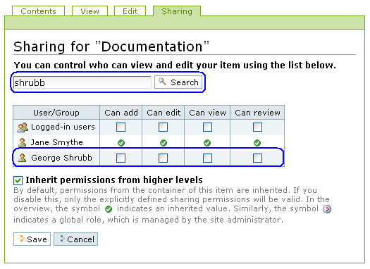
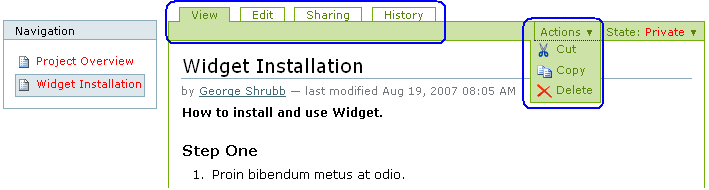
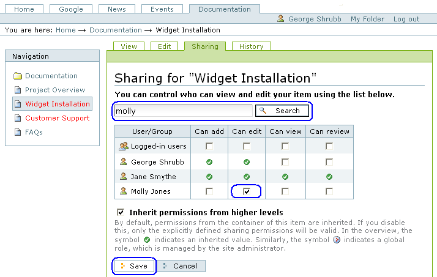

==================================
4. Colaboración y flujo de trabajo
==================================

Aprenda sobre como compartir y controlar el acceso a su contenido usando la
pestaña "Compartir" y el menú Estado.

4.1. Estados de Publicación básicos
===================================

El sistema de control para publicación en Plone es bastante flexible,
comenzando con una configuración básica para hacer un elemento privado o
publico.

En la esquina superior derecha del panel "Editar" de cualquier contenido --
carpetas, imágenes, paginas, etc. y cualquier tipo de contenido especializado
-- hay un menú a la derecha para el Estado de Publicación Este menú *Estado*
tiene opciones para controlar los Estados de Publicación:

.. image:: images/statemenu1.png
  :alt: 

El titulo del menú mostrara el Estado actual de Publicación para el elemento
de contenido, tal como *Estado: Privado*, como se muestra arriba. Privado es
el Estado inicial al crear un elemento de contenido -- una imagen cargada,
una pagina, una noticia -- Y como su nombre lo indica, en el estado Privado,
el contenido generalmente no estará disponible para los visitantes del sitio
web.  La opción *Publicar* del menú, hará que el elemento de contenido este
disponible para usuarios no registrados del sitio web. La opción *Enviar para
publicación* del menú es usada en sitios web donde se necesita la
autorización de editores de contenido que tienen que aprobar los elementos a
ser publicados, como es discutido abajo.

Además, y esto sera muy importante, ciertos tipos de contenidos tales como
noticias y eventos, no aparecerán en el sitio web como usted espera, hasta
que hayan sido explícitamente *publicados*.

Recuerde esto: **¡el Estado de Publicación es importantísimo!**

El Estado de Publicación solo puede ser cambiado por aquellos usuarios que
tengan las autorizaciones necesarias. El menú Estado mostrara solo aquellas
opciones que tenga permitido ejecutar. Por ejemplo, en la pagina web de un
gran periódico, un periodista puede agregar paginas para los artículos de
noticias, pero en el menú de Estado no se muestra la opción *Publicar*, solo
la opción l*Enviar para publicación*. Esto es porque un periodista debe
enviar los artículos al personal de edición para su respectiva aprobación.
Sin embargo, si su cuenta posee los permisos para *Publicar*, la opción en el
menú aparecerá y usted simplemente podrá publicar los elementos en un solo
paso.

Para un editor, un contenido que ha sido enviado puede ser *publicado* o
*rechazado*, ya sea en su totalidad, porque es una publicación inapropiada
para la situación, o por la típica razón de que necesite revisión.

Después de que el contenido ha sido *publicado*, puede ser *retirado*, para
cambiarlo de vuelta al estado *borrador publico*, o de vuelta al Estado
Privado con la opción *Echar atrás*, si se requiere. La opciones del menú
Estado cambiaran consecuentemente:

.. image:: images/statemenu2.png
  :alt: 

Debería considerarse la retracción o ajustarse a *Privado*, todo aquel
contenido que se vuelva obsoleto o indeseado por alguna razón.  Ajustarlo a
*Privado* hará que el elemento no pueda ser visto por el publico o mostrarse
en resultados de búsqueda, pero lo mantendrá al alcance, en caso de que el
formato o el contenido en si (texto, imágenes, etc.) sea necesitado después.
Esto es especialmente importante para eventos que necesiten un formato único.
La decisión de eliminarlo o ajustarlo a *Privado* dependerá si el contenido
existe en alguna otra locación en una computadora local. Si el contenido es
de gran tamaño, en el sentido de espacio requerido en disco. Quizás salvarlo
en una computadora local antes de eliminarlo seria una buena decisión, esto
es, si el espacio en el servidor del sitio web es un problema.

4.2. Control Avanzado
=====================

El sistema de control de publicación en la opción Avanzado, posee
características sofisticadas para configurar la disponibilidad por fechas y
contenido.

Este menú *Estado* tiene la opción *Avanzado*...:

.. image:: images/copy_of_statemenu1.png
  :alt: 

El cual muestra el panel de *Avanzado*:

.. image:: images/stateadvanced.png
  :alt: 

Debajo de una sección de explicación al principio del panel, se haya una
casilla de comprobación que muestra el contenido que sera afectado por el
cambio de Estado de Publicación. Muestra que la carpeta Long-tailed Skipper
sera afectada por el cambio de Estado.

El siguiente campo *Incluir los elementos contenidos*, es una casilla de
comprobación para controlar si los cambios de Estado afectaran solo este
elemento (carpeta Long-tailed Skipper) o lo elementos que contiene y todas
sus sub-carpetas (en el caso de poseer) y otros elementos contenidos. Esta es
una casilla de comprobación importante, ya que fácilmente le deja modificar
la disponibilidad de una sección completa del sitio web. Por ejemplo, la
carpeta Long-tailed Skipper puede contener cuatro carpetas para imágenes,
descripciones de presencia de especies, historia de taxonomía, las cuales se
han mantenido en *Privado* durante el trabajo inicial para elaborar el
contenido. El cual se puede publicar inmediatamente -- Cambiar a *Publicado*
-- marcando esta casilla y ajustando a *Publicar* al final del panel antes de
guardar. De igual modo, la opción *Enviar para publicación* se usaría en un
sitio web donde los editores controlen las publicaciones finales.

Así mismo, una sección completa podría hacerse *Privada*. Por ejemplo, si una
agencia de alquiler de coches decide retirar un modelo de su flota, la
sección entera de su sitio web dedicada a este modelo de coche, con varias
sub-carpetas llenas de paginas, imágenes, y archivos, podría ajustarse a
*Privado*.

Los siguientes dos campos de fechas son *Fecha de Efectividad* y *Fecha de
Terminación*. Sus significados son muy claros. Si el elemento o grupo de
contenido tienen que ajustarse a una ventana de tiempo valida para
publicación, se puede configurar en estos campos.

Los comentarios que usted ingrese le permiten dar una explicación a los
cambios de Estado y al respectivo contenido afectado. Esto es especialmente
útil cuando varias personas están trabajando en un sitio web, y un usuario
menos familiarizado con cierta área en el sitio observa un contenido y se
pregunta por que no esta publicado: "Esta información luce bien. Por que no
esta publicada¿" Luego lee un comentario que dice algo como "No publicar
hasta que Richard revise los problemas de derechos de autor relacionados a
los elementos descritos aquí."  El uso de comentarios es una buena idea para
información perceptiva, incluso si usted es la única persona trabajando en el
sitio web, ya que puede olvidar la razón del por que tomo una decisión
relacionada al Estado de Publicación.

Finalmente, al final del panel hay una selección de varios Estados
disponibles. Estos variaran dependiendo del Estado actual del elemento. Por
ejemplo, si el elemento esta actualmente en un Estado Publicado, pues no
aparecerá la opción *Publicar*, si el elemento se encuentra en el Estado
*Privado*, no estará la opción para hacer este *Privado*, etc.  Si un
elemento ya esta publicado aparecerán las siguientes opciones al final del
panel *Retirar* y *Echar atrás* para "privatizar" el elemento,
estableciéndolo a *borrador publico* o luego para Estado *Privado*.

.. image:: images/lightscameraaction.png
  :alt: 

Ver un vídeo sobre como `controlar el Estado de Publicación`_ en Plone 2

4.3. Políticas de flujo de trabajo
==================================

Las políticas de flujo de trabajo permiten a un administrador crear un
ambiente estructurado para controles de publicación y gestión de contenido
como un flujo paso a paso que involucra a los usuarios en distintos roles.

El flujo de trabajo es un tema avanzado. Incluye la creación de un control
mas reglamentado en la creación de contenidos. revisión y publicación. Si
usted posee una cuenta de usuario en un pequeño y típico sitio Plone,
probablemente no se enfrentara a las políticas personalizadas de flujos de
trabajo, ya que no existe la necesidad de este control mas sofisticado. Sin
embargo, el potencial de usar esta función se encuentra allí, ya que esta
integrado en Plone.

Como una introducción al concepto de flujo de trabajo, consideremos un
ejemplo que involucre el sitio web de un periódico, para el cual estos
distintos grupos de personas están trabajando:

Periodistas Pueden crear historias, pero solo las pueden Enviar para
publicación Editores Pueden revisar las historias, pero no las pueden publicar
del todo. Envían revisiones positivas y editan las historias para una
revisión posterior. Correctores Hacen la revisión final de hechos, arreglos,
revisiones, y pueden publicar las historias.

Una *Política de flujo de trabajo*, a veces abreviado *flujo de trabajo*,
describe las restricciones relacionadas a los cambios de Estado para
distintos grupos de persona. Una vez que la política de flujo de trabajo ha
sido creada, requiere ser aplicada a un área del sitio web para que las
reglas surtan efecto. En el ejemplo del sitio web del periódico, una política
de flujo de trabajo sera establecida y aplicada a las carpetas donde los
periodistas hacen el trabajo de agregar nuevos artículos. Luego los
periodistas crearan historias y las enviaran para su respectiva revisión y
aprobación:

.. image:: images/workflowsteps.png
  :alt: 

Los periodistas agregaran noticias y las *enviaran* (la opción de menú
*Publicar* no estará disponible para ellos). Del mismo modo, los editores
podrán *rechazar* el articulo para revisión o en cambio podrán *enviar* el
articulo a un corrector para la revisión final y publicación. En este ejemplo
del periódico, la política podría nombrarse como "Política de Revision
Editorial." Configurar una política de flujo de trabajo es una cuestión de
aplicarla a un área del sitio web -- para definir el enfoque del flujo de
trabajo. Esta es una tarea de un administrador de un sitio web. El
administrador del sitio web podría usar los paneles de control de Plone para
especificar en que partes del sitio la "Política de Revision Editorial" se
aplicara, si al sitio completo o a alguna sección en particular.

Plone trae varias políticas de flujo de trabajo útiles - - la que se
establece por defecto es una política sencilla de publicación web. El
administrador de su sitio web podría emplear un política mas especifica, tal
como una política para un sitio web comunitario o una compañía intranet
(internal web system). Si es así, quizás usted tenga que aprender algunas
medidas de procedimientos para publicaciones, pero estas son solo
explicaciones detalladas de los principios preestablecidos, políticas básicas
del flujo de trabajo.

4.4. Colaboración a través de elementos compartidos
===================================================

La pestaña Compartir le concede colaborar con otros usuarios a través del uso
de varias herramientas incorporadas.

Ejemplo 1: Autorizar a otros para agregar contenido a una carpeta que usted creo.
---------------------------------------------------------------------------------

En este ejemplo, Jane Smythe tiene acceso completo a su sitio web Plone. Ella
puede agregar, editar, eliminar y publicar contenido en cualquier parte del
sitio. Por ahora ella ha creado una carpeta llamada "Documentation" y le
agrego una Pagina "Project Overview". Por ahora no ha publicado ni la carpeta
ni el documento. El flujo de trabajo por defecto para este sitio Plone no ha
sido modificado

Ahora ella quiere que su colega, George Shrubb, agregue contenido a la
carpeta "Documentación" . el tiene la autorización de editar cualquiera de
los contenidos existentes, pero ella necesita que el comience a agregar
contenido. Antes de seguir junto a Jane, rápidamente observemos lo que
actualmente ve George cuando inicia sesión en este sitio Plone:

.. image:: images/02b.png
  :alt: 

Note que actualmente George ni siquiera puede ver la carpeta "Documentation,
ya que Jane después de crearla sigue estando en el Estado *Privado*. Todos
los permisos por defecto están actualmente en su lugar y funcionando
correctamente.

Jane autoriza a George con los permisos que el necesita para agregar
contenido a la carpeta Documentation.

Jane navega a la carpeta Documentation y hace clic en la pestaña Compartir:

.. image:: images/03_002.png
  :alt: 

Lo primero que hay que notar es que ella tiene todos los permisos disponibles
para esta carpeta. Estos permisos fueron otorgados un poco mas arriba en el
sitio como lo indican las señales verdes de verificación.

Si observamos detenidamente los permisos disponibles, vemos que hay:

-   **Puede agregar** - Esto significa que cuando este permiso es
    otorgado a un usuario en particular (o grupo de usuarios), este puede
    agregar nuevos elementos de contenido. Y debido a que este usuario
    también es el creador de elementos de contenidos, igualmente sera capaz
    de editarlos.
-   **Puede editar **- Cuando este permiso es otorgado en una carpeta, el
    usuario no solo puede editar la carpeta (titulo y descripción) sino que
    también puede editar cualquiera de los elementos contenidos en la
    carpeta. Sin embargo, el usuario no tiene el permiso de eliminar
    contenido. Por ejemplo, si este permiso es otorgado para un Pagina, el
    usuario solo puede editar esa Pagina y no los otros elementos de esa
    carpeta.

-   **Puede ver** - Cuando este permiso es otorgado en una carpeta u otro
    elemento, el usuario puede ver el contenido pero no puede hacer ningún
    cambio.

-   **Puede revisar** -  Cuando este permiso es otorgado, el usuario
    puede publicar elementos.

Nota: ¡estos permisos anulan los permisos por defecto de flujo de trabajo!
Por ejemplo, si usted otorga el permiso "Puede ver" en una Pagina que esta en
el Estado Privado, ese usuario sera capaz de ver la Pagina.

En este ejemplo Jane le otorgara el permiso "Puede agregar" a George en la
carpeta Documention, para que pueda agregar contenido a la carpeta. Jane lo
busca por su nombre:

Ahora ella puede otorgar permisos específicos a George para la carpeta
Documentation. Ella le dará el permiso "Puede agregar" y luego hará clic en
"Guardar"

.. image:: images/05_002.png
  :alt: 

 ¡Eso es todo! Ahora veamos como ve George el sitio.

Nota: George NO necesita salir e iniciar sesión nuevamente. Los permisos
siempre se mantienen al día ya que se revisan cada vez que un usuario acede a
cualquier parte en un sitio web Plone (ej. hace clic en un enlace).

Por ejemplo, George puede hacer clic en la pestaña *Inicio* para refrescar la
pagina y podrá ver la carpeta Documentation

.. image:: images/06.png
  :alt: 

Cuando George hace clic en la pestaña Documentation, se da cuenta que puede
ver todo el contenido en la carpeta Documentation, y también puede agregar
los tipos de contenidos disponibles en esta, como se muestra en el menú
*Agregar elemento*:

.. image:: images/07.png
  :alt: 

George quiere revisar lo que Jane ha creado ya, así que hace clic en el
enlace "Project Overview" y revisa:

.. image:: images/07b.png
  :alt: 

George puede ver el documento, sin embargo, sus permisos limitados no le
permiten editarlo o cambiar su Estado. Lo único que puede hacer aparte de ver
el documento es hacer su propia copia de el.

George agrega una Pagina llamada "Widget Installation" y crea el contenido
para esa Pagina. Cuando finalice el la guarda:

.. image:: images/08.png
  :alt: 

Jane ve el trabajo que ha hecho George. Ella hace clic en la pestaña
Documentation y puede ver George realmente ha estado ocupado. Ella hace clic
en la Pagina "Widget Installation" para revisarla detenidamente:

Note que Jane tiene acceso completo a la Pagina que ha creado George. Ella la
puede editar así como también puede cotar/copiar/pegar. En lugar de eso, ella
esperara que George envié la Pagina para revisión antes de hacer cualquier
cambio con ella.

Ejemplo 2: Dejar a otros editar el contenido que usted creo.
------------------------------------------------------------

George y Jane han estado trabajando duro para crear Paginas en la carpeta
Documentation. **Jane ha publicado la carpeta Documentation y varias de sus
paginas**

.. image:: images/09b.png
  :alt: 

Jane ha decidido cambiar todo el control de las ediciones (mas no publicar)
de la carpeta Documentation y dárselo a George. De tal manera que retorna a
la carpeta Documentation y hace clic en la pestaña *Compartir*:

.. image:: images/10.png
  :alt: sharing10.png

En este punto ella solo necesita hacer clic en la casilla de confirmación
"Puede editar" y George podrá editar todo el contenido de la carpeta --
incluyendo la carpeta Documentation como tal. Cuando George visite la carpeta
y haga clic en "Project Overview" (una Pagina que creo Jane), esto es lo que
el vera:

.. image:: images/11.png
  :alt: sharing11.png

Ahora George puede editar cualquier elemento en la carpeta, sin importar
quien o cuando la haya creado.

Mientras tanto, Molly se ha unido a George como un nuevo miembro del equipo.
George ayuda a Molly iniciar la actualización del documento "Widget
Installation" el va a la pestaña "Widget Installation" y busca el nombre
completo de Molly (no usuario) y le otorga el permiso "Puede editar" para
este documento.

Ahora cuando Molly vaya a la carpeta Documentation, ella puede ver los dos
elementos publicados y el elemento privado que ahora puede editar:

.. image:: images/13.png
  :alt: sharing13.png

Y de hecho puede editar el documento "Widget Installation" cuando haga clic
en el:

.. image:: images/13b.png
  :alt: sharing13b.png

Sin embargo note que ella cuando hace clic en cualquiera de los elementos que
no tiene permitido editar, no tiene ningún tipo de acceso adicional. Ella
puede ver estos dos elementos porque están publicados y en el flujo de
trabajo por defecto de Plone (lo que significa que cualquiera los puede ver)

.. image:: images/13c.png
  :alt: sharing13c.png

Una nota final para este ejemplo: si la carpeta Documentation no hubiese
estado en el Estado Publicado, o Molly no hubiese tenido algún otro permiso
(Por ejemplo, "Puede ver" en la carpeta Documentation), Molly hubiese
necesitado la dirección URL completa para poder llegar al documento que tenia
permiso de editar. ¡Los permisos son muy específicos en Plone!

Créditos de esta sección
------------------------

.. sectionauthor:: Leonardo J. Caballero G. <lcaballero@cenditel.gob.ve>, 
.. codeauthor:: 
    Luis Sumoza <lsumoza@gmail.com>, 
    Victor Terán <vteran93@yahoo.es>

