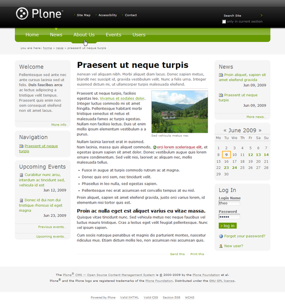
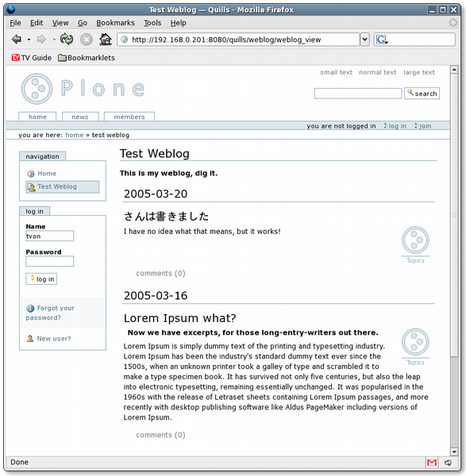
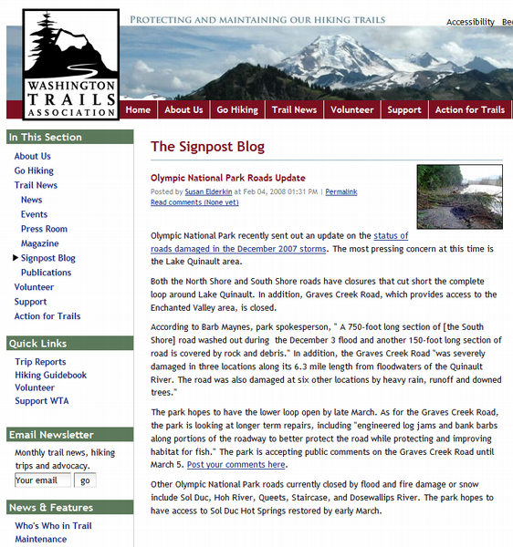
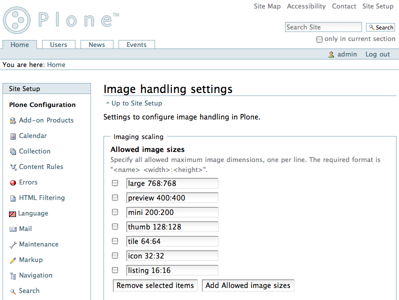
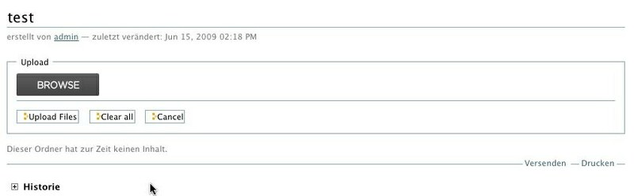

.. -*- coding: utf-8 -*-

Agregando módulos y complementos adicionales a Plone
====================================================

¿Cómo agrego productos específicos al sitio Plone?
~~~~~~~~~~~~~~~~~~~~~~~~~~~~~~~~~~~~~~~~~~~~~~~~~~

Para la mayor comprensión de este manual cada vez que nos refiramos a un
producto estaremos hablando de plugins para los que usen WordPress o módulos
para los que usen Joomla o Drupal, también debemos tomar en cuenta que los
temas o pieles en Plone los tratamos como un producto. dicho esto bienvenidos
a la magia de personalizar su sitio Plone

Usted probablemente quiere agregar productos en su sitio Plone, como un
apariencia visual o temas distinto a la predeterminada, o agregar un foro de
discusión, integrar con otros servicios como *Bases de Datos*, *LDAP*, *Lista
de correo*, entre otros.

Módulos / Complementos / Agregados adicionales
~~~~~~~~~~~~~~~~~~~~~~~~~~~~~~~~~~~~~~~~~~~~~~

Hay que entender varios conceptos antes de continuar:

**Paquete Python**
  Es un termino generalmente usando para describir un módulo Python. en el
  más básico nivel, un paquete es un directorio que contiene un archivo
  ``__init__.py`` y algún código Python.

**Productos**
  Es una terminología usada por la comunidad Zope / Plone asociada a
  cualquier implementación de módulos / complementos y agregados que amplíen la
  funcionalidad por defecto que ofrece Zope/Plone. También son conocidos como
  *"Productos de terceros"* del Ingles **`Third-Party Products`_**.

**Producto Zope**
  Es un tipo especial de paquete Python usado para extender Zope. En las
  antiguas versiones de Zope, todos los productos eran carpetas que se ubican
  dentro de una carpeta especial llamada ``Products`` de una instancia Zope;
  estos tendrían un nombre de módulo Python que empiezan por "**Products.**".
  Por ejemplo, el núcleo de Plone es un producto llamado CMFPlone, conocido en
  Python como `Products.CMFPlone`_.

**Producto Plone**
  Es un tipo especial de paquete Zope usado para extender las funcionalidades
  de Plone. Se puede decir que son productos que su ámbito de uso es solo en el
  desde la interfaz gráfica de Plone.

**Paquete Egg de Python**
  Es una forma de empaquetar y distribuir paquetes Python. Cada Egg contiene
  un archivo ``setup.py`` con metadata (como el nombre del autor y la correo
  electrónico y información sobre el licenciamiento), como las dependencias del
  paquete. La herramienta del ``setuptools``, es la librería Python que permite
  usar el mecanismo de paquetes egg, esta es capaz de encontrar y descargar
  automáticamente las dependencias de los paquetes Egg que se instale. Incluso
  es posible que dos paquetes Egg diferentes necesiten utilizar simultáneamente
  diferentes versiones de la misma dependencia. El formato de paquetes Eggs
  también soportan una función llamada ``entry points``, una especie de
  mecanismo genérico de plug-in. Mucha más detalle sobre este tema se encuentra
  disponible en el `sitio web de PEAK`_.

**Collective**
  Es un repositorio de código comunitario, para Productos Plone y productos
  de terceros, y es un sitio muy útil para buscar la ultima versión de código
  fuente del producto para cientos de productos de terceros a Plone. Los
  desarrolladores de nuevos productos de Plone son animados a compartir su
  código a través de Collective para que otros puedan encontrarlo, usarlo, y
  contribuir con correcciones / mejoras. Si usted quiere publicar un nuevo
  producto en el repositorio Collective de Plone necesita `obtener acceso de
  escritura al repositorio`_ y `crear su estructura básica de repositorio`_
  para su producto. Para consultar el repositorio en forma Web en el siguiente
  `enlace`_.

Tipos de productos disponibles
~~~~~~~~~~~~~~~~~~~~~~~~~~~~~~

Teniendo en cuenta los conceptos previos, entonces existen muchos Productos
distribuidos como Productos Zope o paquetes Egg, pero ahora hay que saber que
tipo de producto están disponibles para instalar y ampliar las
funcionalidades de Zope/Plone, a continuación se describe una lista de
estos:

**Temas / Apariencias**
  Por lo general si un producto de Tema esta bien diseñado y implementado
  debe aplicarse de una ves al momento de instalarlo. En caso que no se aplique
  de una puede acceder a la sección `Configuración de Temas`_ y cambiar el
  **Tema predeterminado** por el de su gusto.

**Tipos de contenidos**
  Los tipos de contenidos son productos que extienden la funcionalidad de
  **Agregar elemento** que permite agregar nuevos tipos de registros
  (Contenidos) a tu sitio. Esto quiere decir que si instala un tipo de
  contenido exitosamente debería poder acceder a usarlo desde el menú de
  **Agregar elemento** en el sitio Plone. Opcionalmente algunos productos
  instalan un panel de control del producto que puede acceder a este en la
  sección `Configuración de Productos Adicionales`_.

**Productos Zope**
  Este tipo de productos esta disponibles desde la interfaz administrativa de
  Zope (ZMI) de `su instalación`_ donde deben acceder con las credenciales del
  usuario Administrador de Zope. Muchas veces el producto simplemente no hay
  que instalarlo por que se agregar automáticamente.

Recomendaciones para agregar productos
~~~~~~~~~~~~~~~~~~~~~~~~~~~~~~~~~~~~~~

Al momento de buscar que producto a instalar, proceda de la siguiente forma:

-   Consulte la sección llamada `Add-on Product Releases`_ del sitio
    Plone.org, donde podrá conseguir información de los productos adicionales
    realizados por terceros o miembros de la comunidad, muchos de los
    productos disponibles en esta sección son productos **"al viejo estilo"**
    así que debe configurar la dirección de descarga en la sección
    **[productdistros]** como previamente se explico. Hasta Febrero de 2001
    hay más de 1503 proyectos de productos de terceros con 4755 publicaciones
    disponibles en el sitio Web de Plone.
-   Si quiere gestionar con su buildout la instalación de los paquetes
    eggs puede usar como referencia el sitio `Python Package Index (PyPI)`_
    seleccionar los nombres de paquetes eggs y agregarlo en la sección
    ``eggs`` y ``zcml`` respectivamente.
-   Si no esta disponible ni `Add-on Product Releases`_ del sitio
    Plone.org ni en el sitio `Python Package Index (PyPI)`_, consulte el
    `repositorio SVN Collective`_ y debe realizar un ``svn checkout`` al
    directorio ``trunk/`` o al directorio ``tags/`` del producto de la
    versión estable que necesita utilizar dentro del directorio ``./src/``
    y luego configurarlo como se describe previamente en la sección llamada
    **Agregando un paquete "desarrollo"**.

Ejemplo de uso
~~~~~~~~~~~~~~~

Para ejemplificar estos conceptos previos, agregue el siguiente producto:

`heddex.tranquility theme`_

Este tema se empaqueta como un paquete egg Python y en la `página del
producto en plone.org`_ tiene buenas instrucciones de instalación. Esta
documentación dice añadir el nombre de producto ``heddex.tranquility``
debajo de la directivas ``eggs`` y ``zcml`` en parte **[buildout]**.

Antes de seguir seria bueno que entiendas que es buildout y sus hiervas, para
esto recomiendo leer el manual sobre **`Gestión de proyectos con Buildout`_**.

Para empezar, es una buena idea hacer una copia de seguridad del archivo
original ``buildout.cfg``, sólo en caso de que accidentalmente dañe la
configuración respectivamente.

1.  Abra el archivo ``buildout.cfg`` en su editor de texto de elección.
2.  Buscar la sección etiquetada: **[buildout]**.
3.  Buscar la linea que tenga la directiva: **eggs =**.
4.  Agregar "**heddex.tranquility**" por debajo de la lista de paquetes
    eggs, dejando cuatro espacios en blanco antes del nombre del paquete.
5.  Buscar la linea que tenga la directiva: **zcml =**.
6.  Agregar "**heddex.tranquility**" por debajo de esa línea, dejando
    cuatro espacios en blanco antes del nombre del paquete.
7.  Guarde su archivo de configuración ``buildout.cfg``.
8.  Ejecute el script buildout, de la siguiente forma: ``./bin/buildout
    -vN``
9.  Inicie de nuevo Plone, de la siguiente forma: ``./bin/instance fg``.
10. Abra el navegador web de su preferencia, acceda a su dirección del
    sitio Plone, por defecto es `Agregar/Quitar Productos`_ y justo al lado
    del producto **heddex.tranquility** y luego haga clic en el botón
    **Instalar** . Hasta este punto solo debe aparecer en la lista de los
    **Productos instalados**, si hasta este punto no ha cambiado la
    apariencia del sitio de Plone debe ir a la sección `Configuración de Temas`_
    y cambiar el **Tema predeterminado** por el de su gusto.

**Nota:** Es necesario respetar los 4 espacios de izquierda a derecha como se
describen a continuación:

.. code-block:: cfg

  eggs =
      heddex.tranquility
  ...
  zcml =
      heddex.tranquility

**Agregando un producto tradicional Zope 2**

La forma más sencilla de probar un producto tradicional de Zope 2 es para
extraerlo en dentro de la carpeta ``products/`` de instalación. Si ves
documentación referente a la carpeta Products/ en una instancia de Zope, esta
es la misma cosa.

Sin embargo, este enfoque hace que sea más difícil para redistribuir su
proyecto y compartirlo con otros desarrolladores. A menudo es más predecible
dejar que buildout descargue e instale el paquete por usted. Puede hacer esto
con la sección **[productdistros]** del archivo ``buildout.cfg``.

.. code-block:: cfg

  ...

  [productdistros]
  recipe = plone.recipe.distros
  urls =
      http://plone.org/products/docfindertab/releases/1.0.4/Products.DocFinderTab-1.0.4.zip
      http://plone.org/products/windowz/releases/1.2/windowZ-1.2.tgz
  nested-packages =
  version-suffix-packages =

  ...

Este método también es conocido como **"al viejo estilo de Zope"**  y la
razón de este mecanismo es por que algunos productos no están aun empaquetado
como paquetes eggs de Python. Estos productos necesitan ser instalados usando
sus enlaces de descargas como se demostrado previamente. Su usted busca un
producto que usted quiere usar que no este empaquetado como egg, usted
necesita buscar el enlace de descargas en la página de productos en plone.org
y coloque la dirección URL.

**Agregando un paquete "desarrollo"**

A veces usted tiene que existen algunos productos que no están empaquetados
en ``egg`` ni **al viejo estilo de Zope**, pero estos están disponibles desde
un repositorio de control de versiones como SVN, Git, o simplemente son
varios productos locales en desarrollo. Usted puede hacer dos cosas para
instalar entonces. Lo primero que hay que hacer es construirlo y colocarlo al
directorio ``./src/`` de su instalación Plone. Esto también es muy útil
cuando usted modifica un producto existente. Antes de ejecutar el comando
buildout usted tiene que agregar los productos a las secciones ``eggs`` y
``zcml`` (si es necesario) de archivo ``buildout.cfg``:

.. code-block:: cfg

  ...
  eggs  =
      ...
      canaima.aponwaotheme
      ...
  zcml =
      ...
      canaima.aponwaotheme
      ...
  develop =
      ...
      src/canaima.aponwaotheme
      ...

Luego ejecuta el siguiente comando dentro del directorio ``./src/``:

.. code-block:: sh

  $ git clone git://gitorious.org/~macagua/canaima-aponwao-plone-theme/canaima-aponwaotheme.git canaima.aponwaotheme

Luego reconstruye el el sitio con el siguiente comando: 

.. code-block:: sh

  $ ./bin/buildout -vN

Este es un tema para Plone 3 y Plone 4 que aun esta en desarrollo:

`canaima.aponwaotheme`_

Cabe destacar que ya existente `extensiones de Buildout`_ que gestión
descargas desde repositorios de control de versiones como
`infrae.subversion`_ y `mr.developer`_ que con unas simples
configuraciones adicionales en tu archivo ``buildout.cfg`` puede automatizar
la descarga de los códigos fuentes del los respectivos repositorios.

Algunos productos adicionales útiles
------------------------------------

Una serie de productos útiles que sirven de ejemplo para poner en practica
las configuraciones en su archivo ``buildout.cfg``

**NOTA:** Los tres puntos suspensivos **...** son la indicar que tienes una serie
de configuraciones antes o después de la sección, así que **NO** se copian ;)

Editor de texto enriquecido
~~~~~~~~~~~~~~~~~~~~~~~~~~~

Existe varios editores de texto enriquecido como `TinyMCE`_ y
`Products.FCKeditor`_, adicionalmente al editor por defecto que ofrece Plone
como es Kupu.

Editor de texto enriquecido

.. image:: ./images/screenshot.jpeg
  :align: center
  :alt: TinyMCE

.. image:: ./images/screenshot_004.jpeg
  :align: center
  :alt: Products.FCKeditor

Agregue la siguiente configuración del producto al archivo ``buildout.cfg``

.. code-block:: cfg

  eggs =
      ...
      Products.FCKeditor
      Products.TinyMCE

Foros de discusión
~~~~~~~~~~~~~~~~~~

`Ploneboard`_ es uno de los más usados en la mayoría de sitios Plone. Si
usted necesita realmente un foro avanzado usted más bien debe buscar fuera
del sitio de Plone y tratarte de integrarlo a su sitio.

.. image:: ./images/ploneboard04.png
  :align: center
  :alt: Foro de discusión con el producto Ploneboard

Agregue la siguiente configuración del producto al archivo ``buildout.cfg``

.. code-block:: cfg

  eggs =
      ...
      Products.Ploneboard

Calificaciones
~~~~~~~~~~~~~~

`plone.contentratings`_, es un producto que permite definir categorías de
calificaciones, tipo de calificación y aplicarla a los diversos tipos  de
contenidos de tu sitio Plone. Un ejemplo del uso este `sitio`_ que usa este
producto en la sección **Editor's rating** la cual posee 4 categorías y el
tipo de calificación esta basado por Estrellas.

.. code-block:: cfg

  eggs =
      ...
      plone.contentratings
      ...
  zcml =
      ...
      plone.contentratings

Bitácoras
~~~~~~~~~

Yo he probado los productos `Quills`_ y `Scrawl`_, el primero es muy parecido
a las características que ofrece Wordpress y el segundo es muy minimalista.

Agregue la siguiente configuración del producto al archivo ``buildout.cfg``

.. code-block:: cfg

  eggs =
      ...
      Products.Quills
      Products.Scrawl

Sistema de noticias
~~~~~~~~~~~~~~~~~~~

Altamente recomendada es el producto `Singing and Dancing`_.

.. image:: ./images/screenshot_003.png
  :align: center
  :alt: Sistema de correo de noticias con el producto Singing and Dancing

Agregue la siguiente configuración del producto al archivo ``buildout.cfg``

.. code-block:: cfg

  extends =
      ...
      https://svn.plone.org/svn/collective/collective.dancing/buildout-extends/0.9.0.cfg
      ...
  [instance]
   ...
   eggs =
       ...
       collective.dancing
       ...
   zcml =
       ...
        collective.dancing
       ...

Etiquetas
~~~~~~~~~

`quintagroup.portlet.cumulus`_ Es un portlet de nubes de etiquetas que rotan usando una animación de Flash 3D.

.. image:: ./images/screenshot_002.jpeg
  :align: center
  :alt: Nube de etiquetas con el producto quintagroup.portlet.cumulus

Agregue la siguiente configuración del producto al archivo ``buildout.cfg``

.. code-block:: cfg

  eggs =
      ...
      quintagroup.portlet.cumulus
      ...
  zcml =
      ...
      quintagroup.portlet.cumulus
      ...

Media
~~~~~

`ATGoogleVideo`_, agrega un tipo de contenido que hace referencias a vídeos
almacenados en Google Video o YouTube dentro de un sitio Plone

Agregue la siguiente configuración del producto al archivo ``buildout.cfg``

.. code-block:: cfg

  eggs =
      ...
      Products.ATGoogleVideo

`Gallery portlet`_, un portlet para presentar galerías fotográficas.

.. image:: ./images/screenshot_002.png
  :align: center
  :alt: portlet de Galería de imágenes Gallery portlet

Agregue la siguiente configuración del producto al archivo ``buildout.cfg``

.. code-block:: cfg

  eggs =
      ...
      se.portlet.gallery
  zcml =
      ...
      se.portlet.gallery

`plone.app.imaging`_ le habilita declarativamente definir adicionales tamaños
de imágenes inicialmente generadas cuando usted agrega imágenes en su portal.

Agregue la siguiente configuración del producto al archivo ``buildout.cfg``

.. code-block:: cfg

  eggs =
      ...
      plone.app.imaging
      ...
  zcml =
      ...
      plone.app.imaging
      ...

Seguridad
~~~~~~~~~

`Plone Captchas`_ agrega mecanismos de captcha para si sitio Plone.

.. code-block:: cfg

  eggs =
      ...
      quintagroup.plonecaptchas
      ...
  zcml =
      ...
      quintagroup.plonecaptchas
      ...

Administración
~~~~~~~~~~~~~~

`Anonymous view`_ es bastante útil porque le permite a usted mostrar ciertas
páginas que estarán disponibles a usuarios anónimos.

.. code-block:: cfg

  eggs =
      ...
      collective.anonymousview
      ...
  zcml =
      ...
      collective.anonymousview
      ...

`collective.uploadify`_, si usted le gustaría subir varios archivos de una
ves usted tiene que instalarlo.

Agregue la siguiente configuración del producto al archivo ``buildout.cfg``

.. code-block:: cfg

  eggs =
      ...
      collective.uploadify

Referencias
~~~~~~~~~~~

- `Installing Plone add-ons - quick instructions`_
- `Using Add-ons`_
- `Add on product installation fails`_
- `Installing a third party product`_
- `Packages, products and eggs`_

.. _Third-Party Products: http://plone.org/documentation/kb/add-ons/tutorial-all-pages
.. _Products.CMFPlone: http://pypi.python.org/pypi/Products.CMFPlone
.. _sitio web de PEAK: http://peak.telecommunity.com/DevCenter/setuptools
.. _obtener acceso de escritura al repositorio: http://plone.org/countries/conosur/documentacion/obtener-acceso-de-escritura-al-repositorio-svn-de-plone
.. _crear su estructura básica de repositorio: http://plone.org/countries/conosur/documentacion/crear-un-nuevo-proyecto-en-el-repositorio-collective-de-plone
.. _enlace: http://svn.plone.org/svn/collective/
.. _Configuración de Temas: http://localhost:8080/Plone/@@skins-controlpanel
.. _Configuración de Productos Adicionales: http://localhost:8080/Plone/prefs_install_products_form
.. _su instalación: http://localhost:8080/manage
.. _Add-on Product Releases: http://plone.org/products
.. _Python Package Index (PyPI): http://pypi.python.org/pypi/
.. _heddex.tranquility theme: http://plone.org/products/heddex.tranquility-theme
.. _Gestión de proyectos con Buildout: http://coactivate.org/projects/ploneve/gestion-de-proyectos-con-buildout
.. _canaima.aponwaotheme: http://gitorious.org/%7Emacagua/canaima-aponwao-plone-theme/canaima-aponwaotheme
.. _extensiones de Buildout: http://pypi.python.org/pypi?:action=search&term=Buildout&submit=search
.. _infrae.subversion: http://pypi.python.org/pypi/infrae.subversion
.. _mr.developer: http://pypi.python.org/pypi/mr.developer
.. _TinyMCE: http://plone.org/products/tinymce/
.. _Products.FCKeditor: http://plone.org/products/fckeditor
.. _Ploneboard: http://plone.org/products/ploneboard
.. _plone.contentratings: http://plone.org/products/plone-contentratings/
.. _sitio : http://www.contentmanagementsoftware.info/plone/plone-contentratings
.. _Quills: http://plone.org/products/quills/
.. _Scrawl: http://plone.org/products/scrawl/
.. _Singing and Dancing: http://plone.org/products/dancing/
.. _quintagroup.portlet.cumulus: http://plone.org/products/quintagroup.portlet.cumulus
.. _ATGoogleVideo: http://plone.org/products/atgooglevideo/
.. _Gallery portlet: http://plone.org/products/gallery-portlet/
.. _plone.app.imaging: http://plone.org/products/plone.app.imaging/
.. _Plone Captchas: http://plone.org/products/plone-captchas/
.. _Anonymous view: http://plone.org/products/collective.anonymousview/
.. _collective.uploadify: http://plone.org/products/collective.uploadify/
.. _Installing Plone add-ons - quick instructions: http://plone.org/documentation/kb/installing-add-ons-quick-how-to
.. _Add on product installation fails: http://plone.org/documentation/kb/diagnosing-third-party-product-installation-problems
.. _Installing a third party product: http://plone.org/documentation/manual/developer-manual/managing-projects-with-buildout/installing-a-third-party-product
.. _Packages, products and eggs: http://plone.org/documentation/manual/developer-manual/managing-projects-with-buildout/packages-products-and-eggs/
