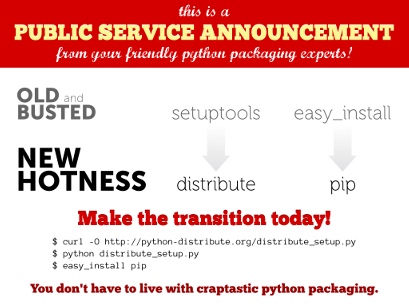

================
Distribute y PIP
================

¿Qué es Distribute?
===================

`Distribute`_ es un conjunto de mejoras en el módulo de la biblioteca
estándar de Python: ``distutils`` (para Python 2.3.5 y hasta en la mayoría de
las plataformas, plataformas de 64 bits requieren como mínimo de Python 2.4)
que le permite crear con más facilidad la distribución de paquetes de Python,
en especial los que tienen las dependencias de otros paquetes.

``Distribute`` se creó porque el `paquete Setuptools`_ ya no se mantiene. Los
paquetes de terceros, es probable que requieran setuptools, que es
proporcionado por el paquete ``Distribute``. Por lo tanto, en cualquier
momento si los paquetes dependen del paquete setuptools, ``Distribute``
intervendrá para decir que ya ofrece el módulo de ``setuptools``.

Estado actual del Empaquetamiento en Python
-------------------------------------------

El módulo ``distutils`` es parte de la `librería estándar`_ de Python y aun
lo será hasta la versión Python 3.3. El módulo ``distutils`` será
descontinuado en Python 3.3. El módulo ``distutils2`` (note el número dos)
tendrá compatible hacia atrás para Python 2.4 en adelante; y será parte de la
`librería estándar`_ en Python 3.3.

El módulo ``distutils`` provee las bases para empaquetar aplicaciones Python.
Desafortunadamente, el módulo ``distutils`` está plagado de problemas, razón
por la cual un pequeño grupo de desarrolladores de Python están trabajando en
``distutils2``. Sin embargo, hasta ``distutils2`` este completado, se
recomienda que en el desarrollado o el uso paquete ``distutils`` puro o el
paquete ``Distribute`` para empaquetar software Python.

Al mismo tiempo, si un paquete requiere el paquete setuptools, la
recomendación es que instale el paquete ``Distribute``, el cual provee una
versión más actualizada del paquete setuptools que el `paquete original de Setuptools`_.

En el `futuro`_ ``distutils2`` remplazará a ``setuptools`` y ``distutils``,
le cual también removerá la necesidad de ``Distribute``. El como del estado
anterior ``distutils`` será removido de la `librería estándar`_. Para más
información, por favor, consulte el `Futuro del Empaquetado`_.

.. image:: ./state_of_packaging.jpg
  :alt: El estado actual de Empaquetado en Python
  :align: center

ALTAMENTE RECOMENDADO
~~~~~~~~~~~~~~~~~~~~~

Ver el vídeo de la `PyCon 2011 - Packaging, from Distutils to Distutils2`_,
Packaging or installing a Python application can be extremely painful por
`Tarek Ziadé`_ esta charla le sumergiera dentro de las nuevas características
de Distutils2 y explica como usted puede usarlo en su proyecto *hoy* para
hacer más fácil la vida para todo el mundo (usuarios, administradores de
paquetes de Sistemas operativos, programadores, etc.).

Para descargar el vídeo haga clic `aquí`_ (Tamaño 294 mb) y para ver por
Stream consulte la siguiente `página`_.

¿Qué es PIP?
============

`pip`_ es una herramienta para instalar y administrar paquetes Python, como
los que podemos encontrar en el Índice de Paquetes de Python - `PYPI`_. Esta
herramienta es el remplazo para la famosa herramienta `easy_install`_. En su
mayoría se utiliza las mismas técnicas para encontrar los paquetes, por lo
que los paquetes que se instalaban usando la herramienta easy_install deben
ser instalables con la herramienta pip también. Esto significa que usted
puede utilizar ``pip install SomePackage`` en lugar de ``easy_install
SomePackage``.

Para poder utilizar el pip, primero debe instalar ``setuptools`` o
``distribute``. Si utiliza virtualenv, una copia del pip será automáticamente
instalados en cada entorno virtual que usted crea. pip se puede complementar
con `virtualenv`_, y se recomienda que utilice `virtualenv para aislar a su instalación`_.

Pip comparado con easy_install
------------------------------

pip tiene por objeto mejorar el easy_install. Algunas de las mejoras son:

-   Todos los paquetes se descargan antes de iniciar la instalación. Una
    instalación parcialmente completada no se produce como resultado.
-   Tiene cuidado de presentar una salida útil en la consola.
-   Las razones de las acciones de instalación se le aplica un
    seguimiento. Por ejemplo, si un paquete se está instalando, pip sigue la
    pista de por qué ese paquete era necesario.
-   Los mensajes de error debe ser útil.
-   El código fuente es relativamente conciso y coherente, por lo que es
    más fácil de usar mediante programación.
-   Los paquetes no tienen que ser instaladas como archivos de huevo, que
    pueden ser instalados en forma plana (mientras cuida la metadata de
    paquete egg).
-   Ofrece soporte nativo para otros sistemas de control de versiones
    (Git, Mercurial y Bazaar)
-   Tiene un mecanismo de desinstalación de paquetes.

Simple to define fixed sets of requirements and reliably reproduce a set of
packages.

-   Fácil de definir conjuntos de requerimientos y reproducir de forma
    fiable un conjunto de paquetes.

PIP no hacer todo lo que se easy_install. En concreto:
------------------------------------------------------

-   No se puede instalar a partir de huevos. Sólo se instala desde el
    código fuente. (En el futuro seráa bueno si se pudiera instalar los
    binarios de Windows EXE o MSI -.. pero instalar paquetes binarios para
    otras plataformas no es una prioridad).
-   No entiende la sección *SetupTools Extras* (como package[test]). Esto
    podría ser agregado eventualmente.
-   Es incompatible con algunos paquetes que tienen muchas
    personalizaciones  ``distutils`` o  ``setuptools`` en sus archivos
    setup.py.

Instrucciones de Instalación
============================

Siempre existen más de dos formas de instalar paquetes en Python Distribute y
PIP ;)

Para ambas es recomendable que instale ciertas dependencias en su sistema
operativo como las que se muestran a continuación: 

.. code-block:: sh

  # aptitude install python-setuptools python-dev build-essential

Para instalar Distribute ejecute el siguiente comando: 

.. code-block:: sh

  # easy_install -U distribute

También para instalar PIP ejecute el siguiente comando: 

.. code-block:: sh

  # easy_install -U pip

Ejemplos de uso de PIP
======================

El script ``pip`` ofrece varias formas de uso, para instalar los paquetes de
diversas fuentes:

**Ejemplo 1.** Instalar un paquete por nombre, buscando en PyPI la versión
más reciente: 

.. code-block:: sh

    $ pip install SQLObject

**Ejemplo 2.** Instalar o actualizar un paquete por nombre y versión
utilizando una dirección URL donde encontradas en una "página de descargas": 

.. code-block:: sh

    $ pip install -f http://pythonpaste.org/package_index.html SQLObject

**Ejemplo 3.** Instalar o actualizar un paquete desde su propio `replica del
repositorio PYPI`_ o tu repositorio de paquetes Egg privado: 

.. code-block:: sh

    $ pip install -i http://pypi.misitio.org/simple SQLObject

**Ejemplo 4.** Descargar e instalar una distribución de código fuente: 

.. code-block:: sh

    $ pip install http://example.com/path/to/MyPackage-1.2.3.tgz

**Ejemplo 5.** Instalar todas las dependencias de mi proyecto Python usando
un archivo de dependencias requeridas para instalar: 

.. code-block:: sh

    $ pip install -r ./pip_requirement.txt

Un ejemplo del archivo :file:`pip_requirement.txt` puede ser el siguiente: ::

    python-ldap
    django
    buildbot
    buildbot-slave
    PyYAML
    south

**Ejemplo 6.** Actualizar un paquete ya instalado con la versión más reciente
de PyPI: 

.. code-block:: sh

    $ pip install --upgrade PyProtocols

**Ejemplo 7.** Para usar realizar búsquedas de paquetes disponibles para
instalar desde los repositorios por definidos: 

.. code-block:: sh

    $ pip search plonetheme-*

**Ejemplo 8.** Para remover un paquete egg 

.. code-block:: sh

    $ pip uninstall SQLObject

Para más información consulte la ayuda disponible por que paquete ``pip``
ejecutando el siguiente comando: 

.. code-block:: sh

    $ pip help

Distribute en zc.buildout
-------------------------

Puede usar Distribute en zc.buildout, habilitando el uso de este por medio de
un parámetro adicional en su archivo bootstrap.py de la siguiente manera: 

.. code-block:: sh

    $ python bootstrap.py --distribute

PIP en zc.buildout
~~~~~~~~~~~~~~~~~~

Existen varias estrategias para integrar PIP en zc.buildout, a continuación
se describen algunas formas:

`gp.recipe.pip`_, ese paquete es un recipe de zc.buildout el cual permite
instalar paquete python usando pip. A continuación se explica un ejemplo de
configuración zc.buildout con este récipe se puede usar:

1.  El récipe agrega un `virtualenv`_ en el directorio  parts/ de su
    instalación buildout, entonces genera este binario para generar un
    scripts  ejecutable Python. Así que tienes un área de pruebas **limpia**
    de instalaciones previas.
2.  El récipe esta basado en `zc.recipe.egg#scripts`_ para que pueda
    compartir sus paquetes eggs entre buildouts como de costumbre.
3.  Por supuesto, usted puede instalar algunos archivos .pybundle .
4.  Usted puede construir paquetes desde un repositorio SVN con la opción
    editables .
5.  Cada linea encontrada en la opción install es la última parte de un
    comando de ``pip``. Esta le permitirá a usted construir paquetes eggs con
    sus dependencias. Por ejemplo, instalar la librería `lxml`_ en un área de
    prueba pura, sin tener  instalado libxml2 y libxslt, usted  necesita
    tener instalado Cython y con esta línea de comando  ``python setup.py
    install --static-deps`` para instalar lxml.

A continuación un ejemplo de configuración zc.buildout:

.. code-block:: cfg

    [buildout]
    # the cache dir is used by buildout & pip
    download-cache = download
    parts = eggs
      
    [eggs]
    recipe = gp.recipe.pip
   
    # eggs installed by pip (also add the Deliverance bundle)
    install =
        Cython
        --install-option=--static-deps lxml==2.2alpha1
        http://deliverance.openplans.org/dist/Deliverance-snapshot-
        latest.pybundle
      
    # eggs installed by zc.recipe.egg
    eggs =
        Paste
        pyquery
    

Otra forma de usar pip es a través de una extensión zc.buildout llamada
`gp.vcsdevelop`_, para hacer checkout de paquetes eggs desde varios
`sistemas de control de versiones`_. A continuación se muestra un ejemplo de
configuración zc.buildout con esta extensión:

.. code-block:: cfg

    [buildout]
    ...
    extensions = gp.vcsdevelop
    develop-dir = ./requirements
    requirements = requirements.txt
    parts = eggs
    ...
    [eggs]
    recipe = zc.recipe.egg
    eggs = ${buildout:requirements-eggs}
    interpreter = python
    ...

Un ejemplo del archivo :file:`requirements.txt` puede ser el siguiente: ::

    ConfigObject>=1.0
    -e git+git://github.com/bearstech/PloneTerminal.git#egg=PloneTerminal

Referencias
-----------

-   `Installing the Package Tools`_.
-   `pip v1.0.2 documentation`_.
-   `Combine zc.buildout and pip benefits`_.

.. _Distribute: http://packages.python.org/distribute
.. _paquete Setuptools: http://pypi.python.org/pypi/setuptools/
.. _librería estándar: http://guide.python-distribute.org/glossary.html#term-standard-library
.. _paquete original de Setuptools: http://guide.python-distribute.org/distribute_info_
.. _futuro: http://guide.python-distribute.org/future.html
.. _Futuro del Empaquetado: http://guide.python-distribute.org/future.html
.. _PyCon 2011 - Packaging, from Distutils to Distutils2: http://us.pycon.org/2011/schedule/presentations/81/
.. _Tarek Ziadé: http://tarekziade.wordpress.com/
.. _aquí: http://blip.tv/file/get/Pycon-PyCon2011PackagingFromDistutilsToDistutils2191.mp4
.. _página: http://pycon.blip.tv/file/4880990
.. _pip: http://pypi.python.org/pypi/pip
.. _PYPI: http://pypi.python.org/pypi
.. _easy_install: http://peak.telecommunity.com/DevCenter/EasyInstall
.. _virtualenv: http://pypi.python.org/pypi/virtualenv
.. _virtualenv para aislar a su instalación: http://www.coactivate.org/projects/ploneve/creacion-de-entornos-virtuales-python
.. _replica del repositorio PYPI: http://www.coactivate.org/projects/ploneve/instalar-y-configurar-su-propio-repositorio-de-pypi
.. _gp.recipe.pip: http://pypi.python.org/pypi/gp.recipe.pip
.. _zc.recipe.egg#scripts: http://pypi.python.org/pypi/zc.recipe.egg#id23
.. _lxml: http://codespeak.net/lxml/
.. _gp.vcsdevelop: http://pypi.python.org/pypi/gp.vcsdevelop/
.. _sistemas de control de versiones: http://es.wikipedia.org/wiki/Control_de_versiones
.. _Installing the Package Tools: http://guide.python-distribute.org/installation.html
.. _pip v1.0.2 documentation: http://www.pip-installer.org/en/latest/index.html
.. _Combine zc.buildout and pip benefits: http://www.gawel.org/weblog/en/2008/12/combine-zc.buildout-an-pip-benefits

