.. -*- coding: utf-8 -*-

.. _administrando_contenido:

==========================
3. Administrando Contenido
==========================

La pestaña de contenidos es el lugar donde los elementos de contenido se
pueden copiar, cortar, pegar, mover, renombrar, etc.

3.1. Cortando, Copiando y Pegando Elementos
===========================================

Las operaciones de corte, copia y pegado involucran mover uno o varios
elementos de una carpeta a otra.

Cortar/Pegar
------------

Una tarea común en un sitio web es mover elementos desde un área hacia otra.
Esto ocurre a menudo porque algún contenido esta en la ubicación incorrecta.
Por ejemplo, si el autor del siguiente contenido acerca de las mariposas
skippers (mariposas hespéridos) se da cuenta que se ha incluido
equivocadamente una mariposa swallowtail (mariposa papilionido) -- la carpeta
Eastern Tiger Swallowtail mostrada abajo --, esta carpeta puede ser movida de
una manera simple usando una operación de *cortar*/*pegar*:

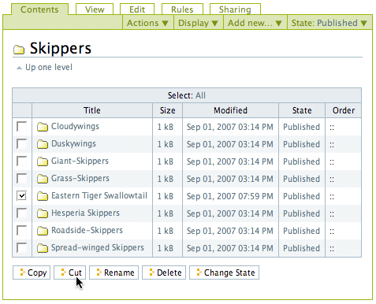

Note que se ha seleccionado la carpeta Eastern Tiger Swallowtail, y que se
presionara el botón de *cortar*. Después de presionar el botón *cortar*, la
pantalla mostrara un nuevo botón de *pegar*. La carpeta Eastern Tiger
Swallowtail y todo su contenido ahora se encuentran en la "memoria" del sitio
web. Sin embargo, la carpeta Eastern Tiger Swallowtail no desaparece
inmediatamente, esperando la operación de pegar. El botón *pegar* esta
resaltado para mostrar que las operaciones cortar/pegar están en proceso:

.. image:: images/operationpaste.png
  :alt:
  :align: center

El botón *pegar* esta activo. El próximo paso es navegar hasta la carpeta de
destino, en este caso la carpeta Swallowtails :

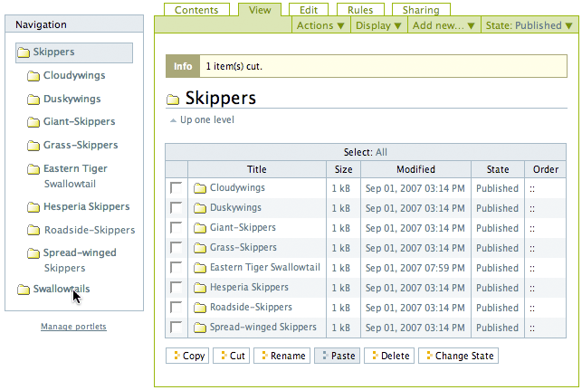

Después de hacer clic en la carpeta Swallowtails, allí se sigue mostrando el
botón *pegar*, porque la operación de pegado aun no se ha completado:

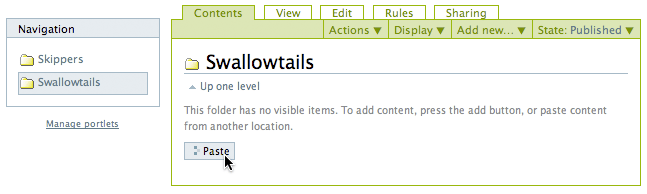

Por ultimo, al hacer clic en el botón *pegar* se agrega la carpeta Eastern
Tiger Swallowtail a la carpeta correcta Swallowtails, y se borra de su
ubicación original; carpeta Skippers. Con esto la operación de
*cortar*/*pegar* ha terminado:

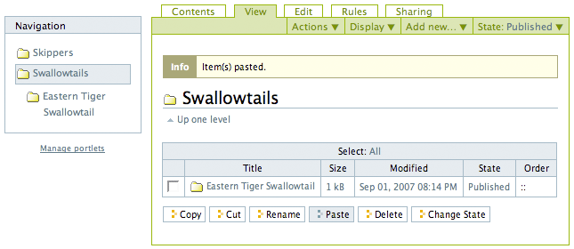

El botón *pegar* permanece activo porque se puede continuar pegando la
carpeta en otros lugares si fuese necesario. Esto es útil en varias
situaciones, incluyendo cuando se necesita copiar una pagina, por ejemplo una
plantilla base, dentro de muchas carpetas.

Copiar/Pegar
------------

Una operación de *copiar*/*pegar* es idéntica a la operación de
*cortar*/*pegar*, con la excepción de que no es eliminado el contenido de la
carpeta original. Funciona como es esperado que funcione.

----

.. figure:: images/lights-camera-action.png
    :alt: lights-camera-action.png
    :align: center

Ver un vídeo sobre como `ejecutar esas operaciones`_ en Plone 2.

----

3.2. Editando Contenido
=======================

Editar contenido en Plone funciona de la misma forma que agregar contenido --
normalmente los paneles para introducir y configurar datos del contenido son
los mismos para editar y agregar datos.

Por supuesto, cuando editamos un elemento de contenido, el elemento ya
existe. Haga clic en la pestaña Editar y aparecerá el panel de ingreso de
datos del elemento, junto con los valores existentes de los datos del
elemento.

Para un ejemplo de algo realmente simple, donde editar se ve igual que
agregar, podemos revisar como editar una carpeta.

El panel *Editar* de una carpeta simplemente muestra las áreas de ingreso del
titulo y la descripción. Comúnmente no se proveen descripciones para una
carpeta, así que la única área cambiada es la del titulo. Si usted desea
conceder una descripción, lo cual es una buena idea para distinguir las
carpetas en una lista, la descripción puede ser solo texto -- no hay
oportunidad para definir un estilo de texto, como negrita, itálica u otras
opciones de formato. Esto mantiene las descripciones de los elementos de
contenido en Plone lo mas simple posible.

Acá vemos el panel *Editar* para una carpeta, en este caso, una llamada
"Butterflies":

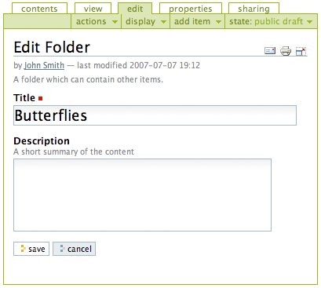

Eso es todo. Cambie lo que desee y guarde, y el contenido sera actualizado en
el sistema de almacenamiento de Plone. Los contenidos se pueden editar
múltiples veces, tal como se pueden editar los contenidos en su computadora
local. Ya se puede haber dado cuenta que Plone almacena los elementos de
contenido como entidades separadas, similar a los "archivos" de una
computadora local, pero no es necesario pensarlo de esta manera. Plone es un
sistema de gestión de contenidos, donde el contenido viene en la forma de
numerosos elementos de contenido discretos, que pueden ser editados de forma
individual. Puede editar tanto como quiera.

Para un ejemplo de editar un contenido que es un poco distinto a como se
crea, podemos revisar la edición de una imagen. La edición de una imagen
puede hacerse navegando a una imagen individual y haciendo clic en la pestaña
*Editar*. Haciendo clic en la pestaña *Editar* para la imagen, se vera el
siguiente panel de *Edición de Imagen*:

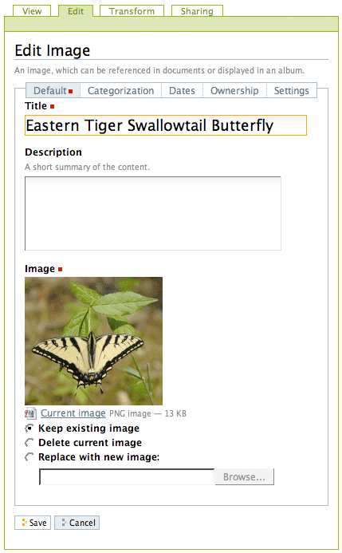

Aquí, una imagen llamada "Eastern Tiger Swallowtail Butterfly" esta siendo
editada. Puede cambiar el titulo y la descripción, como es normal, en cuyo
caso debería dejar la opción "Mantener imagen actual". También es posible
cambiar la imagen en si misma, seleccionado "Reemplazar con nueva imagen". O,
haga clic en la opción "Borrar imagen actual", y se eliminara la imagen
completamente.

Note también la pestaña *Transformar* en la parte superior, que aparece
específicamente en las imágenes, ofreciendo varias alternativas de
transformación de la imagen:

.. image:: images/transformimage.png
  :alt:
  :align: center

De esta manera editar una imagen es un poco distinto que crearla desde un
principio, pero no demasiado.

Los paneles de edición para el resto de tipos de contenido generalmente son
iguales a los paneles de creación.

Edición rápida (*opcional*)
---------------------------

.. tip:: 
    La edición rápida esta deshabilitada por defecto en versiones superiores de Plone (3.3+). 
    Esta puede ser habilitada a través del panel de control por un Administrador 
    del sitio (Configuración del sitio -> Sitio -> casilla Habilitar edición rápida).

El procedimiento normal para editar un elemento de contenido es hacer clic en
la pestaña *Editar* y usar los campos de ingreso específicos de información
para el elemento. Para los campos de texto, como el Titulo, Descripción,
Cuerpo, etc., hay una forma mas rápida de edición llamada edición rápida.
Esta edición se puede utilizar mientras se esta viendo el elemento de
contenido (la pestaña *Visualizar* esta activa). Para que este activada la
edición rápida, el usuario debe tener los derechos para editar el contenido.

Cuando el ratón pasa sobre las partes editables del elemento, una sutil caja
rodeara el texto editable. En la siguiente captura de pantalla, el cursor del
ratón *NO* esta sobre texto editable, así que puede ver el titulo y cuerpo
del texto como lo haría normalmente:

.. image:: images/inlineeditingoff.png
  :alt:
  :align: center

Pero cuando el ratón se mueve sobre el cuerpo del texto, una caja remarca el
cuerpo del texto como editable:

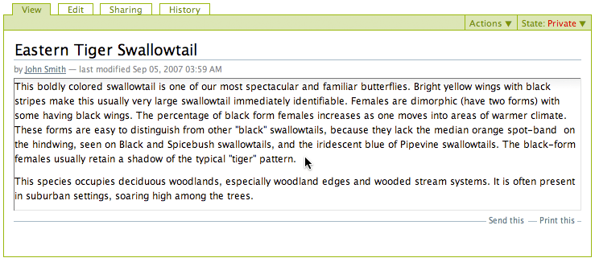

Al hacer clic dentro del cuerpo del texto después que aparece la caja de
edición, aparece el editor visual:

.. image:: images/inlineeditingbodytext2.png
  :alt:
  :align: center

Al cambiar o agregar texto y guardar devuelve la vista normal. Esto es
considerablemente mas rápido -- menos clics y menos tiempo esperando
respuesta del servidor -- que hacer clic en la pestaña *Editar* y esperar que
se cargue completamente la pagina con los paneles de edición.

Si se mueve el mouse sobre el titulo, que también es editable, aparece una
caja de edición rápida:

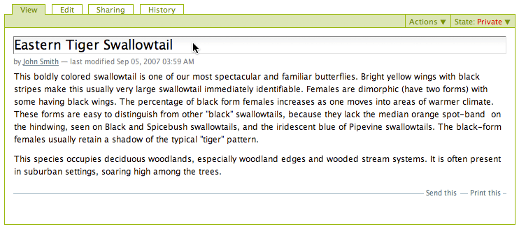

Al hacer clic en el titulo después que aparece la caja de edición, se activa
un simple campo de edición con los botones Guardar y Cancelar:

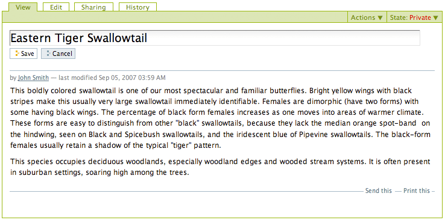

Cambie el titulo y guarde. El beneficio en rapidez de la edición rápida se
nota especialmente en algo tan simple como el titulo.

3.3. Vistas de carpeta
======================

Las carpetas disponen de una pestaña "Mostrar" que controla las distintas
formas de listar el contenido de las carpetas.

Para la mayor parte de los elementos, si quiere cambiar la forma en que se
ven, debe editar el contenido directamente. Pero con las carpetas el asunto
es distinto. Como las carpetas son contenedores de otros elementos, estas
pueden desplegar sus contenidos de varias maneras. A continuación vera cada
una de las opciones en esta sección.

Considere un escenario donde un entusiasta de las mariposas, john Smith, ha
ingresado a su sitio web para trabajar en la parte dedicada a las mariposas
Skipper. el navega a la carpeta Skippers haciendo clic en las pestañas
superiores del sitio web, o el menú de navegación, que esta a la izquierda en
el diseño por defecto de su sitio web Plone. Cuando hace clic en la carpeta
"Skippers", se muestra el panel de vista estándar, llamado "vista estándar":

.. image:: images/folderviewstandard.png
  :alt:
  :align: center

La pestaña *Visualizar* es como se muestran los contenidos de un elemento
para los visitantes anónimos del sitio web. Haz clic en la *pestaña Vista*
cuando quiere ver la forma en que un elemento se ve después de haber cambiado
algo. Para las carpetas, vera un listado de los elementos de contenido que
esta contiene, en una de todas las formas de presentación que existen,
seleccionadas mediante el menú desplegable de selección *mostrar*. La vista
por defecto se llama *vista estándar*:

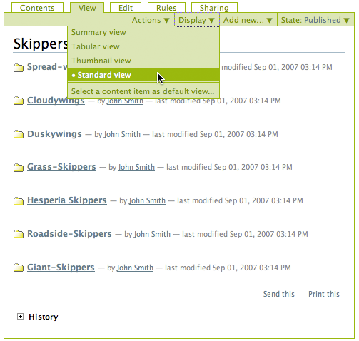

Y esta es una *vista resumen*:

 .. image:: images/folderviewsummary.png
  :alt:
  :align: center

Y una *vista tabular*:

 .. image:: images/folderviewtabular.png
  :alt:
  :align: center

Y una *vista en miniatura*, la que se usa principalmente para fotografías,
pero que también funciona para el contenido normal:

 .. image:: images/folderviewthumbnail.png
  :alt:
  :align: center

Hacer un álbum de fotos es muy simple. Tan solo agregue las fotografías
(imágenes, o archivos de imágenes, comúnmente archivos .jpg) a una carpeta y
seleccione la vista de esta a **vista en miniatura**. La vista en miniatura
automáticamente actualizara la exhibición mientras agregue las imágenes a la
carpeta, presentando una división multi-pagina en conjuntos de imágenes, si
es necesario, cuando el numero de imágenes crece.

Si esta subiendo imágenes fotográficas de una cámara digital o un escáner, lo
mejor sera que le cambie las dimensiones en su computador local antes de
subirlas, debido a que son muy grandes.

Establecer un elemento de contenido individual de la carpeta como vista por defecto de la misma.
------------------------------------------------------------------------------------------------

La funcionalidad de lista de vista básica de carpetas descrita anteriormente
encaja con la manera normal de pensar en carpetas -- como contenedores de
elementos -- pero Plone agrega una buena facilidad para definir la vista de
una carpeta para que sea cualquier elemento individual contenido en la misma.
Esta se aprovecha de la forma en que el sistema de navegación dinámicamente
refleja la estructura de la carpeta de un sitio web Plone cuando las carpetas
son creadas.

Usted puede configurar en la pestaña "mostrar" de una carpeta para que
muestre una sola pagina, la cual puede ser útil para manifestar los
documentos mas recientes en una lista de documentos almacenados en la
carpeta. O usted puede configurarla a una Colección, la cual ya dispone de un
poderoso filtrado de contenido. La configuración de la vista "mostrar"
debería ser usada con cuidado, porque esta cambia el comportamiento de las
carpetas, desde actuar como un simple contenedor a actuar como un enlace
directo a contenido. En lugar de eso, usualmente puede lograr lo que quiera
únicamente utilizando Colecciones, las cuales se describirán mas adelante.

----

.. figure:: images/lights-camera-action.png
    :alt: lights-camera-action.png
    :align: center

Ver un vídeo sobre como `definir la pagina en la vista mostrar`_ en Plone 2.

----

Lo próximo sera movernos a la pestaña *Contenidos* para ver las funciones
importantes para accesar a los contenidos en una lista de contenido de
carpeta.

3.4. Vistas para contenidos
===========================

La pestaña de Contenidos muestra una lista de elementos en una carpeta. Es el
lugar para ejecutar simples acciones de elemento-por-elemento y las acciones
de manipulación de copiar, cortar, pegar, mover, reordenar, etc.

La pestaña Contenidos para las carpetas es como las utilidades de sistema de
"Administrador de Archivos" o "My PC" en escritorio MS Windows y Linux
respectivamente y el "Finder" en Mac OS X, con una funcionalidad similar.

Haciendo clic en la pestaña *Contenidos* para una carpeta, como la siguiente
carpeta Skippers, muestra el panel de la pestaña *Contenidos*:

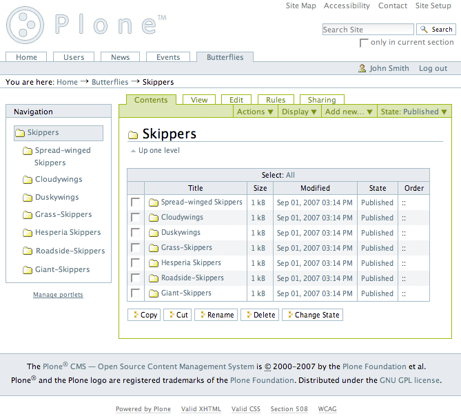

El panel de la pestaña *Contenidos* es inmediatamente reconocido observando
las casillas de comprobación al lado izquierdo de los elementos en la lista
de contenidos . Haga clic en estas casillas de comprobación para seleccionar
múltiples elementos para ejecutar operaciones como *copiar*, *cortar*,
*renombrar*, *eliminar*, o *Cambiar Estado*.

Plone tiene un porta-papeles para las operaciones *copiar* y *cortar*.  Si
usted comprueba uno o mas elementos, y hace clic en el botón copiar o cortar,
el botón pegar sera agregado a la fila de botones al final del panel. Si
después hace clic en otra carpeta, usted podrá pegar los elementos allí. Para
una operación de cortar, los elementos serán eliminados de la carpeta origen
-- ellos no desaparecerán -- hasta que sean pegados en algún lado.

*Renombrar* elementos mostraran un panel para ingresar un nuevo nombre para
el *nombre corto* (o *id*) del elemento, como también el *titulo*. La
distinción entre *nombre corto* y *titulo* solo se hace aparente cuando usted
renombra, porque Plone automáticamente crea el *nombre corto* del *titulo* en
la mayoría de los sitios Web Plone.  Pero la operación renombrar debe mostrar
el *nombre corto* así como el *titulo*, por que usualmente se desea cambiar
ambos, si se cambia alguno. Considere el siguiente ejemplo:

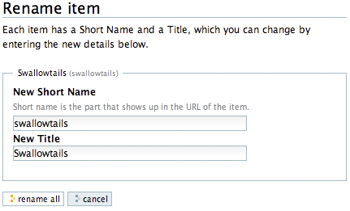

Si usted quisiera cambiar el titulo a "Long-tailed Skippers," usted podría
también cambiar el nombre corto a "long-tailed-skippers." Esto mantendría las
cosas en orden -- de forma correcta, ya que la dirección URL para el
elemento, la dirección Web, se mantendría al día con el actual elemento de
contenido. Note que el nombre corto no puede contener espacios blancos. Use
guiones para cualquier espacio en blanco en el titulo, si no haga una copia
exacta del titulo. También, use caracteres en minúsculas para el nombre
corto. También vea la pagina "`¿Que hay en un nombre Web?`_" para una 
descripción de como Plone manipula las direcciones Web y el nombre corto. El
siguiente vídeo también incluye una ilustración de la operación de renombrar:

----

.. figure:: images/lights-camera-action.png
    :alt: lights-camera-action.png
    :align: center

Ver un vídeo que incluye `renombrar un elemento`_ en Plone 2.

----

La operación *eliminar* es sencilla. Haga clic para seleccionar uno o mas
elementos en sus casillas de comprobación, y luego haga clic en el botón
eliminar, y los elementos serán eliminados.

La operación *Cambiar Estado* ofrece un grandiosa manera de cambiar el estado
de la publicación de una selección de carpetas, y sus sub-carpetas. En el
siguiente ejemplo, el Estado de Publicación para una carpeta llamada "Long-
tailed Skippers" se esta modificando. Marque la casilla "Incluir los
elementos contenidos", esto hace que el cambio de Estado afecte todos los
contenidos dentro de la carpeta. No olvide que usted puede hacer esto,
digamos, en tres carpetas a la vez, y todos sus sub-carpetas y elementos
contenidos, de manera que usted cambie rápidamente los estados de: publicar,
retirar, etc.

Presione *Shift* y haga *clic* para seleccionar un rango de elementos de
trabajo. Esto podría ser muy útil para una carpeta con una docena o mas
elementos, y podría ser indispensable para carpetas con cientos de elementos.

Adicionalmente a estas operaciones de acción individual, el reordenar es una
manipulación natural usando el ratón, como esta descrita en la próxima
sección.

3.5. Reordenar los elementos de contenido de la carpeta
=======================================================

La pestaña de Contenidos tiene la funcionalidad para una rápida y precisa
reordenación de los elementos contenidos.

Considere la siguiente carpeta, llamada "Skippers," que almacena información
acerca de este tipo de mariposa.  Con frecuencia, cuando se agrega elementos
de contenidos, inicialmente no están organizados en el orden que queremos. La
opción deseada no siempre es alfabética, pero en este ejemplo se asume eso. A
continuación puede ver que las sub-carpetas de mariposa Skipper no están en
orden alfabético:

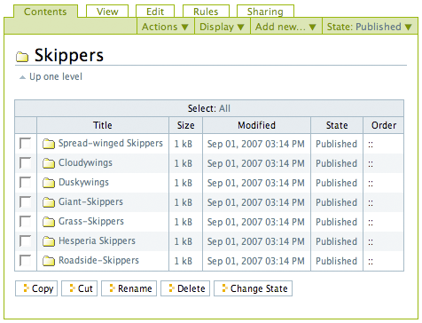

Para mover el elemento del tope nombrado "Spread-winged Skippers" al final de
la lista, uno podría hacer clic en la columna Orden a la derecha (que
contiene dos signos de dos puntos) y arrastre la fila a la posición deseada:

.. image:: images/copy_of_foldercontentsreorder.png
  :alt:
  :align: center

Arrastrar y soltar se hace presionando y manteniendo el botón del ratón hasta
donde quiera mover el elemento. El elemento que se esta moviendo se torna
amarillo mientras que este en esta acción:

.. image:: images/foldercontentsdrag.png
  :alt:
  :align: center

Cuando el botón de ratón es liberado, el elemento queda donde fue soltado:

.. image:: images/foldercontentsdrop.png
  :alt:
  :align: center

3.6. Enlaces siguiente/anterior
===============================

Los enlaces siguiente/anterior automáticos para los elementos de contenidos
en una carpeta pueden ser habilitados bajo la pestaña Configuración (en una
carpeta).

La pestaña *Configuración* se encuentra haciendo clic en la pestaña *Editar*
para la carpeta. Allí hay un casilla de comprobación para "Habilitar la
navegación siguiente/anterior" para los elementos contenidos en la carpeta:

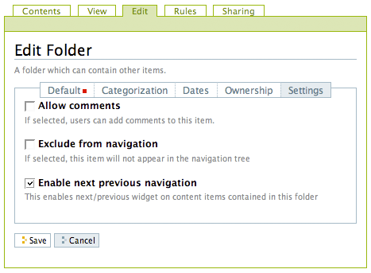

Una ves habilitado, tan pronto elementos de contenidos son agregados en la
carpeta, los enlaces siguiente/anterior automáticamente aparecerán como ha
sido requerido:

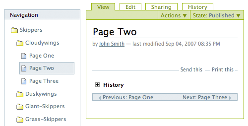

Tres paginas han sido creadas en la carpeta Cloudywings, y "Page Two" (la
cual no tiene texto para este ejemplo) se ha seleccionado. Al final de "Page
Two" están los enlaces "Anterior: Page One" y "Siguiente: Page Three."

Este es una característica *realmente* ¡muy útil!

3.7. Eliminando Elementos
=========================

Los elementos pueden ser eliminados de una carpeta con facilidad.

A veces es necesario eliminar un elemento de contenido, a menudo para
remplazarlo con un versión actualizada. O usted simplemente podría eliminar
un elemento, por una variedad de razones. En el ejemplo de la mariposa
swallowtail agregada por error a la carpeta Skippers, en vez de cortar y
pegar en algún lugar, simplemente podría ser eliminada:

.. image:: images/operationdelete.png
  :alt:
  :align: center

En el ejemplo que se muestra arriba, la carpeta *Eastern Tiger Swallowtail*
esta a punto de ser eliminada.

Carpetas enteras pueden ser eliminadas, así que debe tener cuidado al
ejecutar la operación eliminar, esto se aplica al uso de computadoras en
general, y todos hemos aprendido a hacer un auto-chequeo de ultimo minuto
para asegurarnos de que la operación de eliminar es realmente deseada.

3.8. Bloqueo y desbloqueo automático
====================================

Plone da un mensaje de bloqueo que le dirá que el documento fue bloqueado,
por quien, y hace cuanto tiempo - de esta manera no pasara que modifique
accidentalmente los cambios que otro usuario haya hecho.

Cuando alguien hace clic en la pestaña Editar, el elemento inmediatamente es
bloqueado. Esta característica previene que dos personas estén editando el
mismo documento al mismo tiempo, o que accidentalmente guarden ediciones
sobre los cambios de otro usuario. En este ejemplo, George Schrubb inicio la
edición del documento "Widget Installation". Cuando Jane Smythe (quien tiene
permisos para editar este documento) se dirige a la pestaña ver del
documento, ella observara lo siguiente:

.. image:: images/locking01.png
  :alt: locking01.png
  :align: center

Una ves que George allá finalizado la edición del documento y haga clic en el
botón Guardar, el documento es desbloqueado y estará disponible para ser
editado por otros usuarios (teniendo ellos los permisos apropiados para
hacerlo, por supuesto).

Sin embargo, si Jane se da cuenta que George ya no esta editando el documento
(Es decir que el mensaje de bloqueo refleja que el elemento fue bloqueado
días atrás y no hace algunos minutos) entonces Jane puede "desbloquearlo" y
hacerlo disponible para la edición nuevamente.

En Plone 3.3 o versiones superiores:

Si un usuario edita la pagina sin hacer clic en el botón Guardar o Cancelar,
el bloqueo del contenido permanecerá efectivo por los próximos 10 minutos,
después de este tiempo, el elemento de contenido bloqueado es automáticamente
desbloqueado. La característica de tiempo fuera es importante para los
navegadores que no ejecutan la acción javascript "on-unload" apropiadamente
como Safari.

Tal vez usted quiera deshabilitar los bloqueos, para esto dirijase al panel
de control de Plone (Configuración del Sitio -> Sitio) y desmarque *Habilitar
el bloqueo para ediciones a través de la interfaz web*.

3.9. Versionando (Plone v3.0 - Plone v3.2)
==========================================

Una descripción general de como ver el histórico de versiones de un elemento,
comparar versiones, vista preliminar de versiones previas y revertir a
versiones previas. Este documento es específicamente para versiones 3.0, 3.1
y 3.2.

**Crear una nueva versión**
---------------------------

Plone 3.0 incluye una característica de versionado. Por defecto, los
siguientes tipos de contenidos tienen habilitado el versionamiento:

-   Paginas
-   Noticias
-   Eventos
-   Enlaces

Los elementos de contenido pueden ser configurados para que tengan
habilitado/deshabilitado la política de versionado a través del panel de
Configuración de Plone en la "Configuración del Sitio" -> "Tipos".

Cuando se edita un elemento, usted puede usar el campo <s0>nota sobre el
cambio</s0> al final del elemento; la nota sobre el cambio sera almacenada en
el histórico de versiones del elemento. Si la "nota sobre el cambio" se deja
en blanco, esta puede ser rellenada automáticamente dependiendo del Estado
del elemento (ej. si se deja en blanco la primera ves que el elemento es
guardado se usa " " .)

Una nueva versión es creada cada ves que el elemento es guardado.

Viendo el histórico de versiones
--------------------------------

Una ves que un elemento ha sido guardado, usted puede usar la pestaña
Histórico para ver la historia de versiones:

.. image:: images/image_preview_003.png
  :alt: Histórico de Versión
  :align: center

La versión mas reciente es listada de primero y al hacer clic en cualquiera
de los encabezados de las columnas, estas se re-ordenaran en la lista.

Comparando versiones
--------------------

Desde la pestaña "Histórico" usted puede comparar cualquier versión previa
con la versión actual usando el enlace "Comparar con versión actual" en la
columna de Acciones. También puede comparar cualquier versión con la versión
previa usando el enlace "Comparar con versión previa".

.. image:: images/image_preview_004.png
  :alt: Comparando Versiones
  :align: center

La leyenda indica que el contenido agregado se manifiesta en color verde
claro y las etiquetas agregadas en color verde oscuro; similarmente, el color
rojo claro indica el texto que fue eliminado y el color rojo oscuro para las
etiquetas que fueron eliminadas; y finalmente el texto resaltado con el color
amarillo indica que ha sido cambiado.

Usted también puede ver las diferencias en el código haciendo clic en en
enlace "Mostrar diferencias como código":

.. image:: images/image_preview_005.png
  :alt: Comparando Versiones (código HTML)
  :align: center

Previsualizando y revirtiendo a versiones previas
-------------------------------------------------

Usted puede tener una visualización previa de una versión anterior haciendo
clic en el enlace "vista preliminar" en la columna Versión para cualquier
versión en particular desde la pestaña "Histórico"; en la pagina subsecuente,
usted necesitara hacer clic al enlace vista preliminar:

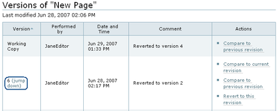

o desplazar toda la pagina hacia abajo para ver la vista preliminar:

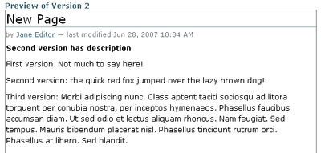

Para revertir una versión en particular, solo use el enlace "Volver a esta
versión". Un comentario indicara cuando un elemento fue revertido y a cual
versión fue revertido:

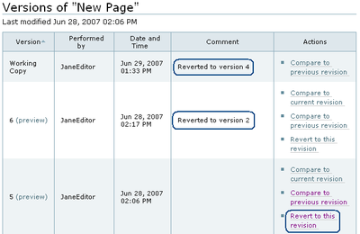

3.10. Versionando (Plone v3.3+)
===============================

Una descripción general de como ver el histórico de versiones de un elemento,
comparar versiones, vista preliminar de versiones previas y revertir a
versiones previas. Este documento es específicamente para versiones 3.3 o
superiores

**Crear una nueva versión**
---------------------------

Plone 3 incluye una característica de versionado. Por defecto, los siguientes
tipos de contenidos tienen habilitado el versionamiento:

-   Paginas
-   Noticias
-   Eventos
-   Enlaces

Note que todos los otros tipos de contenidos hacen seguimiento del histórico
del flujo de trabajo

Los elementos de contenidos pueden ser configurados para que tengan
habilitado/deshabilitado el versionamiento a través del panel de
Configuración de Plone en la "Configuración del Sitio" -> "Tipos".

Cuando se edita un elemento, usted puede usar el campo **nota sobre el
cambio** al final del elemento; la nota sobre el cambio sera almacenada en el
histórico de versiones del elemento. Si la nota sobre el cambio se deja en
blanco , Plone incluye una nota por defecto: "Initial Revision".

Una nueva versión es creada cada ves que el elemento es guardado. El
versionado hace un seguimiento de todo tipo de ediciones: contenido,
metadatos, configuraciones, etc.

Viendo el histórico de versiones
--------------------------------

Una ves que un elemento ha sido Guardado, usted puede verlo en el viewlet
**Histórico** encontrado al final de la pagina. Simplemente haciendo clic en
el viewlet Histórico para expandirlo:

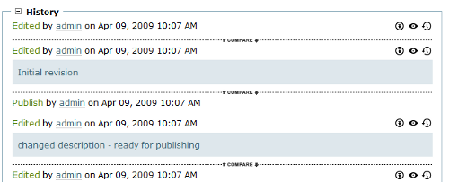

La versión mas reciente es listada de primero. El viewlet de Histórico provee
la siguiente información:

-   El tipo de edición (contenido o flujo de trabajo)
-   Cual usuario hizo la edición
-   En que fecha o hora ocurrió la edición

Comparando versiones
--------------------

Desde el viewlet Histórico usted puede comparar cualquier versión previa con
la versión actual o cualquier otra versión con la versión justo antes de
esta.

Para comparar cualquier versión previa con aquella que justo esta antes de
esa, use el botón COMPARAR ubicado entre las dos versiones adyacentes en el
viewlet Histórico.

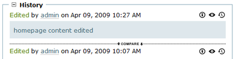

Haciendo clic en este botón, usted vera una pantalla como esta en donde puede
ver las diferencias entre las dos versiones:

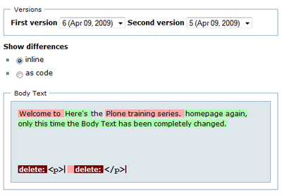

En este ejemplo, el texto esta de color rojo, indicando que este texto fue
eliminado y el texto que esta de color verde es texto que ha sido agregado a
la nueva versión. Una etiqueta de párrafo vacía es también muestra que ha
sido eliminado en este ejemplo. Usted puede elegir entre las vista
**directa** o **como código** para ver las diferencias entre versiones.

.. image:: images/image_preview_005.png
  :alt: Comparando Versiones (código HTML)
  :align: center

Usted también puede comparar cualquier versión con la versión *actual*
haciendo clic en el icono de flecha en el viewlet Histórico

.. image:: images/image_preview_008.png
  :alt: history-icons.png
  :align: center

(icono a la izquierda). Estos iconos son encontrados a la derecha de cada
versión listada en el viewlet.

Viendo y revirtiendo a versiones previas
----------------------------------------

**Usted puede tener una vista preliminar de cualquier versión anterior** de
un documento haciendo clic en el icono del "ojo" a la derecha de cualquier
versión listada en el viewlet Histórico

.. image:: images/image_preview_008.png
  :alt: history-icons.png
  :align: center

(icono centrado).

**Para revertir a una versión previa**, haga clic en el icono cara-reloj a la
derecha de cualquier versión listada en el viewlet Histórico

.. image:: images/image_preview_008.png
  :alt: history-icons.png
  :align: center

(icono a la derecha).

3.11. Copia de trabajo
======================

Las copias de trabajo le permiten tener dos versiones de su contenido en
paralelo.

**Cuando un sitio Plone es creado, hay un numero de características
adicionales que pueden ser habilitadas, incluyendo "Copia de trabajo". Si el
sitio Plone que esta usando no muestra la opción "Retirar versión" en el menú
desplegable "Acciones", usted podría necesitar contactar al administrador de
su sitio y solicitarle que instale "Working Copy Support (Iterate)".**

Resumen
-------

Tal vez usted haya estado en una situación como esta antes: tiene un
documento publicado, y necesita actualizarlo extensivamente, pero usted
quiere que la versión antigua siga disponible en el sitio web hasta que
publique la nueva versión del documento. Usted también quiere que el nuevo
documento remplace el actual, pero le gustaría mantener los históricos de
cambios del documento antiguo, en caso de necesitarlo. Copia de trabajo hace
todo esto posible.

Esencialmente usted "retira una versión" del documento actualmente publicado,
lo cual crea una "copia de trabajo" para el documento. Luego usted edita la
copia de trabajo (tomándose todo el tiempo que desee) y cuando este listo
para que la nueva versión se publique, hace clic en la opción "Guardar nueva
versión" de su copia de trabajo, y esta sera publicada. Tras bambalinas,
Plone remplazara el documento original con el nuevo documento en la misma
ubicación y dirección web y archiva la versión antigua como parte del
histórico de versiones del documento.

Usando "Retirar versión"
------------------------

Primero, navegue a la pagina que usted quiere ejecutar "Retirar versión".
Entonces desde el menú desplegable "Acciones", seleccione Retirar versión:

.. image:: images/01.png
  :alt:
  :align: center

Después se le pedirá que seleccione la carpeta en la cual la "copia de
trabajo" deberá localizarse -- esta sera la versión que usted edite. En este
ejemplo, elegiremos la carpeta Home, que es la carpeta personal del usuario:

.. image:: images/02.png
  :alt:
  :align: center

Luego haga clic en "Retirar versión". Su ubicación actual es automáticamente
actualizada a la copia de trabajo:

.. image:: images/03.png
  :alt:
  :align: center

Ahora usted es libre para editar su propia copia local del documento
publicado. Durante este tiempo,  el documento original esta "bloqueado" --
esto significa que nadie puede editar esa versión publicada mientras usted
tenga "retirada" una copia de trabajo. Esto previene que se inicien otros
cambios hechos a (y subsecuentemente se pierdan desde la versión de copia de
trabajo) la versión publicada mientras usted edita su copia.

.. image:: images/locked.png
  :alt:
  :align: center

Usando "Guardar nueva versión"
------------------------------

Cuando usted haya terminado con la edición de la copia de trabajo hay que
remplazarla por la versión publicada, simplemente seleccione la opción
"Guardar nueva versión" en el menú desplegable "Acciones":

.. image:: images/04a.png
  :alt:
  :align: center

Se le pedirá que ingrese un mensaje para el guardar la Nueva Versión.
Rellenelo y haga clic en el botón "Guardar nueva versión":

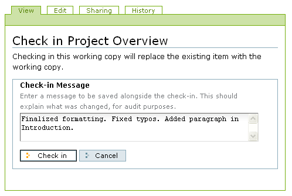

Su documento actualizado remplazara ahora la copia publicada y se convertirá
en la nueva copia publicada. Note que su ubicación ha sido actualizada a la
ubicación del documento original.

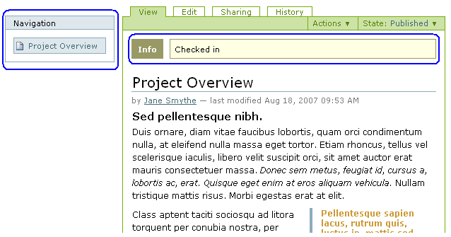

También note que ya no existe una copia de trabajo del documento en la
carpeta personal de usuario.

Observe que no es necesario (y de hecho no es recomendado) usar el menú
desplegable "Estado" en una copia de trabajo. Si embargo si usted por
descuido lo hizo, no importa. Solo valla atrás a su copia de trabajo y use la
opción "Guardar nueva versión" desde el menú desplegable "Acciones".

Cancelando un "Retirar versión"
-------------------------------

Si por alguna razón es necesario cancelar una "retirado" y **usted no quiere
guardar ninguno de sus cambios**, simplemente navegue hacia la copia de
trabajo y seleccione la opción "Cancelar retirada de versión" desde el menú
desplegable "Acciones":

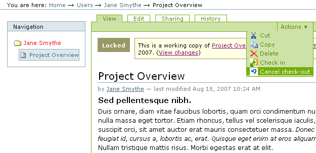

Se le pedirá que confirme "Cancelar retirada de versión" o "Mantener retirada
de versión":

.. image:: images/cancel2.png
  :alt:
  :align: center

Note que si el usuario que ha retirado una versión de una copia de trabajo no
esta disponible para realizar un "Guardar nueva versión" o un "Retirar
versión", los usuarios con rol de Administrador pueden navegar a la copia de
trabajo y ejecutar estas acciones. Esto es porque no todos los colaboradores
tienen el privilegio de *Guardar nueva versión*. Si esta opción no aparece en
su menú desplegable *Acciones*:

1.  Use el menú desplegable *Estado*.
2.  Enviar para publicación.
3.  Preguntar a un usuario revisor para **no** cambiar el Estado.
4.  Pedir al usuario revisor para que ejecute el "Guardar nueva versión"
    en su lugar.

La rutina de "Guardar nueva versión" se encargara del Estado.

3.12. Modo Presentación
=======================

Plone tiene la habilidad de crear fácilmente laminas de presentaciones.

El "Modo presentación" es una característica especial del tipo de contenido
Pagina. Usted puede habilitar el "Modo presentación" editando la pagina,
luego dirijase a la pestaña **Configuración**. Note que la casilla de "Modo
presentación" este disponible. Una ves marcada, un enlace aparecerá en la
vista de la pagina para que los usuarios vean la pagina en "Modo presentación."

¿Como crear laminas?
--------------------

Todos los contenidos para una presentación residen en una sola pagina. Usted
no necesita crear una pagina para cada lamina. Una lamina es creada cuando
usted usa la clase de estilo Encabezado (h1) en una pagina - estos le indican
efectivamente a Plone donde quiere que estén las laminas.

Usted puede tener tantas laminas como usted quiera en su presentación. Solo
agregue mas etiquetas de Encabezado (h1) a su pagina y el contenido entre el
encabezado h1 y el próximo encabezado h1 se convierte en el contenido de su
lamina.

¿Como aplicar formato una lamina?
---------------------------------

Es importante saber que el **Estilo de Párrafo Normal no hará que ningún
contenido se muestre en la lamina.**. Las laminas están destinadas a contener
información resumida, no grandes cantidades de texto. Como tales. usted debe
ordenar todo el contenido de cada lamina con un estilo diferente a aquel del
Párrafo Normal. Ejemplos de esos estilos incluye:

-   Encabezado (h1)

-   Subtítulo (h3)

-   Lista de definiciones

-   Lista no ordenada

-   Lista numerada

-   Literal

-   Cita destacada

-   Resaltado

-   Resaltar

.. _ejecutar esas operaciones: http://media.plone.org/LearnPlone/Copy,%20Paste,%20Cut,%20etc.swf
.. _definir la pagina en la vista mostrar: http://media.plone.org/LearnPlone/Choosing%20a%20default%20page.swf
.. _¿Que hay en un nombre Web?: http://plone.org/documentation/manual/plone-3-user-manual/adding-content/whats-in-a-web-name
.. _renombrar un elemento: http://media.plone.org/LearnPlone/Copy,%20Paste,%20Cut,%20etc.swf

Créditos de esta traducción
---------------------------

.. sectionauthor::  Hugo Salgado <hsalgado@vulcano.cl>
.. codeauthor:: 
    Luis Sumoza <lsumoza@gmail.com>, 
    Leonardo J. Caballero G. <leonardocaballero@gmail.com>,
