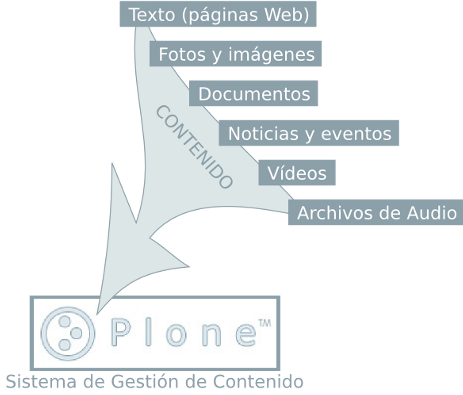
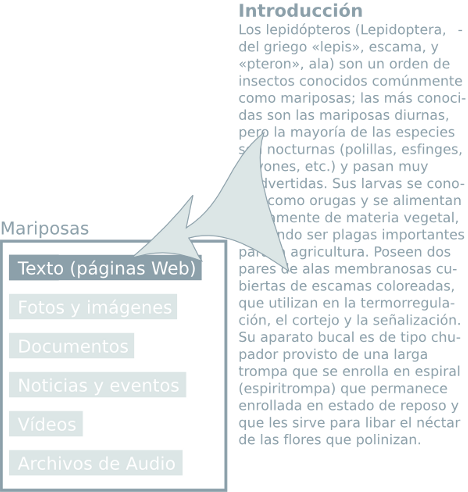
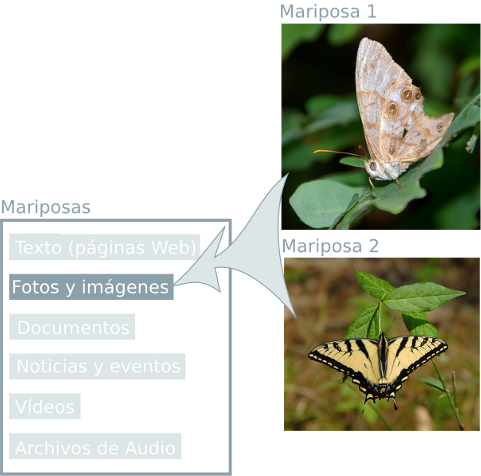
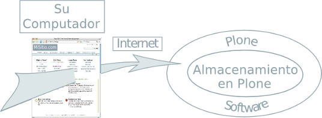
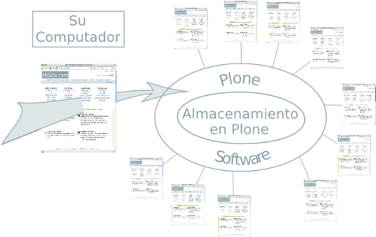
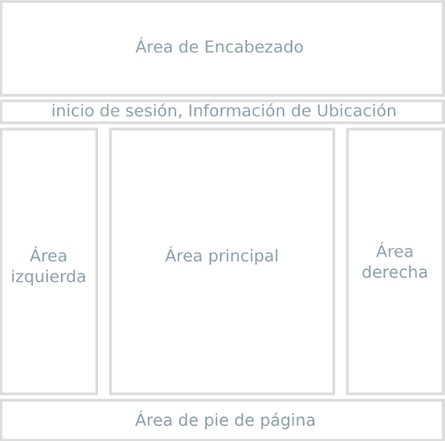
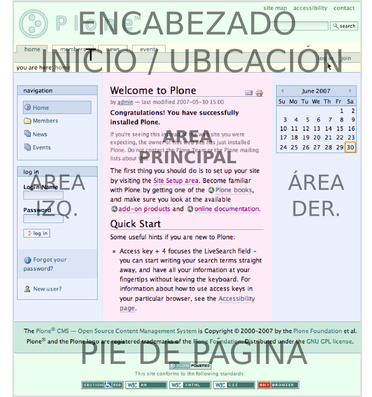
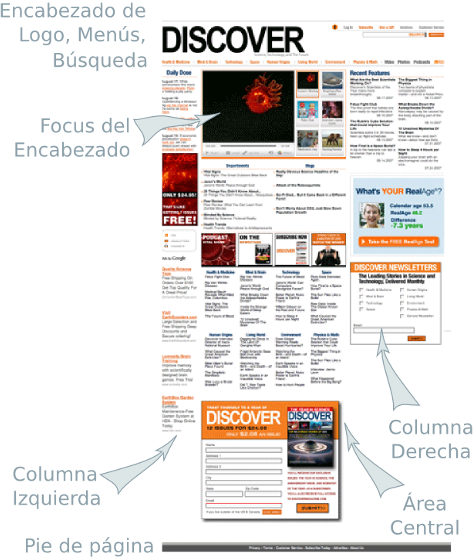
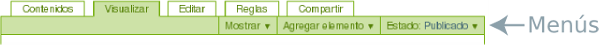
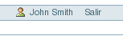

.. -*- coding: utf-8 -*-

.. highlight:: rest

.. _introduccion:

===============
1. Introducción
===============

Un Resumen conceptual de Plone

1.1. Resumen conceptual
=======================

Una explicación de Plone como sistema de gestión de contenidos

¿Qué es Plone?
--------------

Plone es un sistema de gestión de contenidos (del ingles, Content Management
System - CMS) que puede emplearse para construir un sitio web. Empleando
Plone, las personas sin conocimientos de programación o sin la ayuda un
experto pueden contribuir al contenido de un sitio web. Plone funciona vía
web, por lo tanto no necesita instalar ningún software especializado en la
computadora del cliente. La palabra *contenido* es usada en un sentido
general ya que usted puede publicar distintos tipos de información,
incluyendo:

Un sitio web Plone contiene diferentes tipos de contenido, incluyendo textos,
fotos e imágenes. Estos pueden ser almacenados en diferentes formas:
documentos, noticias, eventos, vídeos, archivos de audio y cualquier tipo de
archivo que pueda ser subido o creado en un sitio web. El contenido también
puede subirse desde una computadora local, además, Plone le permite crear
*carpetas* para organizar el contenido y crear una estructura de navegación:

.. image:: images/content_is_added_to_folders.png
    :align: center
    :alt: Contenido es agregado en carpetas

¡Usted adora las mariposas!
---------------------------

Si se deseara agregar contenido sobre mariposas, por ejemplo, se puede crear
una carpeta llamada "Mariposas" y luego agregar texto a una pagina dentro de
la carpeta:

También se pueden agregar algunas imágenes a la carpeta:

Dentro de una carpeta usted puede agregar muchos contenidos de distintos
tipos, incluyendo sub-carpetas. Luego de agregar algunos reportes y vídeos a
la carpeta Mariposas, el contenido debería estar organizado como se muestra a
continuación, con dos sub-carpetas dentro de la carpeta Mariposas:

.. image:: images/folders_within_folders.png
    :alt: Carpeta en carpeta
    :align: center

¿Qué ocurre tras bambalinas?
----------------------------

Es probable que el lector se pregunte cómo funciona todo. Un sitio Web Plone
típico existe como una instalación de Plone instalada en un servidor web. El
servidor web puede estar en cualquier sitio, usualmente en una compañía de
hospedaje con una "pila" de computadoras dedicadas a realizar la tarea:

.. image:: images/server_rack.png
    :alt: Rack del servidor
    :align: center

El diagrama muestra los cables que conectan los servidores individuales a
internet, a través de rápidas conexiones de red. Su sitio Plone es solo un
software y almacenamiento de base de datos instalados en uno de los
servidores individuales. Cuando introduce texto o hace clic en algún lugar del sitio, la computadora
del usuario envía y recibe datos a través de cables de red y canales de
comunicación en internet que interactúan con la instalación de Plone en el
servidor.

Simplifiquemos el diagrama que muestra como se interactúa con Plone:

.. image:: images/client_to_server_simple.png
    :alt: Del cliente al servidor
    :align: center

Usted usa su navegador web; Mozilla Firefox, Safari, Internet Explorer, etc.
-- para ver y editar su sitio web Plone, y éste guarda los cambios realizados
en su sistema de almacenamiento de bases de datos.

Por ejemplo, imagine que su sitio web Plone de Mariposas esta ubicado en el
sitio misitio.com. Usted escribe www.misitio.com en su navegador web. Luego
presiona la tecla Enter, la siguiente secuencia de eventos es llevada a cabo
entre el navegador y el servidor de www.misitio.com:

.. image:: images/client_request.png
    :alt: Solicitud del cliente
    :align: center

Luego el software Plone responde:

.. image:: images/server_response.png
    :alt: Respuesta del servidor
    :align: center

Plone lee su respectiva base de datos para buscar la información almacenada
en misitio.com. Luego envía de vuelta la pagina web a su computadora en un
código llamado HTML que es un lenguaje de computadora que describe con luce
una pagina web. Este incluye texto, gráficos, tipos de letras, color del
fondo, etc. En Internet existen muchos sitios donde se puede aprender HTML
detalladamente, pero una de las ventajas de Plone es que no es necesario
aprender (demasiado) sobre HTML. Esa es una de las razones por la que Plone y
otros software similares permiten al usuario concentrarse en el contenido,
por ejemplo, el texto y los gráficos de las mariposas en vez de aprender un
nuevo lenguaje de computadoras.

Pero regresemos a la interacción entre la computadora del usuario y el
servidor. El navegador web "suministra" (traduce) este HTML para que pueda
ver la pagina web resultante:

.. image:: images/my_site_served.png
    :alt: Mi sitio servido
    :align: center

Así que cuando ve su pagina web de mariposas, puede decidir si cambiarla o
agregarle contenido. Además en cualquier momento se puede subir fotos,
documentos, etc:

Luego que hace sus cambios y hace clic en "Guardar", la nueva versión de la
pagina web se mostrara a cualquiera que visite el sitio:

1.2. Diseño visual de los sitios web Plone
==========================================

Plone permite a diseñadores y administradores crear diseños únicos para sus
sitios. En esta sección se hace un breve recorrido por el esquema de Plone y
algunos ejemplos de diseño.

¿Como luce un sitio web hecho con Plone?. Desde hace varios anos existe un
diseño consistente para la apariencia por defecto de Plone. El diseño por
defecto generalmente se parece a lo siguiente:

Aunque un sitio Plone puede tener un diseño radicalmente distinto a este,
igual debería identificar los elementos comunes, como por ejemplo el enlace
de entrar, un panel de navegación o un menú. En el diseño por defecto, el
menú de navegación esta a la izquierda y usualmente muestra una lista de
carpetas. También puedo haber un grupo de pestañas *Entrar, información sobre
la ubicación* en la franja de la parte superior.

Es posible distinguir entre el *diseño* de un sitio web y su *funcionalidad*.
Para realmente realizar el trabajo, concentrese en la funcionalidad y no se
preocupe demasiado por la apariencia y diseño del sitio web. Una fortaleza
del sistema de contenidos de Plone, es que un sitio web puede ser
radicalmente rediseñado sin afectar al contenido ni funcionalidad. El menú de
navegación puede moverse de izquierda a derecha y funcionara del mismo modo.
El área de la derecha puede eliminarse ya que normalmente la funcionalidad
que se le da a esta no es necesaria. Las áreas de la izquierda, principal, y
derecha, tal como se describe arriba y abajo, pueden cambiarse a la parte
superior, media, e inferior, y aun así debajo de todo esto seguiría siendo un
sitio web Plone.

Usaremos el diseño por defecto de Plone como ejemplo de una división típica
de pantalla:

Usted tal ves requiera adaptar estos términos (áreas) según sea necesario
para el diseño de su sitio web Plone. Seguramente se usaran términos (áreas)
variados para describir el diseño real del sitio, como por ejemplo, los
"slots" o paneles izquierdo y derecho para las columnas laterales. Los
"portlets" o "viewlets" para las áreas discretas o "cajas", entre otros.

A modo de ejemplo, se seleccionara tres sitios para comparar tomados de la
`lista de sitios web Plone`_:

.. image:: images/akamaidesign.png
    :alt: Diseño de Akamai
    :align: center

En la figura, se muestra el sitio de Akamai, un líder proveedor de
herramientas y tecnologías de aceleración web. El encabezado posee un simple
menú con enlaces que lista horizontalmente a las cinco secciones principales
de contenido. A la derecha, el encabezado posee otro menú horizontal y un
cuadro de búsqueda. Al pie del encabezado se muestra la opción para entrar al
sitio, opción empleada por los responsables del mismo. Debajo del encabezado
y a la izquierda, hay un área para gráficos llamativos y temas actuales. El
área principal en el centro a la izquierda se encuentra el texto principal.
La columna derecha contiene una serie de "portlets." El pie de pagina posee
un menú horizontal con las mismas opciones del encabezado convenientemente.
Por ultimo, a la derecha hay una columna con opciones de zoom.

Este es el sitio web de Discover Magazine. El área de encabezado contiene un
extenso menú horizontal o si se quiere "menú principal," en la esquina
superior derecha hay otro menú y un cuadro de búsqueda. Este sitio posee un
gran numero de "portlets" de texto que cubren diferentes temas, los cuales
están agrupados en tres columnas, izquierda, centro y derecha. En la parte
superior de la columna del centro hay un área con un vídeo. Y en diferentes
partes del sitio abundan cuadros interactivos. El pie de pagina contiene
información básica sobre la identificación y un enlace a "acerca de". En
sitios complejos como lo es la revista Discover, los responsables de
contenido entran mediante pantallas de edición personalizadas y hay una gran
automatización de flujos de datos - Plone esta construido sobre Zope, un
sistema sofisticado de almacenamiento, y Python un excelente lenguaje de
programación que facilita mucho "cableado" inteligente de flujo de texto y
gráficos en el sitio web.

.. image:: images/smealdesign.png
    :alt: Diseño de Penn State University's Smeal College of Business
    :align: center

El ultimo ejemplo para examinar de los tres sitios web es el de Penn State
University's Smeal College of Business (Escuela de Negocios Smeal de la
Universidad Estatal de Pensilvania) El encabezado contiene un logotipo, un
menú horizontal para las áreas principales y un cuadro de búsqueda a la
derecha. El sitio posee un menú principal a la izquierda, el cual es uno de
los elementos mas tradicionales en sitios web Plone. Una área grande que
contiene una animación móvil. Y otro gráfico pequeño en la columna izquierda.
Hay tres columnas textuales que completan el diseño arriba del pie de pagina
de identificación. Los responsables de este sitio web acceden a través de una
pagina de inicio de sesión personalizada, con la sesión y información del
usuario mostrados en la parte inferior del área de encabezado superior.

Para concluir, ¿como luce un sitio web hecho en Plone?, Tradicionalmente,
recién instalado luce como se mostró en las primeras figuras de esta pagina,
con encabezado, menú, columnas y pie de pagina. Los tres sitios mostrados,
son ejemplos de como los diseñadores pueden combinar distintas áreas, menús
horizontales y verticales, "portlets", contenido textual, ubicados
generalmente en una serie de columnas. La maquinaria base es Plone, sobre
Zope y Python, pero el diseño llamado "tema" o "skin" puede modificarse para
que luzca en la forma que quiera el diseñador.

1.3. Cuentas y roles de usuarios en Plone
=========================================

Los elementos básicos al usar una cuenta de un sitio web Plone, distinción
entre un usuario anónimo y registrado y la descripción de los roles de
usuario.

Los sitios construidos sobre Plone son muy diversos: sitios personales,
sitios de comunidades, organizaciones o negocios con cientos de usuario. Cada
persona que agrega contenido a un sitio Plone debe tener su propia cuenta de
usuario. Una cuenta de usuario esta compuesta de un nombre de usuario y una
contraseña. Algunos sitios Plone permiten que sus visitantes creen sus
propias cuentas mediante el enlace **Registrar** y un formulario que requiere
información de usuario elemental. Otros sitios poseen cuentas que son creadas
por administradores, en cuyo caso las personas suelen recibir mensajes de
correo electrónico con los detalles de la cuenta de usuario.

Una vez creada la cuenta de usuario Plone, esta le permite a una persona
acceder al área de administración de contenido ingresando su nombre y
contraseña. Las contraseñas son sensibles a mayúsculas y minúsculas. Esto
significa que hay que prestar atención al momento de escribir la contraseña
porque no es lo mismo escribir una letra en mayúscula o minúscula. Por
ejemplo, si la contraseña es xcFGt6v hay que escribirla exactamente de ese
modo, caso contrario no se podrá lograr el acceso. En general se recomienda
emplear contraseñas que tengan distintos caracteres sobre contraseñas como
"raccoon" o "boardwalk" porque son mas complejas de descubrir y por lo tanto
son mas seguras.

Navegación de usuario registrado versus usuario anónimo
-------------------------------------------------------

La distinción entre *la navegación de usuarios anónimos* y la *actividad web
autenticada (registrado)* es muy importante:

Navegación de usuario anónimo
-----------------------------

     Esta es la manera normal en que una persona navega la web. Usted
     escribe la dirección del sitio en el navegador y observa las paginas
     web, ve vídeos e imágenes y no requiere iniciar sesión.. Por este motivo
     es llamado anónimo: cualquier persona puede navegar el sitio sin dar a
     conocer su identidad. Note la presencia del enlace *Entrar (Log in)* en
     la parte superior derecha de la siguiente figura. Si un sitio Plone
     muestra el enlace *Entrar (Log in)*, esto significa que el usuario no ha
     iniciado sesión, y el usuario esta navegando de forma anónima, como se
     muestra en la siguiente figura de un sitio Plone nuevo:

     .. image:: images/plonemain3.png
       :alt: Navegación de un sitio Plone como usuario anónimo
       :align: center

Actividad web autenticada (registrado)
--------------------------------------

     Usted puede estar familiarizado con el modo *autenticado*, por
     ejemplo, es el que emplea el sitio web de un banco, tarjeta de crédito,
     o cualquier otro sitio web que requiere una cuenta de usuario. El sitio
     web de un banco permite ver información sobre su cuenta, llenar
     formularios, transferir fondos y otras acciones, siempre y cuando haya
     iniciado sesión. Un sitio Plone no es muy diferente, con la diferencia
     que se pueden hacer cosas mas sofisticadas. Observe la siguiente imagen,
     el usuario "John Smith" ha iniciado su sesión. Cerca de la parte
     superior derecha usted puede ver enlaces para el nombre John Smith y
     salir de la sesión. Otra diferencia importante posterior al inicio de
     sesión -- sobre el cuerpo principal ahora aparece un encabezado verde
     con pestañas. Estas pestañas aparecen cuando un usuario tiene
     suficientes privilegios para modificar un área del sitio web. John Smith
     tiene los permisos para cambiar esta área principal. Las pestañas en el
     encabezado verde para el área principal variaran un poco, pero usted
     puede contar con que se parece a una interfaz con pestañas de este color
     verde particular. En la siguiente figura, el usuario John Smith ha
     iniciado sesión dentro de un nuevo sitio web Plone:

    .. image:: images/plonemain3_002.png
      :alt: Navegación de un sitio Plone como usuario registrado
      :align: center

Roles de usuario
----------------

La distinción entre los diferentes roles de usuarios es muy importante en un
sitio web Plone. Para ilustrar el caso mas simple, considere los dos roles de
usuarios, uno llamado *miembro* y otro llamado *administrador*. Estos roles
tienen diferentes privilegios o "poderes":

Miembro
-------

-   posee una cuenta de usuario y por ello puede iniciar sesión
-   puede agregar contenido, pero solamente en áreas especificas y no
    puede cambiar nada fuera de estas. A menudo a los usuarios se les otorga
    un "área base", para ser tratada como espacio personal donde pueden
    agregar contenido.
-   no pueden publicar contenido, lo que significa que no es visible a
    visitantes anónimos, incluso el mismo contenido que ellos agregaron. Una
    persona con el rol de Administrador debe aprobar el contenido para que
    sea publicado.

Administrador
-------------

-   posee una cuenta de usuario y por ello puede iniciar sesión
-   puede agregar contenido en cualquier parte del sitio y tiene
    privilegios para cambiar cualquier cosa
-   puede publicar cualquier contenido

Cuando usted obtiene una cuenta nueva en un sitio web Plone, se le debería
dar información de las áreas donde tiene privilegios para agregar contenido
una vez haya iniciado sesión. Si esto ocurre y el usuario abre la carpeta
donde tiene tales privilegios, en la parte superior del contenido se deben
visualizar pestañas de color verde con los nombres *Contenidos*, *Vista*,
*Editar*, Reglas, *Compartir*, e *Historia*:

.. image:: images/editstriptabs.png
    :alt: Pestañas
    :align: center

Si se hace clic en ellas es posible explorar las diferencias entre una y
otra, de todas maneras aquí están las descripciones para ayudarlo a empezar:

-   *Contenidos* - muestra una lista con los elementos que contenidos en
    la carpeta

-   *Vista* - muestra la vista que un usuario anónimo visualizara

-   *Editar* - cambia el panel a una vista de edición

-   *Reglas* - muestra un panel para controlar como son creados y
    administrados los elementos

-   *Compartir* - muestra un panel para establecer permisos para que
    otros usuarios puedan ver y editar el contenido
-   *Histórico* - muestra la bitácora de cambios realizados en un
    elemento

Debajo de las pestañas en la parte baja del encabezado verde puede ver varios
menús *Mostrar, Agregar elemento y Estado*:

Explore estos también. Aquí están las descripciones básicas de estos menús:

-   *Mostrar* - permite seleccionar el tipo de vista (lista de elementos,
    vista de resumen, etc.)

-   *Agregar elemento* - muestra un menú con los diferentes elementos de
    contenidos que se pueden agregar (imágenes, paginas, carpetas, etc.)

-   *Estado* - permite cambiar el estado de publicación del elemento
    actual (privado, borrador publico, publico, etc.)

Estos menús y pestañas son los medios principales para interactuar con Plone.
A medida que usted aprenda mas sobre administrar un sitio web Plone, mas
familiar le resultaran los procesos.

1.4. Iniciar de sesión
======================

Que esperar cuando usted inicia sesión en un sitio Plone

Cuando usted visita un sitio web Plone de forma anónima o se la ha dado la
dirección web para mantenimiento del sitio, aparecerá un botón *Entrar*
similar al siguiente:

.. image:: images/log-in.png
    :alt: Entrar
    :align: center

Luego de hacer clic en el botón *Entrar*, vera un panel donde debe escribir
el nombre de usuario y contraseña:

.. image:: images/loginform.png
    :alt: Panel inicio de sección
    :align: center

Luego de iniciar sesión en un sitio web Plone el usuario vera su nombre,
usualmente en la parte superior de la pantalla debajo del encabezado. Si hace
clic en su nombre usted accederá a sus preferencias personales, texto de
presentación del usuario, etc.

1.5. Configurando sus preferencias de usuario
=============================================

Luego de iniciar sesión en el sitio web Plone, usted puede cambiar sus
preferencias personales por información sobre su identidad y elegir las
configuraciones del sitio web.

Luego de iniciar sesión, su nombre completo sera colocado en la parte derecha
del encabezado. Haga clic en su nombre para ir a su área personal llamada
cuadro de mando:

Usted podrá ver su *panel cuadro de mando*:

.. image:: images/dashboardjohnsmith.png
    :alt: Panel cuadro de mando
    :align: center

Cuando usted inicia sesión por primera vez, su cuadro de mando estará vacío,
como lo indica el mensaje. Los Portlets son "vistas" especificas de
diferentes tipos de contenidos. Usted puede elegir cuales Portlets quiere en
su cuadro de mando, haciendo clic en la pestaña *Editar*, pero en un segundo
llegaremos allí. Primero veamos el enlace de *Perfil* y *Preferencias
Personales* en las esquina superior derecha. Al hacer clic en el enlace
"Perfil" se abre un panel que muestra su fotografía de perfil personal si ha
subido alguna:

Después de crear contenido en el sitio web, usted puede volver aquí, para ver
todo correctamente listado. La pestaña *Editar* del perfil o el enlace de
*Preferencias Personales* discutido anteriormente, mostraran el panel de "mis
preferencias":

.. image:: images/dashboardpersonalprefs.png
    :alt: Preferencias Personales
    :align: center

Los campos de entrada incluyen:

-   *Nombre Completo*- Si su nombre es común, incluya la primera inicial
    o segundo nombre completo.

-   *Correo electrónico* - REQUERIDO - Usted podrá recibir correos electrónicos del
    sistema del sitio web, o de una tabla de mensajes si se encuentra
    instalada, entre otros. Cuando un elemento es obligatorio, a pequeño
    cuadrado rojo sera mostrado al lado del elemento.

-   Caja de texto de *Localización* - Este es el nombre de su ciudad,
    pueblo, estado, provincia o de donde sea que provenga.

-   Menú de selección para *preferencias del idioma* - Plone sobresale al
    ofrecer soporte multilingüe.

-   Caja de texto de *Biografía* - Introduzca una corta descripción de
    usted mismo. Aproximadamente de un párrafo de largo.

-   Dirección de la *Pagina personal* - Si usted tiene su propio sitio
    web o un área para compartir fotos en un sitio web, en este caso,
    introduzca la dirección del sitio web aquí si así lo desea, para que la
    gente pueda saber mas sobre usted.

-   Menú de selección para *Editor de Contenido* - Usted tiene la opción
    de usar Kupu, el cual le permite editar paginas web con una linda
    interfaz gráfica o usando un panel de edición, el cual es bueno si usted
    esta acostumbrado a escribir paginas web usando HTML (El "código" básico
    de las paginas web). La configuración por defecto usa Kupu el cual es
    asumido en este manual de usuario.

-   Casilla de comprobación para *Habilitar edición externa* - Este es el
    encendido y apagado de un editor "externo", si alguno ha sido instalado
    por el administrador del sito web. El uso de un editor "externo" es
    principalmente para diseñadores web y programadores quienes logran
    realizar mas editando el código mismo, pero estos pueden ser usados para
    la creación de paginas web en gran volumen usando lenguajes de marcado
    especializados. (No se preocupe por esto, si no ha escuchado nada de su
    administrador del sitio).

-   Casilla de comprobación para *Habilitar el listado de búsquedas* -
    Desmarque esto, si usted *no* quiere ser listado en las búsquedas.
    Normalmente debería mantener esto marcado, ya que mantener comunicación
    abierta es un objetivo importante para la mayoría de sitios Web Plone.

-   *Foto* del avatar - La fotografía podrá aparecer como una pequeña
    imagen o imagen de tamaño miniatura, entonces es mejor usar una imagen de
    su rostro o una por encima del torso.

Usted puede cambiar sus preferencias cuando lo desee.

1.6. Su cuadro de mando
=======================

Un usuario de Plone tiene un "cuadro de mando" personal a través del cual
personaliza su interfaz de usuario.

Plone tiene algunas "vistas" de noticias, eventos, cambios en elementos
recientes y mas. Estas vistas están en zonas rectangulares separadas llamadas
Portlets. Piense en un Porlet como la vista de una ventana de un tipo
especifico de contenido. Por ejemplo, el Portlet de noticias ofrece vistas de
elementos de noticias recientemente publicados.

Usted controla que Porlets ve en su cuadro de control., y donde están
colocados. La siguiente captura de pantalla muestra lo que el usuario
Elizabeth Smith podrá ver luego de iniciar sesión y hacer clic en su nombre
en la parte superior derecha para ir a su área personal:

.. image:: images/dashboard.png
    :alt: 
    :align: center

El cuadro de control aparece vacío para nuevos usuarios.

Al Hacer clic en la pestaña de editar del cuadro de control, se mostraran los
Porlets que ya han sido asignados.. El cuadro de control de arriba esta
vacío, porque aquí no hay contenido disponible para mostrar en los Portlets
de este nuevo sitio web. Aquí están los Portlets por defecto:

.. image:: images/dashboardedit.png
    :alt: 
    :align: center

Usted ve los Portlets de *Noticias* y *Eventos* en la columna totalmente a la
izquierda, los Portlets de *Elementos recientes* en la segunda columna, y el
portlet de la *lista de revisiones* en la columna derecha. La tercera columna
no tiene un Portlet asignado.

Una nueva cuenta de usuario en un sitio web Plone básico puede tener un
cuadro de mando como el mostrado, pero para un sitio web que ha sido
personalizado con funcionalidades de agregados, pueden haber mas Portlets
para elegir, y el cuadro de mando podrá iniciar con mas listados en las
columnas.. Por ejemplo, podrían haber Portlets para "clima actual",
"acciones", "cita del día", entre otras, dependiendo de que esta instalado en
el sitio (estos elementos requieren de un software personalizado).
Dependiendo de que esta instalado en el sitio, el usuario puede personalizar
lo que quiera ver en los portlets y la ubicación de estos en las cuatro
columnas.

Entonces, para los usuarios típicos de Plone el cuadro de mando podría
iniciar con los Portlets mostrados anteriormente y luego serian "poblados" de
noticias, eventos, u otros elementos añadidos al sitio web.

.. _lista de sitios web Plone: http://plone.net/sites

Créditos de esta traducción
---------------------------

.. sectionauthor:: Roberto Allende <rallende@menttes.com>
.. codeauthor:: 
    Luis Sumoza <lsumoza@gmail.com>, 
    Leonardo J. Caballero G. <leonardocaballero@gmail.com>,
