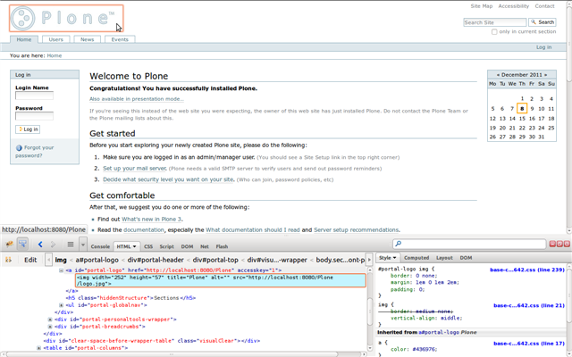
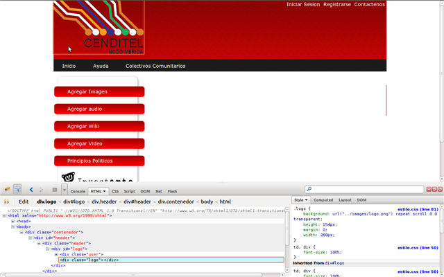
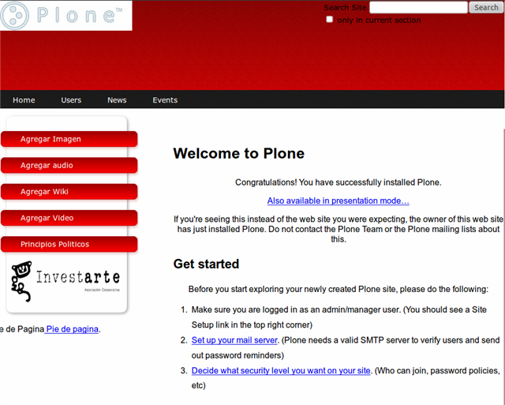

.. highlight:: rest

.. _deliverance_usando:

===========
Guía de Uso
===========

Siete pasos para su uso
=======================
 1) Ejecutar el servicio de ``Deliverance``.
 2) Preparar los archivos ``HTML/CSS`` de su tema.
 3) Debe colocar los archivos en una carpeta, normalmente dentro del proyecto ``Deliverance`` llamada ``static``.
 4) Identificar los selectores ``CSS`` de los elementos en el sitio/aplicación Web como fuente de datos que se desea mapear al tema estático.
 5) Identificar los selectores ``CSS`` dentro del tema que servirán como marcadores de posición para los elementos dinámicos traídos desde la fuente de contenidos.
 6) Crear un archivo de reglas que integre los elementos de la fuente de contenido en los marcadores de posición del tema.
 7) Configurar el ``servidor host`` al ``Proxy inverso`` de ``Deliverance``.

Se recomienda el navegador ``Firefox`` e instalar el complemento llamado `Firebug`_, 
el cual nos permitirá identificar de manera rápida y simple los identificadores ``CSS`` 
del contenido y del ``tema``.

El complemento ``firebug`` se puede descargar desde `aquí`_, una vez instalado podemos 
acceder a su consola dándole clic a un pequeño insecto que aparecerá en la parte superior 
o inferior derecha dependiendo de la versión del navegador.

Para mas información sobre su uso consultar este `tutorial`_.

Como ya se ha mencionado anteriormente Deliverance utiliza selectores ``CSS`` para mapear 
elementos desde una fuente de contenidos dinámicos que bien pueden ser ``CMS`` como 
(Plone, Joomla, Django entre otros) o archivos HTML locales/estáticos previamente guardados 
o como por ejemplo este documento. Se puede hacer uso de las reglas con los identificadores 
``CSS`` o bien usando expresiones ``Xpath`` en el caso de que el elemento no tenga un 
identificador ``CSS``.

- Los atributos identificados con ``id`` se invocan con el siguiente carácter: ``#``
- Los atributos identificados con una clase ``class`` se invocan con el siguiente carácter: ``.`` 

**Ejemplos de la aplicación de reglas usando un Plone como fuente de contenidos**.

* Para esto debemos activar el entorno virtual ``Virtualenv``.

.. code-block:: console

    $ source $HOME/virtualenv/python2.4/bin/activate 

* Luego de esto ubicarse en el directorio raíz del ``Deliverancedemo`` y realizar el 
siguiente comando para levantar una instancia de ``Plone``.

.. code-block:: console

    $ cd $HOME/proyectos/deliverancedemo/
    $ ./bin/instance start

Usted debería ver algo como esto

.. code-block:: console

    . daemon process started, pid=2749

* Ahora activaremos el servicio de ``Deliverance``.

.. code-block:: console

    $ ./bin/deliverance-proxy rules.xml

Usted debería ver algo como esto

.. code-block:: console

    To see logging, visit http://localhost:5000/.deliverance/login
        after login go to http://localhost:5000/?deliv_log
    serving on http://localhost:5000

* Basándonos en la configuración anterior es recomendable abrir 2 ventanas del navegador 
una con la fuente de contenido http://localhost:8080 y otra con el ``tema`` http://localhost:5000

* Luego de realizar estos pasos ya se puede empezar a aplicar las reglas para ello debemos 
modificar el archivo ``rules.xml``, se puede hacer modificándolo directamente y para ver los 
cambios solo se debe actualizar la pagina http://localhost:5000 presionando ``f5`` o dando clic 
en el navegador, también se pueden ver y aplicar las reglas desde la consola de depuración de 
deliverance http://localhost:5000/?deliv_log o bien reiniciando el servicio para visualizarlos

.. code-block:: console

    $ ./bin/deliverance-proxy rules.xml

* A continuación un ejemplo sobre como reemplazar el logo de ``Plone`` por el del ``tema`` para 
esto identificaremos el atributo mediante selectores ``CSS`` a través de ``firebug`` *

*Identificando atributos mediante selectores CSS a través de firebug el identificador del logo del tema*

Esta regla nos permite reemplazar el logo

.. code-block:: xml

    <replace content='#portal-logo img' theme='#logo' />

Ahora se reemplazara el titulo del ``tema`` por el del contenido dinámico ``Plone``.
Para realizar esta regla haremos uso de las expresiones ``XPath``

.. code-block:: xml
 
    <replace content='/html/head/title' theme='/html/head/title' />

Ahora se reemplazara la barra de edición
Para ello utilizaremos de nuevo el ``firebug`` para identificar los atributos ``CSS``

.. code-block:: xml
  
    <replace content='.content-views' theme='.edit-menu' />

Ahora se integrara la columna de contenidos de ``Plone`` al ``tema``

.. code-block:: xml

     <replace content='#portal-column-content' theme='children:#description' />

La aplicación de estas reglas dan como resultado que la integración con ``Plone`` y 
el ``tema`` luzca de esta forma:

Como aplicar temas a diferentes secciones del contenido
=======================================================
Aplicar clase de la página por ruta, si tenemos una parte del contenido a la que queremos 
aplicar otro tema o otras reglas, por ejemplo http://localhost:8080/Plone/applications lo 
hacemos mediante estas reglas:

.. code-block:: xml

    <match path="/applications" class="applications" />
    <rule class="applications" suppress-standard="1">
    <theme href="/static/applications.html" />

    <replace content='children:p.documentDescription'theme='children:span.SectionSubtitle' />
    <replace content='children:#portal-column-two'theme='children:#right-column' />

    </rule>

Cada sección puede tener su tema y reglas diferentes.

.. _Firebug: http://es.wikipedia.org/wiki/Firebug
.. _aquí: https://addons.mozilla.org/es-es/firefox/addon/firebug/
.. _tutorial: http://www.adictosaltrabajo.com/tutoriales/tutoriales.php?pagina=firebugAvanzado
