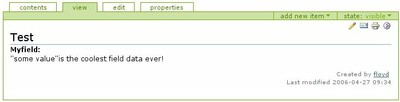
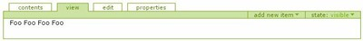
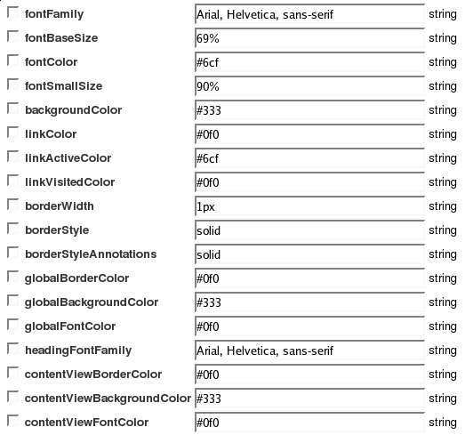

.. -*- coding: utf-8 -*-

.. _5_seccion:

Bloques para construcción
=========================

Skin, Componentes, Configuración. Los tres bloques para construcción
principales de un tema; interconectados, pero cada con un tipo distinto de
comportamiento.

Resumen
-------

Revisión general de los bloques para construcción y la forma en que se unen
para crear un tema.

En realidad, hay tres elementos principales en un tema. El siguiente diagrama
le muestra cómo estas ranuras se comportan en conjunto:

.. image: ./image_large.png
  :width: 768px
  :alt: Diagrama de bloques para construcción usados para crear un tema
  :align: center

  Diagrama de bloques para construcción usados para crear un tema

Skin
....

-   Está relacionado a la construcción general de una página y a la
    entrega de contenido

-   contiene plantillas de páginas, macros y scripts de Python, y es
    también el lugar para poner las hojas de estilo y JavaScript

-   para ayudarle a entender estos le apuntaremos en la dirección de
    tutoriales en el lenguaje TAL de plantillas y le presentaremos las capas
    de skin y el orden de precedencia

-   para encontrar elementos skin, busque en

    -   portal_skins en la Interfaz de Administración de Zope
    -   el directorio de skins en el producto de un sistema de archivos

Componentes
...........

-   los parte de Componentes lidia (en su mayoría) con la decoración de
    la página, los elementos de página que poseen un nivel de consistencia de
    una página a otra, junto con elementos de página que presentan una
    actividad de procesamiento, tales como el árbol de navegación y los
    canales RSS
    
-   despliega una mezcla de clases Python y plantillas de página para
    crear viewlets, portlets y las vistas del explorador Web
    
-   para ayudarle a entender estas, le daremos un breve recorrido de cómo
    están conectadas entre sí con el ZCML, y le daremos la más corta de las
    introducciones a las partes de clases Python de las cuales realmente
    necesita saber
    
-   para encontrar las piezas que calzan para construir un componente,
    busque en

    -   portal_view_customizations in the Zope Management Interface
    -   the browser directory in a file system product

Configuración
.............

-   la parte de Configuración lidia con determinar el orden de algunos
    elementos de páginas (o elementos individuales) en la página y con la
    estructuración automática de algunas configuraciones, que usted en caso
    contrario tendrá que hacer manualmente a través de la interfaz de la
    Configuración de sitio.
    
-   para ayudarle a comprender la configuración, le señalaremos en la
    dirección de herramientas principales para la configuración manual, darle
    una vista general de la herramienta Generic Setup (instalación genérica)
    y el XML que se usa para la configuración automática
    
-   las herramientas de configuración se encuentran en varios lugares del
    sitio, pero los archivos necesarios para ejecutar una configuración de
    forma automática se encuentran en el directorio de perfiles de un
    producto del sistema de archivos

.. _52_seccion:

Skin
----

Plantillas, hojas de estilo, archivos Javascript, el modo de personalizarlos,
dónde encontrarlos.

Plantillas y el lenguaje de plantillas
......................................

Plantillas y el lenguaje de plantillas

Plantillas y el lenguaje de plantillas
~~~~~~~~~~~~~~~~~~~~~~~~~~~~~~~~~~~~~~

Los elementos principales de un skin son las plantillas de página, imágenes,
scripts de Python, archivos CSS, y archivos JavaScript.

Plantillas de página (Zope)
:::::::::::::::::::::::::::

Las plantillas de página (archivos .pt o ZPT) son una parte esencial de un
tema Plone y probablemente es el aspecto más fácil de dominar en Plone. Están
escritos en un lenguaje elegante de plantillas base-XML llamado TAL, a veces
hacen uso de macros (METAL), y en ocasiones incorporan expresiones Python
(cálculos pequeños de una línea) o scripts de Python.

Hay varias introducciones excelentes para ZPT, y no se necesita mucho tiempo
para aprender TAL. Pruebe estas:

-   `Zope Page Templates tutorial on plone.org (Tutorial de Plantillas de página Zope en plone.org)`_

-   `ZPT Reference on Zope.org (Referencia de ZPT en Zope.org)`_

TAL es el único idioma que realmente recomendamos para que aprenda
correctamente. Para el resto puede escoger su camino o familiarizarse a
medida que avanza.

-   `Zope Page Template Tutorial on plone.org - Advanced Usage (Tutorial de Plantillas de página Zope en plone.org; uso avanzado)`_

Una página Web Plone se realiza mediante la agregación de plantillas, en
lugar de una sola, y hay un par de aspectos de las Plantillas de página Zope
que tendrá que tener en cuenta.

1. Ranura (Slot)
****************

Una ranura es una sección de una plantilla predefinida. Esta puede dejarse
vacía, o darle un contenido por defecto, pero está disponible para ser
llenada en el momento. Un ranura está definida en una plantilla con un código
como este:

.. code-block:: html

    <metal:bodytext metal:define-slot="main" tal:content="nothing">
        .....
    </metal:bodytext>

Y llenada a través de otra plantilla como esta:

.. code-block:: html

    <metal:main fill-slot="main">
     <h1 class="documentFirstHeading">
        ......
     </h1>
    </metal:main>

El tutorial ZPT en plone.org le guía a través de esto con más detalle, 
y la sección :ref:`Plantillas y componentes para páginas <62_seccion>` 
de este manual le muestra un ejemplo.

2. Plantillas de vista de contenidos (_view)
********************************************

.. note :: 
    el término "vista" también tiene una aplicación más técnica, por lo
    que en el contexto de los Componentes (descrito posteriormente en este
    manual) va a significar algo diferente.

Desde la perspectiva del usuario, contribuyente, o la del visitante, una
vista es la forma en que un elemento de contenido es presentado en la página.
Hay una `útil introducción`_ a este tema en el manual de usuario de Plone.

la plantillas que se utilizan para representar un elemento de contenido para
una vista poseen _view anexadas a sus nombres (ej., document_view.pt) y
pueden tener un título como "Standard View" (Vista estándar) Estas plantillas
en realidad so un conjunto de información a punto de encajar en ranuras.

Scripts
:::::::

Se trata de pequeñas funciones independientes para los momentos en que
necesita unas pocas líneas de código para realizar el cálculo. En el sistema
de archivos poseen una extensión .py; Los encontrará en la Interfaz de
Administración de Zope como Script (Python).

He aquí un fragmento de la plantilla event_view (la vista de contenido para
el tipo de contenido evento), la cual utiliza un script de Python para dar
formato al campo de tiempo de acuerdo con el formato predeterminado para el
sitio. Si busca en CMFPlone/skins/plone_scripts, encontrará el
toLocalizedTime.py; sólo unas pocas líneas de código.

.. code-block:: html

    End Date Time

Comenzando
~~~~~~~~~~

Las Plantillas de página son una herramienta de generación de páginas Web. En
esta parte, revisaremos los fundamentos y mostraremos cómo utilizarlos en su
sitio Web para crear páginas Web dinámicas fácilmente.

El objetivo de las Plantillas de página es flujo de trabajo natural. un
diseñador usará un editor HTML WYSIWYG (del inglés What You See Is What You
Get que se traduce como "Lo que ves es lo que obtienes") para crear una
plantilla, luego un programador lo editará para que forme parte de una
por el programador, él no va a alterar la aplicación.
aplicación. Si es requerido, el diseñador puede cargar la plantilla *de
nuevo* dentro de su editor y realizar más cambios en su estructura y
apariencia. A través medidas razonables para preservar los cambios realizados

Las plantillas de páginas apuntan a este objetivo mediante la adopción de
tres principios:

1.  Jugar agradablemente con herramientas de edición.

2.  Lo que ve es muy similar a lo que obtiene.

3.  Mantiene del código de plantillas, excepto por la lógica estructural.

Una Plantilla de página es como un modelo de páginas que se generará. En
particular es una página valida HTML/XHTML. Puesto que HTML es altamente
estructurado, y los editores WYSIWYG cuidadosamente preservan esta
estructura, hay límites estrictos en la forma en que el programador puede
cambiar una página y seguir respetando el primer principio

A pesar de que las Plantillas de página son adecuadas para programadores y
diseñadores que necesitan trabajar juntos para crear páginas web dinámicas
construyendo la base para la mayoría de páginas Plone, usted igualmente
debería aprender al menos un poco sobre esto si es necesario personalizar el
aspecto de Plone o el diseño. Además, puede ser más sencillo de usarlas y
entenderlas que la alternativa DTML (Lenguaje de Marcado de Documento de
Plantilla).

Pero, ¿Por qué otro Lenguaje de plantilla?
::::::::::::::::::::::::::::::::::::::::::

Hay una gama de sistemas de plantillas en el mercado, algunas de ellas
populares como ASP, JSP, y PHP. Desde el principio, Zope siempre ha integrado
un lenguaje de plantilla llamado DTML. ¿Por qué inventar otro?

En primer lugar ninguno de estos sistemas de archivos están dirigidos a
diseñadores de HTML. Una vez que una página se ha convertido en una
plantilla, no es HTML válido, por lo que es difícil trabajarla fuera de la
aplicación. Cada uno de ellos viola el primer o segundo principio de
Plantillas de página de Zope en cierto grado u otro. Los programadores no
deberían "secuestrar" el trabajo de los diseñadores y convertir el HTML en
software. XMCL, parte del proyecto Enhydra, comparte nuestro objetivo, pero
requiere que el programador escriba cantidades considerables de código de
soporte Java para cada plantilla.

En segundo lugar, todos estos sistemas sufren con respecto a la separación
entre presentación, lógica y contenido (datos). Sus violaciones del tercer
principio disminuyen la escalabilidad de la administración de contenidos y
los esfuerzos de desarrollo de sitios Web que utilizan estos sistemas.

Aplicando los principios
::::::::::::::::::::::::

Las Plantillas de página usan **Template Attribute Language (TAL) (Lenguaje
de Atributo de Plantillas)**. TAL consiste en atributos especiales de
etiquetas, por ejemplo, el título de una página dinámica puede lucir como
este:

.. code-block:: html

    <title tal:content="context/title">Page Title</title>

El atributo ``tal:content`` es una sentencia TAL. Debido a que tiene un
namespace XML (la parte ``tal:``) la mayoría de herramientas de edición no se
quejarán por no entenderlo, y no lo eliminarán. No cambiará la estructura o
apariencia de la plantilla cuando se carga en el editor WYSIWYG o en un
navegador Web. El nombre ``content`` (contenido) indica que definirá el
contenido de la etiqueta ``title`` (título), y el valor "context/title" es
una expresión que provee el texto a insertar en la etiqueta

Para el diseñador HTML que usa una herramienta WYSIWYG, esto es HTML
perfectamente válido, y se muestra en el editor de la manera en que un título
debería verse. El diseñador que no preocupa por los detalles de aplicación de
TAL, sólo ve una * maqueta * de la plantilla dinámica, con valores ficticios
como "Page Title" (Título de página) para el título del documento.

Cuando esta plantilla se guarda en Zope y es vista por un usuario, Zope
convierte este contenido estático en contenido dinámico y reemplaza "Page
Title", con lo que sea que "context/title" resuelva. En este caso,
"context/title" se resuelve en el título del objeto para el cual se aplica la
plantilla. Esta sustitución se realiza de forma dinámica, cuando la plantilla
se ve.

Este ejemplo demuestra también el segundo principio. Cuando usted ve la
plantilla en un editor, el texto del título actuará como un marcador de
posición para el texto del título dinámico, la plantilla proporciona un
ejemplo de cómo los documentos generados se verán.

Hay comandos de plantilla para la sustitución de etiquetas completas, su
contenido, o sólo algunos de sus atributos. Usted puede repetir una etiqueta
varias veces u omitirla por completo. Puede unir partes de varias plantillas,
y especificar el tratamiento de errores simples. Todas estas funciones son
usadas para generar estructuras de documentos, usted **no puede** crear
subrutinas o clases, escribir bucles o pruebas multi-modo, o fácilmente
expresar algoritmos complejos. Para estas tareas, utilice Python.

El lenguaje de plantillas deliberadamente no es tan poderoso y objetivo-
general como podría ser. Está destinado a ser utilizado dentro de un marco
(como Zope) en el que otros objetos manejan la lógica de negocio y aquellas
tareas no relacionadas con el diseño de la página.

Por ejemplo, el lenguaje de plantillas será ventajoso para renderizar una
página de factura, al generar una fila para cada elemento, e insertar la
descripción, cantidad, precio, y otros para el texto de cada fila. No se pude
utilizar para crear el registro de la factura en una base de datos o para
interactuar con un centro de procesamiento de tarjetas de crédito.

Creando una Plantilla de página
:::::::::::::::::::::::::::::::

Si usted diseña páginas, probablemente use FTP o WebDAV en vez de la Interfaz
de Administración de Plone (ZMI) para crear y editar Plantillas de páginas, o
desarrolla plantillas en el filesystem para su posterior instalación. Si
usted no es el dueño del sitio Zope, pregunte a su administrador Zope por
instrucciones, pero para los pequeños ejemplos mostrados en este artículo, es
mucho más sencillo usar la ZMI. Para más información sobre el uso de FTP o
WebDAV con Zope, vea `The Zope Book (el Libro de Zope)`_ o el `artículo WebDAV`_ 
de Jeffrey Shell.

También puede usar `Emacs`_, `cadaver`_, o algún otro cliente, pero si usted
es un programador o administrador de Zope, lo más seguro es que use la ZMI de
igual manera, al menos ocasionalmente. Revise el Libro de Zope para
instrucciones sobre la configuración de este para que trabaje con varios
clientes.

Use su navegador Web para entrar en la Interfaz de Administración de Zope
como lo haría normalmente con Zope. Escoja una carpeta (root está bien) y
seleccione "Page Template" (Plantilla de página) de la lista desplegable.
Escriba "simple_page" en el campo de ``Id`` del formulario para agregar,
luego pulse el botón "Agregar y Editar".

Ahora debería ver la página principal de edición para la nueva Plantilla de
página. El título está en blanco, el tipo-contenido es ``text/html``, y el
texto de la plantilla por defecto está en el área de edición.

Ahora creará una página dinámica muy simple. Escriba las palabras "Simple
Page" (página simple) en el campo de ``Título``. Luego edite el cuerpo de
texto de la plantilla para que luzca como este:

.. code-block:: html

    This is <b tal:replace="template/title">the Title</b>.

Ahora presione el botón de guardar cambios, y la página de edición debería
mostrar un mensaje confirmando que los cambios han sido guardados. Si un
mensaje de error aparece en la parte de arriba del área de código, o algún
texto que comienza con ``<-- Page Template Diagnostics (diagnóstico de
plantilla de página)`` se ha añadido a la plantilla, entonces revise que
escribió el ejemplo correctamente y guárdelo nuevamente. No necesita borrar
el comentario de error, ya que una vez que este haya sido corregido
desaparecerá.

Haga clic en la pestaña ``Test`` (Prueba). debería ver una página casi
completamente vacía con "This is a simple Page" (Esto es una página simple)
en la parte superior.

Respalde, y haga clic en el enlace "Browse HTML source" (Examinar fuente
HTML) bajo el campo de tipo-contenido. Esto le mostrará la fuente *no
renderizada o procesada* de la plantilla. debería ver "This is (Esto es)
**the Title (el título)**." retorne nuevamente, para que así este listo para
editar más aún el ejemplo.

Expresiones simples
:::::::::::::::::::

El texto "template/title" (plantilla/título) en su simple Plantilla de página
es una *expresión de ruta*. Este el tipo más común de expresiones definidas
por la Sintaxis de Expresiones TAL (TALES). Manda a buscar la propiedad del
``título`` de la plantilla. Aquí hay otras expresiones comunes de ruta:

-   request/URL: La URL de la solicitud actual de Web.

-   user/getUserName: el nombre de usuario autenticado para el inicio de
    sesión.

-   container/objectIds: una lista de Ids (Identificaciones) de los
    objetos que están en la misma Carpeta de las plantillas.

Cada ruta comienza con una nombre variable. Si la variable contiene el valor
que usted quiere, detengase allí. Caso contrario, agregue una barra (``/``) y
el nombre de un sub-objeto o propiedad. Es posible que tenga que pasar a
través de varios sub-objetos para llegar al valor que usted está buscando.

Hay una construcción pequeña en un conjunto de variables tales como ``request
(solicitud)`` y ``user (usuario)``, que serán listados y descritos
posteriormente, y también aprendió a cómo definir sus propias variables.

Insertando texto
::::::::::::::::

En su plantilla "simple_page", utilizó la sentencia ``tal:replace`` en una
etiqueta en negrita. Cuando la probó, esta remplazó la etiqueta completa por
el título de la plantilla. Por otra parte cuando examinó el código, vio el
texto de la plantilla en negrita. Nosotros hemos utilizado una etiqueta en
negrita para resaltar la diferencia.

Con el fin de colocar el texto dinámico dentro de otro texto, se suele usar
``tal:replace`` en una etiqueta ``span (lapso)``. Agregue las líneas
siguientes a su ejemplo:

.. code-block:: html

     
    The URL is URL.

La etiqueta ``span`` es estructural, no visual, así que esta luce como "The
URL is URL." (La URL es URL), cuando vea el código en un editor o navegador.
Cuando vea la versión renderizada, esta puede lucir a algo como esto:

.. code-block:: html

     
    The URL is http://localhost:8080/simple_page.

Recuerde que tiene que tener cuidado cuando este editando y no destruir el
``span`` o ingresar etiquetas de formato tales como ``b`` o ``fuente`` dentro
de este, ya que también serán remplazadas.

Si quiere insertar texto en una etiqueta sin modificarla como tal,
use``tal:content``. Para definir el título de su página de prueba al título
de propiedad de la plantilla, agregue las líneas siguientes encima del otro
texto:

.. code-block:: html

    <head>
      <title tal:content="template/title">The Title</title>
    </head>

Si usted abre la pestaña Test en una nueva ventana, el título que tendrá la
ventana será "a Simple Page" (una página simple).

Repitiendo estructuras
::::::::::::::::::::::

Ahora agregará contexto a su página, en la forma de una lista de objetos
almacenados en la misma carpeta. Creará una tabla que una fila numerada para
cada objeto, y columnas para el ID, meta-type, y título. Agregue estas líneas
a la parte inferior de su plantilla:

.. code-block:: html

          <table border="1" width="100%">
            <tr>
              <th>#</th><th>Id</th><th>Meta-
              Type</th><th>Title</th>
            </tr>
            <tr tal:repeat="item container/objectValues">
              <td tal:content="repeat/item/number">#</td>
              <td tal:content="item/id">Id</td>
              <td tal:content="item/meta_type">Meta-Type</td>
              <td tal:content="item/title">Title</td>
            </tr>
          </table>

La sentencia ``tal:repeat`` en la fila de tabla se traduce en "repita esta
fila para cada elemento en mi lista contenedora de valores de objetos".
Repetir la sentencia coloca los objetos de la lista dentro de la variable del
``elemento`` uno a la vez, y hace una copia de la fila usando esa variable.
El valor de "item/id" en cada fila es la ID del objeto para esa fila.

Puede usar cualquier nombre que le parezca para la variable del item
(elemento), siempre y cuando comience con una letra y contenga sólo letras,
números, y subguiones (``_``). Esta sólo existe en la etiqueta <tr> tag; si
la trata de usar por encima o por debajo de esa etiqueta obtendrá un error.

También puede usar el nombre de la variable ``tal:repeat`` para obtener
información sobre la repetición actual. Colocándola después de la variable
incorporada ``repetida`` en una ruta, puede acceder a la cuenta de repetición
comenzando a partir de cero (``index``), de uno (``number``), de "A"
(``Letter``), y de otras maneras. De esta manera la expresión
``repeat/item/number`` será ``1`` en la primera fila, ``2`` en la segunda
fila, y así sucesivamente.

Ya que un bucle ``tal:repeat`` puede colocarse dentro de otro, más de uno
puede estar activo al mismo tiempo. Por esta razón debe escribir
``repeat/item/number`` en vez de ``repeat/number``. Usted debe especificar el
bucle por el que está interesado incluyendo el nombre de este.

Elementos condicionales
:::::::::::::::::::::::

Vea la plantilla, y se dará cuenta de que la tabla es muy sobria. Vamos a
mejorarla dándole sombra a ciertas filas. Copia de la segunda fila de la
tabla, luego edite el código para que se vea así:

.. code-block:: html

          <table border="1" width="100%">
            <tr>
              <th>#</th><th>Id</th><th>Meta-
              Type</th><th>Title</th>
            </tr>
            <tbody tal:repeat="item container/objectValues">
              <tr bgcolor="#EEEEEE"
              tal:condition="repeat/item/even">
                <td tal:content="repeat/item/number">#</td>
                <td tal:content="item/id">Id</td>
                <td tal:content="item/meta_type">Meta-
                Type</td>
                <td tal:content="item/title">Title</td>
              </tr>
              <tr tal:condition="repeat/item/odd">
                <td tal:content="repeat/item/number">#</td>
                <td tal:content="item/id">Id</td>
                <td tal:content="item/meta_type">Meta-
                Type</td>
                <td tal:content="item/title">Title</td>
              </tr>
            </tbody>
          </table>

La ``tal:repeat`` no ha cambiado, simplemente la ha movido a la nueva
etiqueta ``tbody``. Esta es una etiqueta HTML estándar destinada a agrupar
las filas del cuerpo de una tabla, que es la manera en que las está
utilizando. Hay dos filas en el cuerpo con columnas idénticas, y una tiene un
fondo gris.

Si ve el código de la plantilla, verá dos filas. Si usted no hubiera agregado
la sentencia ``tal:condition`` a la filas, la plantilla generaría ambas filas
para cada elemento, que es algo que usted no quiere. La sentencia
``tal:condition`` en la primera fila asegura que sólo sea agregada en
repeticiones de indexación-par, mientras que la segunda condición sólo le
permite aparecer en repeticiones de indexación-impar.

Una sentencia ``tal:condition`` no hace nada si su expresión tiene un valor
verdadero, pero elimina la etiqueta de declaración en su totalidad,
incluyendo su contenido, si el valor es falso. Las propiedades ``par`` e
``impar`` de ``repeat/item`` son cero o uno. El número cero, una cadena en
blanco, una lista vacía, y la variable integrada ``nothing (nada)`` son todos
valores falsos. Casi cualquier otro valor es verdadero, otros números a parte
del cero, y cadenas con cualquier cosa dentro de ellas (¡incluso espacios!).

Definiendo variables
::::::::::::::::::::

Nota: de Plone 4 en adelante, use *container/values* en lugar de
*container/objectValues* de abajo..

La plantilla mostrará siempre al menos una fila, ya que la propia plantilla
es uno de los objetos listados. En otras circunstancias, puede existir la
posibilidad de que quiera que la tabla este vacía. Supongamos que usted
quiere en este caso, omitir toda la tabla. Esto lo puede hacer agregando
``tal:condition`` a la tabla:

.. code-block:: html

          <table border="1" width="100%"
                 tal:condition="container/objectValues">

Ahora cuando no haya objetos, ninguna parte de la tabla será incluida en el
diseño. Sin embargo cuando haya objetos, la expresión
"container/objectValues" será evaluada dos veces, lo cual es un poco
ineficiente. Además, si usted quiere cambiar la expresión, tendrá que
cambiarla en ambos lugares.

Para evitar estos problemas, puede definir una variable para que contenga la
lista y luego usarla en ambos casos: ``tal:condition`` y ``tal:repeat``.
Cambie las primeras líneas para que se vean así:

.. code-block:: html

          <table border="1" width="100%"
                 tal:define="items container/objectValues"
                 tal:condition="items">
            <tr>
              <th>#</th><th>Id</th><th>Meta-Type</th><th>Title</th>
            </tr>
            <tbody tal:repeat="item items">

La sentencia ``tal:define`` crea la variable ``items``, y la puede usar en
cualquier parte de la etiqueta de la tabla. Note también cómo puede tener dos
atributos TAL en la misma etiqueta ``table``. De hecho puede tener tantas
como quiera, en este caso, son evaluadas en orden La primera asigna la
variable ``items`` y la segunda usa ``items`` en una condición para ver si es
falsa (en este caso, una secuencia vacía) o verdadera.

Ahora supongamos que en lugar de simplemente no mostrar la tabla cuando no
hay elementos, usted desea mostrar un mensaje. Para hacer esto, introduzca lo
siguiente encima de la tabla:

.. code-block:: html

          <h4 tal:condition="not:container/objectValues">There
          Are No Items (No hay elementos)</h4>

La variable ``items`` no la puede usar todavía, ya que no está definida. Si
usted mueve la definición a la etiqueta ``h4``, no la puede usar más en la
etiqueta ``table``, porque se convierte en una variable *local* de la
etiqueta ``h4``. Puede situar la definición en una etiqueta que encierre a
ambas ``h4`` y ``table``, pero hay una solución más simple. Al colocar la
palabra clave ``global`` delante del nombre de la variable, hace que la
definición dure desde la etiqueta ``h4`` hasta el fondo de la plantilla:

.. code-block:: html

          <h4 tal:define="global items container/objectValues"
              tal:condition="not:items">There Are No Items</h4>
          <table border="1" width="100%"
              tal:condition="items">

El ``not:`` en la primera ``tal:condition`` es un tipo prefijo de expresión
que puede ser ubicado delante de cualquier expresión. Si la expresión es
verdadera, ``not:`` es falso y viceversa.

Cambiando atributos
:::::::::::::::::::

La mayoría, sino todos, de objetos listados por su plantilla tiene una
propiedad ``icono``, que contiene la ruta al icono para ese tipo de objeto.
Con el fin de mostrar este icono en la columna meta-type, tendrá que insertar
esta ruta dentro del atributo ``src`` de una etiqueta ``img``, mediante la
edición de la columna meta-type en ambas filas para que se vean así:

.. code-block:: html

          <td>
              
              Meta-Type
          </td>

La sentencia ``tal:attributes`` remplaza el atributo ``src`` de la imagen con
el valor de ``item/icon``. El valor de ``src`` en la plantilla actúa como un
marcador de posición, de modo que la imagen no está dañada, y sea del tamaño
correcto.

Ya que el atributo ``tal:content`` hubiera remplazado los contenidos
completos de la celda, incluyendo las imágenes con le texto meta-type, este
tiene que ser eliminado. En su lugar, se inserta el meta-type en línea de la
misma manera como la dirección URL en la parte superior de la página.

Based on the `Zope Book`_, (C) `Zope Corporation`_

Macros y ranuras
~~~~~~~~~~~~~~~~

Macros
::::::

Hasta ahora, ha visto cómo las Plantillas de página se pueden utilizar para
añadir comportamientos dinámicos a las páginas Web individuales. Otra
característica de las Plantillas de página es la posibilidad de reutilizar
elementos de apariencia a través de muchas páginas.

Por ejemplo, con las Plantillas de página, puede tener un sitio que tenga un
aspecto estándar. Y no importa el "contenido" de una página, igual tendrá un
encabezado estándar, barra lateral, pie de página, y/u otros elementos de
página. Este es un requisito muy común para los sitios web, y así es
exactamente como funciona Plone.

Puede reutilizar los elementos de presentación a través de las páginas con
**macros** . Los Macros definen la sección de una pagina que puede ser
reutilizada en otras páginas. Un macro puede ser una página completa, o sólo
una parte de ella como el encabezado o pié de página. Después de que define
uno o más macros en una Plantilla de página, puede usarlos en otras
Plantillas de páginas.

Usando macros
:::::::::::::

Puede definir macros con atributos de etiqueta similares a las sentencias
TAL. Atributos de etiquetas macro son también denominados sentencias **Macro
Expansion Tag Attribute Language (METAL) o en Español Lenguaje de Expansión
Macro para Atributos de Plantillas**. Aquí hay un ejemplo de definición
macro:

.. code-block:: html

    

      Copyright 2008, <em>Foo, Bar, and Associates</em> Inc.
    

Esta sentencia metal:define-macro define un macro llamado "copyright". El
macro consiste del elemento p (incluye todos los elementos contenidos que
terminan con una etiqueta de cierre p).

Los macros definidos en una Plantilla de página son almacenados en el
atributo *macros* de la plantilla. Puede usar los macros de otra Plantilla,
refiriéndose a ellos a través del atributo *macros* de una Plantilla de
página en la cual están definidos. Por ejemplo supongamos que el macro
*copyright* está en una Plantilla de página llamada "master_page". Aquí está
como usar el macro *copyright* desde otra Plantilla de página:

.. code-block:: html

    

    <b metal:use-macro="container/master_page/macros/copyright">
      Macro goes here
    </b>

En esta Plantilla de página el elemento b será completamente remplazado por
el macro cuando Zope renderice la página.

.. code-block:: html

    

    

      Copyright 2008, <em>Foo, Bar, and Associates</em> Inc.
    

Si usted cambia el macro (por ejemplo si cambia el titular de los derechos de
autor), todas las Plantillas de página que usen este macro automáticamente
reflejaran el cambio.

Note cómo el macro es identificado por una expresión de ruta utilizando la
sentencia metal:use-macro. La sentencia metal:use-macro remplaza el elemento
de sentencia con el macro nombrado.

Detalles macro
::::::::::::::

Las sentencias metal:define-macro y metal:use-macro son bastante sencillas.
No obstante hay algunas sutilezas en sus usos, que vale la pena mencionar.

El nombre de un macro debe ser único dentro de la Plantilla de página en la
que se define. Puede definir más de un macro en una plantilla, pero todos
necesitan nombres distintos.

También hay que señalar que a pesar del atributo define-macro, el macro sigue
siendo una sección regular de la plantilla; así que cuando llama a la
plantilla completa, la sección macro es renderizada con el diseño de la
página igual que cualquier otra sección de la misma. Cuando usa el atributo
define-macro simplemente está **agregando** una especie de "ancla" a esa
sección, por lo que se puede llamarse desde otra parte, pero no va a cambiar
nada respecto al comportamiento de la misma sección en la propia plantilla.

Normalmente usted hace referencia a un macro en una sentencia metal:use-macro
con una expresión de ruta. Sin embargo, puede utilizar cualquier tipo de
expresión que desee, siempre y cuando devuelva un macro. Por ejemplo:

.. code-block:: html

    

      Replaced with a dynamically determined macro,
      which is located by the getMacro script.
    

En este caso la expresión de ruta devuelve un macro definido dinámicamente
por el script getMacro. El uso de expresiones Python para localizar macros le
permite variar de forma dinámica cual macro su plantilla utiliza.

Puede usar la variable por defecto con la sentencia metal:use-macro:

.. code-block:: html

    

      This content remains - no macro is used
    

El resultado es el mismo que al usar default con tal:content y tal:replace.
El contenido "default" en la etiqueta no cambia cuando sea renderizado. Esto
puede ser útil si usted necesita condicionalmente utilizar un macro o caer en
el contenido por defecto si este no existe.

Si trata de utilizar la variable nothing con metal:use-macro obtendrá un
error ya que nothing no es un macro. Si usted quiere utilizar nothing para
que condicionalmente incluya un macro, debería entonces encerrar la sentencia
metal:use-macro con una sentencia tal:condition.

Zope maneja macros primero al renderizar sus plantillas. Luego Zope evalúa
las expresiones TAL. Por ejemplo, considere este macro:

.. code-block:: html

    

      template's title
    

Cuando se utiliza este macro se insertará el título de la plantilla en la
cual el macro es utilizado, y no el título de la plantilla en la que se
define el macro. En otras palabras, cuando se utiliza un macro, es como
copiar el texto de un macro dentro de la plantilla y luego renderizar su
plantilla.

Usando ranuras (slots)
::::::::::::::::::::::

Las macros son mucho más útiles si se pueden anular partes de ellos al
momento de utilizarlos. Puede hacer esto definiendo **slots (ranuras)** en el
macro que puede llenar cuando use la plantilla. Por ejemplo, considere un
macro de barra lateral:

.. code-block:: html

    

      Links
      <ul>
        <li><a href="/">Home</a></li>
        <li><a href="/products">Products</a></li>
        <li><a href="/support">Support</a></li>
        <li><a href="/contact">Contact Us</a></li>
      </ul>
    

Este macro está bien, pero supongamos que le gustaría incluir información
adicional en la barra lateral sobre algunas páginas. Una manera de lograr
esto es con ranuras:

.. code-block:: html

    

      Links
      <ul>
        <li><a href="/">Home</a></li>
        <li><a href="/products">Products</a></li>
        <li><a href="/support">Support</a></li>
        <li><a href="/contact">Contact Us</a></li>
      </ul>
      
    

Cuando use este macro puede elegir ocupar la ranura de este modo:

.. code-block:: html

    

      <b metal:fill-slot="additional_info">
        Make sure to check out our <a href="/specials">specials</a>.
      </b>
    

Cuando renderice esta plantilla la barra lateral incluirá información
adicional que usted haya proporcionado en la ranura:

.. code-block:: html

    

      Links
      <ul>
        <li><a href="/">Home</a></li>
        <li><a href="/products">Products</a></li>
        <li><a href="/support">Support</a></li>
        <li><a href="/contact">Contact Us</a></li>
      </ul>
      <b>
        Make sure to check out our <a href="/specials">specials</a>.
      </b>
    

Note cómo el elemento span que define la ranura es remplazado con el elemento
b para que llene la ranura.

Personalizando presentación por defecto
:::::::::::::::::::::::::::::::::::::::

Un uso común de la ranura es proporcionar presentación por defecto la cual
puede personalizar. En el ejemplo de ranura de la última sección, la
definición de ranura era simplemente un elemento span vacío. Sin embargo,
usted puede proporcionar presentación por defecto en una definición de
ranura. Por ejemplo, considere este macro revisado de barra lateral:

.. code-block:: html

    

      

      Links
      <ul>
        <li><a href="/">Home</a></li>
        <li><a href="/products">Products</a></li>
        <li><a href="/support">Support</a></li>
        <li><a href="/contact">Contact Us</a></li>
      </ul>
      

      
    

Ahora la barra lateral es completamente personalizable. Puede llena los
enlaces de la ranura para redefinir los enlaces de la barra lateral. Sin
embargo, si decide no ocupar el puesto de enlaces obtendrá entonces los
vínculos predeterminados que aparecen dentro de la definición de la ranura.

Usted puede incluso tomar esta técnica más a fondo mediante la definición de
ranuras dentro de ranuras. Esto le permite sustituir presentación por defecto
con un buen grado de precisión. Aquí hay un macro de barra lateral que define
ranuras dentro de ranuras:

.. code-block:: html

    

      

      Links
      <ul>
        <li><a href="/">Home</a></li>
        <li><a href="/products">Products</a></li>
        <li><a href="/support">Support</a></li>
        <li><a href="/contact">Contact Us</a></li>
        
      </ul>
      

      
    

Si usted desea personalizar los enlaces de la barra lateral puede llenar las
ranuras de *enlaces* para sustituir los enlaces completamente, o puede llenar
la ranura *additional_links* para insertar algunos enlaces adicionales
después de los enlaces predeterminados. Usted puede modificar ranuras tanto
como quiera.

Combinando METAL y TAL
::::::::::::::::::::::

Usted puede usar ambas sentencias METAL y TAL en los mismos elementos. Por
ejemplo:

.. code-block:: html

    <ul metal:define-macro="links"
        tal:repeat="link context/getLinks">
      <li>
        <a href="link_url"
           tal:attributes="href link/url"
           tal:content="link/name">link name</a>
      </li>
    </ul>

En este caso, getLinks es un script (imaginario) que reúne una lista de
objetos de enlace, posiblemente usando un consulta de Catálogo.

Ya que las sentencias METAL son evaluadas primero que las sentencias TAL, no
hay conflictos. Este ejemplo es interesante también porque personaliza un
macro sin usar ranuras. El macro llama el script getLinks para determinar los
enlaces. De esta manera puede personalizar los enlaces de su sitio
rédefiniendo el script getLinks sobre distintas locaciones dentro de su
sitio.

No siempre es fácil descubrir la mejor manera de personalizar el aspecto de
distintas partes de su sitio. En general, usted debe utilizar las ranuras
para sustituir elementos de presentación, y se debe utilizar scripts para
proporcionar contenido dinámico. En el caso del ejemplo de enlaces, es
discutible si los enlaces son contenido o presentación. Probablemente los
scripts proporcionan una solución más flexible, especialmente si su sitio
incluye objetos de contenido.

Macros de página completa
:::::::::::::::::::::::::

En lugar de utilizar macros para partes de presentación compartida entre las
páginas, puede utilizar macros para definir páginas completas. Las ranuras
hacen esto posible. Aquí hay un macro que define la página completa:

.. code-block:: html

    <html metal:define-macro="page">
      <head>
        <title tal:content="context/title">The title</title>
      </head>

      <body>
        <h1 metal:define-slot="headline"
            tal:content="context/title">title</h1>

        

          This is the body.
        

        
          
Copyright 2008 Fluffy Enterprises

        

      </body>
    </html>

Este macro define una página con tres ranuras: *headline (encabezado)*, *body
(cuerpo)*, y *footer (pié de página)*. Note como la ranura *headline* incluye
una sentencia TAL para determinar dinámicamente el contenido del encabezado.

Luego usted puede usar este macro en plantillas para diferentes tipos de
contenidos, o distintas partes de su sitio. Aquí hay un ejemplo de cómo un
elemento de noticia puede usar este macro:

.. code-block:: html

    <html metal:use-macro="container/master_page/macros/page">

      <h1 metal:fill-slot="headline">
        Press Release:
        Headline
      </h1>

      

        News item body goes here
      

    </html>

Esta plantilla rédefine la ranura *headline* para que incluya las palabras
"Press Release" (Notas de prensa) y ejecuta el método getHeadline en el
objeto actual. También rédefine la ranura *body* para que ejecute el método
getBody en el objeto actual.

Lo mejor de este enfoque es que ahora puede cambiar el macro de la *página* y
la plantilla de notas de prensa será automáticamente actualizada. Por ejemplo
usted puede poner el cuerpo de la página en una tabla y agregar una barra
lateral a la izquierda y la plantilla de notas de prensa automáticamente
usará estos elementos nuevos de presentación.

Based on the `Zope Book`_, (C) `Zope Corporation`_

Uso avanzado
~~~~~~~~~~~~

En esta parte vamos a ver algunas de las características más avanzadas del
Lenguaje de Atributo de Plantilla, incluyendo un análisis más profundo a la
Sintaxis de Expresiones TAL ().

Mezclando y combinando sentencias
:::::::::::::::::::::::::::::::::

Como ha podido ver en el ejemplo de la plantilla, usted puede situar más de
una sentencia TAL en la misma etiqueta. Sin embargo, hay tres limitaciones
que debería conocer:

1.  Solamente uno de cada tipo de sentencia puede ser usada en una sola
    etiqueta. Ya que HTML no le permite múltiples atributos con el mismo
    nombre, usted no puede tener dos ``tal:define`` en la misma etiqueta.

2.  Ninguno de los dos ``tal:content`` y ``tal:replace`` pueden ser
    usados en la misma etiqueta, por la razón de que sus funciones hacen
    conflicto.

3.  El orden en el que usted escribe atributos TAL en una etiqueta no
    afecta el orden en que se ejecutan. No importa cómo las ordene, las
    sentencias TAL en una etiqueta siempre se ejecutaran de la siguiente
    manera : ``define (definir)``, ``condition (condición)``, ``repeat
    (repetir)``, ``content (contenido)`` / ``replace (remplazar)``,
    ``attributes (atributos)``.

Para superar estas limitaciones, se puede añadir otra etiqueta y dividir las
sentencias entre las etiquetas. Si no hay ningún tipo obvio de etiqueta que
encaje, use ``span`` o ``div``.

Por ejemplo, si quiere definir una variable para cada repetición de un
párrafo, usted no puede situar ``tal:define`` en la misma etiqueta que
``tal:repeat``, ya que la definición pasará antes que todas las repeticiones.
En cambio, podría escribir una de las siguientes:

.. code-block:: html

          

            

            Phrase number 1 is
            <b tal:content="ph">Phrase</b>.

          

          

            
            Phrase number 1 is
            <b tal:content="ph">Phrase</b>".
          

Nota: la definición de "n" en realidad no es muy útil en este ejemplo porque
podríamos haber utilizado directamente "repeat/ph/number" en el atributo de
sustituir el cual sólo ocurre una vez,pero sirve para nuestro propósito.

Sentencias con partes múltiples
:::::::::::::::::::::::::::::::

Si usted necesita definir múltiples atributos en una etiqueta, no puede
hacerlo mediante la colocación de múltiples sentencias ``tal:attributes`` en
la etiqueta, y dividiéndolas de manera inservible por las etiquetas.

Ambas sentencias ``tal:attributes`` y ``tal:define``pueden tener partes
múltiples en una sola sentencia. Para separar partes se utiliza el punto y
coma (``;``), así que cualquier expresión que contenga punto en coma en estas
sentencias debe repetirse dos veces (``;;``). Aquí hay un ejemplo de
configuración de ambos atributos ``src`` y ``alt`` de una imagen:

.. code-block:: html

          

Aquí hay una mezcla de definiciones de variables:

.. code-block:: html

          

**Nota:** de Plone 4 en adelante usted puede utilizar *context/items* en
lugar de *context/objectIds*.

Expresiones de cadena
:::::::::::::::::::::

Expresiones de cadenas le permiten fácilmente mezclar expresiones de ruta con
texto. Todo el texto después del ``string:`` líder se toma y se busca para
expresiones de ruta. Cada expresión de ruta de precederse por un símbolo de
dolar (``$``). Si tiene más de una parte, o debe ser separado del texto que
le sigue, debe estar rodeado por llaves (``{}``). Ya que el texto está dentro
de un valor de atributo, sólo puede incluir una cita doble usando la sintaxis
de entidad ``&quot;``. Debido a que los símbolos de dolar son usados para
señalar expresiones de ruta, un símbolo de dolar literal debe repetirse dos
veces (``$$``). Por ejemplo:

.. code-block:: html

          
          
          
          
          
          

Expresiones de ruta nocall
::::::::::::::::::::::::::

Una expresión de ruta ordinaria trata de renderizar el objeto que manda a
llamar. Esto significa que si el objeto es una función, script, método, o
algún otro tipo de elemento ejecutable, la expresión evaluará el resultado de
llamar al objeto. Usualmente esto es lo que se quiere, pero no siempre es el
caso. Por ejemplo, si usted quiere poner un documento DTML dentro de una
variable para que así pueda referirse a sus propiedades, no puede usar
entonces una expresión normal de ruta ya que renderizará el documento dentro
de una cadena.

Si introduce un prefijo de expresión ``nocall:`` delante de una ruta,
previene la renderización y simplemente le da el objeto. Por ejemplo:

.. code-block:: html

          Id: Title

Este tipo de expresión también es útil cuando quiere definir una variable que
mantenga una función o una clase de un módulo, para su uso en una expresión
Python.

Otras variables integradas
::::::::::::::::::::::::::

Ya usted ha visto algunos ejemplos de variables integradas ``template``,
``user``, ``repeat``, y ``request``. Aquí está una lista más completa de las
otras variables integradas y sus usos:

.. glossary ::

  nothing
    Un valor falso similar a una cadena en blanco que puede usar en
    ``tal:replace`` o ``tal:content`` para eliminar una etiqueta o sus
    contenidos. Si usted define un atributo a ``nothing``, el atributo se quita
    de la etiqueta (o no se inserta), a diferencia de una cadena en blanco.
    Equivalente a ``None`` en Python.

  default
    Un valor especial que no cambia nada cuando se usa en ``tal:replace``, 
    ``tal:content``, o ``tal:attributes``. Deja el texto de la plantilla en su lugar.

  options
    Los argumentos *palabras clave*, en el caso de haber, que fueron pasados 
    a la plantilla.

  attrs
    Un diccionario de atributos de la etiqueta actual en la plantilla. Las claves son los
    nombres de los atributos y los valores son los valores originales de los
    atributos de la plantilla.

  root
    El objeto Zope raíz. Utilice esta opción para obtener los objetos Zope desde 
    una ubicación fija, sin importar dónde está o se haya llamado la plantilla.

  context
    El objeto en el que se llama la
    plantilla. Regularmente esto es lo mismo que *container*, pero puede ser
    diferente si está usando adquisición. Utilice esta opción para obtener los
    objetos Zope que usted espera encontrar en diferentes lugares dependiendo de
    cómo se llama la plantilla.

  here 
    Un sobrenombre (viejo) para *context*.

  container
    El contenedor (generalmente una carpeta) donde la
    plantilla se mantiene. Utilice esta opción para obtener los objetos Zope
    desde ubicaciones relativas a contenedores permanentes de plantillas.

  request
    Contiene la información completa sobre la solicitud actual HTTP que ZOPE está
    procesando. Vea `esta página en zope.org wiki`_ para más información sobre el
    objeto de la solicitud.modules La colección de módulos Python disponibles
    para plantillas. Vea la sección sobre la escritura de expresiones Python.

  view (vista)
    *Solamente* para plantillas llamadas de una vista de estilo Zope 3,
    esta variable se refiere a la clase de vista asociada. Esto entonces puede
    contener funciones y variables preparadas expresamente para la salida de la
    plantilla

Rutas alternas
::::::::::::::

La ruta ``template/title`` se garantiza que existe cada vez que una plantilla
es usada, sin embargo esta puede ser una cadena en blanco. Algunas rutas tal
como ``request/form/x``, puede que no existan durante algunas renderizaciones
de la plantilla. Normalmente esto causa un error cuando la ruta es evaluada.

Cuando una ruta no existe, a menudo tiene una ruta de retorno o valor que le
gustaría usar en su lugar. Por ejemplo si ``request/form/x`` no existe, quizá
quiera usar en su lugar ``context/x``. Puede hacer esto listando las rutas en
orden de preferencia, separados por caracteres plecas (``|``):

.. code-block:: html

          <h4 tal:content="request/form/x | context/x">Header</h4>

Dos variables que son bastante útiles como la última ruta en un lista de
alternativas son ``nothing`` y ``default``. Use ``nothing`` para poner en
blanco el objetivo si ninguna de las rutas es encontrada o ``default`` para
dejar el texto de ejemplo en su lugar.

También puede probar la existencia de una ruta directamente con el prefijo de
ruta ``exists:`` . Una ruta de expresión con el prefijo ``exists:`` delante
de ella será verdadera si la ruta existe, y falsa si no existe. Estos dos
ejemplos mostrarán un mensaje de error sólo si esta pasa la solicitud:

.. code-block:: html

          <h4 tal:define="err request/form/errmsg | nothing"
              tal:condition="err" tal:content="err">Error!</h4>

          <h4 tal:condition="exists:request/form/errmsg"
              tal:content="request/form/errmsg">Error!</h4>

Elementos dummy
:::::::::::::::

Usted puede incluir elementos de página que son visibles en la plantilla pero
son lo están en texto generado mediante el uso de la variable integrada
``nothing``, como esta:

.. code-block:: html

          <tr tal:replace="nothing">
            <td>10213</td><td>Example Item</td><td>$15.34</td>
          </tr>

Esto puede ser útil para rellenar las partes de la página que se ocupan más
por la página generada que por la plantilla. Por ejemplo, una tabla que
usualmente tiene diez filas sólo tendrá una en la plantilla, agregando nueve
filas dummy, el resultado de la plantilla lucirá mas parecida al resultado
final.

Insertando estructuras
::::::::::::::::::::::

Normalmente las sentencias ``tal:replace`` y ``tal:content`` citan el texto
que insertan, convirtiendo ``<`` a ``&lt;`` por ejemplo. Si usted quiere
insertar el texto no citado, necesita preceder la expresión con la palabra
clave ``structure``. Dada una variable ``copyright`` con un valor de cadena
de "(C) 2008 By <b>Me</b>", las siguientes dos líneas:

.. code-block:: html

          Copyright 2008
          Copyright 2008

...generarán "(C) 2001 By <b>Me</b>" y "(C) 2001 By **Me**" respectivamente.

Esta característica es especialmente útil cuando se está insertando un
fragmento de código HTML que es almacenado en una propiedad o generado por
otro objeto Zope. Por ejemplo, es posible que tenga elementos de noticias que
contienen simple código de marcado HTML tales como texto en negrita y cursiva
cuando se renderizan, y desea conservarlos cuando los inserte dentro de una
área de "Noticias más importantes" de la página. En este caso, podría
escribir:

.. code-block:: html

          
A News Article

Expresiones básicas Python
::::::::::::::::::::::::::

Una expresión Python comienza con ``python:``, seguida por una expresión
escrita en el lenguaje Python. Python es un lenguaje de programación sencillo
y expresivo. Si nunca se había encontrado con en él antes, debería leer una
de las excelentes tutoriales o introducciones disponibles en el sitio oficial
`http://www.python.org`_.

Una expresión de Plantilla de página Python puede contener cualquier cosa que
el lenguaje Python considere una expresión. Puede usar sentencias tales como
``if`` y ``while``,y las restricciones de seguridad de Zope son aplicadas.

Comparaciones
*************

Un lugar donde las expresiones Python son prácticamente necesarias es en la
sentencia ``tal:condition``. Por lo general, se quiere comparar dos cadenas o
números, y no hay otra manera de hacer eso. Puede usar operadores de
comparación ``<`` (less than), ``>`` (greater than), ``==`` (equal to), y
``!=`` (not equal to). También puede usar operadores booleanos ``and``,
``not``, y ``or``. Por ejemplo:

.. code-block:: html

            

              
                Gear #1:
                Name
              
            

Algunas veces usted desea escoger distintos valores dentro de una sola
sentencia sobre la base de una o más condiciones. Eso lo puede hacer con la
función ``test``, como esta

.. code-block:: html

            You 
                  are logged in as
                  Name
                

            <tr tal:define="oddrow repeat/item/odd"
                tal:attributes="class python:test(oddrow,
                'oddclass', 'evenclass')">

Usando otros tipos de expresiones
*********************************

Usted puede usar otros tipos de expresiones dentro de una expresión Python.
Cada tipo tiene una función correspondiente con el mismo nombre, incluyendo
``path()``, ``string()``, ``exists()``, y ``nocall()``. Esto le permite
escribir expresiones tales como:

.. code-block:: python

            "python:path('context/%s/thing' % foldername)"
            "python:path(string('context/$foldername/thing'))"
            "python:path('request/form/x') or default"

La última línea del ejemplo tiene un significado ligeramente diferente que la
expresión de ruta "request/form/x | default", ya que usará el texto por
defecto si "request/form/x" no existe *o* si este es falso.

Llegar a los objetos de Zope
::::::::::::::::::::::::::::

Gran cantidad del poder de Zope involucra enlazar objetos especializados. Sus
Plantillas de páginas pueden usar Scripts, SQL Methods, Catalogs, y objetos
predeterminados de contenidos. Con el fin de utilizarlos, hay que saber cómo
acceder a ellos.

Las propiedades de objetos son generalmente atributos, así que puede obtener
el título de una plantilla con la expresión "template.title". La mayoría de
objetos Zope aceptan adquisición, lo que les permite obtener atributos de
objetos "padres". Esto significa que la expresión Python
"context.Control_Panel" adquirirá el Objeto de Panel de control de la carpeta
root. Los métodos de objetos son atributos, como en "context.objectIds" y
"request.set". Los objetos contenidos en una carpeta se pueden acceder como
atributos de la carpeta, pero ya que suelen tener identificaciones que no son
identificadores Python válidos, no puede utilizar la notación normal. Por
ejemplo en lugar de escribir "context.penguin.gif" debe escribir
"getattr(context, 'penguin.gif')".

Algunos objetos tales como ``request``, ``modules``, y acceso de elementos de
soporte para carpetas Zope. Algunos ejemplos de esto son:

.. code-block:: python

          request['URL'], modules['math'], and context['thing']

Cuando se utiliza el acceso de elemento en una carpeta, este no trata de
adquirir el nombre, por lo que sólo tendrá éxito si en realidad hay un objeto
con ese ID contenidos en la carpeta.

Las expresiones de ruta le permiten ignorar los detalles de cómo llegar de un
objeto a otro. Zope trata el acceso a atributos, luego el acceso a elementos.
Puede escribir "context/images/penguin.gif" en vez de
"python:getattr(context.images, 'penguin.gif')", y "request/form/x" en lugar
de "python:request.form['x']".

El intercambio es que las expresiones de ruta no le permiten especificar esos
detalles. Por ejemplo. si usted tiene una variable de formulario "get", debe
escribir "python:request.form['get']", ya que "request/form/get" evaluará al
*método* "get" del diccionario del formulario.

Usando scripts
::::::::::::::

Los objetos scripts a menudo son usados para encapsular lógicas de negocios y
manipulación compleja de datos. En el momento que usted se encuentre
escribiendo una gran cantidad de sentencias TAL con expresiones complicadas
dentro de ellas, debería considerar si un script haría el trabajo mejor.

Cada script tiene una lista de parámetros que espera recibir cuando se le
llama. Si esta lista está vacía, entonces puede usar el script usando una
expresión de ruta. De otra forma, necesitará usar una expresión Python como
esta:

.. code-block:: python

          "python:context.myscript(1, 2)"
          "python:context.myscript('arg', foo=request.form['x'])"

Si desea devolver más de un solo bit de datos desde un script a una plantilla
de página, es una buena idea devolverlo en un diccionario. De esta manera, se
puede definir una variable para contener todos los datos, y el uso de
expresiones de ruta para hacer referencia a cada bit. Por ejemplo suponga que
tenemos un script ``getPerson`` el cual llama un diccionario como
``{'nombre':'Fred', 'edad':25}``:

.. code-block:: html

          Name is 30 years old.

Llamando a DTML
:::::::::::::::

DTML es otro lenguaje de plantillas disponible para Zope, en la actualidad
mayormente remplazado por ZPT, pero sigue estando en uso. Puede leer más
acerca de esto en `the relevant chapter of the Zope Book`_.

A diferencia de Scripts, Métodos DTML no tienen ninguna lista explicita de
parámetros. En cambio, esperan que sea pasado un cliente, un mapeo, y
argumentos de palabras claves. Se utilizan para construir un espacio de
nombres.

Cuando ZPublisher de Zope publica objetos DTML, pasa el contexto del objeto
como el cliente, y el REQUEST como el mapeo. Cuando un objeto DTML llama a
otro, pasa su propio espacio de nombres como el mapeo, y sin cliente.

Si usted utiliza una expresión de ruta para renderizar un objeto DTML, este
pasará un espacio de nombres con ``request``, ``context``, y las variables de
plantilla que ya están con él. Esto significa que el objeto DTML será capaz
de utilizar los mismos nombres como si hubieran sido publicados en el mismo
contexto que la plantilla, junto con los nombres de las variables definidas
en la plantilla.

Módulos Python
::::::::::::::

El lenguaje Python viene con un gran número de módulos, que proporcionan una
amplia variedad de capacidades para los programas Python. Cada módulo es un
conjunto de funciones, datos y las clases Python relacionadas con un solo
propósito, tales como cálculos matemáticos o expresiones regulares.

Varios módulos, como "math" y "string", están disponibles en las expresiones
Python por defecto. Por ejemplo puede obtener el valor de *pi* desde módulo
math escribiendo "python:math.pi". Sin embargo para acceder desde una
expresión de ruta, necesita usar la variables de ``modules``. En este caso
usaría "modules/math/pi". Por favor consulte el libro Zope o a una guía de
referencia DTML para obtener más información sobre estos módulos.

El módulo "string" está escondido en expresiones Python por la función de
expresión "string", así que tiene que entrar a través de la variable
``modules``. Usted puede hacer esto directamente con una expresión que lo
use, o definir una variable global para él, de esta manera:

.. code-block:: html

          tal:define="global mstring modules/string"
          tal:replace="python:mstring.join(slist, ':')"

Los módulos se pueden agrupar en paquetes, que son simplemente una forma de
organizar y nombrar los módulos relacionados. Por ejemplo, los scripts de
Zope de base-Python son proporcionados por una colección de módulos en el
sub-paquete "PythonScripts" del paquete de Zope "Products". En particular el
módulo "standard" dentro de este paquete proporciona un número de funciones
para formato útiles que son estándares en la etiqueta DTML "Var". El nombre
completo de este módulo es "Products.PythonScripts.standard", así que puede
obtener acceso a él usando cualquiera de la siguientes sentencias:

.. code-block:: html

          tal:define="pps modules/Products.PythonScripts.standard"
          tal:define="pps python:modules['Products.PythonScripts.standard']"

La mayoría de los módulos Python no se pueden acceder desde Plantillas de
página, DTML, o scripts a menos que agregue a ellos las declaraciones de
seguridad de Zope. Pero esta información está fuera del alcance de este
documento; la puede revisar en `Zope Security Guide (Guía de Seguridad de Zope)`_.

Atributos especiales HTML
:::::::::::::::::::::::::

Los atributos HTML booleanos checked*,* selected, *nowrap*, *compact*,
*ismap*, *declare*, *noshade*, *disabled*, *readonly*, *multiple*, *selected*
y *noresize* son tratados de manera diferente por tal:attributes. El valor es
verdadero o falso (como es definido por tal:condition). El atributo se define
para attr="attr" en caso verdadero y omitido en el caso contrario. Si el
valor es default, se considera entonces como verdadero si el atributo ya
existe, y falso si no existe. Por ejemplo cada una de las siguientes líneas:

.. code-block:: html

    <input type="checkbox" checked tal:attributes="checked default">
    <input type="checkbox" tal:attributes="checked string:yes">
    <input type="checkbox" tal:attributes="checked python:42">

se renderizará como:

.. code-block:: html

    <input type="checkbox" checked="checked">

mientras que cada uno de estos:

.. code-block:: html

    <input type="checkbox" tal:attributes="checked default">
    <input type="checkbox" tal:attributes="checked string:">
    <input type="checkbox" tal:attributes="checked nothing">

se renderizará como:

.. code-block:: html

    <input type="checkbox">

This article contains information and examples from the `Zope Book`_, (C) `Zope Developers Community.`_

Variables globales de plantillas
~~~~~~~~~~~~~~~~~~~~~~~~~~~~~~~~

Plone define algunas variables globales útiles para usarlas en sus plantillas

Cuando este escribiendo plantillas para Plone, se dará cuenta de un conjunto
de variables que usa más seguido, como la URL del portal o el miembro
actualmente autenticado.

Para su conveniencia, Plone define algunas variables globales de plantillas
que son traídas a main_template vía global_defines. Algunas de los más útiles
son:

.. glossary ::

  portal
    El objeto del portalportal_url El URL del portal

  member
    El usuario actual (``None`` si el usuario es anónimo)

  checkPermission
    Una función para revisar si el usuario actual tiene cierto permiso para el contexto actual
    ``checkPermission('View portal content "(Ver contenido del portal)",
    contexto)``.

  isAnon
    Verdadero si el usuario actual no ha iniciado sesión.

  is_editable
    Verdadero si el usuario actual tiene permisos de edición en el contexto.

  default_language
    El idioma por defecto del portal

  here_url
    El URL del objeto actual.

Para ver la lista completa de estas variables revise the docstring for ``globalize()`` in the interface `Products.CMFPlone.browser.interfaces.IPlone`_.

Personalizando plantillas AT
~~~~~~~~~~~~~~~~~~~~~~~~~~~~

En este tutorial se describen los pasos para producir una vista totalmente
personalizada de objetos de Arquetipos. Esto es aplicable para afinar
pequeños detalles de comportamiento por defecto AT así como la destrucción y
reconstrucción de la vista a partir de cero. (Aportado por Floyd May)

Introducción
::::::::::::

Objetivos, prerrequisitos y herramientas

Si usted piensa que la manera en que Archetypes (Arquetipos) automáticamente
genera HTML para ver su objeto no sea lo suficientemente bonita, pues ¡ha
venido al lugar correcto! Voy a enseñarle cómo adornar esas monótonas y
aburridas vistas y hacer que ¡*brillen*!

Objetivos: ¿Qué voy a aprender?
*******************************

-   Cómo Arquetipos genera vistas para los objetos de contenido

-   Que tanto control me da Arquetipos

-   Cómo cambiar el diseño HTML para un campo en particular mediante la
    creación de una plantilla widget por defecto.

-   Cómo usar el marco de plantillas de Arquetipos para realizar cambios
    pequeños a la vista AT generada por defecto

-   Cómo personalizar el diseño HTML para la vista completa de un objeto
    de Arquetipo usando los macros de ``title``, ``body``, ``folderlisting``, y
    ``footer``

Prerrequisitos: ¿Qué necesito saber?
************************************

-   Como leer y escribir código Python
-   Cómo leer y escribir en ZPT (páginas de Plantillas Zope)
-   Cómo crear productos base-Arquetipos (ArchGenXML es aceptable)

Herramientas: ¿Qué necesito tener instalado?
********************************************

-   Plone 2.0 o 2.1
-   Arquetipos (incluidos por defecto en Plone 2.1)
-   `The ATViewTutorial product`_ - este producto cuentas con ejemplos de los conceptos de esta tutorial.

¿Qué lo hace funcionar?
:::::::::::::::::::::::

Esta página describe cómo Arquetipos usa diferentes plantillas para generar
HTML, y como se puede aplicar la personalización a plantillas de base-AT.

Arquetipo posee un sistema bastante inteligente para generar páginas HTML
para objetos de base-AT. El mismo conjunto de plantillas genera **todas** las
áreas de contenido para **todos** los objetos de base-AT. Esto le compra el
siguiente beneficio, provechoso para la consistencia del sitio:

-   Todas las páginas lucen iguales.

Sin embargo también tienen el siguiente inconveniente:

-   Todas las páginas lucen iguales.

Diferentes tipos de contenido necesitan mostrarse de diferente manera.
Averigüemos cómo Arquetipos hace las cosas, para que podamos descubrir cómo
hacer que los tipos de contenido ¡*brillen*!

La plantilla ``base_view``
**************************

La plantilla ``base_view`` (se encuentra en el skin de arquetipos) se encarga
de seleccionar el macro apropiado desde la plantillas apropiadas, y usa esos
macros para mostrar el contenido. Si observa este parte del código de
'base_view':

.. code-block:: html

            <tal:block define="portal_type python:here.getPortalTypeName().lower().replace(' ', '_');
                               view_template
                               python:'%s_view' % portal_type;
                               view_macros
                               python:path('here/%s/macros|nothing' %
                               view_template);
                               macro
                               view_macros/css | nothing"
                       condition="macro">

Puede ver que define la variable ``view_template`` como el Nombre de portal
cambiado a minúsculas y subguiones (_) en vez de espacios, seguido de
``_view``. Por ejemplo la plantilla MyType's view se llamaría
``mytype_view``.

Ahora antes de continuar le debo advertir que no edite ``base_view``. En
serio, no lo haga. :ref:`[1] <52162_nota_pie>`

En serio NO personalice ``base_view``. Si cree que necesita personalizar
primero ``base_view``, pues...no lo haga. Siga leyendo este tutorial. Si
después de leer esta tutorial, esta seguro que necesita personalizar
``base_view``, **¡NO!** lo haga. Escriba un ejemplo claro y conciso indicando
por qué después de leer esta tutorial, cree que debería personalizar
``base_view``, y envíela la lista de correos de ``archetypes-users``. Si
usted necesita *realmente* personalizar ``base_view``, pues habrá encontrado
un defecto en Arquetipos, y las personas en la lista le confirmarón que ese
es su caso particular. Así que repita después de mí: "No personalizar
``base_view``." ¡Bien!

Ahora, hay que tener en cuenta seis macros importantes. Estos seis macros le
dan el poder para insertar código de plantilla que es personalizado por su
clase. Estos macros son:

``js`` Un macro para insertar javascript dentro de la etiqueta ``<head>`` de
la página HTML generada. ``css`` Un macro para insertar CSS y código de
estilo dentro de la etiqueta ``<head>`` de la página ``header`` El macro que
define la parte superior del área de contenido. Por defecto este macro tiene
un etiqueta ``<h1>`` que contiene el título, enlaces para imprimir, enviar
correo, etc. en la parte derecha. ``body`` Este macro define el área de
"body" (cuerpo) del contenido Aquí es donde se muestran los campos y sus
valores. ``folderlisting`` Este macro muestra una lista del contenido hijo
para un objeto. No lo confunda con ``folder_contents``, esto es lo que la
pestaña ``vista`` muestra para objetos folderish. Objetos folderish usan
ambos macros ``body`` y ``folderlisting``. ``footer`` Aquí es donde AT pone
la línea de fondo.

.. image:: ./at-folderish-screenshot.jpg
  :alt: Esta imagen muestra las áreas generadas por el header, el cuerpo y macros folderlisting

Como puede ver el macro ``header`` genera dentro del contorno marcado en rojo
como "header" (encabezado), el macro ``body`` genera el contenido justo abajo
de este, y el macro ``folderlisting`` genera la lista de objetos dentro del
objeto folderish.

La plantilla ``base_view`` extrae automáticamente el macro apropiado de vista
por defecto (``mytype_view``, de nuestro ejemplo ad-hoc anterior), o de la
próxima plantilla que exploraremos: ``base``.

La plantilla ``base``
*********************

La plantilla ``base`` contiene cuatro de los seis macros buscados por
``base_view``:

-   ``header``
-   ``body``
-   ``folderlisting``
-   ``footer``

La única razón por la que he mencionado ``base`` es para que sepa de donde
proviene el comportamiento AT por defecto. Esto es importante si usted sólo
desea cambiar un poco de la vista de un tipo. Regularmente es útil copiar el
macro desde ``base`` a su plantilla de vista por defecto o predeterminada, y
luego empezar a ajustar y personalizar.

Widgets
*******

Un Widget es lo que usa Arquetipos para mostrar campos. Estos poseen dos
partes:

.. glossary ::

  La clase widget
    Esta clase define el comportamiento y datos para el widget.
    En la mayoría de casos, nunca tendrá que crear un clase derivada-"Widget" por
    defecto. Vea Archetypes/Widget.py para ejemplos.

  La plantilla widget:
    Esta es una ZPT que proporciona tres macros: ``view (vista)``, ``edit (editar)``, 
    y ``search (buscar)``. Estos macros presentan el campo: Algunos de los macros
    dependen de ciertas variables que hayan sido definidas en la plantilla de
    llamado, así que preste atención. A menudo sólo tendrá que proporcionar una
    plantilla widget por defecto, y no una clase widget por defecto.

Hay todo tipo de widgets en el mercado que hacen todo tipo de cosas. El
`Archetypes Quick Reference Manual (Manual rápido de referencia para Arquetipos)`_ 
cubre los detalles para distintos widgets en Arquetipos.

.. _52162_nota_pie:

[1] A menos que está apurado o nervioso.

Personalizando widgets
::::::::::::::::::::::

Esta página le muestra cómo personalizar widgets, y da algunos ejemplos de
qué tipo de ingeniosos trucos se pueden hacer con la personalización de
widgets.

Como ya hemos dicho, los widgets son lo que Arquetipos utiliza para mostrar
los campos individuales. Las plantillas integradas en Arquetipos,
``base_view``,``base``, y ``widgets/field`` usan cada campo y widget de campo
asociado (especificado en el esquema) para determinar cual plantilla de
widget usar. No obstante, puede sustituir un plantilla de widget, como
mostraremos más abajo. Además, puede crear una clase completamente nueva de
widget, que tendrá los datos y las operaciones específicas para la
presentación de tipos datos por defecto. Lea la siguiente sección para
determinar que tanto hackeo de widget tiene que hacer.

Cómo determinar si usted necesita crear una clase de widget personalizada.
**************************************************************************

Si no puede encontrar un widget en Archetypes (Arquetipos) o en productos de
disponibilidad fácil hechos por terceros que hagan lo que usted necesite, use
el siguiente grupo de preguntas para determinar si puede simplemente
personalizar una **plantilla** versus crear una nueva **clase de widget**. Si
responde "no" a las siguientes preguntas, una plantilla personalizada es todo
lo que necesita:

-   ¿La pantalla de su campo requiere funciones auxiliares para hacer
    conversiones o formato que serán difíciles o incómodas en TALES?
-   ¿Posee usted múltiples clases de base-AT donde algunos campos en esas
    clases comparten las siguientes características

    -   Los mismos tipos de datos.
    -   Necesidades similares para la presentación
    -   Uno o más atributos que son clase-específico que se aplican a la
        presentación (es decir, el lugar más adecuado para situar estos atributos
        está en la definición de esquema)

-   ¿Sus tipos de datos personalizados necesitan super-específicas
    organizaciones (para que los datos puedan presentarse en un formato
    estándar) al momento de editar o buscar, los cuales no puede obtener de
    ninguna clase estándar de widget AT?
-   Necesita sustituir o cambiar la manera que Arquetipos maneja el
    procesamiento del formulario ``editar`` de un campo en específico?

Si usted contestá "sí" a la mayoría de las preguntas, entonces puede que
tenga que crear una clase widget. Si le parece que las preguntas no están
claras, eche un vistazo a `RichDocument tutorial`_ . Si usted tiene un caso
lo suficientemente específico (como RichDocument) en el que *necesita* clases
de widget personalizadas, probablemente pueda hacerlo por el simple hecho de
*saber* que los necesita. `[1]`_

Personalizando plantillas widget
********************************

La creación de plantillas widget personalizadas no es difícil, así que no
tenga miedo. Asumo que si está leyendo esta sección ya debe haber determinado
que usted no necesita una clase de widget personalizada, y simplemente
necesita retocar un poco cómo se hacen las cosas por defecto.

En primer lugar, usted debe entender que control tiene al personalizar una
plantilla widget en sí misma. Usted está controlando la presentación de los
*datos* del widget, pero no su *label (rótulo)*. Para un StringField llamado
``myfield``, la presentación por defecto será algo como:

**myfield:** some value (algún valor)

Lo único que podemos controlar es la presentación de lo que viene después de
"**myfield:**", que simplemente son los datos contenidos dentro del campo
mismo (hablaremos de cómo personalizar los rótulos posteriormente) Sin
embargo, si personalizamos la plantilla, ¡podemos insertar *todo tipo* de
ingenioso HTML allá dentro! Así que veamos la plantilla StringWidget',
'widget/string':

Es bastante sencilla Como puede ver, hay tres macros importantes en una
plantilla widget:

-   ``view (vista)``
-   ``edit (editar)``
-   ``search (buscar)``

No se preocupe por los macros ``edit`` y ``search``; recuerde que estamos
personalizando *view (vista)*. Empecemos por crear una nueva plantilla
llamada ``my_string_widget`` `[2]`_. Comience de esta manera:

Observe cómo se utiliza la misma llamada de "pase-a través" macro en el macro
``edit`` que la plantilla ``string`` originalmente utiliza en el macro de ``
búsqueda ``. Es importante recordar el siguiente concepto: **las plantillas
widget necesitan tener definidos los tres macros:** ``view``, ``edit``, y
``search``. También note cómo no existe un código de visualización para el
rótulo, como es de costumbre en otras partes. Si se está preguntando de dónde
viene la variable ``accessor``, pues es parte del código de visualización del
widget. La clase widget define las siguiente variables locales que son
accesibles dentro de las plantillas widget:

.. glossary::

  ``accessor``
    El método accessor para el campo. Llámelo para recuperar el valor
    del campo.
    
  ``fieldName``
    El nombre del campo.
    
  ``widget``
    El objeto de widget para el campo.
    
  ``field``
    La instancia de la clase misma del campo ``mode`` será 
    ``view`` o ``edit``, basado en la acción que se haya tomado. 
    Para nuestros fines debería ser siempre ``view``.

Ahora vamos a modificar la manera en que StringField se muestra. Para
brevedad, solo mostrará el macro ``view``:

Luego deberíamos decirle a nuestro esquema de tipo que apunte a la nueva
plantilla

.. code-block:: python

        StringField('myfield',
            widget=StringWidget(
                label='Myfield',
                label_msgid='ATViewTutorial_label_myfield',
                description_msgid='ATViewTutorial_help_myfield',
                i18n_domain='ATViewTutorial',
                macro='my_string_widget',
            )
        ),

Asegúrese de reiniciar Zope y reinstalar usando ``portal_quickinstaller``.
Ahora cuando renderizamos StringField, se verá como este:

Así es amigos, es *así de sencillo*.

[1]  Una vez más, esto probablemente sólo se aplica a cierto nerviosismo.

[2] Note que aquí estoy rompiendo la convención AT. Usted no tiene que hacer
eso, pero yo encuentro más conveniente y inteligible añadir ``_widget`` a los
nombres de mi plantillas widget.

Control total: La plantilla de Vista
::::::::::::::::::::::::::::::::::::

Esta página describe cómo se puede controlar cada parte del diseño HTML en el
área de contenido mediante la creación de una plantilla de vista
personalizada.

Bueno, usted ya ha hackeado un poco las plantillas widget, y están
disfrutando de la gloria de su poder recién descubierto, sin embargo, todavía
usted no está satisfecho. ¡Quiere controlarlo **todo**! Bueno ¡*yo tengo* la
información que *usted* necesita!

Arquetipos y tipos-específicos de plantillas de Vistas
******************************************************

Arquetipos automáticamente reconoce las plantillas con nombre específicos, y
usa el código dentro de esas plantillas para mostrar su objeto base-AT. Toda
la magia ocurre dentro de la plantilla ``base_view``. Para crear una
plantilla de vista personalizada, convierta el nombre su tipo a minúscula (el
``myObject.portal_type``). Ahora remplace los espacios con subguiones ( _ ).
Y finalmente agregue ``_view`` al final del nombre, y ya *casi* tiene una
plantilla de vista personalizada.

nombre que está listado en ``portal_types``, o lo que se arroja desde
Revise más abajo para ejemplos de nombres de tipos a sus respectivas
plantillas de vista.

Nombre de tipo

Nombre de la plantilla de Vista

My Type

``my_type_view``

SomeTypeV2

``sometypev2_view``

Ahora para remediar la parte "casi" de la oración anterior, defina uno o más
de los siguientes macros en su plantilla:

-   ``header``
-   ``body``
-   ``folderlisting``
-   ``footer``

¡Eureka! Ya tiene una plantilla de vista personalizada. Para ver cómo
funciona esto, cree una simple plantilla (por supuesto nombrada
apropiadamente) que contenga el siguiente código:

::          Foo

              Foo

              Foo

              Foo

Y como magia debería ver renderizado en área de contenido:

.. image:: ./image_preview_002.jpeg
  :alt: The Infamous "Foo" View

¿Pero aguarde! ¿Dónde están todos mis campos?
*********************************************

Así que ahora quiere sus datos devuelta. Usted dijo que quería total control,
y ahora no quiere total control. Pero el punto de esta tutorial no es el
control, es el *brillo*. Así que exploremos como mezclar y combinar las
plantillas existentes AT con sus códigos personalizados para hacer una
plantilla brillante que presente lo que *usted* quiera.

En primer lugar, mantenga presente la plantilla "Foo" anterior. Es bastante
útil cuando no está seguro de cual de los cuatro macros está generando una
porción del área de contenido. Simplemente comente uno o más de los macros, y
verá que macro genera cual porción.

Ahora ?recuerda cuando hice referencia sobre el uso de la plantilla ``base``
como un punto de partida para la creación de plantillas personalizada sí
Bueno, eso es lo que haremos. Empecemos por personalizar el pié de página. El
macro ``footer`` en la siguiente plantilla es copiado directamente desde
"base":

::

    Get the byline - contains details about author and modification date.

Ahora agreguemos algo debajo de la byline (línea de fondo), alguna
información importante que se aplique a cada instancia de su tipo
personalizado:

::

    Get the byline - contains details about author and modification date.

    Important information that applies to every instance of my custom
    type.

Note que todo lo que tuvimos que hacer fue copiar el macro desde ``base`` , y
añadir la etiqueta `` 
`` con algún texto contenido en él. Note por
ejemplo, que podríamos haber usado ``tal:content="here/getCustomFooterData"``
en la etiqueta ``
 
`` si hubiéramos definido un método
``getCustomFooterData()`` en nuestra clase.

Apliquemos este concepto al macro ``body``, y juegue un poco con los campos
que se muestran. Primero empecemos por copiar el ``body (cuerpo)`` desde
``base`` en nuestra plantilla.

Ahora vamos a cambiar algunas cosas añadiendo un poco de código en la macro.
Primero note que ``tal:repeat`` está repitiendo sobre todos los campos que no
son metadatos. Por lo tanto, si quiere hacer algo para cada campo, colóquelo
dentro de este macro. Usted podría (posiblemente) reorganizar el macro para
que el bucle ``tal:repeat`` está dentro de otro bloque de contención, y ponga
el código TAL antes y después de la presentación de los campos, o haga uso de
las variables para ``repetir`` ``first`` y ``last`` para lograr la misma
cosa. hagamos dos cosas para personalizar nuestro macro ``body``:

-   Encierre todos los campos con ``
 
`` que tienen un clase CSS
    personalizada, ``my-custom-at-body``
-   Encierre cada campo con `` 
`` que tiene una clase CSS
    personalizada, ``my-custom-at-field``

Estos cambios, como estoy seguro que usted ha descubierto, no van a hacer
mucha diferencia (en el caso de alguna) en el aspecto de la página
renderizada sin escribir algún código CSS. Ahora introducimos el macro
``css``:

.. code-block:: html

    <link href="#" type="text/css" rel="stylesheet" />
    

    
&nbsp;

    

Podemos definir una stylesheet CSS llamada ``my_custom_css.css`` que contenga
nuestro código CSS

.. code-block:: css

        .my-custom-at-body {
            border: thin dashed;
            background-color: #cccccc;
            padding-top: 1em;
        }

        .my-custom-at-field {
            background-color: #ffffff;
        }

Arquetipos inserta el macro ``css`` dentro de la etiqueta de la página
renderizada, creando nuestro código CSS personalizado, archivos enlazados, e
incluye disponibles en la página. Nuestro resultado final será algo como
esto:

Si hemos creado plantillas widget personalizadas, estas también serán
aplicadas a las páginas renderizadas.

Personalizando rótulos
**********************

Todavía hay un elemento de control que nos falta: aún no se puede sustituir
la presencia de un rótulo de campo. Al personalizar la visualización del
rótulo, podemos insertar imágenes, enlaces, etc. dentro de la página en lugar
de el rótulo por defecto.

El macro incluido en nuestra plantilla de vista personalizada a continuación
hará la magia por nosotros:

.. code-block:: html

    <link href="#" type="text/css" rel="stylesheet" />
    

    
&nbsp;

    

    <label>Now presenting... Field1!</label>

Note que solo he sustituido el rótulo por defecto para los campos llamados
"myfield". El macro ``label (rótulo)l`` en ``widgets/field`` es donde el
comportamiento predeterminado se puede encontrar. El resultado final luce
como este:

.. image:: ./image_preview.jpeg
  :alt: rótulo personalizado

No olvide tampoco que tiene el poder de omitir ``head (encabezado)``,``body
(cuerpo)``,``folderlisting (listado de carpetas)``, y ``footer (pié de
página)`` simplemente escribiendo en macros sin-acción dentro de su plantilla
de vista. Además, se puede llegar a su objeto y recuperar los valores de
campo sin necesidad de utilizar el marco de widget.

Conclusión
:::::::::::

Algunas notas finales sobre la personalización de las plantillas de vista en
Arquetipos

Ahora ya debería saber toda la información siguiente:

-   Cómo identificar cuales partes de una plantilla de vista en
    Arquetipos son generadas por los macros de ``header (encabezado)``,
    ``body (cuerpo)``,``folderlisting (listado de carpetas)``, y ``footer 
    (pié de página)``

-   Cómo crear una plantilla de vista personalizada que sustituya uno o
    más de los macros ``header ``,``body``,``folderlisting``, y ``footer``

-   Cómo crear una plantilla de widget personalizada que funcione en el
    marco Arquetipos

-   Cómo crear una plantilla ``body`` personalizada que use el widget de
    Arquetipos para renderizar plantillas.

-   Cómo inyectar código CSS y enlaces a los archivos CSS personalizados
    en su plantilla de vista

Algunas notas finales
*********************

Quiero presentar algunos detalles de cómo aplicar todas estas herramientas.
un tipo sabio en algún momento dijo algo como, "Para el hombre cuya
herramienta es un martillo, cada problema entonces tiende a lucir como un
clavo". Su éxito con Arquetipos realmente depende de la selección de la
herramienta adecuada para el problema especifico. Por lo tanto, utilice el
siguiente esquema del diseño básico de página AT como guía para determinar lo
que debe ser personalizado:

-   macro ``header``

    -   Título (o Identificación si el título no está presente)
    -   Acciones sobre el documento (Ejemplo: imprimir, enviar a, etc)

-   macro ``body``

    -   Lista de campos

        -   rótulo del campo (del macro ``label (rótulo)`` en la
            plantilla de vista, si alguno existe)

        -   Valor del campo (del macro de la plantilla widget ``view (vista)``)

-   macro ``folderlisting``

    -   Lista de enlaces para cada sub-objeto

-   macro ``footer``

    -   línea de fondo

Así que basado en cuales partes de este diseño estándar que necesita para
personalizar, utilice el macro adecuado. Mantenga la infame plantilla "Foo"
presente en caso de que necesite depurar Vea la siguiente página para una
referencia sobre personalización de plantillas de vista en Arquetipos.

Referencias
:::::::::::

Una referencia para personalizar plantillas de vista en Arquetipos

Plantillas de vista
*******************

Las plantillas son nombradas de acuerdo con la clase ``portal_type``. Para
crear el nombre de una plantilla, siga estos pasos:

1.  Cambie ``portal_type`` a minúsculas.
2.  Remplace todos los espacios con subguiones (``_``).
3.  Anexe ``_view`` al final del nombre

Arquetipos localizará automáticamente las plantillas con nombres creados de
acuerdo a los pasos anteriores, y hará uso de las macros definidos dentro de
la plantilla. Plantillas de vista puede definir uno o más de las siguientes
macros:

``css`` Un macro para insertar código CSS de tipo-específico, incluyendo
etiquetas de ``<link>`` apuntando a archivos CSS personalizados. No hay
ningún macro por defecto dentro de los Arquetipos, este utiliza los actuales
estilos CSS en Plone para renderizar objetos de base-AT. ``header`` Este
macro, por defecto, genera la etiqueta ``<h1>`` conteniendo el título del
objeto y las acciones sobre el documento (imprimir, RSS, etc.) ``body`` El
lugar donde los campos y los valores se muestran por defecto. Cuando se
renderiza campos usando el mecanismo widget existente, asegúrese de definir
con ``tal:define`` la variable de ``field`` como el campo actual; las
plantillas widget dependen de que esta variable se configure.
``folderlisting`` Este es el listado de carpetas cuando se esta viendo la
etiqueta de ``vista`` de un objeto folderish. Esta **no** es lo misma que la
vista de ``contenido``. ``footer`` Por defecto, aquí es donde Arquetipos
coloca la línea de fondo. ``label`` Esta plantilla genera rótulos de campo.

Para cualquiera de estos macros que no este definido en la plantilla de vista
personalizada. Arquetipos usará el comportamiento por defecto en este lugar,
tomado de ``base`` o ``widgets/field``.

Plantillas widget
*****************

Use las plantillas widget personalizadas nombrándolas en el esquema; inserte
un parámetro ``macro`` dentro del constructor widget en el esquema, y defina
los valores para el nombre de la plantilla. Por ejemplo
``macro="my_widget_template"``. Las plantillas widget tienen que tener los
siguientes tres macros:

-   ``view (vista)``
-   ``edit (editar)``
-   ``search (buscar)``

Plantillas widget tienen las siguientes variables locales disponibles dentro
de las expresiones TALES:

``accessor`` El método accessor para el estado actual. El código ``
`` causará que el valor del campo se escriba dentro
de la etiqueta ``
``. ``fieldName`` El nombre del campo. ``widget`` El
objeto de widget para el campo. ``mode`` Siempre será ``view`` para ver las
plantillas, pero también puede ser útil para revisar errores.

Cómo personalizar las vista o edición sobre los elementos de contenidos en Arquetipos
~~~~~~~~~~~~~~~~~~~~~~~~~~~~~~~~~~~~~~~~~~~~~~~~~~~~~~~~~~~~~~~~~~~~~~~~~~~~~~~~~~~~~

Explica una forma de personalizar la vista o editar plantillas sin tener que
cambiar la acción de un objeto.

Razones/Casos de uso
::::::::::::::::::::

Usualmente me gusta modificar lo menos posible para que más de las plantillas
de mi página sean tal como las plantillas por defecto de Plone. Descubrí que
esto me ayuda cuando me mudo a nuevas versiones y también hace que la
creación del uso para estilos CSS sea más fácil.

Otro caso de uso es que si quiero generar un formulario utilizando el esquema
pero lo necesito para hacer diferente las cosas en función de que botón se
presiona, se puede lograr esto con la colocación de botones nombrados en el
formulario en combinación con el uso de portal_formcontroller para sustituir
lo que pasa en un envío. Ejemplo: para importar datos desde CSV en un esquema
independiente tengo un botón form.button.Import y en este esquema sólo
muestro este botón y el botón de cancelar, (en vez de guardar, siguiente,
anterior, etc.) y luego personalizo la acción (y validación)
portal_formcontroller para que content_edit (el script que guarda) vaya al
script que hace la importación antes del volver a la acción de vista.

Arquetipos base_view y base_edit
::::::::::::::::::::::::::::::::

Ambas plantillas tienen varias macros que se consiguen a través de otras
plantillas de páginas. Que están configuradas de tal manera que buscarán una
plantilla llamada con el tipo de contenido para estos macros y luego
predeterminar a las macros de arquetipos genéricos. Es decir, digamos que
tiene un tipo de contenido llamado "Newsletter", base_view busca por una
plantilla llamada "newsletter_view", si la encuentra y esta contiene los
macros correctos usará esos en lugar de los predeterminados "view_macros"
(Encontrados en la carpeta de skin "portal_skins/archetypes").

A continuación se muestra un ejemplo del esqueleto de una plantilla de vista
personalizada que muestra las diferentes cosas que se pueden personalizar.
See base.pt

.. code-block:: html

    <html xmlns="http://www.w3.org/1999/xhtml" xml:lang="en"
          lang="en"
          metal:use-macro="here/main_template/macros/master"
          i18n:domain="plone">

    <body>

    <metal:main fill-slot="main">

            <!-- header, H1 with title in it -->
            <metal:header define-macro="header">

            </metal:header>

            <!-- body macro where all the fields are -->
            <metal:body define-macro="body">

            </metal:body>

            <!-- folderlisting that shows sub-objects if there are any -->
            <metal:folderlisting define-macro="folderlisting">

            </metal:folderlisting>

            <!-- footer, by line created date etc. -->
            <metal:footer define-macro="footer">

            </metal:footer>

    </metal:main>

    </body>

    </html>

Abajo hay un esqueleto de una plantilla de edición personalizada:

.. code-block:: html

    <html xmlns="http://www.w3.org/1999/xhtml"
          xml:lang="en" lang="en"
          xmlns:tal="http://xml.zope.org/namespaces/tal"
          xmlns:metal="http://xml.zope.org/namespaces/metal"
          xmlns:i18n="http://xml.zope.org/namespaces/i18n"
          i18n:domain="plone">

      <metal:head define-macro="topslot">

      </metal:head>

      <metal:head define-macro="javascript_head">

      </metal:head>

      <body>
            <!-- header, h1 of Edit <Type>, schemata links and webdav lock message -->
            <metal:header define-macro="header">

            </metal:header>

            <!-- typedesription, typeDescription from the content type -->
            <metal:typedescription define-macro="typedescription">

            </metal:typedescription>

            <!-- body, editform , fields, buttons, the default macro
                 contains a number of slots which usually
                 provide enough
                 ways to customise so often I use that macro
                 and just
                 fill the slots
            -->

            <metal:body define-macro="body">

                <metal:default_body use-macro="here/edit_macros/macros/body">

                  <!-- inside the fieldset but above all the fields -->

                  <metal:block fill-slot="extra_top">

                  </metal:block>

                  <!-- listing of the fields, usually I won't customise this

                  <metal:block fill-slot="widgets">

                  </metal:block>

                  -->

                  <!-- below the fields above the
                  formControls (hidden fields for refernce stuff is above
                  buttons) -->

                  <metal:block fill-slot="extra_bottom">

                  </metal:block>

                  <!-- within the formControls these are 
                  the default previous, next, save, cancel buttons -->
                  <metal:block fill-slot="buttons">

                  </metal:block>

                  <!-- within the formControls a slot for
                  extra buttons -->
                  <metal:block fill-slot="extra_buttons">

                  </metal:block>

                </metal:default_body>

            </metal:body>

            <!-- footer, by line created date etc. -->
            <metal:footer define-macro="footer">

            </metal:footer>

      </body>

    </html>

Vea las plantillas dentro de Products.Archetypes:skins/archetypes para
ejemplos sobre cómo hace Arquetipos para trabajar por defecto, obtenga las
listas de campos, trabaje la traducción, maneje el procesamiento de
formularios y más. Usándolas como base y personalización de sólo los detalles
necesarios pueden hacer el trabajo mucho más fácil que empezar de cero.

¿Cómo se hace?
::::::::::::::

Digamos que su tipo de contenido es "**Newsletter**"

Pasos para la vista
*******************

1.  Cree un plantilla de página (ya sea en el sistema de archivos o por
    la ZMI) llamado "newsletter_view"
2.  Utilice el esqueleto y comente los macros que desea conservar de la
    misma manera. Estos son los que desea usar de la plantilla view_macros
    (en portal_skins/archetypes)

3.  Ponga su código en los macros/ranuras relevantes.
4.  Pruebe y usted ha finalizado.

Pasos para la edición
*********************

1.  Cree una plantilla de página llamada "newsletter_edit"
2.  Use el esqueleto y luego comente los macros para los que desea
    utilizar la opción predeterminada. (from edit_macros).
3.  Ponga su código en los macros/ranuras relevantes.
4.  Pruebe y usted ha finalizado.

¿Dónde encontrar lo que usted necesita?
.......................................

En que lugar está almacenada el skin en Plone y en su propio producto de
tema.

A través de la Web
~~~~~~~~~~~~~~~~~~

Puede personalizar todas las plantillas de página, skins y CSS muy fácilmente
a través de la web.

-   :menuselection:`Configuración del sitio --> Interfaz de Administración de Zope --> portal_skins`

Localice el elemento que desee cambiar, haga clic en el botón de personalizar
y una copia será movida a la capa de personalización.

También puede agregar nuevas plantillas de páginas, scripts de Python y
archivos (para CSS y JavaScript) a la capa de personalización mediante el uso
de lista desplegable en la ZMI. En la mayoría de los casos, sin embargo, le
resultará más fácil encontrar una plantilla en la cual desea basar la nueva
plantilla, personalizarla y luego cambiarle el nombre a través de la ZMI.

No se olvide que si está cazando algo, en pestaña de Buscar en la ZMI puede
ser muy útil.

Skin de Plone por defecto en el sistema de archivos.
~~~~~~~~~~~~~~~~~~~~~~~~~~~~~~~~~~~~~~~~~~~~~~~~~~~~

Todas las plantillas de página, hojas de estilo, scripts y JavaScript para el
skin por defecto de Plone se pueden encontrar en el producto CMFPlone:

.. glossary::

  [your products directory]/CMFPlone/skins
    Usted verá que hay una serie de directorios correspondientes a las capas 
    de skin específicas. La mayoría de esto debería ser auto-explicativo, pero 
    vale la pena recordar que únicamente las plantillas genéricas están almacenadas 
    en plone_templates. Si desea localizar una vista específica de contenido 
    (e.j., document_view) entonces tendrá que buscar en plone_content.

Dentro de su propio producto de tema
~~~~~~~~~~~~~~~~~~~~~~~~~~~~~~~~~~~~

.. image:: ./your_theme_egg_skin_cutdown.gif
  :alt: The skins folder in your theme product

/skins/[su espacio de nombre de tema].

  [su espacio de tema]_custom_templates | custom_images | styles 
  Estos directorios formarán las capas de skins. Sus
  plantillas, imágenes y hojas de estilo pueden ir aquí. Si usted pidió por
  esto, la plantilla de pegado plone3_theme proveerá una hoja de estilo en
  blanco para sustituir los por defecto de Plone. /skins.zcml Cuando la
  instancia de Zope arranca, esto convierte sus directorios en las capas de
  skin. 

.. image:: ./your_theme_egg_skin_cutdown1.gif
  :alt: Subsidiary files used for installing and setting up the Skin

/profiles/default/skins.xml | cssregistry.xml | jsregistry.xml 

  Cuando su tema está instalado en el sitio Plone, este configura la jerarquía 
  de las capas de skin, y registra sus hojas de estilo y JavaScript con los registros

Hojas de estilo
...............

Hojas de estilo

La hoja de estilo personalizada y las propiedades de base
~~~~~~~~~~~~~~~~~~~~~~~~~~~~~~~~~~~~~~~~~~~~~~~~~~~~~~~~~

Usted puede hacer mucho con sólo reemplazar los estilos existentes de Plone.
Hay stylesheet (hojas de estilo) disponibles sólo para este propósito.

Usted encontrará una stylesheet vacía llamada ploneCustom.css en

-   [your products directory]/CMFPlone/skins/plone_styles or
-   :menuselection:`Configuración del sitio --> Interfaz de Administración de Zope --> portal_skins --> plone_styles`

Este stylesheet está siempre cargado de último en una página, y por lo tanto
puede utilizarse para sustituir cualquier otro estilo. Hay un excelente y
completa tutorial sobre esto aquí:

-   `http://plone.org/documentation/tutorial/working-with-css`_

DTML (Document Template Markup Language - Lenguaje de Marcado de Documento de Plantilla)
::::::::::::::::::::::::::::::::::::::::::::::::::::::::::::::::::::::::::::::::::::::::

verá que ploneCustom.css tiene una extensión .dtml, y la CSS que está en el
interior está empaquetada

.. code-block:: xml

    /* <dtml-with base_properties> */
     .......
    /* </dtml-with> */

DTML es otro lenguaje de plantillas de Zope, que en este caso se ha
implementado de manera que ciertas variables puedan ser recogidas a partir de
una hoja de propiedades (base_properties.props), por ejemplo:

.. code-block:: css

    #portal-column-one {
        vertical-align: top;
        width: <dtml-var columnOneWidth missing="16em">;
        border-collapse: collapse;
        padding: 0;
    }

Nosotros no recomendamos el uso de esta técnica, ya que es probable que
desaparezca, pero es bueno saber que está allá. Algunas veces puede quedar
atrapado si está personalizando ploneCustom.css y accidentalmente elimina la
parte superior o inferior de la sentencia "dtml-with" o se le olvida agregar
la extensión .dtml.

CSS
~~~

Familiarizándose con las hojas de estilo de Plone

Conceptos básicos de CSS
::::::::::::::::::::::::

instrucciones para encontrar y modificar base_properties de Plone y CSS.

Propósito, prerrequisitos y audiencia
*************************************

Esta tutorial describe el uso de CSS (Cascading Style Sheets - Hojas de
Estilo en Cascada) en Plone 3.x y está pretendido para personalizadores de
sitio que están familiarizados con CSS y poseen privilegios administrativos
en un sitio Plone. Este enfoque está estrictamente hecho para crear
modificaciones a-través-de-la-Web a stylesheets (hojas de estilo).

Ningún conocimiento previo de Python, Plone o Zope es requerido y los
ejemplos guiarán a aquellos nuevos en Plone a través de cada paso requerido
para hacer modificaciones CSS en Plone. Si usted ha montado un sitio Plone
pero igual es nuevo en Plone, esta tutorial es para usted. Si es un diseñador
Web que necesita trabajar como parte de un equipo de Plone, esta tutorial le
puede ayudar a clarificar como la CSS es usada en Plone.

Usando las herramientas adecuadas
*********************************

Por mucho, la herramienta instrospector CSS más popular de sitios web es
`Firebug`_ de Mozilla. No importa el nivel de su experiencia, Firebug es la
última herramienta de depuración CSS y todos los personalizadores deberían
utilizarla.

La idea básica es que usted puede recorrer el HTML que enmarca sus páginas de
Plone, y ver la CSS que es aplicada al HTML. Usted puede incluso cambiar la
configuración de CSS en el momento para experimentar con el diseño de su
sitio. Para obtener ayuda sobre el uso de Firebug, `haga clic aquí`_ .

Introducción
++++++++++++

El uso extenso de CSS en Plone le da a los personalizadores una gran cantidad
de control sobre la apariencia de un sitio Plone. La manera más rápida de
obtener una idea de esto es mirar en un sitio Plone con los estilos
deshabilitados en su explorador. En Firefox puede deshabilitar los estilos en
"Ver>Estilo de la página>sin estilo", (pruebe esto ahora). Claramente CSS es
bastante usada, y la hace bastante provechosa para la separación de forma y
contenido.

Diseño personalizado de un sitio Plone se puede realizar mediante una de las
siguientes maneras:

1.  modificando 'base_properties'
2.  substituyendo el estilo existente agregando información para
    estilizar a ploneCustom.css
3.  añadir, borrar o reordenar stylesheets

Esta tutorial describirá las técnicas 1 y 2.

Note que las personalizaciones serias de la interfaz de Plone se hacen mejor
`creando productos personalizados`_. Estos le permiten encapsular todos los
cambios de estilos y plantillas en un solo sitio, guardarlos y re-aplicarlos
en otro sitio. Las instrucciones que se explican aquí son para
personalizaciones "rápidas y robustas" en un sitio individual.

Navegando la ZMI
****************

Las siguientes carpetas en la ZMI (Zope Management Interface - Interfaz de
Administración de Zope) le permite controlar que stylesheets son usadas y sus
respectivos contenidos:

.. glossary::

  :menuselection:`Interfaz de Administración de Zope --> portal_css`
    Controla el registro y ordenamiento de stylesheets dentro de Plone.  

  :menuselection:`Interfaz de Administración de Zope --> portal_skins --> custom`
    Ubicación para versiones locales personalizadas de los stylesheets encontrados en 
    :menuselection:`Interfaz de Administración de Zope --> portal_skins --> plone_styles`.

  :menuselection:`Interfaz de Administración de Zope --> portal_skins --> plone_styles`
    Ubicación por defecto de base_properties y stylesheets.

Personalizaciones simples
*************************

Activación del modo de desarrollo
+++++++++++++++++++++++++++++++++

Antes de comenzar cualquier personalización CSS debería activar el modo
debug-/development. Esto le garantizará que el almacenamiento en caché y la
compresión de CSS está desactivada.

Esta es la manera en que se activa el modo depuración/desarrollo:

1.  Acceda a su sitio Plone con el usuario "admin" o con su cuenta de
    administrador.
2.  agregue "/manage" al URL para accesar a la ZMI (Interfaz de Administración de Zope)
3.  Navegue a :menuselection:`Interfaz de Administración de Zope --> portal_css`
4.  haga clic en la casilla de verificación para modo depuración/desarrollo
5.  haga clic en el botón Guardar

Cuando haya finalizado con las modificaciones de CSS debería desactivar el
modo depuración/desarrollo, ya que este afecta el rendimiento de su sitio
Plone.

Modificando base_properties
+++++++++++++++++++++++++++

Plone proporciona un grupo de base_properties que controlan ciertas cosas del
color, fuente, logotipo y márgenes por defecto de Plone. Estas propiedades le
permiten modificar la apariencia básica de un sitio sin trabajar directamente
con los archivos CSS de Plone y proporciona la manera más simple de hacer
personalizaciones básicas. Los nombres de propiedades individuales son
razonablemente auto-explicativos (linkColor, borderStyle, *etc.*) y aceptar
valores estándar de estilo CSS.

Así es como modifica base_properties:

1.  active el modo de desarrollo
2.  Navegue a la :menuselection:`Interfaz de Administración de Zope --> portal_skins --> plone_styles --> base_properties`
3.  haga clic en el botón de personalizar
4.  modifique propiedades individuales usando los valores de estilo CSS
5.  haga clic en el botón de guardar (al final de la página)

La sección 3 de esta tutorial proporciona una descripción más detallada de
cada una de las propiedades de base.

Modificando la CSS
++++++++++++++++++

El siguiente paso más allá de las modificaciones de base_property es la
substitución de la CSS de Plone con su propia CSS personalizada. Plone
proporciona la stylesheet ploneCustom.css para las personalizaciones de
sitio. La parte difícil para las personas nuevas en Plone es averiguar los
selectores CSS que son usados dentro de Plone.

Para mucha gente, el Firebug o las extensiones de Firefox para desarrollo Web
proporcionan la manera más fácil de inspeccionar los estilos asociados con
los elementos HTML en una página web. Cualquiera de estas proporciona una
forma fácil de acceso a los selectores CSS e información de estilo requerida
para la creación de stylesheets personalizadas.

Note que los archivos .css en :menuselection:`Interfaz de Administración de Zope --> portal_skins --> plone_styles` son realmente
plantillas dtml, lo que significa que pueden utilizar base_properties para
hacer cambios globales vía variables.  Esto quiere decir que pueden contener
referencias a base_properties junto con CSS estándar, como en el siguiente
ejemplo de public.css:

.. code-block:: css

    h1, h2 {

        border-bottom: **&dtml-borderWidth;** **&dtml-borderStyle;**
        **&dtml-globalBorderColor;**;

        font-weight: normal;

    }d

Aquí está cómo agregar personalizaciones CSS a su sitio Plone:

1.  active el modo de desarrollo
2.  Navegue a :menuselection:`Interfaz de Administración de Zope --> portal_skins --> plone_styles --> ploneCustom.css`
3.  haga clic en el botón de personalizar
4.  agregue CSS
5.  haga clic en el botón de guardar (al final de la página)

Las secciones 4 y 5 de este tutorial describen las stylesheets (hojas de
estilo) de Plone y los selectores CSS asociados con los distintos elementos
de la interfaz de Plone.

LEO1
Restableciendo los estilos por defecto
++++++++++++++++++++++++++++++++++++++

Cuando al principio comienza a jugar con base_properties y stylesheets usted
querrá la libertad de hacer muchos cambios, pero sabiendo que igual puede
regresar fácilmente a las configuraciones por defecto. Plone hace que esto
sea fácil, siempre manteniendo las versiones de base_properties y stylesheets
personalizadas en una carpeta separada. Cuando Plone reúne las stylesheets de
CSS, este busca primero por versiones personalizadas y usa estas cuando las
encuentra. Por otra parte si no las encuentra utiliza entonces las versiones
por defecto. Para restablecer las configuraciones por defecto sólo necesita
eliminar las versiones personalizadas.

Esta es la manera como restablece los estilos por defecto en su sitio Plone.

1.  active el modo de desarrollo
2.  navegue a :menuselection:`Interfaz de Administración de Zope --> portal_skins --> custom`

3.  revise **base_properties** y/o **ploneCustom.css** (o cualquier cosa
    que haya modificado)

4.  haga clic en el botón de eliminar.

5.2.3.2.2. Ejemplos de personalización CSS
===========================================

Ejemplos de personalización de Plone 3.0.x a través de base_properties y CSS.

Los siguientes ejemplos son proporcionados para darle un impulso en hacer
cambios a su sitio. No se pretende que sean ejemplos completos. En cada caso
tomaremos un sitio Web existente para usarlo como nuestro objetivo y hacer
algunos cambios que imiten el estilo del objetivo. Terminar el estilo lo
dejaremos como ejercicio para el estudiante.

Ejemplo 1: estilo *"Austin Neon"*
---------------------------------

Una de las maneras más fáciles de ver el control de base_properties es crear
un estilo "oscuro" para su sitio. Como ejemplo de donde es apropiado este
estilo usaremos `Austin Neon`_ como nuestro sitio.  Como siempre, la
extensión Firebug para Firefox es invaluable para inspeccionar el estilo de
nuestro objetivo. Si usted todavía no la ha hecho, por favor instale y entre
en confianza con Firebug antes de tratar de descubrir cómo el objetivo es
estilizado.

Configuración inicial de base_properties
~~~~~~~~~~~~~~~~~~~~~~~~~~~~~~~~~~~~~~~~~

El primer paso será modificar base_properties de nuestro sitio Plone como se
describe en la sección 1. La siguiente captura muestra la base_properties que
se acerca a representar los colores que se encuentran en nuestro objetivo.
Vaya y realice estos cambios a su base_properties ahora.

Dar más estilo con CSS
~~~~~~~~~~~~~~~~~~~~~~~

TODO (marcador de código)

Example 2: estilo *'New York Times'*
------------------------------------

¿alguien desea hacer alguna contribución?

5.2.3.2.3. base_properties
==========================

Descripción de todas las base_properties en Plone 3.0.x

La siguiente lista de base_properties son usadas para dar estilizar a través
de Plone. Estas pueden editarse mediante la ZMI en 
:menuselection:`Interfaz de Administración de Zope --> portal_skins --> plone_styles --> base_properties`

Plone 3.0.x base_properties
---------------------------

logoNamenombre del archivo del logotipo del portal fontFamilyfamilia de
fuente usada para todo el texto que no es encabezado fontBaseSizeel tamaño de
la fuente base de donde todo es calculado fontColorel color de fuente
principal fontSmallSizeusado para varios elementos como botones y texto
discreto discreetColorcolor de fuente para el texto discreto
backgroundColorcolor de fondo linkColorcolor utilizado en los enlaces
normales linkActiveColorcolor que se utiliza en enlaces activos
linkVisitedColorcolor que se utiliza en los enlaces ya visitados
borderWidthancho de la mayoría de los márgenes en Plone borderStyleestilo de
las líneas de borde, normalmente sólido borderStyleAnnotationsestilo de las
líneas de márgenes de los comentarios, etc globalBorderColorcolor del borde
utilizadas en las pestañas principales, portlets, etc
globalBackgroundColorcolor de fondo para las pestañas seleccionadas, títulos
de portlets, etc. globalFontColorcolor de la fuente en las pestañas y en los
encabezados de portlets headingFontFamilyfamilia de fuente para los
encabezados h1/h2/h3/h4/h5/h6 contentViewBorderColorcolor de las pestañas de
vista de contenidos contentViewBackgroundColorcolor del fondo de las pestañas
de vista de contenidos contentViewFontColorcolor de la fuente usada en las
pestañas de vista de contenidos inputFontColorcolor de fuente usado para los
elementos de entrada  textTransformtransformación de texto a minúsculas en
portlets, pestañas, etc evenRowBackgroundColorcolor de fondo de las filas
impares en los listados oddRowBackgroundColorcolor de fondo de las filas
impares en los listados notifyBorderColorcolor del borde de los elementos de
notificación tal como el mensaje de estado, el enfoque del calendario
notifyBackgroundColorcolor de fondo de los elementos de notificación como el
mensaje de estado, el enfoque del calendario lpBackgroundColorcolor de fondo
de la información en ventanas emergente (en la actualidad no se utiliza)

5.2.3.2.4. Stylesheets CSS por defecto
======================================

Descripción de los stylesheets CSS por defecto en Plone 3.0.x.

Las stylesheets por defecto están descritas más abajo junto con las listas de
los selectores CSS definidos en cada una.  Las stylesheets son presentadas en
el mismo orden en que están definidas en :menuselection:`Interfaz de Administración de Zope --> portal_css` para que el
estilo definido en las stylesheets de más abajo sustituyan el estilo definido
en las de más arriba.

member.css
----------

Estilos para estados de flujo de trabajo de usuarios que hayan iniciado
sesión.

.. code-block:: css

    .state-private { ... }
    .state-visible { ... }
    .state-published { ... }
    .state-pending { ... }
    .state-expired { ... }
    .syndicated { ... }

RTL.css
-------

Estilos de izquierda a derecha para el idioma árabe y hebreo

base.css
--------

Estilos para elementos base (etiquetas HTML)

.. code-block:: css

    body { ... }
    table { ... }
    a { ... }
    img { ... }
    p { ... }
    p img { ... }
    hr { ... }
    h1, h2, h3, h4, h5, h6 { ... }
    h1 a{ ... }
    h1 { ... }
    h2 { ... }
    h3 { ... }
    h4 { ... }
    h5 { ... }
    h6 { ... }
    ul { ... }
    ol { ... }
    li { ... }
    dt { ... }
    dd { ... }
    abbr, acronym, .explain { ... }
    abbr .explain { ... }
    q { ... }
    blockquote { ... }
    code, tt { ... }
    pre { ... }
    ins { ... }
    del { ... }

public.css
----------

Gran cantidad de elementos destinados al público.

.. code-block:: css

    /* Accessibility elements, applied by JS */
    body.largeText { ... }
    body.smallText { ... }

    /* Padding for the columns */
    #portal-column-one .visualPadding { ... }
    #portal-column-two .visualPadding { ... }

    /* Content area */
    h1, h2 { ... }
    body.kssActive h2.inlineEditable:hover, body.kssActive
    h1.inlineEditable:hover { ... }
    h3, h4, h5, h6 { ... }

    .documentFirstHeading { ... }
    .documentContent { ... }
    .documentContent ul { ... }
    .documentContent ol { ... }

    /* Links with differently colored link underlines - only for content
    */
    .documentContent p a { ... }
    .documentContent p a:visited { ... }
    .documentContent p a:active { ... }
    #content a:target { ... }
    .documentContent li a { ... }
    .documentContent li a:visited { ... }
    .documentContent li a:active { ... }
    .documentContent dd a { ... }
    .documentContent dd a:visited { ... }
    .documentContent dd a:active { ... }
    /* End links */

    #visual-portal-wrapper { ... }

    /* Logo properties */
    #portal-logo img { ... }

    /* The skin switcher at the top, only shows up if you have multiple
    skins available */
    #portal-skinswitcher { ... }
    #portal-skinswitcher a { ... }
    #portal-top { ... }

    /* Site-wide action menu - font size, contact, index, sitemap etc */
    #portal-siteactions { ... }
    #portal-siteactions li { ... }
    #portal-siteactions li a { ... }
    #portal-siteactions li.selected a { ... }
    #portal-siteactions li a:hover { ... }

    /* Searchbox style and positioning */
    #portal-searchbox { ... }
    #portal-advanced-search { ... }
    #portal-advanced-search a { ... }

    /* Search results elements */
    dl.searchResults dt { ... }
    form.searchPage { ... }
    input.searchPage { ... }
    form.searchPage input.searchButton { ... }

    /* LiveSearch styles */
    .LSRes { ... }
    #LSHighlight, .LSHighlight { ... }
    .LSRow { ... }
    .LSRow a { ... }
    .LSDescr { ... }
    .LSResult { ... }
    .LSShadow { ... }
    .livesearchContainer { ... }
    * html .livesearchContainer { ... }
    #livesearchLegend { ... }
    * html #livesearchLegend { ... }

    /* Workaround for Internet Explorer's broken z-index implementation
    */
    .LSIEFix { ... }
    .LSBox { ... }
    #LSNothingFound { ... }
    .LSBox label { ... }

    /* The global section tabs. */
    #portal-globalnav { ... }
    #portal-globalnav li { ... }
    #portal-globalnav li a { ... }
    #portal-globalnav li.selected a { ... }
    #portal-globalnav li a:hover { ... }
    /* Bar with personalized menu (user preferences, favorites etc) */
    #portal-personaltools { ... }
    #portal-personaltools .portalUser { ... }
    /* Used on all descriptions relevant to those not logged in */
    #portal-personaltools .portalNotLoggedIn { ... }
    #portal-personaltools li { ... }
    #portal-personaltools li a { ... }
    #portal-personaltools .visualIconPadding { ... }
    .visualCaseSensitive { ... }
    #portal-languageselector { ... }
    #portal-languageselector li { ... }
    /* The path bar, including breadcrumbs and add to favorites */
    #portal-breadcrumbs { ... }
    #portal-breadcrumbs a { ... }
    .breadcrumbSeparator { ... }
    .addFavorite { ... }
    .documentEditable { ... }
    #content-news h1 { ... }

    /* Only h5/h6 headlines in the content area should have the discreet
    color */
    #content h5, #content h6 { ... }
    .newsItem { ... }
    .newsImage { ... }
    .newsImageContainer { ... }
    .newsContent { ... }
    .newsContent ul, .newsContent li { ... }
    .newsAbout { ... }
    .newsAbout li { ... }
    .newsFooter { ... }
    .newsFooter li { ... }
    .documentActions { ... }
    .documentActions ul { ... }
    .documentActions li { ... }
    .documentActions a { ... }

    /* Status messages */
    dl.portalMessage { ... }
    dl.portalMessage a { ... }
    dl.portalMessage dt { ... }
    dl.portalMessage dd { ... }
    dl.warning dt { ... }
    dl.error dt { ... }
    dl.warning dd { ... }
    dl.error dd { ... }

    /* The summary text describing the document */
    .documentDescription { ... }
    .documentByLine { ... }
    dl.searchResults span.documentByLine { ... }
    #category ul { ... }
    #category ul li { ... }
    .discussion { ... }
    .even { ... }
    .odd { ... }
    .visualHighlight { ... }
    .discreet { ... }
    .pullquote { ... }
    .callout { ... }
    .notify, .documentEditable * .notify { ... }
    .card { ... }
    .card a { ... }
    .portrait { ... }
    .portraitPhoto { ... }

    /* The table used for listings - horizontal and vertical variants */
    table.listing, .stx table { ... }
    table.listing th, .stx table th { ... }
    table.listing .top { ... }
    table.listing .listingCheckbox { ... }
    table.listing td, .stx table td { ... }
    table.listing a { ... }
    table.listing a:hover { ... }
    table.listing img { ... }
    table.listing td a label, .stx table td a label { ... }

    /* Vertical addition class */
    table.vertical { ... }
    table.vertical th { ... }
    table.vertical td { ... }

    /* grid addition class */
    table.grid td { ... }

    /* plain table class with light gray borders */
    table.plain, table.plain td, table.plain th { ... }

    /* Batch selector */
    .listingBar { ... }
    .listingBar span.previous, .listingPrevious { ... }
    .listingBar span.next, .listingNext { ... }
    .listingBar img { ... }
    .listingBar a { ... }
    .tileItem { ... }
    .tileHeadline { ... }
    .tileHeadline a { ... }
    .tileBody { ... }
    .tileImage { ... }
    .eventDetails { ... }

    /* Useful deviations from regular style on elements */

    /* List classes without markers */
    ul.visualNoMarker, ol.visualNoMarker { ... }
    ul.discreet { ... }
    textarea.proportional { ... }
    .productCredits { ... }
    #portal-footer { ... }
    #portal-footer p { ... }
    #portal-footer a { ... }
    #portal-footer a:visited { ... }
    #portal-footer a:hover { ... }
    #portal-colophon { ... }
    #portal-colophon ul { ... }
    #portal-colophon ul li { ... }
    #portal-colophon ul li a { ... }

    .feedButton { ... }
    .poweredBy { ... }

    /* Sitemap styles */
    #portal-sitemap { ... }
    #portal-sitemap a { ... }
    #portal-sitemap a:hover { ... }
    #portal-sitemap .navTreeLevel1 { ... }
    #portal-sitemap .navTreeLevel2 { ... }

    /* Album view classes */
    .photoAlbumEntry { ... }
    .photoAlbumEntry img { ... }
    .photoAlbumEntryWrapper { ... }
    .photoAlbumEntry a { ... }
    .photoAlbumFolder { ... }
    .photoAlbumEntryTitle { ... }

    /* Link types */
    a.link-parent { ... }
    #content .link-category { ... }
    #content .link-user { ... }
    #content .link-comment { ... }
    #content .link-anchor { ... }
    #content .link-presentation { ... }
    #content .link-wiki-add { ... }

    /* Handling external/internal links, we first set the icon on all
    links, then
    remove it from the ones that are local - for both http and https */
    #content a[href ^="http:"], #content a.link-external { ... }
    #content a[href ^="https:"], #content a.link-https { ... }
    #content a[href ^="&dtml-portal_url;"] { ... }

    /* Protocol-specific links */
    #content a[href ^="mailto:"], #content a.link-mailto { ... }
    #content a[href ^="news:"], #content a.link-news { ... }
    #content a[href ^="ftp:"], #content a.link-ftp { ... }
    #content a[href ^="irc:"], #content a.link-irc { ... }
    #content a[href ^="callto:"], #content a.link-callto { ... }
    #content a[href ^="webcal:"], #content a.link-webcal { ... }
    #content a[href ^="feed:"], #content a.link-feed { ... }

    #content .link-plain { ... }

    /* For ghosted elements */
    .visualGhosted { ... }

    /* Fullscreen */
    body.fullscreen #portal-logo, body.fullscreen #portal-siteactions {
    ... }
    body.fullscreen #portal-globalnav { ... }
    body.fullscreen #portal-searchbox { ... }

    /* Kupu image alignment classes */
    .image-left { ... }
    .image-inline { ... }
    .image-right { ... }
    dd.image-caption { ... }
    dl.captioned { ... }

    /* Dashboard */
    #dashboard-info-message { ... }
    #dashboard { ... }
    #dashboard-portlets1,
    #dashboard-portlets2,
    #dashboard-portlets3 { ... }
    #dashboard-portlets4 { ... }
    #dashboard-portlets1 a,
    #dashboard-portlets2 a,
    #dashboard-portlets3 a,
    #dashboard-portlets4 a { ... }
    #dashboard-portlets1 dl.portlet,
    #dashboard-portlets2 dl.portlet,
    #dashboard-portlets3 dl.portlet,
    #dashboard-portlets4 dl.portlet { ... }
    div.managedPortlet.portlet { ... }
    #dashboard select { ... }
    .portletAssignments { ... }
    #dashboard-portlets1 div.managedPortlet a,
    #dashboard-portlets2 div.managedPortlet a,
    #dashboard-portlets3 div.managedPortlet a,
    #dashboard-portlets4 div.managedPortlet a { ... }
    #dashboard-portlets1 div.managedPortlet span a,
    #dashboard-portlets2 div.managedPortlet span a,
    #dashboard-portlets3 div.managedPortlet span a,
    #dashboard-portlets4 div.managedPortlet span a{ ... }
    #dashboard-actions { ... }
    #dashboard-actions ul { ... }
    #dashboard-actions ul li { ... }
    #dashboard-actions ul li.portalUser { ... }

    /* manage portlets */
    .section div { ... }

columns.css
-----------

Estilos para columnas de tabla-basada también conocido como "slot izquierdo",
"slot derecho", etc.

.. code-block:: css

    #portal-columns { ... }
    #portal-column-one { ... }
    #portal-column-content { ... }
    #portal-column-two { ... }
    body.fullscreen #portal-column-one, body.fullscreen #portal-column-
    two { ... }
    body.fullscreen #portal-column-content { ... }

authoring.css
-------------

Estilos asociados con elementos de creación visible para los proveedores de
contenido.

.. code-block:: css

    /* Editable border */
    .contentViews { ... }
    .contentViews li { ... }
    .contentViews li a { ... }
    .contentViews .selected a { ... }
    .contentViews li a:hover { ... }
    .configlet .contentViews { ... }

    /* begin ECMAScript Content Action Menus */
    .contentActions { ... }
    .contentActions ul, .contentActions li { ... }
    .contentActions li { ... }
    .contentActions a { ... }
    .contentActions span.subMenuTitle { ... }
    .contentActions a span.subMenuTitle { ... }
    .actionMenu { ... }
    .actionMenu .actionMenuHeader { ... }
    .actionMenu.activated .actionMenuHeader { ... }
    .actionMenu .actionMenuHeader a { ... }
    .arrowDownAlternative { ... }
    .actionMenu .actionMenuContent { ... }
    .actionMenu.activated .actionMenuContent { ... }
    .actionMenu.activated .actionMenuContent { ... }
    .actionMenu.deactivated .actionMenuContent { ... }
    .actionMenu .actionMenuContent ul { ... }
    .actionMenu .actionMenuContent li { ... }
    .actionMenu .actionMenuContent li a { ... }
    .actionMenu .actionMenuContent .selected { ... }
    .actionMenu .actionMenuContent li a:hover { ... }
    .actionMenu .actionMenuContent .actionSeparator a { ... }
    #templateMenu li a { ... }
    /* end ECMAScript Content Action Menus */

    ul.configlets { ... }
    ul.configlets li { ... }
    ul.configlets li a { ... }
    ul.configlets li a:visited { ... }
    ul.configlets li a:active { ... }
    ul.configlets li label { ... }
    ul.configletDetails { ... }
    ul.configletDetails li { ... }
    ul.configletDetails li a { ... }
    ul.configletDetails li label { ... }

    /* Additional STX workaround classes */
    .stx table p { ... }
    .stx table { ... }
    .stx table td { ... }

    .reviewHistory { ... }
    .comment { ... }
    .comment h1, .comment h2, .comment h3, .comment h4, .comment h5,
    .comment h6 { ... }
    .comment h3 a { ... }
    .commentBody { ... }
    .spacer { ... }

    /* Collapsible elements */
    dl.collapsible { ... }
    dl.collapsible dt.collapsibleHeader { ... }
    dl.collapsible dd.collapsibleContent { ... }

    /* for IE the following isn't needed, that's why the css2 selector is
    used */
    dl.collapsible dd.collapsibleContent > dl { ... }
    dl.expandedInlineCollapsible dt.collapsibleHeader,
    dl.expandedBlockCollapsible dt.collapsibleHeader { ... }
    dl.collapsedBlockCollapsible { ... }
    dl.collapsedBlockCollapsible dt.collapsibleHeader { ... }
    dl.collapsedInlineCollapsible dd.collapsibleContent,
    dl.collapsedBlockCollapsible dd.collapsibleContent { ... }
    dl.collapsedInlineCollapsible { ... }
    dl.collapsedInlineCollapsible dt.collapsibleHeader { ... }

    .configlet .documentEditable { ... }
    .documentEditable .documentContent { ... }
    .label { ... }
    .optionsToggle { ... }

    #portal-column-content fieldset > * input:focus, #portal-column-
    content fieldset > * textarea:focus { ... }

    .highlightedSearchTerm { ... }
    dl.searchResults .highlightedSearchTerm { ... }
    .noInheritedRoles { ... }
    .currentItem { ... }
    tr.dragging td { ... }
    .draggingHook { ... }
    .notDraggable { ... }

    .managePortletsLink { ... }
    ul.formTabs { ... }
    li.formTab { ... }
    li.formTab a { ... }
    li.formTab a { ... }
    li.firstFormTab a { ... }
    li.lastFormTab a { ... }
    li.formTab a.selected { ... }
    li.formTab a:hover { ... }
    li.formTab a.notify { ... }
    li.formTab a.required span { ... }
    li.formTab a.notify:hover { ... }
    .formPanel { ... }
    .formPanel.hidden { ... }
    div.formControls input.hidden { ... }

portlets.css
------------

Estilos asociados con componentes de portlets individuales

.. code-block:: css

    /* Main portlet elements */
    .portlet { ... }
    .portlet a { ... }
    .portlet a.tile { ... }

    .portletItem a:visited, .portletFooter a:visited { ... }
    .portletHeader { ... }
    .portletHeader a { ... }
    .portletItem { ... }
    .portletItem ol { ... }
    .portletItemDetails { ... }
    .portletFooter { ... }

    /* Elements that enable layout with rounded corners */
    .portletTopLeft { ... }
    .portletTopRight { ... }
    .portletBottomLeft { ... }
    .portletBottomRight { ... }

    /* Calendar elements - used in the calendar rendering */
    .dayPopup { ... }
    .date { ... }
    .portletCalendar { ... }
    .portletCalendar dt { ... }
    .portletCalendar dd { ... }
    .portletCalendar a { ... }
    .portletCalendar a:hover { ... }
    .ploneCalendar { ... }
    .ploneCalendar td { ... }
    .ploneCalendar .weekdays th { ... }
    .ploneCalendar .event { ... }
    .ploneCalendar .todayevent { ... }
    .ploneCalendar .todaynoevent { ... }

    .managePortletsLink { ... }
    div.portlets-manager div.section { ... }
    div.managedPortlet { ... }
    .managedPortlet .portletHeader { ... }
    .managedPortlet a { ... }
    .managedPortletActions { ... }
    .managedPortletActions a { ... }
    .managedPortletActions a.up,
    .managedPortletActions a.down { ... }
    .managedPortletActions a.delete { ... }

    /* Table of Contents styling - essentially a portlet with smaller
    fonts and aligned right + limited in width */
    .toc { ... }

controlpanel.css
-----------------

Estilos asociados con el panel de control de Plone

.. code-block:: css

    .inlineDisplay { ... }

    table.controlpanel-listing { ... }
    table.controlpanel-listing td, table.controlpanel-listing th { ... }
    table.controlpanel-listing dl { ... }
    table.controlpanel-listing dd { ... }
    table.controlpanel-listing dl dt a .trigger{ ... }
    table .controlpanel-listing td { ... }
    table.controlpanel-listing td.checker{ ... }
    table.controlpanel-listing th.smallcolumn { ... }

    .chooser-right { ... }

    .rule-element { ... }
    .rule-element dl { ... }
    .rule-element dl dd { ... }
    .rule-updown, .rule-operations { ... }

print.css
---------

Estilos de impresión para exploradores con capacidad CSS2. Gran parte de esta
stylesheets (hoja de estilo) tiene que ver con esconder componentes
considerados inapropiados para documentos impresos.

deprecated.css
--------------

Estilos para elementos desacreditados o en desuso que desaparecerán de Plone
en versiones futuras.

navtree.css
-----------

Estilos asociados con el árbol de navegación.

.. code-block:: css

    .portletNavigationTree { ... }
    .navTree { ... }
    .navTree li { ... }
    .navTreeItem { ... }
    .navTreeItem a, dd.portletItem .navTreeItem a { ... }
    .navTreeItem a:hover, dd.portletItem .navTreeItem a:hover { ... }
    .navTreeCurrentItem { ... }
    li.navTreeCurrentItem { ... }
    li.navTreeCurrentItem a, li.navTreeCurrentItem a:hover { ... }

    .navTreeLevel0 { ... }
    .navTreeLevel1 { ... }
    .navTreeLevel2 { ... }
    .navTreeLevel3 { ... }
    .navTreeLevel4 { ... }
    .navTreeLevel5 { ... }

invisibles.css
--------------

Estilos para los elementos invisibles y de accesibilidad.

.. code-block:: css

    /* List classes without markers */
    ul.visualNoMarker, ol.visualNoMarker { ... }
    .visualOverflow { ... }
    .visualOverflow pre, .visualOverflow table, .visualOverflow img { ...
    }

    /* Accessibility and visual enhancement elements */
    .hiddenStructure { ... }
    .contentViews .hiddenStructure, .contentActions .hiddenStructure {
    ... }
    .hiddenLabel { ... }

    /* Helper element to work with CSS floats */
    .visualClear { ... }

    /* Hiding helper elements for old browsers */
    .netscape4 { ... }

forms.css
---------

Estilos asociados con formularios.

.. code-block:: css

    textarea { ... }
    input { ... }

    input[type=checkbox] { ... }

    #searchGadget { ... }

    button { ... }
    select { ... }
    form { ... }
    fieldset { ... }
    legend { ... }
    label { ... }
    optgroup { ... }
    option { ... }
    optgroup > option { ... }

    dl.enableFormTabbing dd { ... }

    #login-form { ... }
    #login-form .field { ... }
    #login-form input { ... }
    #login-form input.context { ... }

    #forgotten-password { ... }

    .standalone, .documentEditable * .standalone { ... }
    .context, .formControls .actionButtons .button, .documentEditable *
    .context { ... }
    .destructive, .documentEditable * .destructive { ... }
    input.searchButton { ... }
    .searchSection { ... }
    .searchSection label:hover { ... }

    /* The edit form elements */
    .field { ... }
    .field .field { ... }
    .fieldRequired { ... }
    .fieldUploadFile { ... }
    .fieldTextFormat { ... }
    .formHelp { ... }
    .formHelp:hover { ... }
    div.error { ... }
    .error .fieldRequired { ... }

    /* Styles to make the editing widgets look more like their view
    counterparts */
    #archetypes-fieldname-title input, input#form\.title { ... }
    #archetypes-fieldname-description textarea,
    textarea#form\.description { ... }
    input.inputLabelActive { ... }

    textarea#form\.description { ... }

    tr.selected { ... }

    .kupu-save-message { ... }

ploneKss.css
------------

No es accesible a través de :menuselection:`Interfaz de Administración de Zope --> portal_skins --> plone_styles`.

ploneCustom.css
---------------

Aquí es donde sus estilos modificados localmente deben ir. Por defecto,
ningún estilo se define en esta stylesheet.

kupustyles.css
--------------

No es accesible a través de :menuselection:`Interfaz de Administración de Zope --> portal_skins --> plone_styles`.

kupuplone.css
-------------

No es accesible a través de :menuselection:`Interfaz de Administración de Zope --> portal_skins --> plone_styles`.

kupudrawerstyles.css
--------------------

No es accesible a través de :menuselection:`Interfaz de Administración de Zope --> portal_skins --> plone_styles`.

5.2.4. Capas del skin
=====================

Skin layers

5.2.4.1. Capas del skin
=======================

Plantillas, scripts, imágenes, CSS y archivos JavaScript se organizan con las
capas del skin

> Nota: en el contexto de componentes, "capa" tiene un significado
ligeramente distinto.

A la piel se compone de una serie de capas del skin. En el sistema de
archivos, cada capa es un directorio. En la Interfaz de Administración de
Zope (ZMI), cada capa aparece en portal_skins como una carpeta separada (con
plantillas de páginas, hojas de estilos o scripts de Python).

Estas tienen dos usos.

-   En primer lugar mantienen las cosas organizadas. Si echa un vistazo a
    la skin de Plone por defecto (una parte mostrada en la captura de
    portal_skins de más arriba), usted verá que han separado plantillas,
    scripts, estilos e imágenes dentro de distintas capas del skin.

-   Más importante es que tienen un orden de precedencia. Esto significa
    que un elemento denominado main_template en la capa superior será
    encontrado y utilizado antes que un elemento denominado main_template en
    la capa inferior. Vamos a entrar en esto con más detalle en la página
    siguiente.

Para crear una capa del skin a través de la web, basta con agregar una nueva
carpeta. En el sistema de archivos, agregue un directorio a su directorio del
skin. También tendrá que agregar una pequeña cantidad de configuración para
asegurarse de que su directorio es encontrado y registrado como una capa skin
en la instalación.

Primero en [your theme package]/skins.zcml

.. code-block:: xml

    <cmf:registerDirectory
           name="[Your Skin Directory Name]"/>

Luego en [your theme package]/profiles/default/skins.xml

.. code-block:: xml

    <object name="[Your Skin Directory Name]"
        meta_type="Filesystem Directory View"
        directory="[your namespace].[your theme name]:skins/[Your
        Skin Directory Name]"/>

y

.. code-block:: xml

    <skin-path name="[your skin name]" based-on="Plone Default">
      <layer name="[Your Skin Directory Name]"
             insert-after="custom"/>
    </skin-path>

.. _5242_seccion:

5.2.4.2. Personalización a través del Orden de precedencia
==========================================================

Cómo las capas del skin funcionan y cómo estas pueden ser usadas en la
personalización.

Si usted ha trabajado con Plone 2, estará entonces familiarizado con este
tipo de personalización. Como hemos mencionado anteriormente, el orden de
capas en una skin determina cuales plantillas de página, archivos CSS y
scripts de Python se procesen primero.

Para inspeccionar el orden de precedencia:

-   :menuselection:`Configuración de sitio --> Interfaz de Administración de Zope --> portal_skins`
-   haga clic en la pestaña Propiedades

Usted debería ver las capas del skin por defecto de Plone que allá se listan.
Capas como "plone_templates" provienen del tema principal de Plone, pero
también habrá capas que proveen plantillas desde productos adicionales
específicos (por ejemplo, el editor visual kupu).

Cuando se le pidió para procesar una plantilla específica, Plone trabajará
desde arriba hacia abajo de la lista, buscando en cada capa a su vez para
recuperar la plantilla.

En la parte superior hay una capa personalizada; cualquier plantilla colocada
aquí se encontrará y se utilizará de primero. Por lo tanto, para crear su
propia versión de una plantilla de Plone o archivo CSS, dele el mismo nombre
que la versión de Plone pero póngalo en la capa personalizada.

Este es el enfoque más simple, pero el hecho de garantizar que la versión
está en un capa superior en el orden de precedencia en un skin que el tema
principal de Plone será suficiente para asegurar que Plone lo encuentre
primero e ignore la versión original.

Esta técnica se puede utilizar de dos maneras:

utilizando la carpeta personalizada a través de la Interfaz de Administración
de Zope, usted puede agregar sus propias versiones de plantillas, hojas de
estilo, etc en la carpeta personalizada. Esto siempre se produce en la parte
superior, por lo que puede estar seguro que sus versiones se encontrarán
primero. agregando sus propias capas skin en su propio producto de tema en el
sistema de archivos, cree una o dos capas skin, y asegúrese que en la
instalación estas capas están puestas justo debajo de la carpeta
personalizada en el orden o precedencia. Hay más información sobre cómo hacer
esto en la siguiente sección.

Probablemente la descripción más completa de skins, capas y orden de
precedencia puede encontrarse en las primeras dos secciones del 
`Capitulo 7 de la guía definitiva para Plone`_ (note que la mayoría de este 
libro hace referencia a Plone 2, pero estas secciones siguen siendo relevantes 
para Plone 3).

5.2.4.3. Creando y nombrando su propio Skin
===========================================

¿Cómo se crea realmente un skin?

A través de la ZMI
-------------------

-   Vaya a la :menuselection:`Configuración del sitio --> Interfaz de Administración de Zope --> portal_skins`
-   haga clic en la pestaña Propiedades

-   Elija agregar nuevo y otórguele a su skin un nombre
-   Ahora puede escribir en una lista las capas que desea utilizar y en
    el orden que desee usarlas
-   Finalmente, en la parte inferior de la página, configure su nuevo
    skin por defecto

En el Sistema de archivos
-------------------------

Si usted utiliza la plantilla paster plone3_theme, el código lo
proporcionará, cuando el producto de tema está instalado, lo cual registrará
los directorios del skin como capas skins y las reunirá en una skin nueva.

La plantilla paster le da la opción de basar su skin en el Plone Default.
Esto es, cuando instala el tema en su sitio, las capas skins de Plone serán
añadidas a las suyas, pero por debajo de las suyas en el orden de
precedencia. Esta es una buena idea, para luego reusar detalles de Plone
Default sin duplicarlos, y sustituir aquellos que no quiera.

Los pasos clave son:

1.  Registre los directorios de su skin como Filesystem Directory Views
    "Vistas de directorios del sistema de archivos", para que se puedan
    convertir en capas skin. Esto ocurre en dos sitios:[your theme
    package]/skins.zcml and [your theme package]/profiles/default/skins.xml

    .. code-block:: xml

        <cmf:registerDirectory name="[Your Skin Directory Name]"/>

         <object name="[Your Skin Directory Name]"
            meta_type="Filesystem Directory View"
            directory="[your namespace].[your theme
            name]:skins/[Your Skin Directory Name]"/>

2.  Agregue y organice sus capas skins dentro de una sola skin [your
    theme package]/profiles/default/skins.xml

    .. code-block:: xml

        <skin-path name="[your skin name" based-on="Plone Default">
          <layer name="[Your Skin Directory Name]"
             insert-after="custom"/>
        </skin-path>

3.  Defina su skin como la skin por defecto [your theme
    package]/profiles/default/skins.xml empaquetando este nodo alrededor de
    los nodos de los dos ejemplos anteriores.

    .. code-block:: xml

        <object name="portal_skins" allow_any="False" cookie_persistence="False"
           default_skin="[your skin name]">
            .........
        </object>

Acerca del nombre del Skin
---------------------------

El nombre de su skin es requerido en algunos sitios en su producto de tema.
Vale la pena conocer dónde y por qué, para referencia, las ocurrencias
figuran en esta lista.

Dónde

Atributos/Directivas utilizados/as

Uso

profiles/default/skins.xml

<skin_path name="[your skin name]"

Usado para nombrar el conjunto de capas skin

profiles/default/skins.xml

<object name="portal_skins"

default_skin="[your skin name]">

Usado para definir su grupo de capas skin como el skin por defecto.

browser/configure.zcml

<interface ... 

name="[your skin name]"

/>

Usado para nombrar la interfaz específica de tema (vea la sección de
:ref:`Componentes <53_seccion>`)

profiles/default/viewlets.xml

<order manager="plone.portalfooter" skinname="[your skin name]">

Usado para especificar el tema cuando ordena los viewlets en el administrador
de estos.

(Vea la sección de :ref:`Componentes <53_seccion>`)

.. _53_seccion:

5.3. Componentes
================

La decoración de la página, viewlets, portlets, y sus respectivos
administradores. Cómo hacer el suyo propio y cómo encontrar las cosas que
necesita.

5.3.1. Estructurando componentes y ZCML
=======================================

Información sobre componentes y cómo están conectados entre sí.

.. image:: ./component.gif
  :alt: diagrama de un componente

Componentes son herramientas potentes y flexibles de Plone 3, pero un poco
más abstracto que las plantillas de página o scripts de Python. Como el
diagrama arriba intenta mostrar, estos son normalmente combinaciones de
clases Python y plantillas de páginas conectadas entre sí en el Lenguaje de
Marcado de Configuración Zope (ZCML) y con un nombre dado.

Hay dos cosas importantes para recordar acerca de los componentes

Los componentes son combinados de clases, plantillas, interfaces, permisos,
etc. Para hacer un seguimiento de componentes usted necesita buscar en primer
lugar en los archivos. ZCML, localizar sus nombres, y esto le llevará a las
clases y plantillas que contribuyen a ellos. Los Componentes llegan a
existencia cuando la instancia de Zope es iniciada A condición de que Zope
haya leído el archivo .zcml, un componente estará disponible para su uso. No
es posible sobrescribir los componentes existentes, es mejor que cree la suya
propia, reusando algunas de las partes.

Partes de un Componente
-----------------------

Un componente llega a existir a través de una "directiva" ZCML (hay un
ejemplo de una de estas más adelante). La directiva tendrá un serie de
"atributos" los cuales apuntarán a las diferentes piezas que intervienen en
su creación. Estas piezas tienen cuatro funciones principales.

1.  **Identificar** el componente (en el caso de un viewlet habitualmente
    se hace con un atributo de "nombre"

2.  **Computar** la información que el componente debe mostrar (esto
    habitualmente se hace con una clase Python apuntada con un atributo de
    "clase"). Por ejemplo, en el caso del árbol de navegación, esta será la
    elaboración de cual parte del árbol se debe mostrar para cada página.

3.  **Mostrar** la información que la clase del componente ha computado
    (esto habitualmente se hace con una plantilla de página).

4.  **Restringir** la presentación del componente. En el caso de un
    Viewlet, esto podría ser la restricción para mostrarlo sólo a ciertos
    usuarios registrados (mediante el atributo de "permiso") o la restricción
    para mostrarlo sólo con ciertos tipos de contenidos (mediante el atributo
    "for").

Hay más sobre esto en la sección de :ref:`partes de componentes <534_seccion>`

Lenguaje de Marcado de Configuración Zope (ZCML)
-------------------------------------------------

El `Five Tutorial on WorldCookery.com`_ lo guiará a través del ZCML, y hay
suficientes ejemplos en los tutoriales en el sitio de documentación de Plone.

Aquí está una directiva de muestra ZCML evocando el viewlet de presentación
(que simplemente ofrece un enlace a una versión de presentación de una
página):

    .. code-block:: xml

        <configure xmlns="http://namespaces.zope.org/zope"
                   xmlns:browser="http://namespaces.zope.org/browser">

        <browser:viewlet
             name="plone.presentation"
             for="Products.ATContentTypes.interface.IATDocument"
             manager="plone.app.layout.viewlets.interfaces.IAboveContentBody"
             class=".presentation.PresentationViewlet"
             permission="zope2.View"
            />

        </configure>

Hay tres cosas que destacar:

-   Al igual que cualquier tipo de XML, ZCML utiliza namespaces (espacios
    de nombre o espaciosnombre); atento de estos si usted está escribiendo su
    propio archivo ZCML. Para componentes de tema, mayormente usará el
    namespace del explorador.
-   Los atributos ZCML generalmente se refieren más a la interfaces que
    de los tipos de contenido. clases o componentes (vea los atributos *for*
    y *manager* en el ejemplo anterior). Encontrará más información sobre las
    interfaces en una :ref:`sección más adelante <5341_seccion>`.
-   Mira el atributo de clase y verá que comienza con un punto inicial.
    Esto significa que puede encontrarlo en el mismo directorio que el
    archivo ZCML como tal. Si no se encuentra dentro del mismo directorio
    entonces tendrá que dar el nombre completo.

Puede obtener información detallada sobre las directivas ZCML en la sección
de Referencia de ZCML de la API (Interfaz de programación de aplicaciones)
para Zope 3 - `http://apidoc.zope.org/++apidoc++/`_. Si usted quiere ser muy
disciplinado y ordenado, consulte la ZCMLStyleGuide
`http://wiki.zope.org/zope3/ZCMLStyleGuide`_ .

5.3.2. Viewlets, portlets y otros componentes
=============================================

Tipos de componentes.

Viewlet
=======

Esta es una nueva característica de Plone 3 y se utiliza para proporcionar
los aspectos de la decoración de la página; los elementos de la página que
por lo general no cambian en las áreas del sitio. Estos son organizados por
otro tipo de contenido; un Administrador de Viewlet.

Para más información puede revisar:

-   Sección :ref:`Anatomía de un Viewlet <711_seccion>` en este manual de referencia

-   `http://plone.org/documentation/tutorial/customizing-main-template-viewlets`_

-   `http://plone.org/documentation/tutorial/customization-for-developers/viewlets/`_

Portlet
-------

Los Portlets en Plone son cajas de información, usualmente en la columnas de
izquierda o derecha de una página, que contienen contenido agregado o
información adicional, que puede ser directamente relevante o no al elemento
de contenido que se está mostrando. Tras bambalinas estás se solían construir
de plantillas de páginas ordinarias, pero ahora en Plone 3, estos son
conectados en conjunto como componentes y manejadas por otro componente: un
Administrador de Portlet.

Para más información echa un vistazo a:

-   The :ref:`Anatomy of a Portlet <721_seccion>` section of this manual
-   `http://plone.org/documentation/how-to/override-the-portlets-in-plone-3.0/`_
-   `http://plone.org/documentation/tutorial/customization-for-developers/portlet-renderers/`_ (for a much more technical explanation)
-   `http://plone.org/documentation/how-to/adding-portlet-managers`_

Vista (Vista del explorador)
----------------------------

Ya hemos dado una definición del término "vista" en la :ref:`sección de skin <52_seccion>`
anterior. Sin embargo, tras bambalinas, en el contexto de componentes, Vista
tiene un significado más técnico. Se refiere a un componente el cual es
regularmente creado de una clase Python o una plantilla o incluso ambas, en
pocas palabras, procesa los datos desde un elemento de contenido antes de que
llegue a la página. Hay una `explicación técnica`_ en el Manual de Desarrollo
de Plone.

A veces verá que es referida como BrowserView (Vista de Explorador) o
<browser:page> y en plantillas usted verá el nombre de vista del navegador
precedido por @@. Nos fijamos en las vistas del explorador una vez más en la
sección de :ref:`armar una página <6_seccion>`.

> Note que el término explorador y namespace del explorador son usados para
demarcar componentes de presentación; esto es, esas partes de códigos que se
usan para crear elementos las cuales encontrarán el camino al navegador Web
en algún momento.

Recurso (Recurso de Explorador) y ResourceDirectory (Directorio de Recurso)
---------------------------------------------------------------------------

Aunque hemos indicado que el skin y las capas son el hogar habitual de
plantillas de páginas, imágenes y hojas de estilo, también es posible
convertirlas en componentes mediante su registro en ZCML. En este caso las
verá referidas así ++resource++[nombre del recurso]. Lo mismo se puede hacer
para un directorio que contiene las plantillas y hojas de estilo.

En este momento puedo escuchar que está diciendo "Genial" y "¿cual debería
usar, componentes o skins?", vaya a la sección :ref:`¿Skin o Componentes? <536_seccion>` para
una discusión de los pros y contras. Al momento de escritura sugerimos la
opción más sencilla que es mantener sus plantillas, imágenes y hojas de
estilo en su skin. Estamos mencionando los recursos del explorador para que
sepa que son en el caso de encontrárselos.

5.3.3. Personalizando o creando nuevos
======================================

Usted puede personalizar a través de la Web, pero en el sistema de archivos
la manera para personalizar o crear componentes para su tema es conectar
nuevos.

A través de la Web
-------------------

Al igual que para skins y capas, es posible personalizar las plantillas
usadas por componentes a través de Interfaz de Administración de Zope.

-   :menuselection:`Configuración del sitio --> Interfaz de Administración de Zope --> portal_view_customizations`

Usted necesitará saber el nombre de su componente (por ejemplo
plone.presentation). La sección :ref:`Elementos <7_seccion>` de este manual le ayudará en el
caso de que el nombre no sea obvio. Solo puede reescribir las plantillas, lo
cual puede ser limitante.

En el Sistema de archivos
-------------------------

Usted puede lograr mucho más si está construyendo su propio tema en el
sistema de archivos, y en este caso el enfoque es ligeramente diferente.

En vez de reescribir un componente (como puede hacer para el skin), es mucho
más fácil crear su propia versión. Esto involucra un poco de reestructuración
o nueva estructuración en su propio archivo .zcml, pero realmente es más
sencillo de lo que parece.

He aquí un ejemplo de la viewlet de presentación, ya que es utilizado por
Plone:

.. code-block:: xml

    <browser:viewlet
          name="plone.presentation"
          for="Products.ATContentTypes.interface.IATDocument"
          manager="plone.app.layout.viewlets.interfaces.IAboveContentBody"
          class=".presentation.PresentationViewlet"
          permission="zope2.View"
          />

Imagine para sus propósitos, que necesita usar una nueva clase para obtener
este viewlet como usted quiere. En su propio archivo configure.zcml, dele un
nuevo nombre y conéctelo a su propia clase.

.. code-block:: xml

    <browser:viewlet
          name="[your namespace].[your presentation viewlet]"
          for="Products.ATContentTypes.interface.IATDocument"
          manager="plone.app.layout.viewlets.interfaces.IAboveContentBody"
          class=".[your viewlet module].[your viewlet class]"
          permission="zope2.View"
          />

-   Recuerde que el punto delante del namespace de su clase indica que
    puede ser encontrada en el mismo directorio que el archivo de
    configure.zcml.
-   Si no está seguro en donde se encuentra el archivo configure.zcml,
    consulte la página :ref:`¿Dónde encontrar lo que usted necesita? <537_seccion>` 
    de esta sección.

.. _534_seccion:

5.3.4. Partes de componentes
============================

Más información sobre algunas de las piezas que sirven para constituir los
componentes.

.. _5341_seccion:

5.3.4.1. Interfaces y por qué son importantes
==============================================

Interfaces son un tema un poco tecnológico y algo que una persona que no sea
desarrolladora preferiría evitar. No obstante, son una parte importante de
las conexiones (estructuras) de un componente, así que vale la pena saber un
poco que son y que hacen.

Interfaces como marcadores
--------------------------

Atributos ZCML a menudo se refieren a las interfaces en lugar de clases, por
ejemplo, el siguiente ejemplo conecta el viewlet de presentación de los tipos
de contenido que tienen la interfaz IATDocument.

.. code-block:: xml

    <browser:viewlet
          name="plone.presentation"
          for="Products.ATContentTypes.interface.IATDocument"
          manager="plone.app.layout.viewlets.interfaces.IAboveContentBody"
          class=".presentation.PresentationViewlet"
          permission="zope2.View"
          />

En efecto esto se traduce en que el viewlet de presentación está disponible
para cualquier tipo de contenido que sea un ATDocument o se comporta como un
ATDocument. Por lo tanto, en este caso, la interfaz es un marcador.

Lo conveniente de esto es que un tipo de contenido puede tener una o más
interfaces. y varios tipos de contenido pueden compartir las misma interfaz.
Si usted desarrolla un nuevo tipo de contenido y lo marca con una interfaz
IATDocumen, usted puede usar este viewlet de presentación dentro de él: sin
extra conexiones (estructuración) requerida.

Componentes e Interfaces
------------------------

Los componentes se pueden marcar con una interfaz, el término técnico es
"proporcionar". Tenga en cuenta que en el ejemplo de viewlet de presentación,
el administrador de viewlet es referido por su interfaz, y no por su Nombre: 

.. code-block:: xml

    manager="plone.app.layout.viewlets.interfaces.IAboveContentBody"

Para localizar el componente, busque en el archivo configure.zcml en el mismo
directorio que las interfaces. Por ejemplo en
plone/app/layout/viewlets/configure.zcml verá que la interfaz ha sido
conectada con una clase Python para crear un componente de administrador de
viewlet:

.. code-block:: xml

          <browser:viewletManager
            name="plone.abovecontentbody"
            provides=".interfaces.IAboveContentBody"
            permission="zope2.View"
            class="plone.app.viewletmanager.manager.OrderedViewletManager"
            />

¿Cómo detectar una interfaz?
----------------------------

Generalmente es bastante fácil detectar una referencia a una interfaz. Por
convención sus nombres tendrán el prefijo "I" y estarán alojados en una
interfaz o namespace de la interfaz. Si usted investiga interfaces.py o
interface.py en cualquier huevo o producto, no encontrará mucha cantidad de
código, pero a menudo encontrará información útil. Efectivamente es
documentación sobre lo que un componente que está proporcionando (es decir
marcado por) esa interfaz debería hacer. Por ejemplo:

.. code-block:: python

    class IAboveContentBody(IViewletManager):
        """A viewlet manager that sits above the content body in view
        templates    """

Si ha utilizado la plantilla de paster plone3_theme, usted encontrará que
tiene un archivo interfaces.py ya hecho, en donde puede agregar sus propias
interfaces en el caso de que sea necesario crearlas.

5.3.4.2. Clases de Python
=========================

Habrá notado que las clases de Python a menudo son parte de las conexiones
entre componentes, y entenderá que realmente no puede evitar tener un poco de
conocimiento acerca de ellas, especialmente si quiere crear sus propios
viewlets.

Tener que lidiar con algo tan avanzado como las clases Python puede ser
desalentador para el aquel no-desarrollador. La buena noticia es que el uso
de clases Python será más un asunto de copiar y cambiar pequeñas partes de
código que escribir desde cero.

¿Qué es una clase?
------------------

Lo mejor es pensar en una clase como una pieza discreta de código que
contiene una colección de métodos ("acciones" de algún tipo) y atributos
("variables" que pueden contener un valor).

En el caso de componentes, el objetivo principal de una clase es computar las
partes de información que un componente necesita mostrar. La clase del
viewlet de logotipo es un buen ejemplo. Puede encontrarlo en:

-   [ubicación de su huevo]/plone/app/layout/viewlets/common.py - busque por LogoViewlet

Después de un poco de trabajo preparatorio, la clase LogoViewlet primero
averigua el nombre de la imagen que se va a utilizar para el logotipo (y se
define en la hoja de propiedades base_properties):

.. code-block:: python

    logoName = portal.restrictedTraverse('base_properties').logoName

Luego resuelve las estadísticas vitales, tamaño, alt text (texto alternativo)
etc y lo convierte en una etiqueta de anclaje HTML:

.. code-block:: python

    self.logo_tag = portal.restrictedTraverse(logoName).tag()

Finalmente, en el caso de que sea necesario, busca el título del sitio:

.. code-block:: python

    self.portal_title = self.portal_state.portal_title()

En la plantilla de página asociada con este viewlet puede hacerse con esta
información (self.logo_tag, self.portal_title) usando la variable "view":

.. code-block:: html
    
    

¿Tengo que usar clases?
-----------------------

Los viewlets tienden a estar conectados con una clase Python que apunta a una
plantilla. Así que, aunque es posible que sólo desea crear una nueva
plantilla, usted descubrirá que tiene que escribir una clase para que apunte
a su nueva plantilla. La sección :ref:`Elementos <7_seccion>` de este manual debería ayudarlo
dándole un fragmento de código para que cada elemento copie y pegue dentro de
su propio producto.

Aquí hay un ejemplo: La plantilla de logotipo estándar en realidad no hace
uso de view/portal_title. Así que si usted quería incorporar esto de alguna
manera en su logotipo, entonces usted tendrá que escribir su propia
plantilla y también su propia clase:

.. code-block:: python

    from plone.app.layout.viewlets.common import LogoViewlet
    from Products.Five.browser.pagetemplatefile import ViewPageTemplateFile

    class [your class name](LogoViewlet):
        render = ViewPageTemplateFile('[nombre de su plantilla]')
    

-   Primero traiga ("import" ("importar")) todas las partes y detalles
    mediante los cuales construirá su clase por...... import......

-   A continuación, defina su clase. Lo importante aquí es que se base en
    una clase pre-existente, de modo que usted no tenga que empezar de cero.
    Ponga el nombre de la clase pre-existente entre paréntesis después del
    nombre de su clase (asegúrese de que lo haya importado primero). ¡No
    olvide los dos puntos!
-   Finalmente, reescriba cualquiera de los métodos y atributos que
    necesite. Aquí hemos reescrito el método *render* para mostrar nuestra
    propia plantilla.

.. note:
    el sangrado es muy importante en el código Python, la convención es
    usar cuatro espacios (en lugar de un espacio tabulador). Si está teniendo
    problemas, revise la sangría primero.

-   `http://wiki.python.org/moin/HowToEditPythonCode`_

Si se siente valiente o quiere saber más, una introducción clara se puede
encontrar aquí:

-   `Dive Into Python - Defining Classes`_

5.3.4.3. Permiso
================

El atributo de permiso se puede usar para restringir la visibilidad de un
componente.

Cuando un usuario inicia sesión en un sitio, se le dará cierto rol
("administrador", "editor", etc.) Este rol, efectivamente, es un conjunto de
permisos, que otorgan derechos particulares sobre ciertos aspectos del sitio.

Para saber más sobre permisos consulte el tutorial para el entendimiento de
permisos y seguridad:

-   `http://plone.org/documentation/tutorial/understanding-permissions/`_

En el caso de componentes, el atributo de permiso permite al sitio decidir si
un usuario tiene un derecho (permiso) para ver o interactuar con un
componente. La mayoría de viewlets tiene los permisos Zope2.View o
Zope2.Public, los cuales se asignan a todo el mundo, incluso usuarios
anónimos. Sin embargo observe el viewlet Lock info (información de bloqueo)

.. code-block:: xml

    <browser:viewlet
            name="plone.lockinfo"
            manager=".interfaces.IAboveContent"
            class="plone.locking.browser.info.LockInfoViewlet"
            permission="cmf.ModifyPortalContent"
            for="plone.locking.interfaces.ITTWLockable"
            />

Al usar cmf.ModifyPortalContent, este viewlet está restringido, es decir, se
limita a sólo aquellos usuarios que tienen derecho de editar contenido
(aquellos que no lo posean no estarán interesados si un elemento está
bloqueado o no).

La lista de permisos disponibles está enterrada profundamente en el producto
FIVE, el cual viene con la instalación de Zope, revise en permissions.zcml
para la lista más actualizada.

+---------------------------------+---------------------------------------------------+
|            Permisos             |                     Descripción                   |
+=================================+===================================================+
| zope2.Public                    | público, cualquiera puede acceder                 |
+---------------------------------+---------------------------------------------------+
| zope2.Private                   | Privado, sólo accesible desde código de confianza |
+---------------------------------+---------------------------------------------------+
| zope2.AccessContentsInformation | Acceder a información de contenido                |
+---------------------------------+---------------------------------------------------+
| zope2.ChangeImagesFiles         | Cambiar Imágenes y Archivos                       |
+---------------------------------+---------------------------------------------------+
| zope2.ChangeConfig              | Cambiar configuración                             |
+---------------------------------+---------------------------------------------------+
| zope2.ChangePermissions         | Cambiar permisos                                  |
+---------------------------------+---------------------------------------------------+
| zope2.CopyOrMove                | Copiar o Mover                                    |
+---------------------------------+---------------------------------------------------+
| zope2.DefinePermissions         | Definir permisos                                  |
+---------------------------------+---------------------------------------------------+
| zope2.DeleteObjects             | Eliminar objetos                                  |
+---------------------------------+---------------------------------------------------+
| zope2.FTPAccess                 | Acceso FTP                                        |
+---------------------------------+---------------------------------------------------+
| zope2.ImportExport              | Importar/Exportar objetos                         |
+---------------------------------+---------------------------------------------------+
| zope2.ManageProperties          | Administrar propiedades                           |
+---------------------------------+---------------------------------------------------+
| zope2.ManageUsers               | Administrar usuarios                              |
+---------------------------------+---------------------------------------------------+
| zope2.Undo                      | Deshacer cambios                                  |
+---------------------------------+---------------------------------------------------+
| zope2.View                      | Vista                                             |
+---------------------------------+---------------------------------------------------+
| zope2.ViewHistory               | Ver historial                                     |
+---------------------------------+---------------------------------------------------+
| zope2.ViewManagementScreens     | Ver pantallas de administración                   |
+---------------------------------+---------------------------------------------------+
| zope2.WebDAVLock                | WebDAV Lock items (elementos de bloqueo WebDAV)   |
+---------------------------------+---------------------------------------------------+
| zope2.WebDAVUnlock              | Elementos desbloqueados WebDAV                    |
+---------------------------------+---------------------------------------------------+
| zope2.WebDAVAccess              | Acceso WebDAV                                     |
+---------------------------------+---------------------------------------------------+
| cmf.ListFolderContents          | Listar contenido de carpetas                      |
+---------------------------------+---------------------------------------------------+
| cmf.ListUndoableChanges         | Listar cambios infactibles                        |
+---------------------------------+---------------------------------------------------+
| cmf.AccessInactivePortalContent | Acceso a contenido inactivo del portal            |
+---------------------------------+---------------------------------------------------+
| cmf.ManagePortal                | Administrar portal                                |
+---------------------------------+---------------------------------------------------+
| cmf.ModifyPortalContent         | Modificar contenido del portal                    |
+---------------------------------+---------------------------------------------------+
| cmf.ManageProperties            | Administrar propiedades                           |
+---------------------------------+---------------------------------------------------+
| cmf.ListPortalMembers           | Listar miembros del portal                        |
+---------------------------------+---------------------------------------------------+
| cmf.AddPortalFolders            | Agregar carpetas de portal                        |
+---------------------------------+---------------------------------------------------+
| cmf.AddPortalContent            | Agregar contenido de portal                       |
+---------------------------------+---------------------------------------------------+
| cmf.AddPortalMember             | Agregar miembro de portal                         |
+---------------------------------+---------------------------------------------------+
| cmf.SetOwnPassword              | Definir su propia contraseña                      |
+---------------------------------+---------------------------------------------------+
| cmf.SetOwnProperties            | Definir sus propiedades                           |
+---------------------------------+---------------------------------------------------+
| cmf.MailForgottonPassword       | Envío por correo de contraseñas olvidadas         |
+---------------------------------+---------------------------------------------------+
| cmf.RequestReview               | Solicitar revisión                                |
+---------------------------------+---------------------------------------------------+
| cmf.ReviewPortalContent         | Revisión de contenido de portal                   |
+---------------------------------+---------------------------------------------------+
| cmf.AccessFuturePortalContent   | Acceso a contenido futuro de portal               |
+---------------------------------+---------------------------------------------------+

5.3.5. Creando componentes específicos de tema
==============================================

Quizá usted quiere hacer componentes que sólo están disponibles para su tema
particular. Para hacer esto necesitará una interfaz.

En la medida que los componentes entren en existencia en el momento que Zope
inicie y lea los archivos .zcml, estarán disponibles para cada sitio Plone
que usted tenga en la su instancia Zope. Tal vez usted no quiere que esto
pase.

Una interfaz de tema
--------------------

Usted puede especificar que sus componentes están disponibles sólo para su
tema con una interfaz de marcador y un atributo de capa en ZCML. Aquí hay una
versión re-conectada (reestructurada) del viewlet de presentación:

.. code-block:: xml

    <browser:viewlet
          name="[your namespace].[your presentation viewlet]"
          for="Products.ATContentTypes.interface.IATDocument"
          manager="plone.app.layout.viewlets.interfaces.IAboveContentBody"
          class=".[your viewlet module].[your viewlet class]"
          layer=".interfaces.IThemeSpecific"
          permission="zope2.View"
          />

Nota: no confunda el atributo de capa con una capa de skin. Aquí, capa se
refiere al tema completo y no a una sola parte de él.

Hay dos métodos para crear una interfaz de tema:

Usando plone.theme
~~~~~~~~~~~~~~~~~~

En Plone 3.0, plone.theme es usado:

-   Una interfaz de marcador es definida en [su paquete de tema]/browser/interfaces.py:

.. code-block:: python

    from plone.theme.interfaces import IDefaultPloneLayer

    class IThemeSpecific(IDefaultPloneLayer):
        """Marker interface that defines a Zope 3 browser layer.
        """

-   y esto es registrado en ZCML en [su paquete de tema]/browser/configure.zcml

.. code-block:: xml

    <interface
            interface=".interfaces.IThemeSpecific"
            type="zope.publisher.interfaces.browser.IBrowserSkinType"
            name="[your skin name]"
            />

Nota: [el nombre de skin] surge aquí; revise de nuevo la sección de skins si
se está preguntando que es esto.

Usando plone.browserlayer
~~~~~~~~~~~~~~~~~~~~~~~~~

En Plone 3.1, plone.browserlayer está disponible para usted.

-   Cree su interfaz (por ejemplo en [su paquete de tema]/browser/interfaces.py)

.. code-block:: python

    from zope.interface import Interface
    
    class IThemeSpecific(Interface):
        """A layer specific to my product """

-   Registre esto en la configuración (en [su paquete de tema]/profiles/default/browserlayer.xml):

.. code-block:: xml

    <layers>
     <layer name="[your skin name]"
       interface="[your namespace].[your theme
       name].browser.interfaces.IThemeSpecific"
     />
    </layers>

Si usted genera su producto de sistema de archivo o huevo utilizando la
plantilla paster plone3_theme, pues lo básico estará hecho para usted (usando
el método plone.theme), simplemente tendrá que localizar la interfaz para
encontrar su respectivo nombre. Busque en

-   [su paquete de tema]/browser/interfaces.py or configure.zcml

Y debería encontrara el nombre IThemeSpecific. Cuando se refiera a ella, use
esta ruta

.. code-block:: xml

    layer=".interfaces.IThemeSpecific"

.. _536_seccion:

5.3.6. ¿Skin o Componentes?
===========================

Habrá notado que usted puede convertir cualquier plantilla, archivo css, o
cualquier directorio que contenga estos en un componente. Así que ¿por qué
molestarse con el bloque para construcción de skin?

El producto creado por la plantilla de paster plone3_theme hace lo siguiente:

-   **sustituye y sobrescribe** en las plantillas estándar de Plone
    Default y archivos CSS van en la sección **Skin**; el directorio de skins.
-   **nuevas** hojas de estilos e imágenes van en la sección de
    **Componentes**: el directorio del explorador.

Este manual sugiere poner todas sus plantillas, hojas de estilo e imágenes en
la sección de Skin, y dejar sólo las plantillas de viewlets y portlets en los
componentes. Hay varias razones para esto

-   es más fácil hacer esto cuando usted apenas está comenzando
-   sigue el camino por el cual Plone Default es construido
-   hace que sea rápido y fácil ajustar su tema sobre la marcha después
    de que se haya instalado. En ese punto, usted puede realizar más
    personalizaciones del skin a través de la Interfaz de Administración de
    Zope.

Al momento de estar escribiendo esto hay una `gran discusión`_ tratando de
resolver esta pregunta.

Si usted quiere quitar los recursos del explorador fuera del producto creado
por la plantilla paster plone3_theme

-   remove the images and stylesheets directories in the [your theme package]/browser
-   elimine las entradas <browser:resourceDirectory /> en [su paquete de tema]/browser/configure.zcml
-   elimine la entrada de la stylesheet de registro para main.css en [su paquete de tema]/profiles/default/cssregistry.xml
-   si ya ha instalado el producto es posible que tenga que consultar el
    registro de CSS en la interfaz de Administración de Zope (portal_css) y
    elimine la entrada main.css allá también

.. _537_seccion:

5.3.7. ¿Dónde encontrar lo que usted necesita?
==============================================

En dónde colocar los componentes de su propio producto y la manera de
rastrearlos en la interfaz de Administración de Zope, y en el sistema de
archivos.

A través de la Web
-------------------

Las plantillas para la mayoría de componentes pueden ser personalizadas a
través de la web:

-   :menuselection:`Configuración del sitio --> Interfaz de Administración de Zope --> portal_view_customizations`

La sección :ref:`Elementos <7_seccion>` le puede ayudar a identificar el componente que usted
necesita.

Componentes de Plone Default en el sistema de archivos
------------------------------------------------------

Si usted está planeando conectar sus propios componentes, puede que sea
necesario localizar los archivos relevantes de componentes existentes para
copiarlos. Esto puede tener cierto grado de dificultad, Estos están
empaquetados en un número de huevos distintos, por lo que necesita primero
localizar dónde se almacenan los huevos, y luego averiguar cuál de estos
contiene los elementos de componentes que necesita.

-   Para averiguar dónde se encuentran sus huevos, vea la sección :ref:`¿Dónde está qué? <84_seccion>` de este manual
-   La sección del :ref:`Elementos <7_seccion>` de este manual le ayudará a encontrar el
    huevo que contiene ese componente que usted necesita.

Dentro de su propio producto de tema
------------------------------------

.. image:: ./your_theme_egg_components_cutdown.gif
  :alt: La carpeta del explorador en producto de tema

.. glossary ::

  /browser/viewlet.py | viewlet.pt
    Un ejemplo de un componente viewlet

  /browser/interfaces.py 
    Esto se usa para crear la interfaz de su tema /profiles/default/viewlets.xml 
    Utilice este archivo para ordenar sus viewlets dentro de los administradores 
    de viewlets 

  /browser/configure.zcml 
    Utilice este archivo para conectar los componentes 
 
  /browser/templates | styles 
    Estos directorios pueden usarse para plantillas, estilos, e imágenes. 
    Usted tendrá que registrar estos como directorios para recursos en configure.zcml

5.4. Configuración
==================

¿Cómo escribir un archivo de configuración y dónde ponerlo?

5.4.1. Perfiles
===============

Configuración y los perfiles

La configuración se refiere al comportamiento predeterminado de un sitio (por
ejemplo, si usted permite que las personas se registren en su sitio, o cómo
se muestran las fechas). Es probable que quiera que algo de este
comportamiento sea incorporado en su tema.

También hay cierta coincidencia entre los componentes, skins, y
configuración. Por ejemplo, el orden de las capas del skin y el orden en que
aparecen los viewlets dentro de un administrador de viewlet se consideran
aspectos para la configuración.

Perfil
------

Un perfil es un conjunto de archivos de configuración. Cada archivo está
escrito en un XML bastante simple y hace referencia a un grupo en particular
de componentes o elementos de página. Hay dos tipos diferentes de perfiles:
perfiles de base y perfiles de extensión. Para fines de temas el único que
usted necesitará es el perfil de extensión (es decir, un perfil que extiende
la configuración de un sitio existente).

Un perfil aparece cuando se conecta mediante ZCML. Aquí está la versión
creada por la plantilla de paster plone3_theme:

.. code-block:: xml

    <genericsetup:registerProfile
     name="default"
     title="[your skin name]"
     directory="profiles/default"
     description='Extension profile for the "[your skin name]" Plone theme.'
     provides="Products.GenericSetup.interfaces.EXTENSION"
    />

verá que apunta a un directorio para la ubicación de los archivos XML e
indica que se trata de un perfil de extensión mediante el uso de una
interfaz.

5.4.2. Configuración genérica XML (Generic Setup XML)
=======================================================

El lenguaje utilizado para definir los perfiles.

El XML utilizado para los archivos de perfil es sencillo. No hay ningún DTD
disponible, pero hay una cantidad de ejemplos para reusarlos o adaptarlos
para sus propósitos. Si todo esto parece demasiado, la buena noticia es que
puede conseguir que Generic Setup escriba los archivos por usted exportando
la configuración de un sitio existente. Hay más información sobre cómo hacer
esto en la página de herramienta Generic Setup.

El nodo root de un perfil XML es por lo general un objeto:

.. code-block:: xml

    <object name="portal_javascripts" meta_type="JavaScripts Registry">
         .......
    </object>

pertenece a una herramienta de sitio en particular (en este caso el registro
JavaScripts). Sub-nodos representan sub-objetos y atributos XML corresponden
a los atributos de esas clases.

.. code-block:: xml

    <javascript cacheable="True" compression="none" cookable="True"
                enabled="True" expression="" id="jquery.js"
                inline="False"/>

Así que en este caso, el sub-nodo representa una entrada en el registro
JavaScripts y sus casillas de verificación.

.. image:: ./portal_js_snippet.gif
  :alt: screenshot of the javascripts registry in the ZMI

En el caso muy improbable de que sea necesario que averigüe por sí mismo que
atributos usar, tendrá que investigar la API (o las interfaces y clases) de
la herramienta en cuestión. Use `http://api.plone.org`_ o revise el código
fuente.

5.4.3. Herramienta Generic Setup (instalación genérica)
=========================================================

Esta herramienta se utiliza para aplicar perfiles a su sitio.

La puede encontrar aquí

-   :menuselection:`Configuración del sitio --> Interfaz de Administración de Zope --> portal_setup`

Puede ejecutar la herramienta manualmente, pero para efectos de temas, si ha
creado un producto usando la plantilla de paster plone3_theme, Generic Setup
será activada automáticamente cuando instale su tema en su sitio.

Encontrará información más extensa acerca de la herramienta Generic Setup en
este tutorial:

-   `Understanding and Using Generic Setup on plone.org`_

Sin embargo, hay dos datos útiles que valen la pena conocerlos.

No Deshacer
-----------

Aunque se puede desinstalar su tema usando portal_quickinstaller, en la
actualidad, no puede deshacer los perfiles que Generic Setup aplicá durante
la instalación. En la mayor parte esto no es un problema, pero puede ser
confuso. Por ejemplo si está experimentando con el orden de sus viewlets y ha
probado varias versiones de viewlets.xml en instalaciones sucesivas. En este
caso, la exportación de un perfil (explicado más adelante) le puede ayudar a
dar sentido a lo que ha hecho.

Exportando de perfiles
----------------------

Puede exportar la configuración actual de su sitio como un conjunto de
archivos XML. Esto puede ser útil si no está muy seguro de lo que ha hecho,
si está buscando un perfil para basar su propia configuración, o si
simplemente desea que la herramienta Generic Setup escriba una configuración
para usted.

-   :menuselection:`Configuración del sitio --> Interfaz de Administración de Zope --> portal_setup`
-   Haga clic en la pestaña de exportación
-   Seleccione los steps que desea exportar
-   Haga clic en el botón para exportar los steps seleccionados
-   Se le dará un archivo zip con los archivos XML correspondientes

No siempre es obvio cuál step necesita exportar para obtener la exacta
configuración que desea, es posible que tenga que experimentar.

5.4.4. ¿Dónde encontrar lo que usted necesita?
==============================================

Cómo funciona la configuración a través de la web y cómo localizar los
archivos en el sistema de archivos.

A través de la Web
-------------------

Hay una serie de rutas diferentes para configurar su sitio a través de la
web. La sección :ref:`Elementos <7_seccion>` de este manual debe proporcionarle algunos
consejos sobre dónde buscar para configurar ciertos elementos de página. En
general

-   Configuración de sitio le lleva a configlets para las configuraciones
    del sitio.

-   :menuselection:`Configuración del sitio --> Interfaz de Administración de Zope` le guiará a la hoja de estilo y registro
    JavaScript (:menuselection:`Configuración del sitio --> Interfaz de Administración de Zope --> portal_css` y :menuselection:`Configuración del sitio --> Interfaz de Administración de Zope --> portal_javascripts`)
-   Añadiendo /@@viewlet_manager a la URL le permitirá ordenar viewlets.

Configuración de Plone Default en el sistema de archivos
---------------------------------------------------------

Usted encontrará mayoría de los archivos de configuración que usted necesita
en:

-   [su locación de productos]/CMFPlone/profiles/default

Sin embargo, tenga en cuenta que algunos archivos de configuración pueden
estar ubicados en productos de terceros. Por ejemplo, si desea añadir algunos
estilos al editor visual Kupu, como parte de su tema, entonces necesitará
kupu.xml el cual encontrará en [su locación de
producto]/kupu/plone/profiles/default.

Hay una alternativa para cazar en el sistema de archivos, y esta es utilizar
la herramienta Generic Setup para exportar el perfil.

Dentro de su propio producto de tema
------------------------------------

.. image:: ./your_theme_egg_config_cutdown.gif
  :alt: El directorio de configuración de su producto tema

.. glossary ::

  /profiles/default/ 
    Este directorio contiene el XML para Generic Setup 
    La plantilla paster plone3_theme le proporcionará algunos archivos ya hechos;
    para definir sus capas de skin, registrar sus hojas de estilo y JavaScript, y
    ordenar los viewlets. 

  /profiles/default/import_steps.xml 
    es un archivo esencial para instalación, no debería tener que cambiar esto,

  /profiles/default/cssregistry.xml | jssregistry.xml registrará cualquier hoja
    de estilo y JavaScript en su skin. Tendrá que editar estos por usted mismo si
    tiene cualquier archivo css o Javascript que agregar.

  /profiles/default/skins.xml 
    Colocará sus capas de skin en el orden correcto de precedencia. No necesitará 
    cambiar esto a menos que lo haya re-nombrado, eliminado, o agregado directorios 
    en los skins.

  /profiles/default/viewlets.xml 
    determinará en que orden los viewlets aparecen en el administrador de viewlet 
    Necesitará editar esto usted mismo si quiere agregar sus propios viewlets. 

  /profiles.zcml
    Cuando la instancia de Zope inicia, este archivo hace que el perfil esté 
    disponible para el uso de Generic Setup.

.. _Zope Page Templates tutorial on plone.org (Tutorial de Plantillas de página Zope en plone.org): http://plone.org/documentation/tutorial/zpt/
.. _ZPT Reference on Zope.org (Referencia de ZPT en Zope.org): http://www.zope.org/Documentation/Books/ZopeBook/2_6Edition/AppendixC.stx
.. _Zope Page Template Tutorial on plone.org - Advanced Usage (Tutorial de Plantillas de página Zope en plone.org; uso avanzado): http://plone.org/documentation/tutorial/zpt/advanced-usage
.. _útil introducción: http://plone.org/documentation/plone-2.5-user-manual/managing-content/folder-view/
.. _The Zope Book (el Libro de Zope): http://www.zope.org/Documentation/Books/ZopeBook/current/ExternalTools.stx
.. _artículo WebDAV: http://www.zope.org/Documentation/Articles/WebDAV
.. _Emacs: http://www.gnu.org/software/emacs/
.. _cadaver: http://www.webdav.org/cadaver/
.. _Zope Corporation: http://www.zope.com/
.. _esta página en zope.org wiki: http://wiki.zope.org/zope2/REQUESTX
.. _http://www.python.org: http://www.python.org/
.. _the relevant chapter of the Zope Book: http://www.zope.org/Documentation/Books/ZopeBook/current/DTML.stx
.. _Zope Security Guide (Guía de Seguridad de Zope): http://www.zope.org/Documentation/Books/ZDG/current/Security.stx
.. _Zope Book: http://docs.zope.org/zope2/zope2book/
.. _Zope Developers Community.: http://docs.zope.org/zope2/zope2book/source/Contributions.html
.. _Products.CMFPlone.browser.interfaces.IPlone: http://dev.plone.org/plone/browser/Plone/branches/3.2/Products/CMFPlone/browser/interfaces.py#L199
.. _The ATViewTutorial product: http://plone.org/documentation/manual/theme-reference/buildingblocks/skin/templates/customizing-at-templates/atviewtutorial.tgz
.. _Archetypes Quick Reference Manual (Manual rápido de referencia para Arquetipos): http://plone.org/products/archetypes/documentation/manual/quickref
.. _RichDocument tutorial: http://plone.org/tutorial/richdocument
.. _[1]: http://localhost:8080/samplecontent/test-page#ref1
.. _[2]: http://localhost:8080/samplecontent/test-page#ref2
.. _http://plone.org/documentation/tutorial/working-with-css: http://plone.org/documentation/manual/tutorial/working-with-css
.. _haga clic aquí: http://www.evotech.net/blog/2007/06/introduction-to-firebug/
.. _creando productos personalizados: http://plone.org/documentation/kb/how-to-create-a-plone-3-theme-product-on-the-filesystem/                                               
.. _Austin Neon: http://www.austinneon.com/
.. _Capitulo 7 de la guía definitiva para Plone: http://docs.neuroinf.de/PloneBook/ch7.rst
.. _Five Tutorial on WorldCookery.com: http://worldcookery.com/files/ploneconf05-five/step2.html
.. _http://apidoc.zope.org/++apidoc++/: http://apidoc.zope.org/++apidoc++/
.. _http://wiki.zope.org/zope3/ZCMLStyleGuide: http://wiki.zope.org/zope3/ZCMLStyleGuide
.. _http://plone.org/documentation/tutorial/customization-for-developers/viewlets/: http://plone.org/documentation/tutorial/customization-for-developers/viewlets/
.. _http://plone.org/documentation/how-to/override-the-portlets-in-plone-3.0/: http://plone.org/documentation/how-to/override-the-portlets-in-plone-3.0/
.. _http://plone.org/documentation/tutorial/customization-for-developers/portlet-renderers/: http://plone.org/documentation/tutorial/customization-for-developers/portlet-renderers/
.. _http://plone.org/documentation/how-to/adding-portlet-managers: http://plone.org/documentation/how-to/adding-portlet-managers
.. _explicación técnica: http://plone.org/plone-developer-reference/patterns/views/
.. _http://wiki.python.org/moin/HowToEditPythonCode: http://wiki.python.org/moin/HowToEditPythonCode
.. _Dive Into Python - Defining Classes: http://www.diveintopython.org/object_oriented_framework/defining_classes.html
.. _http://plone.org/documentation/tutorial/understanding-permissions/: http://plone.org/documentation/tutorial/understanding-permissions/
.. _gran discusión: http://www.openplans.org/projects/ootb-plone-themes/lists/ootb-plone-themes-discussion/archive/2008/05/1209686168874/forum_view
.. _http://api.plone.org: http://api.plone.org/
.. _Understanding and Using Generic Setup on plone.org: http://plone.org/tutorial/genericsetup/exports-snapshots-and-comparisons
.. _Firebug: http://getfirebug.com/
.. _http://plone.org/documentation/tutorial/customizing-main-template-viewlets: http://plone.org/documentation/tutorial/customizing-main-template-viewlets
