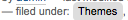
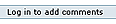
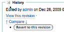
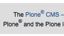
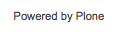

.. -*- coding: utf-8 -*-

.. _7_seccion:

7. Elementos de página
======================

Una referencia para viewlets, portlets, administradores de viewlets, y
columnas de portlets que componen una página. Hay una breve referencia para
cada tipo de componente, con enlaces y recordatorios sobre la forma de
manejarlos, un índice visual de los elementos de página, más fragmentos de
código para hacer su vida más fácil.

7.1. Viewlet
============

Qué se hace para crear un viewlet, además hojas de trucos sobre cómo mover,
eliminar o modificar, y enlaces a tutoriales útiles.

.. _711_seccion:

7.1.1. Anatomía de un Viewlet
=============================

Las partes que construyen un componente viewlet.

Directiva en ZCML
-----------------

<browser:viewlet />

Atributos en ZCML
-----------------

name ejemplo [su namespace].[nombre de su viewlet] manager una interfaz de
administrador layer una interfaz de marcador para su tema en particular class
una clase de Python. Esta clase requiere un atributo "render" (renderizar),
sobre el cual, en la mayoría de los casos, apunta a una plantilla. No es
necesario especificar la plantilla en el ZCML, sin embargo, en versiones de
Plone 3.1.3 en adelante, se puede sustituir esta plantilla usando el atributo
de plantilla más abajo
template En la versión de Plone 3.1.2 o anteriores, sólo se puede usar esta
opción si no está utilizando una clase, en la versión de Plone 3.1.3 o
posteriores, puede utilizar esto para sustituir la plantilla que ha definido
en la clase que usted ha especificado anteriormente
permission en la mayoría de los casos será Zope.Public for especificar una
interfaz marcando a un grupo de tipos de contenido, si lo desea. El viewlet
luego se limitará a aquellos tipos de contenido (por ejemplo, vea el 
:ref:`Viewlet de presentación <7911_seccion>` en la sección de Elementos) 
view (vista) especifique una interfaz que marca una vista del navegador 
específica, si lo desea. El viewlet se limitará a elementos con esa vista 
específica (por ejemplo investigar el código fuente del viewlet de acciones 
de contenido; usted encontrará las instrucciones sobre la ubicación de este 
código en la página `Acciones de contenido`_ de la sección de Elementos)

7.1.2. Mover, quitar u ocultar un viewlet
=========================================

Mover, quitar u ocultar un viewlet

7.1.2.1. Información general y hoja de trucos
==============================================

Una hoja de trucos de que tiene que hacer para mover viewlets en su diseño de
página, como también quitarlos u ocultarlos de su página.

Encontrará información detallada y un tutorial sobre cómo mover viewlets
aquí:

-   `http://plone.org/documentation/tutorial/customizing-main-template-viewlets/reordering-and-hiding-viewlets`_

Hoja breve de trucos para lo básico
------------------------------------

A través de la Web
~~~~~~~~~~~~~~~~~~~

-   Agregue @@manage-viewlets al URL de su sitio.
-   Si solo quiere mover viewlets que solo aparezcan en una página,
    asegúrese de agregar @@manage-viewlets al URL de esa página.
-   Usted encontrará que puede mover, ocultar o eliminar viewlets
    mediante este método, pero no puede moverlos de un adminitrador de
    viewlet a otro.

En su propio producto
~~~~~~~~~~~~~~~~~~~~~

Mover o desplazar viewlets es parte de la configuración de su sitio:

-   Agregue o edite [su paquete de tema]/profiles/default/viewlets.xml

Encontrará información general sobre la configuración del sitio en la sección
`Configuración`_ de este manual. Vale la pena leer esto antes de iniciar
aquí, ya que la configuración de viewlets y administradores de viewlets puede
ser un poco complicado. aquí se mostrará

-   cómo puede poner a la herramienta Generic Setup para que escriba la
    configuración por usted
-   por qué las cosas no están funcionando como usted esperaba

`GloWorm`_ es una herramienta útil aquí también. Esta le ayudará a mover los
viewlets a través de la interfaz de usuario de Plone e inspeccionar la
configuración resultante.

Eliminar un viewlet de un administrador de viewlet
::::::::::::::::::::::::::::::::::::::::::::::::::

No se puede hacer más que ocultar su viewlet en el administrador de viewlet

.. code-block:: xml

    <object>
        <hidden manager="[Viewlet Manager Name]" skinname="[your skin name]">
            <viewlet name="[Viewlet Name]" />
        </hidden>
    </object>

Tenga en cuenta que usted puede hacer este proceso a través de la web y luego
poner a la herramienta Generic Setup para que escriba la configuración por
usted para transferir dentro de su propio paquete de tema.

Moviendo un viewlet dentro de un administrador de viewlet
:::::::::::::::::::::::::::::::::::::::::::::::::::::::::

.. code-block:: xml

    <object>
        <order manager="[Viewlet Manager Name]" skinname="[your skin name]">
    <!-- Specify all the viewlets you want to see in this viewlet 
    in the order you want them with this directive: -->
            <viewlet name="[Viewlet Name]">
        </order>
    </object>

Tenga en cuenta que usted puede hacer este proceso a través de la web y luego
poner a la herramienta Generic Setup para que escriba la configuración por
usted para transferir dentro de su propio paquete de tema.

Moviendo un viewlet de un administrador viewlet a otro
::::::::::::::::::::::::::::::::::::::::::::::::::::::

Si está basando su tema sobre el tema Plone Default, pues encontrará que la
reasignación de un viewlet de Plone Default es un proceso que involucra dos
pasos

-   esconderlo en su administrador de viewlet actual
-   agregarlo y darle una posición en un administrador diferente de
    viewlet

.. code-block:: xml

    <object>
    <!-- Hide it from the current viewlet manager -->
        <hidden manager="[current Viewlet Manager Name]"
        skinname="[your skin name]">
            <viewlet name="[Viewlet Name]" />
        </hidden>
    <!-- Add it to a different viewlet manager -->
        <order manager="[a different Viewlet Manager]"
        skinname="[your skin name]"
               based-on="Plone Default">
            <viewlet name="[Viewlet Name]"
                     insert-before="[Name of Viewlet
                     Below]" />
        </order>
    <!-- OR Add it to your own viewlet manager -->
        <order manager="[Your Viewlet Manager]" skinname="[your skin name]">
            <viewlet name="[Viewlet Name]"/>
        </order>
    </object>

-   También puede usar "insert-after='[Name of Viewlet Above]'"' o
    utilizar un asterisco para colocar el viewlet en la parte superior o
    inferior del administrador (e.g 'insert-after'=*).
-   based-on="Plone Default" significa que va a tomar la orden de Plone
    Default y luego aplicar los ajustes insert-after y insert-before que
    usted ha especificado.

7.1.3. Sustituyendo (anulando) o creando un nuevo viewlet
=========================================================

Sustituyendo (anulando) o creando un nuevo viewlet

7.1.3.1. Información general y hoja de trucos
==============================================

Una hoja breve de trucos sobre cómo personalizar o crear un nuevo viewlet.

Usted puede personalizar una plantilla de viewlet a través de la web, pero no
puede alterar la base de la clase Python.

En el sistema de archivos, en lugar de personalizar, el proceso es conectar
un nuevo viewlet, o re-conectar un viewlet existente.

Encontrará un tutorial detallado sobre la creación de un viewlet en `este artículo`_ .

Breve hoja de trucos
--------------------

A través de la Web
~~~~~~~~~~~~~~~~~~~

-   Use :menuselection:`Configuración del sitio --> Interfaz de Administración de Zope --> portal_view_customizations` 
    para personalizar la plantilla de un viewlet existente de Plone Default.
-   No se puede crear un nuevo viewlet a través de la web.

En su propio producto
~~~~~~~~~~~~~~~~~~~~~

Usted tendrá que saber el nombre de:

1. La interfaz de administrador de viewlet Revise esto en la sección Elementos 
   de este manual 

2. La interfaz específica de su tema 
   Esto es opcional, pero le asegura que su viewlet sólo está disponible para su
   tema. Si utiliza la plantilla de paster plone3_theme, el nombre probablemente 
   será IThemeSpecific.

   Usted tendrá que crear los siguientes (debe ser capaz de localizar los
   originales para copiar revisando la sección Elementos o mediante el uso de
   `GloWorm`_):

3. directiva viewlet de navegación Esto irá en [su paquete de tema]/browser/configure.zcml 

4. archivo de configuración [su paquete de tema]/profiles/default/viewlets.xml

5. página de la plantilla[su paquete de tema]/browser/[your template name].pt

6. Clase PythonEsto es opcional (pero vea la nota de abajo para la versión de Plone 3.1.2 
   o anteriores) coloque esto en [su paquete de tema]/browser/[your module].py

Muestra de directiva de configuration.zcml
~~~~~~~~~~~~~~~~~~~~~~~~~~~~~~~~~~~~~~~~~~

Re-conectando un viewlet de Plone Default para utilizar su propia plantilla
(tenga en cuenta el atributo de capa es muy importante aquí)

.. code-block:: xml

    <browser:viewlet
     name="plone.[viewlet name]"
     manager="[viewlet manager interface]"
     class="plone.app.layout.viewlets.common.[viewlet class name]"
     template="templates/[your template name]"
     layer="[your theme specific interface]"
     permission="zope2.View"
     />

Conectando un nuevo viewlet pero prestando una clase de viewlet de Plone Default

.. code-block:: xml

    <browser:viewlet
     name=[your namespace].[your viewlet name]"
     manager="[viewlet manager interface]"
     class="plone.app.layout.viewlets.common.[viewlet class name]"
     template="templates/[your template name]"
     layer="[your theme specific interface]"
     permission="zope2.View"
     />

Conectando con un viewlet nuevo con su propia clase o su propia plantilla

.. code-block:: xml

    <browser:viewlet
     name=[your namespace].[your viewlet name]"
     manager="[viewlet manager interface]"
     class=".[your module].[your class name]"
     (or: template="templates/[your template name]")
     layer="[your theme specific interface]"
     permission="zope2.View"
     />

Notas de la versión de Plone 3.1.2 o anteriores:
-------------------------------------------------

Ejemplo de clase Python
~~~~~~~~~~~~~~~~~~~~~~~

En la versión de Plone 3.1.2 o anteriores, usted tendrá que usar esto para
sustituir un viewlet de Plone Default, incluso si usted sólo desea cambiar la
plantilla de página.

.. code-block:: python

    from [element namespace] import [element class name]
    from Products.Five.browser.pagetemplatefile import ViewPageTemplateFileclass

    [your class name]([element class name]): render = ViewPageTemplateFile("[your template name]")

7.2. Portlet
============

Una hoja de trucos de los detalles que componen un portlet, además
información sobre cómo mover, ocultar o sustituir (anular) un portlet.

.. _721_seccion:

7.2.1. Anatomía de un portlet
=============================

Las partes que construyen un renderizador de portlet (que es la parte de un
portlet que usted desea personalizar).

La personalización de un portlet es similar a la que sustitución de un
viewlet, pero más directa. Hay una directiva específica ZCML para la
personalización.

Directiva en ZCML
-----------------

<plone:portletRenderer />

Atributos en ZCML
-----------------

layer una interfaz de marcador para su tema en particular portlet la interfaz
del portlet que desea personalizar template ubicación de la plantilla que
desea sustituir class su clase personalizada (use esta opción si no
especifica una plantilla) para la renderización del portlet

7.2.2. Mover, quitar u ocultar un portlet
=========================================

Algunos consejos para mover u ocultar los portlets.

Sea que los portlets aparezcan o no en su sitio es altamente personalizable a
través de la web, usted puede utilizar el enlace para el administrador de
portlets en la mayoría de contextos. Para más información:

-   `http://plone.org/documentation/tutorial/where-is-what/portlets-1/`_

Se asume que usted no quiere *arreglar* portlets en una página (de lo
contrario, probablemente serán viewlets). Sin embargo, si desea establecer
una asignación inicial de portlets en la instalación de su producto de tema,
use

-   [su paquete de tema]/profiles/default/portlets.xml.

He aquí un extracto de portlets.xml de Plone Default, configurando el inicio
de sesión y portlet de navegación para la columna de la izquierda, y los
portlets de reseñas y noticias para la columna de la derecha.

.. code-block:: xml

    <?xml version="1.0"?>
    <portlets
        xmlns:i18n="http://xml.zope.org/namespaces/i18n"
        i18n:domain="plone">

     <!-- Assign the standard portlets -->

     <assignment
         manager="plone.leftcolumn"
         category="context"
         key="/"
         type="portlets.Navigation"
         name="navigation"
         />

     <assignment
         manager="plone.leftcolumn"
         category="context"
         key="/"
         type="portlets.Login"
         name="login"
         />

      <assignment
         manager="plone.rightcolumn"
         category="context"
         key="/"
         type="portlets.Review"
         name="review"
         />

     <assignment
         manager="plone.rightcolumn"
         category="context"
         key="/"
         type="portlets.News"
         name="news"
         />

    </portlets>

Los atributos para la directiva de asignación son descritos en detalle
aquí: `http://plone.org/products/plone/roadmap/203/`_ . En pocas palabras:

manager y type Los nombres de estos se pueden consultar en
plone.app.portlets.portlets.configure.zcml (para el tipo de portlet) o en el
archivo profiles/default/portlets.xml de Plone Default. category Este puede
ser uno de los cuatro valores de "context" (contexto), "content_type" (tipo
de contenido), "group" (grupo) o "user" (usuario) - dependiendo de donde
desea asignar los portlets.key Esto dependerá del valor dado en la categoría
anterior. En el caso de "context", la ubicación en el sitio es indicada (los
ejemplos anteriores especifican el root del sitio).

Si desea configurar el portlet con más detalle, se puede nidificar directivas
de propiedad dentro de la directiva de asignación. Aquí está un detalle para
asegurar que el portlet de navegación aparezca en el root del sitio:

.. code-block:: xml

    <assignment name="navigation" category="context" key="/"
        manager="plone.leftcolumn" type="portlets.Navigation">
         <property name="topLevel">0</property>
     </assignment>

7.2.3. Sustituyendo de un portlet
=================================

Una hoja breve de trucos sobre cómo sustituir o personalizar un portlet

A través de la Web
~~~~~~~~~~~~~~~~~~~

-   Use :menuselection:`Configuración del sitio --> Interfaz de Administración de Zope --> portal_view_customizations`
    para personalizar la plantilla de un portlet existente de Plone Default.

En su propio producto
~~~~~~~~~~~~~~~~~~~~~

Hay un tutorial detallado disponible aquí:

-   `http://plone.org/documentation/manual/theme-reference/elements/portlet/override-the-portlets-in-plone-3.0`_

También puede consultar los detalles del portlet que desee reemplazar en la
sección Elementos de este manual.

Breve hoja de trucos
~~~~~~~~~~~~~~~~~~~~

Usted tendrá que saber el nombre de

La interfaz específica de su tema Esto es opcional pero le asegura que su
portlet sólo está disponible para su tema. Si utiliza la plantilla de paster
plone3_theme, el nombre probablemente será IThemeSpecific.

Usted tendrá que crear los siguientes (debe ser capaz de localizar los
originales para copiar revisando la sección de Elementos):

directiva del renderizador de portlet de plone [su paquete de tema]/browser/configure.zcml página de la plantilla [su paquete de tema]/browser/[your template name].pt Clase Python * [su paquete de tema]/browser/[your module name].py

* En la mayoría de los casos no será necesario una clase Python

Muestra de directiva de configuration.zcml
~~~~~~~~~~~~~~~~~~~~~~~~~~~~~~~~~~~~~~~~~~

.. code-block:: xml

    <configure
        xmlns:plone="http://namespaces.plone.org/plone">
        <include package="plone.app.portlets"  />
        <plone:portletRenderer
           portlet="[element interface]"
           template="[your template name].pt"
          (or class=".[your module].[your class name]")
          layer="[your theme specific interface]"
         />
    </configure>

Ejemplo de clase Python para la sustitución de portlet de navegación
~~~~~~~~~~~~~~~~~~~~~~~~~~~~~~~~~~~~~~~~~~~~~~~~~~~~~~~~~~~~~~~~~~~~~~

Si desea personalizar el portlet de navegación, es posible que deba
suministrar la clase, así como también la plantilla. Dos plantillas están
involucradas: la primera es usual plantilla de visualización, y la segunda se
encarga de la recursión a través del árbol de navegación. Si usted necesita
hacer su propia versión de la segunda, entonces tendrá que asignarla al
método recursivo en la clase.

.. code-block:: python

    from plone.app.portlets.portlets.navigation import Renderer
    from Products.Five.browser.pagetemplatefile import ViewPageTemplateFile

    class [your class name](Renderer):
        _template = ViewPageTemplateFile([your template name].pt)
        recurse = ViewPageTemplateFile([your recurse template name])

7.2.4. Sustituir los portlets de Plone 3.0
==========================================

La personalización de portlets es una tarea regular, trabajando con el tema
de Plone. En este tutorial averiguaremos cómo hacer esto en Plone 3.0 con su
nuevo mecanismo para la administración de portlets (aportado por Denys
Mishunov)

Propósito
~~~~~~~~~

Era bastante fácil personalizar uno de los portlets estándar en tiempos de
las versiones anteriores de Plone 3.0. Tan sólo tenía que copiar una
plantilla de página para el portlet adecuado para su producto de tema y hacer
lo que quiera, cambiando el XHTML. También podía crear un portlet nuevo con
la misma facilidad; simplemente creando una plantilla para el nuevo portlet y
registrando este portlet con las Propiedades de su sitio.

En Plone 3.0 los portlets se convirtieron en algo más complejo. Pero no tema.
Al mismo tiempo se volvieron ¡más poderosos! La ventaja se hace evidente
ahora, ¿no? ;) Estos se sirven desde paquetes Python separados y realmente
tienen posibilidades de administración flexibles. Por lo tanto, vale la pena
probar este nuevo mecanismo para darse cuenta de lo poderoso que es.

Prerrequisitos
~~~~~~~~~~~~~~

Lo primero que hay que destacar; esto no se trata de personalización a través
de la web. Si usted necesita un truco rápido y no muy estilizado, eche un
vistazo a la herramienta portal_view_customizations. Este tutorial asume que
usted desea que sus cambios se repitan, de modo que usted pueda obtener los
mismos cambios en cualquier otro sitio donde se instale su producto.

Otra cosa que podría tener en cuenta vale la pena mencionar: usted no
necesita esta técnica en **ningún** caso que quiera personalizar un portlet
en Plone 3.0. Si usted ha apenas personalizado portlets utilizados en
versiones anteriores de Plone o si desea seguir utilizando los portlets de la
manera "a-la-era-anterior-a-3.0" (que no recomiendo en absoluto) puede que
tenga que revisar ClassicPortlet incluido con Plone 3.0. Este lidia con las
plantillas de página regulares de la misma manera en que ha trabajado con
portlets antes de la 3.0.

Y el último antes de seguir adelante. Si quiere personalizar cualquier de los
portlets estándar eliminandole toda la lógica de fondo (creando un portlet
estático), no lo haga Lo que queremos decir es que **no** haga esto. Gente
con experiencia pens? en usted. Mejor instale plone.portlet.static y juegue
con él, creando los portlets estáticos cuando los necesite.

Así que para todos aquellos que todavía siguen con nosotros...finalmente
seguimos adelante.

Suponemos que ha creado el tema de Plone 3 **MyTheme** ya sea con los
generadores DIYPloneStyle o ZopeSkel. Aquí no cubrimos las explicaciones de
todos los aspectos de la creación de un tema para Plone 3.0. Para obtener más
información acerca de las ideas centrales en la elaboración de un tema,
administración de viewlets en Plone 3.0 y muchos más, revise un excelente
tutorial por David Convent, `Personalización de viewlets en main_template`_
.

El concepto clave en el trabajo con portlets en Plone 3.0 es el uso de la
capa de skin de Zope 3, la misma que tenemos cuando se reemplaza un viewlet.
Asumimos que usted tiene al menos el siguiente conjunto mínimo de archivos en
la carpeta **MyTheme/browser**: ::

    - browser/
        - __init__.py
        - configure.zcml
        - interfaces.py

Generalmente el proceso de sustitución de portlets es así:

-   elija el portlet que desea reemplazar; 

-   registre una capa de skin si todavía no tiene una en **interfaces.py**;

-   agregue la directiva especial <plone:portletRenderer/> a **MyTheme/browser/configure.zcml**;

-   defina el atributo de **portlet** para la directiva
    <plone:portletRenderer />. Este es un tipo de portlet para proveedor de
    datos utilizado para esta sustitución. Esto puede ser una clase o una
    interfaz. Por ejemplo plone.app.portlets.portlets.navigation.INewsPortlet;

-   defina una nuevo atributo **template** para la directiva
    <plone:portletRenderer />. Cuando agregue esto el renderizador
    predeterminado será usado para el portlet que está sustituyendo, pero con
    su plantilla;

-   en caso de que necesite personalizar el comportamiento por defecto
    para el portlet, debe utilizar el atributo **class** en vez de una simple
    plantilla. Esta nueva clase estará actuando como el renderizador para el
    portlet en lugar de la opción predeterminada;

-   defina el atributo **layer** para la directiva <plone:portletRenderer /> 
    con la capa de navegador **MyTheme**. El atributo **layer** del
    atributo portletRenderer asocia un particular IPortletRenderer con una
    particular capa de navegador (capa **MyTheme** en nuestro caso). Cuando
    nuestra capa está en en acción (es decir, MyTheme está instalado) el
    nuevo renderizador será utilizado en lugar de la opción predeterminada:

-   agregue una nueva plantilla a **MyTheme/browser** que implementará el
    renderizador;

-   reinicie Zope y disfrute.

Paso a paso
~~~~~~~~~~~

1. Elija el portlet
:::::::::::::::::::

Primero que nada debemos decidir qué portlet deseamos personalizar. Vamos a
elegir el portlet de Noticias. Si echara un vistazo portlet estándar de
noticias, podrá ver esas imágenes news_icon en frente de los títulos. Vamos a
deshacernos de ellas en el XHTML sólo para ejemplificar.

Los portlets por defecto de Plone se declaran en el paquete
**plone.app.portlets.portlets**. Los portlets de núcleo en Plone 3.0 se
pueden encontrar en
**$INSTANCE_HOME/lib/python/plone/app/portlets/portlets/**. Aunque se pueden
ubicar en otro lugar en $PYTHONPATH. Dependiendo de la instalación de Zope
(win32 o UNIX como sistema operativo, instalación desde el código fuente, por
el instalador, huevos u otros...), puede que tenga que utilizar las
herramientas de búsqueda disponibles en su sistema operativo para localizar
el paquete.

El paquete **plone.app.portlets.portlets** contiene módulos de Python,
plantillas de página y el archivo de configuración de ZCML: **configure.zcml**. 
Este archivo contiene un conjunto de directivas <plone:portlet /> que
definen portlets estándar de esta manera:

.. code-block:: xml

    <plone:portlet
        name="portlets.News"
        interface=".news.INewsPortlet"
        assignment=".news.Assignment"
        renderer=".news.Renderer"
        addview=".news.AddForm"
        editview=".news.EditForm"
        />

Los atributos en el código anterior se explican por si mismo. Pero si no
están claros para usted o desea saber más acerca de los atributos adicionales
para <plone:portlet />, eche un vistazo a la interfaz **IPortletDirective**
en el módulo **metadirectives** dentro del paquete plone.app.portlets.

2. Registre una capa de skin si todavía no tiene una
:::::::::::::::::::::::::::::::::::::::::::::::::::::

Podemos registrar un reemplazo para un portlet sólo para un tema (una
selección de skin), gracias al paquete **plone.theme**. Gracias a
**plone.theme**, podemos establecer una capa de skin de Zope 3 que
corresponda con un skin particular en portal_skins (un tema).

Agregue el siguiente código a **MyTheme/browser/interfaces.py** si todavía no
la tiene:

.. code-block:: python

    from plone.theme.interfaces import IDefaultPloneLayer

    class IThemeSpecific(IDefaultPloneLayer):
        """Marker interface that defines a Zope 3 skin layer bound to a Skin
           Selection in portal_skins.
        """

3. Añada la directiva a configure.zcml con los atributos adecuados
:::::::::::::::::::::::::::::::::::::::::::::::::::::::::::::::::::

Junto con la directiva <plone:portlet />, el paquete plone.app.portlets
define otro; <plone:portletRenderer />. El último se utiliza para sustituir
los portlets, definidos en su sitio. Tiene unos pocos atributos posibles que
se pueden encontrar en el módulo **metadirectives** dentro del paquete
plone.app.portlets. No vamos a listar todos aquí, así que simplemente pase 5
minutos y eche un vistazo a esos atributos, para que pueda comprender el
siguiente código ...

... 5 minutos después...

Bien, volvamos al trabajo. Para sustituir el portlet estándar de noticias
para el producto MyTheme debemos agregar la directiva <plone:portletRenderer
/> a **MyTheme/browser/configure.zcml**. Revisemos cómo debería verse esto
(asegúrese de tener el namespace xmlns:plone="http://namespaces.plone.org/plone" 
definido en su nodo superior **<configure>**):

.. code-block:: xml

    <include package="plone.app.portlets" />

    <interface
       interface=".interfaces.IThemeSpecific"
       type="zope.publisher.interfaces.browser.IBrowserSkinType"
       name="My Theme"
       />

    <plone:portletRenderer
       portlet="plone.app.portlets.portlets.news.INewsPortlet"
       template="mytheme_news.pt"
       layer=".interfaces.IThemeSpecific"
       />

Primero incluya el paquete plone.app.portlets para asegurar que los portlets
por defecto están activados antes de sustituir cualquier cosa.

Luego creamos una interfaz de capa de navegador para **MyTheme**, definida en
**MyTheme/browser/interfaces.py** disponible. Si ha personalizado cualquier
viewlet ya debería tener esto en **configure.zcml** así que no hay necesidad
de añadirlo dos veces en el mismo tema.

A continuación, vamos a resolver cuáles son los atributos que usamos aquí:

-   **portlet**: defina el portlet que vamos a sustituir. En nuestro
    caso, definimos la ruta con puntos completa a la interfaz INewsPortlet,
    implementada por el portlet de noticias;
-   **template**: el nombre de una plantilla que implementa el
    renderizador. El renderizador por defecto para este portlet de noticias
    será usado, pero con la plantilla "mytheme_news.pt en vez de la
    predeterminada.
-   **layer**: nuestra capa de navegador para la cual el renderizador es
    utilizado.
-   un atributo más que puede ser necesario recordar aquí es **class**.
    Usted tendrá que utilizarlo en caso de que quiera cambiar el
    comportamiento por defecto del portlet. Este atributo definirá la clase
    que se utilizará como un renderizador para este portlet en lugar de la
    opción predeterminada.

Es todo con **configure.zcml**. Sigamos.

4. Agregue una nueva plantilla para renderizador del portlet
::::::::::::::::::::::::::::::::::::::::::::::::::::::::::::

En el apartado anterior hemos definido mytheme_news.pt como un valor para el
atributo **template**. Pero no tenemos esa plantilla en el sistema de
archivos. Vamos a añadirla a ** MyTheme / browser / ** . Simplemente copie la
plantilla **news.pt** para el portlet de noticias desde
**plone.app.portlets.portlets** a **MyTheme/browser/** y renombrelo para
mytheme_news.pt. Abra esta plantilla en su editor favorito y vamos a jugar
con ella un poco.

Como debe recordar tiene que deshacerse de los iconos estándar news_icon.gif
que obtenemos para los elementos de noticias por defecto. Encuentre la
siguiente línea en la plantilla:

.. code-block:: xml

    

y comentela de modo que no hagamos pasos irrecuperables y podamos deshacer
nuestros cambios más tarde. Así, tenemos:

.. code-block:: xml

    <!--  -->

¡Eso es todo amigos!
:::::::::::::::::::::

Por lo tanto, eso es todo. Reinicie su Zope y vea su portlet de elementos de
noticia; ¡no hay imágenes! ¡Bien! ¡Excelente! Bueno en realidad no tanto ya
que la imágenes pueden ser útiles para portales de comunidades :)

¿Qué sigue?
:::::::::::

Este ejemplo es muy simple y de seguro no es realmente muy útil. Pero
definitivamente ahora puede hacer personalizaciones mucho mejores. Cuando se
utiliza el atributo **class** en la directiva <plone:portletRenderer/> usted
puede crear portlets que realmente se diferencien de los predeterminados. Y
es allá donde se encuentra la belleza de los portlets en Plone 3.0; no tendrá
que poner una carga de Python a sus plantillas de página como tenía que hacer
antes. Todas las cosas de Python estarán exactamente donde tienen que estar;
en clases Python. Y la plantilla sólo obtendrá los resultados de diferentes
métodos de Python dentro de esa clase.

¡Disfrute!

7.3. Administrador de viewlet
=============================

Cómo mover u ocultar los administradores de viewlet y cómo crear uno nuevo.

7.3.1. Anatomía de un administrador de viewlet
==============================================

Las partes que construyen un administrador de viewlet.

Directiva en ZCML
-----------------

<browser:viewletManager />

Atributos en ZCML
-----------------

name ejemplo [su namespace].[nombre del administrador de su viewlet] provides
una interfaz de marcador que define lo que este gerente hace layer una
interfaz de marcador para su tema en particular class esto será
plone.app.viewletmanager.manager.OrderedViewletManager permission en la
mayoría de los casos será Zope.Public for especificar una interfaz marcando a
un grupo de tipos de contenido, si lo desea. El administrador de viewlet se
limitará a esos tipos de contenido view (vista) especificar una interfaz que
marca una vista, si lo desea. El administrador de viewlet se limitará a los
artículos con esas de vista.

7.3.2. Mover, quitar u ocultar un administrador de viewlet
==========================================================

Algunos consejos de cómo mover u ocultar administradores de viewlet.

Los administradores de viewlets son llamados por plantillas de página.
Moverlos o eliminarlos es simplemente un asunto de personalización de
plantilla. La mayoría son llamados por main_template, pero es posible que
tenga que buscar dentro de las vistas específicas de contenido para algunos
de ellos.

Breve hoja de trucos
--------------------

A través de la Web
~~~~~~~~~~~~~~~~~~~

-   :menuselection:`Configuración del sitio --> Interfaz de Administración de Zope --> portal_skins --> plone_templates` o :menuselection:`Configuración del sitio --> Interfaz de Administración de Zope --> portal_skins --> plone_templates`
-   haga clic en el botón de personalizar, y busque por

    .. code-block:: xml

        

-   (Use la clave de Elementos para identificar exactamente qué
    administrador le interesa)

En su propio producto
~~~~~~~~~~~~~~~~~~~~~

-   Ponga su propia versión de main_template o de vistas de contenido en

[su paquete de tema]/skins.

7.3.3. Creando un nuevo administrador de viewlet
================================================

Una breve hoja de trucos para crear un nuevo administrador de viewlet.

A través de la Web
~~~~~~~~~~~~~~~~~~~

No se puede crear un nuevo administrador de viewlet a través de la web. Para
sustituir el orden en que aparecen los viewlets en un administrador de
viewlet, siga las instrucciones para viewlets.

En su propio producto
~~~~~~~~~~~~~~~~~~~~~

Si usted está basando su nuevo administrador de viewlet en un administrador
de Viewlet de Plone Default, busque los detalles en la sección de Elementos
de este manual.

Usted tendrá que saber el nombre de

La interfaz específica de su tema Esto es opcional, pero le asegura que su
viewlet sólo está disponible para su tema. Si utiliza la plantilla de paster
plone3_theme, el nombre probablemente será IThemeSpecific.

Usted tendrá que crear los siguientes (debe ser capaz de localizar los
originales para copiar revisando la sección de Elementos):

.. glossary ::

  browser viewletManager directive 
    [su paquete de tema]/browser/configure.zcml
    
  Su interfaz de administrador de viewlet 
    [su paquete de tema]/browser/interfaces.py 

  directivas del archivo de configuración
    [su paquete de tema]/profiles/default/viewlets.xml

Muestra de la interfaz
~~~~~~~~~~~~~~~~~~~~~~

.. code-block:: python

    from zope.viewlet.interfaces import IViewletManager

    class [your viewlet manager interface](IViewletManager):
        """ [A description of your viewlet manager goes here]  """

Muestra de la directiva configure.zcml
~~~~~~~~~~~~~~~~~~~~~~~~~~~~~~~~~~~~~~

.. code-block:: xml

    <browser:viewletManager
     name=[your namespace].[your element name]"
     provides=".interfaces.[your viewlet manager interface]"
     class="plone.app.viewletmanager.manager.OrderedViewletManager"
     layer="[your theme interface]"
     permission="zope2.View"
     />

7.4. Administrador de portlet
=============================

Consejos para mover u ocultar administradores de portlets. Hoja de trucos
para la creación de un nuevo administrador de portlet.

7.4.1. Mover o quitar un administrador de portlet
=================================================

Consejos sobre cómo mover o quitar los administradores de portlets.

Los administradores de portlets son llamados por main_template. Moverlos o
eliminarlos es simplemente un asunto de personalización de plantilla.

A través de la Web
~~~~~~~~~~~~~~~~~~~

-   :menuselection:`Configuración del sitio --> Interfaz de Administración de Zope --> portal_skins --> plone_templates --> main_template`
-   Personalice esto, y busque por

    .. code-block:: xml
    
        

-   (Use la clave de Elementos para identificar exactamente qué
    administrador le interesa)

En su propio producto
~~~~~~~~~~~~~~~~~~~~~

-   Coloque su propia versión de main_template en

[su producto de tema]/skins.

7.4.2. Ocultando un administrador de portlet
============================================

Existen varios métodos para ocultar un administrador de portlet.

Un administrador de portlet no se mostrará si no hay portlets para mostrar
asignados a él o si los portlets asignados no tienen datos.

En el caso de las columnas de portlets, si el administrador de portlet está
vacío, entonces también es útil desaparecer los elementos de bloque
circundantes también, para que no obtenga un amplio margen en blanco en su
página. Por esta razón, las columnas que contienen los administradores de
portlets en el main_template están empaquetados con slots (ranuras). Ocultar
los administradores de portlets es, por lo tanto, un asunto de la
manipulación de estas ranuras. Existen varias técnicas:

Definiendo una ranura vacía Utilice lo siguiente en una plantilla de vista de
contenido para asegurarse de que la columna de la derecha se retire:

-   ``<metal:column_one fill-slot="column_one_slot" />``

Usando las variables globales sl y sr Estas se establecen como condiciones en
las ranuras; ellas comprueban los respectivos administradores de portlet de
contenido y, si están vacíos, dan como resultado un false (falso). Usted
puede sustituir estas en la plantilla misma. Usando la opción show_portlets
show_portlets=false se puede pasar como una opción a una plantilla para
establecer sl y sr a falso Para ver esto en acción, eche un vistazo a

-   CMFPlone/skins/plone_templates/standard_error_message.py y
-   CMFPlone/browser/ploneview.py

7.4.3. Creando un nuevo administrador de portlet
=================================================

Cómo crear un nuevo administrador de portlet.

Un ejemplo práctico de la creación de un nuevo administrador de portlet puede
encontrarla aquí

-   `http://plone.org/documentation/how-to/adding-portlet-managers`_

He aquí una lista rápida de lo que tiene que hacer.

Breve hoja de trucos
--------------------

A través de la Web
~~~~~~~~~~~~~~~~~~~

No se puede crear un nuevo administrador de portlet a través de la web.

En su propio producto
~~~~~~~~~~~~~~~~~~~~~

Usted tendrá que proporcionar el nombre de

La interfaz específica de su tema Esto es opcional pero le asegura que su
administrador de portlet está disponible sólo para su tema. Si utiliza la
plantilla de paster plone3_theme, el nombre probablemente será
IThemeSpecific.

Usted tendrá que crear los siguientes (debe ser capaz de localizar los
originales para copiar revisando la sección de Elementos):

Interface Esto irá en [su paquete de tema]/browser/interfaces.py. Le puede
dar cualquier nombre que desee, pero por convención, debe ser precedido por
"I". directiva de configuración [su paquete de tema]/profiles/default/portlets.xml browser:page directive (para la vista del
administrador) [su paquete de tema]/browser/configure.zcml plantilla de
página (para la vista del administrador) [su paquete de tema]/browser/[su
plantilla].pt

Muestra de la interfaz
~~~~~~~~~~~~~~~~~~~~~~

.. code-block:: python

    from plone.portlets.interfaces import IPortletManager

    class [your portlet manager interface](IPortletManager):
     """A description goes here    """

Muestra de portlets.xml
~~~~~~~~~~~~~~~~~~~~~~~

.. code-block:: xml

    <?xml version="1.0"?>
    <portlets>
     <portletmanager
        name="[your namespace].[your portlet manager]"
        type="[your namespace].[your theme
        name].browser.interfaces.[your portlet manager interface]"
     />
    </portlets>

Muestra de directiva configure.zcml (para la vista del administrador)
~~~~~~~~~~~~~~~~~~~~~~~~~~~~~~~~~~~~~~~~~~~~~~~~~~~~~~~~~~~~~~~~~~~~~

.. code-block:: xml

    <browser:page
     for="plone.portlets.interfaces.ILocalPortletAssignable"
     class="plone.app.portlets.browser.manage.ManageContextualPortlets"
     name="[your view name]"
     template="[your template name].pt"
     permission="plone.app.portlets.ManagePortlets"
    />

7.4.4. Práctico
================

Práctico

7.4.4.1. Agregando administradores de portlets
==============================================

Usted necesita portlets en otro lugar en su Plone. En este ejemplo colocamos
portlets contextuales sobre el contenido (aportado por Jens Klein)

> Esto se trata de agregar ADMINISTRADORES de portlets, pista: **
PortletManager! = Portlet. ** Un PortletManager es una especie de contenedor
para los portlets, tal como es el ViewletManager para viewlets. Bueno,
después de reducir el mom?ntum de malentedimiento, comencemos:

Prerrequisitos
--------------

Supongo que está familiarizado con las configuraciones base GenericSetup de
Plone 3. Revise los tutoriales *DIYPloneStyle* y otros relacionados si no es
así.

Usted necesita instalar Plone 3 y un producto NEWTHEME (nuevo tema) para su
propio skin (basado en DIYPloneStyle funciona bien).

Estrategia
----------

En mi ejemplo, yo no quiero personalizar la plantilla principal. Por lo tanto
la idea es agregar un viewlet a
*plone.app.layout.viewlets.interfaces.IContentViews* viewletmanager. Así que
los pasos que hay que hacer son

1.  Añada un viewlet al viewlet-manager
2.  Añada un portlet-manager

3.  Añada una vista de administrador para el portlet-manager.

Paso uno: Añadir un Viewlet
----------------------------

en Products.NEWTHEME agregue un archivo *abovecontentportlets.pt* que
contenga:

.. code-block:: xml

    <tal:block replace="structure provider:my.abovecontentportlets" />

Aquí llamamos al administrador de portlet, y lo creamos en el paso dos.
Pero primero registremos nuestro nuevo viewlet para el viewletmanager.
Edite su Products/NEWTHEME/configure.zcml y agregue:

.. code-block:: xml

    <browser:viewlet
        name="my.abovecontentportlets"
        manager="plone.app.layout.viewlets.interfaces.IContentViews"
        template="abovecontentportlets.pt"
        permission="zope2.View"
    />

Paso dos: Agregar un administrador de portlet
---------------------------------------------

Crear una interfaz de marcado para el administrador y agregue o edite
*Products/NEWTHEME/interfaces.py*

.. code-block:: python

    from plone.portlets.interfaces import IPortletManager

    class IMyAboveContent(IPortletManager):
        """we need our own portlet manager above the content area.
        """

Agregue (o edite) su *Products/NEWTHEME/profiles/default/portlets.xml* y
registre un administrador de portlet:

.. code-block:: xml

    <?xml version="1.0"?>
    <portlets>
     <portletmanager
       name="my.abovecontentportlets"
       type="Products.NEWTHEME.interfaces.IMyAboveContent"
     />
    </portlets>

Eso es todo lo que necesita si no quiere administrar los portlets a través de
la web. Oh! ¿si quiere? Pues entonces necesita un tercer paso:

Paso tres: Añadir una vista de administrador para el administrador de portlet
-----------------------------------------------------------------------------

La vista para administración es renderizada para los slots (ranuras) de la
izquierda y derecha en plantilla principal (main-template) Sin embargo
utilizamos un viewlet y tenemos aquí una vista diferente. así que tenemos que
llamar explícitamente a nuestra vista y llamar a nuestro administrador dentro
de su contexto.

Tenemos que registrar una nueva vista de navegador para ver nuestra plantilla
de página llamando directamente a nuestro administrador. Nuevamente agregue
algunas líneas a su *configure.zcml*:

.. code-block:: xml

    <browser:page
        for="plone.portlets.interfaces.ILocalPortletAssignable"
        class="plone.app.portlets.browser.manage.ManageContextualPortlets"
        name="manage-myabove"
        template="templates/managemyabove.pt"
        permission="plone.app.portlets.ManagePortlets"
    />

Y finalmente, necesitamos la plantilla, así que agregue un archivo *managemyabove.pt* y edite:

.. code-block:: xml

    <html xmlns="http://www.w3.org/1999/xhtml"
          xmlns:metal="http://xml.zope.org/namespaces/metal"
          xmlns:tal="http://xml.zope.org/namespaces/tal"
          xmlns:i18n="http://xml.zope.org/namespaces/i18n"
          metal:use-macro="context/main_template/macros/master"
          i18n:domain="plone">
    <head>
        

            <link type="text/css" rel="kinetic-stylesheet"
                tal:attributes="href
                string:${context/absolute_url}/++resource++manage-
                portlets.kss"/>
        

    </head>
    <body>
    

      <h1 class="documentFirstHeading">Manage My Portlets</h1>
      
    

    </body>
    </html>

    Eso es todo. Después de reiniciar su Zope puede llamar
    *http://DOMAIN.TLD/plone/path/to/some/context/@@manage-myabove*

y asignar portlets sobre su contenido.

7.5. Índice de elementos de página, Plone Default (Plone por defecto) y Classic Theme (tema clásico)
====================================================================================================

Un índice visual de los elementos de la página principal.

Por el momento, este índice le ofrece solamente viewlets, pero la intención
es ampliarlo para incluir portlets y los respectivos administradores.

Una alternativa al uso de este índice es la instalación de `GloWorm`_ en su
instancia de Plone. Este es un inspector visual que le dará información sobre
diversos aspectos del tema Plone Default directamente a través de su
explorador, y facilitarle realizar personalizaciones de viewlet a través de
la Web.

..
  .. |reST| replace:: reStructuredText
  Yes, |reST| is a long word, 

.. |peihtml1| replace:: 
 ... 

.. |peihtml2| replace:: <title> ...</title>
.. |peihtml3| replace:: <link title="Go to previous item" />
.. |peihtml4| replace:: <link rel="shortcut icon" />
.. |peihtml5| replace:: <link rel="search" ... />
.. |peihtml6| replace:: <link rel="author" ... />
.. |peihtml7| replace:: <link title="Front Page" ...> and <link title="Site Map"..>
.. |peihtml8| replace:: 
 ... 

.. |peihtml9| replace:: <ul id="portal-languageselector"> ... </ul>

.. |peihtml11| replace:: <ul id="portal-siteactions">...</ul>

.. |peihtml12| image:: ./image_thumb_011.png
    :alt: plone.searchbox
    
.. |peihtml13| replace:: 
...

.. |peihtml14| image:: ./image_thumb.png
    :alt: plone.logo
    
.. |peihtml15| replace:: <a id="portal-logo" ...>... </a>

.. |peihtml16| image:: ./image_thumb_005.png
    :alt: plone.global_sections
    
.. |peihtml17| replace:: <h5 class="hiddenStructure">Sections</h5> <ul id="portal-globalnav"> ... </ul>

.. |peihtml18| image:: ./image_thumb_006.png
    :alt: plone.personal_bar
    
.. |peihtml19| replace:: 
...

.. |peihtml20| replace:: 
...

.. |peihtml21| replace:: <ul class="contentViews"> ... </ul>

    
.. |peihtml23| replace:: <dl id="document-toc" class="portlet toc" style="display:none"> ... </dl>

.. |peihtml24| image:: ./image_thumb_004.png
    :alt: plone.presentation
    
.. |peihtml25| replace:: 
...

.. |peihtml26| replace:: 
...

.. |peihtml27| image:: ./image_preview_009.png
    :alt: plone.byline
    
.. |peihtml28| replace:: 
...

.. |peihtml29| replace:: 

    
.. |peihtml31| replace:: 
 ... 

.. |peihtml32| image:: ./image_thumb_017.png
    :alt: plone.comments
    
.. |peihtml33| replace:: 
 ... 

.. |peihtml34| replace:: 
...

    
.. |peihtml36| replace:: 
...

.. |peihtml37| replace:: 
...

.. |peihtml38| image:: ./image_preview_010.png
    :alt: plone.colophon 
    
.. |peihtml39| replace:: 
...

+---------------------+---------------------+---------------+--------------------------------------------+
|        Clave        |       Título        |  Código HTML  |  Nombre del Tipo de Administrador          |
+=====================+=====================+===============+============================================+
|                     | Enlaces para salto  | |peihtml1|    | `plone.skip_links`_                        |
|                     |                     |               |                                            |
|                     |                     |               | plone.portalheader                         |
|                     |                     |               |                                            |
|                     |                     |               | `viewlet`_                                 |
+---------------------+---------------------+---------------+--------------------------------------------+
|                     |                     | |peihtml2|    | `plone.htmlhead.title`_                    |
|                     | Título de           |               |                                            |
|                     | Cabecera HTML       |               | plone.htmlhead                             |
|                     |                     |               |                                            |
|                     |                     |               | `viewlet`_                                 |
+---------------------+---------------------+---------------+--------------------------------------------+
|                     | Enlaces             | |peihtml3|    | `plone.nextprevious.links`_                |
|                     | anterior/siguiente  |               |                                            |
|                     |                     |               |                                            |
|                     |                     |               | `viewlet`_                                 |
+---------------------+---------------------+---------------+--------------------------------------------+
|                     | Enlace Favicon      | |peihtml4|    | `plone.links.favicon`_                     |
|                     |                     |               |                                            |
|                     |                     |               | plone.htmlhead.links                       |
|                     |                     |               |                                            |
|                     |                     |               | `viewlet`_                                 |
+---------------------+---------------------+---------------+--------------------------------------------+
|                     | Enlace de búsqueda  | |peihtml5|    | `plone.links.search`_                      |
|                     |                     |               |                                            |
|                     |                     |               | plone.htmlhead.links                       |
|                     |                     |               |                                            |
|                     |                     |               | `viewlet`_                                 |
+---------------------+---------------------+---------------+--------------------------------------------+
|                     | Enlace de autor     | |peihtml6|    | `plone.links.author`_                      |
|                     |                     |               |                                            |
|                     |                     |               | plone.htmlhead.links                       |
|                     |                     |               |                                            |
|                     |                     |               | `viewlet`_                                 |
+---------------------+---------------------+---------------+--------------------------------------------+
|                     | Enlace de           | |peihtml7|    | `plone.links.navigation`_                  |
|                     | navegación          |               |                                            |
|                     |                     |               |                                            |
|                     |                     |               | plone.htmlhead.links                       |
|                     |                     |               |                                            |
|                     |                     |               | `viewlet`_                                 |
+---------------------+---------------------+---------------+--------------------------------------------+
|                     | Analytics           | (Fragmento    |                                            |
|                     |                     | de código     |                                            |
|                     |                     | definido por  | `plone.analytics`_                         |
|                     |                     | el            |                                            |
|                     |                     | administrador |                                            |
|                     |                     | del sitio)    |                                            |
|                     |                     |               |                                            |
|                     |                     |               | plone.portalfooter                         |
|                     |                     |               |                                            |
|                     |                     |               | `viewlet`_                                 |
+---------------------+---------------------+---------------+--------------------------------------------+
|                     | Encabezado          | |peihtml8|    | `plone.header`_                            |
|                     |                     |               |                                            |
|                     |                     |               | plone.portaltop                            |
|                     |                     |               |                                            |
|                     |                     |               | `viewlet`_                                 |
+---------------------+---------------------+---------------+--------------------------------------------+
|                     | Selector de idiomas | |peihtml9|    | `plone.app.i18n.locales.languageselector`_ |
|                     |                     |               |                                            |
|                     |                     |               | Portal Top                                 |
|                     |                     |               |                                            |
|                     |                     |               | `viewlet`_                                 |
+---------------------+---------------------+---------------+--------------------------------------------+
|                     | Acciones del sitio  | |peihtml11|   | `plone.site_actions`_                      |
|                     |                     |               |                                            |
| |peihtml10|         |                     |               | plone.portalheader                         |
|                     |                     |               |                                            |
|                     |                     |               | `viewlet`_                                 |
+---------------------+---------------------+---------------+--------------------------------------------+
|                     | Cuadro de búsqueda  | |peihtml13|   | `plone.searchbox`_                         |
|                     |                     |               |                                            |
| |peihtml12|         |                     |               | plone.portalheader                         |
|                     |                     |               |                                            |
|                     |                     |               | `viewlet`_                                 |
+---------------------+---------------------+---------------+--------------------------------------------+
|                     | Logotipo            | |peihtml15|   | `plone.logo`_                              |
|                     |                     |               |                                            |
| |peihtml14|         |                     |               | plone.portalheader                         |
|                     |                     |               |                                            |
|                     |                     |               | `viewlet`_                                 |
+---------------------+---------------------+---------------+--------------------------------------------+
|                     |                     | |peihtml17|   | `plone.global_sections`_                   |
|                     |                     |               |                                            |
| |peihtml16|         | Secciones globales  |               | plone.portalheader                         |
|                     |                     |               |                                            |
|                     |                     |               | `viewlet`_                                 |
+---------------------+---------------------+---------------+--------------------------------------------+
|                     |                     | |peihtml19|   | `plone.personal_bar`_                      |
|                     |                     |               |                                            |
| |peihtml18|         | Barra personal      |               | plone.portaltop                            |
|                     |                     |               |                                            |
|                     |                     |               | `viewlet`_                                 |
+---------------------+---------------------+---------------+--------------------------------------------+
|                     | Barra de ruta       | |peihtml20|   | `plone.path_bar`_                          |
|                     | (hilo de Ariadna    |               |                                            |
|                     | del portal)         |               | plone.portaltop                            |
|                     |                     |               |                                            |
|                     |                     |               | `viewlet`_                                 |
+---------------------+---------------------+---------------+--------------------------------------------+
|                     |                     | |peihtml21|   | `plone.contentviews`_                      |
|                     |                     |               |                                            |
|                     | Vistas de contenido |               | plone.contentviews                         |
|                     |                     |               |                                            |
|                     |                     |               | `viewlet`_                                 |
+---------------------+---------------------+---------------+--------------------------------------------+
|                     |                     |               | `plone.contentactions`_                    |
|                     | Acciones de         |               |                                            |
|                     | contenido           |               | plone.contentviews                         |
|                     |                     |               |                                            |
|                     |                     |               | `viewlet`_                                 |
+---------------------+---------------------+---------------+--------------------------------------------+
|                     |                     | |peihtml23|   | `plone.tableofcontents`_                   |
|                     |                     |               |                                            |
| |peihtml22|         | Tabla de contenidos |               | plone.abovecontentbody                     |
|                     |                     |               |                                            |
|                     |                     |               | `viewlet`_                                 |
+---------------------+---------------------+---------------+--------------------------------------------+
|                     |                     | |peihtml25|   | `plone.presentation`_                      |
|                     |                     |               |                                            |
| |peihtml24|         | Presentación        |               | plone.abovecontentbody                     |
|                     |                     |               |                                            |
|                     |                     |               | `viewlet`_                                 |
+---------------------+---------------------+---------------+--------------------------------------------+
|                     |                     | |peihtml26|   | `plone.belowcontenttitle.keywords`_        |
|                     |                     |               |                                            |
|                     | Palabras clave      |               | plone.belowcontenttitle                    |
|                     |                     |               |                                            |
|                     |                     |               | `viewlet`_                                 |
+---------------------+---------------------+---------------+--------------------------------------------+
|                     |                     | |peihtml28|   | `plone.presentation`_                      |
|                     |                     |               |                                            |
| |peihtml27|         | Línea de fondo      |               | plone.abovecontentbody                     |
|                     |                     |               |                                            |
|                     |                     |               | `viewlet`_                                 |
+---------------------+---------------------+---------------+--------------------------------------------+
|                     |                     | |peihtml29|   | `plone.lockinfo`_                          |
|                     |                     |               |                                            |
|                     | Bloqueo             |               | plone.abovecontent                         |
|                     |                     |               |                                            |
|                     |                     |               | `viewlet`_                                 |
+---------------------+---------------------+---------------+--------------------------------------------+
|                     |                     | |peihtml31|   | `plone.abovecontenttitle.documentactions`_ |
|                     |                     |               |                                            |
| |peihtml30|         | Acciones de         |               | plone.belowcontentbody                     |
|                     | documento           |               |                                            |
|                     |                     |               | `viewlet`_                                 |
+---------------------+---------------------+---------------+--------------------------------------------+
|                     |                     | |peihtml33|   | `plone.comments`_                          |
|                     |                     |               |                                            |
| |peihtml32|         | Comentarios         |               | plone.belowcontent                         |
|                     |                     |               |                                            |
|                     |                     |               | `viewlet`_                                 |
+---------------------+---------------------+---------------+--------------------------------------------+
|                     |                     | |peihtml34|   | `plone.belowcontentbody.contenthistory`_   |
|                     | Historial de        |               |                                            |
|                     | contenido           |               | plone.belowcontentbody                     |
|                     |                     |               |                                            |
|                     |                     |               | `viewlet`_                                 |
+---------------------+---------------------+---------------+--------------------------------------------+
|                     |                     | |peihtml36|   | `plone.nextprevious`_                      |
|                     |                     |               |                                            |
| |peihtml35|         | Anterior Siguiente  |               | plone.belowcontent                         |
|                     |                     |               |                                            |
|                     |                     |               | `viewlet`_                                 |
+---------------------+---------------------+---------------+--------------------------------------------+
|                     |                     | |peihtml37|   | `plone.footer`_                            |
|                     |                     |               |                                            |
|                     | Pie de página       |               | plone.portalfooter                         |
|                     |                     |               |                                            |
|                     |                     |               | `viewlet`_                                 |
+---------------------+---------------------+---------------+--------------------------------------------+
|                     |                     | |peihtml39|   | `plone.colophon`_                          |
|                     |                     |               |                                            |
| |peihtml38|         | Colofon             |               | plone.portalfooter                         |
|                     |                     |               |                                            |
|                     |                     |               | `viewlet`_                                 |
+---------------------+---------------------+---------------+--------------------------------------------+

7.6. Page Elements Index - Sunburst Theme - Plone 4
===================================================

Un índice visual de los elementos de la página principal.

Por el momento, este índice le ofrece solamente viewlets, pero la intención
es ampliarlo para incluir portlets y los respectivos administradores.

Una alternativa al uso de este índice es la instalación de GloWorm en su
instancia de Plone. Este es un inspector visual que le dará información sobre
diversos aspectos del tema Plone Default directamente a través de su
explorador, y facilitarle realizar personalizaciones de viewlet a través de
la Web.

.. |peihtml40| replace:: 
 ... 

.. |peihtml41| replace:: <title> ...</title>

.. |peihtml42| replace:: <meta ... />

.. |peihtml43| replace:: <link rel="kss-base-url" ... />

.. |peihtml44| replace:: <link title="Go to previous item" ... />

.. |peihtml45| replace:: <link rel="shortcut icon" ... />

.. |peihtml46| replace:: <link rel="search" ... />

.. |peihtml47| replace:: <link rel="author" ... />

.. |peihtml48| replace:: <link title="Front Page" ...> y <link title="Site Map" ...>

.. |peihtml49| replace:: <link rel="alternate" title="RSS 1.0" .. />

.. |peihtml50| replace:: 
 ... 

.. |peihtml51| replace:: <ul id="portal-languageselector"> ... </ul>

.. |peihtml52| image:: ./image_preview_007.png
    :alt: plone.siteactions-sunburst
    
.. |peihtml53| replace:: <ul id="portal-siteactions">...</ul>

.. |peihtml54| image:: ./image_thumb_020.png
    :alt: plone.searchbox-sunburst
    
.. |peihtml55| replace:: 
...

.. |peihtml56| image:: ./image_thumb_008.png
    :alt: plone.logo-sunburst
    
.. |peihtml57| replace:: <a id="portal-logo" ...>... </a>

.. |peihtml58| image:: ./image_thumb_007.png
    :alt: plone.global_sections-sunburst
    
.. |peihtml59| replace:: <h5 class="hiddenStructure">Sections</h5> <ul id="portal-globalnav"> ... </ul>

.. |peihtml60| image:: ./image_thumb_015.png
    :alt: plone.personal_bar-sunburst
    
.. |peihtml61| replace:: 
...

.. |peihtml62| image:: ./image_preview_005.png
    :alt: plone.pathbar-sunburst
    
.. |peihtml63| replace:: 
...

.. |peihtml64| image:: ./image_thumb_003.png
    :alt: plone.contentviews-sunburst
    
.. |peihtml65| replace:: <ul class="contentViews"> ... </ul>

.. |peihtml66| image:: ./image_thumb_002.png
    :alt: plone.contentactions-sunburst 
    
.. |peihtml67| image:: ./image_preview.png
    :alt: plone.toc-sunburst
    
.. |peihtml68| replace:: <dl id="document-toc" class="portlet toc" style="display:none"> ... </dl>

.. |peihtml69| image:: ./image_preview_004.png
    :alt: plone.presentation-sunburst
    
.. |peihtml70| replace:: 
...

.. |peihtml71| image:: ./image_thumb_010.png
    :alt: plone.keywords-sunburst
    
.. |peihtml72| replace:: 
...

.. |peihtml73| image:: ./image_preview_006.png
    :alt: plone.byline-sunburst
    
.. |peihtml74| replace:: 
...

.. |peihtml75| replace:: 

.. |peihtml76| replace:: 
 ... 

.. |peihtml77| image:: ./image_preview_008.png
    :alt: plone.relateditems-sunburst
    
.. |peihtml78| replace:: 
 ... 

.. |peihtml79| image:: ./image_preview_012.png
    :alt: plone.comment-sunburst
    
.. |peihtml80| replace:: 
 ... 

.. |peihtml81| image:: ./image_thumb_019.png
    :alt: plone.contenthistory-sunburst
    
.. |peihtml82| replace:: 
...

.. |peihtml83| image:: ./image_preview_002.png
    :alt: plone.nextprevious-sunburst
    
.. |peihtml84| replace:: 
...

    
.. |peihtml86| replace:: 
...

.. |peihtml87| image:: ./image_thumb_014.png
    :alt: plone.colophon-sunburst
    
.. |peihtml88| replace:: 
...

+---------------------+---------------------+---------------+--------------------------------------------+
|        Clave        |       Título        |  Código HTML  |  Nombre del Tipo de Administrador          |
+=====================+=====================+===============+============================================+
|                     | Enlaces para salto  | |peihtml40|   | `plone.skip_links`_                        |
|                     |                     |               |                                            |
|                     |                     |               | plone.portalheader                         |
|                     |                     |               |                                            |
|                     |                     |               | `viewlet`_                                 |
+---------------------+---------------------+---------------+--------------------------------------------+
|                     | Título de           | |peihtml41|   | `plone.htmlhead.title`_                    |
|                     | Cabecera HTML       |               |                                            |
|                     |                     |               | plone.htmlhead                             |
|                     |                     |               |                                            |
|                     |                     |               | `viewlet`_                                 |
+---------------------+---------------------+---------------+--------------------------------------------+
|                     | Dublin Core         | |peihtml42|   | `plone.htmlhead.dublincore`_               |
|                     | Metadata            |               |                                            |
|                     |                     |               | plone.htmlhead                             |
|                     |                     |               |                                            |
|                     |                     |               | `viewlet`_                                 |
+---------------------+---------------------+---------------+--------------------------------------------+
|                     |                     | |peihtml43|   | `plone.htmlhead.kss-base-url`_             |
|                     | KSS Base Url        |               |                                            |
|                     |                     |               | plone.htmlhead                             |
|                     |                     |               |                                            |
|                     |                     |               | `viewlet`_                                 |
+---------------------+---------------------+---------------+--------------------------------------------+
|                     |                     | |peihtml44|   | `plone.nextprevious.links`_                |
|                     | Enlaces             |               |                                            |
|                     | anterior/siguiente  |               | plone.htmlhead.links                       |
|                     |                     |               |                                            |
|                     |                     |               | `viewlet`_                                 |
+---------------------+---------------------+---------------+--------------------------------------------+
|                     |                     | |peihtml45|   | `plone.links.favicon`_                     |
|                     |                     |               |                                            |
|                     | Enlace Favicon      |               | plone.htmlhead.links                       |
|                     |                     |               |                                            |
|                     |                     |               | `viewlet`_                                 |
+---------------------+---------------------+---------------+--------------------------------------------+
|                     |                     | |peihtml46|   | `plone.links.search`_                      |
|                     |                     |               |                                            |
|                     | Enlace de búsqueda  |               | plone.htmlhead.links                       |
|                     |                     |               |                                            |
|                     |                     |               | `viewlet`_                                 |
+---------------------+---------------------+---------------+--------------------------------------------+
|                     |                     | |peihtml47|   | `plone.links.author`_                      |
|                     |                     |               |                                            |
|                     | Enlace de autor     |               | plone.htmlhead.links                       |
|                     |                     |               |                                            |
|                     |                     |               | `viewlet`_                                 |
+---------------------+---------------------+---------------+--------------------------------------------+
|                     |                     | |peihtml48|   | `plone.links.navigation`_                  |
|                     | Enlace de           |               |                                            |
|                     | navegación          |               | plone.htmlhead.links                       |
|                     |                     |               |                                            |
|                     |                     |               | `viewlet`_                                 |
+---------------------+---------------------+---------------+--------------------------------------------+
|                     |                     | |peihtml49|   | `plone.links.RSS`_                         |
|                     |                     |               |                                            |
|                     | Enlace RSS          |               | plone.htmlhead.links                       |
|                     |                     |               |                                            |
|                     |                     |               | `viewlet`_                                 |
+---------------------+---------------------+---------------+--------------------------------------------+
|                     | Analytics           | (Fragmento    |                                            |
|                     |                     | de código     |                                            |
|                     |                     | definido por  | `plone.analytics`_                         |
|                     |                     | el            |                                            |
|                     |                     | administrador |                                            |
|                     |                     | del sitio)    |                                            |
|                     |                     |               |                                            |
|                     |                     |               | plone.portalfooter                         |
|                     |                     |               |                                            |
|                     |                     |               | `viewlet`_                                 |
+---------------------+---------------------+---------------+--------------------------------------------+
|                     |                     | |peihtml50|   | `plone.header`_                            |
|                     |                     |               |                                            |
|                     | Encabezado          |               | plone.portaltop                            |
|                     |                     |               |                                            |
|                     |                     |               | `viewlet`_                                 |
+---------------------+---------------------+---------------+--------------------------------------------+
|                     |                     | |peihtml51|   | `plone.app.i18n.locales.languageselector`_ |
|                     |                     |               |                                            |
|                     | Selector de idiomas |               | Portal Top                                 |
|                     |                     |               |                                            |
|                     |                     |               | `viewlet`_                                 |
+---------------------+---------------------+---------------+--------------------------------------------+
|                     | Acciones del sitio  | |peihtml53|   | `plonetheme.sunburst.site_actions`_        |
|                     |                     |               |                                            |
| |peihtml52|         |                     |               | plone.portalfooter                         |
|                     |                     |               |                                            |
|                     |                     |               | `viewlet`_                                 |
+---------------------+---------------------+---------------+--------------------------------------------+
|                     |                     | |peihtml55|   | `plone.searchbox`_                         |
|                     |                     |               |                                            |
| |peihtml54|         | Cuadro de búsqueda  |               | plone.portalheader                         |
|                     |                     |               |                                            |
|                     |                     |               | `viewlet`_                                 |
+---------------------+---------------------+---------------+--------------------------------------------+
|                     |                     | |peihtml57|   | `plone.logo`_                              |
|                     |                     |               |                                            |
| |peihtml56|         | Logotipo            |               | plone.portalheader                         |
|                     |                     |               |                                            |
|                     |                     |               | `viewlet`_                                 |
+---------------------+---------------------+---------------+--------------------------------------------+
|                     |                     | |peihtml59|   | `plone.global_sections`_                   |
|                     |                     |               |                                            |
| |peihtml58|         | Secciones globales  |               | plone.portalheader                         |
|                     |                     |               |                                            |
|                     |                     |               | `viewlet`_                                 |
+---------------------+---------------------+---------------+--------------------------------------------+
|                     |                     | |peihtml61|   | `plonetheme.sunburst.personal_bar`_        |
|                     |                     |               |                                            |
| |peihtml60|         | Barra personal      |               | plone.portaltop                            |
|                     |                     |               |                                            |
|                     |                     |               | `viewlet`_                                 |
+---------------------+---------------------+---------------+--------------------------------------------+
|                     | Barra de ruta       | |peihtml63|   | `plone.path_bar`_                          |
|                     | (hilo de Ariadna    |               |                                            |
| |peihtml62|         | del portal)         |               | plone.portaltop                            |
|                     |                     |               |                                            |
|                     |                     |               | `viewlet`_                                 |
+---------------------+---------------------+---------------+--------------------------------------------+
|                     |                     | |peihtml65|   | `plone.contentviews`_                      |
|                     |                     |               |                                            |
| |peihtml64|         | Vistas de contenido |               | plone.contentviews                         |
|                     |                     |               |                                            |
|                     |                     |               | `viewlet`_                                 |
+---------------------+---------------------+---------------+--------------------------------------------+
|                     |                     |               | `plone.contentactions`_                    |
|                     |                     |               |                                            |
| |peihtml66|         | Accions de          |               | plone.contentviews                         |
|                     | contenido           |               |                                            |
|                     |                     |               | `viewlet`_                                 |
+---------------------+---------------------+---------------+--------------------------------------------+
|                     |                     | |peihtml68|   | `plone.tableofcontents`_                   |
|                     |                     |               |                                            |
| |peihtml67|         | Tabla de contenidos |               | plone.abovecontentbody                     |
|                     |                     |               |                                            |
|                     |                     |               | `viewlet`_                                 |
+---------------------+---------------------+---------------+--------------------------------------------+
|                     |                     | |peihtml70|   | `plone.presentation`_                      |
|                     |                     |               |                                            |
| |peihtml69|         | Presentación        |               | plone.abovecontentbody                     |
|                     |                     |               |                                            |
|                     |                     |               | `viewlet`_                                 |
+---------------------+---------------------+---------------+--------------------------------------------+
|                     |                     | |peihtml72|   | `plone.belowcontenttitle.keywords`_        |
|                     |                     |               |                                            |
| |peihtml71|         | Palabras clave      |               | plone.belowcontenttitle                    |
|                     |                     |               |                                            |
|                     |                     |               | `viewlet`_                                 |
+---------------------+---------------------+---------------+--------------------------------------------+
|                     |                     | |peihtml74|   | `plone.belowcontenttitle.documentbyline`_  |
|                     |                     |               |                                            |
| |peihtml73|         | Línea de fondo      |               | plone.belowcontenttitle                    |
|                     |                     |               |                                            |
|                     |                     |               | `viewlet`_                                 |
+---------------------+---------------------+---------------+--------------------------------------------+
|                     |                     | |peihtml75|   | `plone.lockinfo`_                          |
|                     |                     |               |                                            |
|                     | Bloqueo             |               | plone.abovecontent                         |
|                     |                     |               |                                            |
|                     |                     |               | `viewlet`_                                 |
+---------------------+---------------------+---------------+--------------------------------------------+
|                     |                     | |peihtml76|   | `plone.abovecontenttitle.documentactions`_ |
|                     | Acciones de         |               |                                            |
|                     | documento           |               | plone.belowcontentbody                     |
|                     |                     |               |                                            |
|                     |                     |               | `viewlet`_                                 |
+---------------------+---------------------+---------------+--------------------------------------------+
|                     |                     | |peihtml78|   | `plone.belowcontentbody.relateditems`_     |
|                     |                     |               |                                            |
| |peihtml77|         | Elementos           |               | plone.belowcontentbody                     |
|                     | relacionados        |               |                                            |
|                     |                     |               | `viewlet`_                                 |
+---------------------+---------------------+---------------+--------------------------------------------+
|                     |                     | |peihtml80|   | `plone.comments`_                          |
|                     |                     |               |                                            |
| |peihtml79|         | Comentarios         |               | plone.belowcontent                         |
|                     |                     |               |                                            |
|                     |                     |               | `viewlet`_                                 |
+---------------------+---------------------+---------------+--------------------------------------------+
|                     |                     | |peihtml82|   | `plone.belowcontentbody.contenthistory`_   |
|                     | Historial de        |               |                                            |
| |peihtml81|         | contenido           |               | plone.belowcontentbody                     |
|                     |                     |               |                                            |
|                     |                     |               | `viewlet`_                                 |
+---------------------+---------------------+---------------+--------------------------------------------+
|                     |                     | |peihtml84|   | `plone.nextprevious`_                      |
|                     |                     |               |                                            |
| |peihtml83|         | Anterior Siguiente  |               | plone.belowcontent                         |
|                     |                     |               |                                            |
|                     |                     |               | `viewlet`_                                 |
+---------------------+---------------------+---------------+--------------------------------------------+
|                     |                     | |peihtml86|   | `plone.footer`_                            |
|                     |                     |               |                                            |
| |peihtml85|         | Pie de página       |               | plone.portalfooter                         |
|                     |                     |               |                                            |
|                     |                     |               | `viewlet`_                                 |
+---------------------+---------------------+---------------+--------------------------------------------+
|                     |                     | |peihtml88|   | `plone.colophon`_                          |
|                     |                     |               |                                            |
| |peihtml87|         | Pie de página       |               | plone.portalfooter                         |
|                     |                     |               |                                            |
|                     |                     |               | `viewlet`_                                 |
+---------------------+---------------------+---------------+--------------------------------------------+

7.7. Elementos estructurales
============================

Elementos que forman la estructura de página subyacente (administradores de
viewlet y portlet).

7.7.1. Encabezado
=================

Llama los administradores de viewlets para el encabezado del sitio

.. glossary ::

  **Fragmento:** ``
 ...
``

  **Nombre:** 
    plone.header

  **Tipo:** 
    `viewlet`_

Personalización a través de la Interfaz de Administración de Zope
-----------------------------------------------------------------

.. glossary ::

  **Uso:**
    menuselection:`Configuración del sitio --> Interfaz de Administración de Zope --> portal_view_customizations`.
  **Ir a:**
    plone.header

Personalizando de su propio producto
------------------------------------

Los siguientes detalles le ayudarán a localizar los archivos que usted tendrá
que copiar en su propio producto. También le ayudarán a proporcionar la
información correcta para crear sus propias directivas ZCML, clases Python, y
interfaces. Vea `Viewlet`_ para más información.

.. glossary ::

  **Ubicado en:**

    -   [locación de su huevo]]/plone/app/layout/viewlets/
    -   [locación de su huevo]]/plone.app.layout-[version].egg/plone/app/layout/viewlets/

  **Nombre de la plantilla:**
    portal_header.pt

  **Nombre de la clase:** 
    none

  **Administrador:**
    plone.portaltop (nombre)
    
    plone.app.layout.viewlets.interfaces.IPortalTop (interfaz)

Ejemplos de archivos & directivas
~~~~~~~~~~~~~~~~~~~~~~~~~~~~~~~~~

Ponga una versión de portal_header.pt en [su paquete de tema]/browser/templates)

Conecte su viewlet [su paquete de tema]/browser/configure.zcml

.. code-block:: xml

    <browser:viewlet
        name="[your namespace].[your viewlet name]"
        manager="plone.app.layout.viewlets.interfaces.IPortalTop"
        template="templates/[your template name].pt"
        layer=".interfaces.[your theme specific interface]"
        permission="zope2.View"
    />

En [su paquete de tema]/profiles/default/viewlets.xml

Oculte el viewlet original (si lo desea)

.. code-block:: xml

    <object>
        <hidden manager="plone.portaltop" skinname="[your skin name]">
            <viewlet name="plone.header" />
        </hidden>

Inserte su nuevo viewlet en un administrador de viewlet

.. code-block:: xml

        <order manager="plone.portaltop" skinname="[your skin name]"
               based-on="Plone Default">
            <viewlet name="[your namespace].[your viewlet name]"
                     insert-before="*" />
        </order>
    </object>

7.8. Elementos ocultos
======================

Elementos ocultos de página (que aparecen en la HTMLhead o con css
configurado a display:none).

7.8.1. Enlaces para salto
=========================

Enlaces ocultos en la parte superior de la página para saltar al contenido y
la navegación.

.. glossary ::

  **Fragmento:**
    ``
 ...
``

  **CSS:** 
    invisibles.css

  **Nombre:** 
    plone.skip_links

  **Tipo:** 
    `viewlet`_

Personalización a través de la Interfaz de Administración de Zope
-----------------------------------------------------------------

.. glossary ::

  **Uso:**
    menuselection:`Configuración del sitio --> Interfaz de Administración de Zope --> portal_view_customizations`.
  **Ir a:**
    plone.skip_links

Personalizando de su propio producto
------------------------------------

Los siguientes detalles le ayudarán a localizar los archivos que usted tendrá
que copiar en su propio producto. También le ayudarán a proporcionar la
información correcta para crear sus propias directivas ZCML, clases Python, y
interfaces. Vea `Viewlet`_ para más información.

.. glossary ::

  **Ubicado en:**

    -   [locación de su huevo]]/plone/app/layout/viewlets/
    -   [locación de su huevo]]/plone.app.layout-[version].egg/plone/app/layout/viewlets/

  **Nombre de la plantilla:**
    skip_links.pt

  **Nombre de la clase:** 
    plone.app.layout.viewlets.common.SkipLinksViewlet

  **Administrador:**
    plone.portalheader (nombre)
    
    plone.app.layout.viewlets.interfaces.IPortalHeader (interfaz)

Ejemplos de archivos & directivas
~~~~~~~~~~~~~~~~~~~~~~~~~~~~~~~~~~~~~~~~~~~~~~~~~~~~~~~

Coloque una versión de skip_links.pt en [your theme package]/browser/templates)

Cree su propia versión de la clase en [su paquete de tema]/browser/[sumodulo].py

.. code-block:: python

    from plone.app.layout.viewlets.common import SkipLinksViewlet
    from Products.Five.browser.pagetemplatefile import ViewPageTemplateFile
    class [your class name](SkipLinksViewlet):
        render = ViewPageTemplateFile("[your template name]")

Conecte su viewlet [su paquete de tema]/browser/configure.zcml

.. code-block:: xml

    <browser:viewlet
        name="[your namespace].[your viewlet name]"
        manager="plone.app.layout.viewlets.interfaces.IPortalHeader"
        class=".[your module].[your class name]"
        layer=".interfaces.[your theme specific interface]"
        permission="zope2.View"
    />

En [su paquete de tema]/profiles/default/viewlets.xml

Oculte el viewlet original (si lo desea)

.. code-block:: xml

    <object>
        <hidden manager="plone.portalheader" skinname="[your skin name]">
            <viewlet name="plone.skip_links" />
        </hidden>

Inserte su nuevo viewlet en un administrador de viewlet

.. code-block:: xml

    <order manager="plone.portalheader" skinname="[your skin name]"
               based-on="Plone Default">
            <viewlet name="[your namespace].[your viewlet name]"
                     insert-before="*" />
        </order>
    </object>

7.8.2. Título de Cabecera HTML
===============================

El título de la página HTML en la cabecera.

.. glossary ::

  **Fragmento:** ``<title>...</title>``

  **CSS:** 
    none

  **Nombre:** 
    plone.htmlhead.title

  **Tipo:** 
    `viewlet`_

Personalización a través de la Interfaz de Administración de Zope
-----------------------------------------------------------------

.. glossary ::

  **Uso:**
    menuselection:`Configuración del sitio --> Interfaz de Administración de Zope --> portal_view_customizations`.
  **Ir a:**
    plone.htmlhead.title

Personalizando de su propio producto
------------------------------------

Los siguientes detalles le ayudarán a localizar los archivos que usted tendrá
que copiar en su propio producto. También le ayudarán a proporcionar la
información correcta para crear sus propias directivas ZCML, clases Python, y
interfaces. Vea `Viewlet`_ para más información.

.. glossary ::

  **Ubicado en:**

    -   [locación de su huevo]]/plone/app/layout/viewlets/
    -   [locación de su huevo]]/plone.app.layout-[version].egg/plone/app/layout/viewlets/

  **Nombre de la plantilla:**
    none

  **Nombre de la clase:** 
    plone.app.layout.viewlets.common.TitleViewlet

  **Administrador:**
    plone.htmlhead (nombre)
    
    plone.app.layout.viewlets.interfaces.IHtmlHead (interfaz)

Ejemplos de archivos & directivas
~~~~~~~~~~~~~~~~~~~~~~~~~~~~~~~~~

Cree su propia versión de la clase en [su paquete de tema]/browser/[sumodulo].py

.. code-block:: python

    from plone.app.layout.viewlets.common import TitleViewlet
    from Products.Five.browser.pagetemplatefile import ViewPageTemplateFile

    class [your class name](TitleViewlet):
        [your code here]

Conecte su viewlet [su paquete de tema]/browser/configure.zcml

.. code-block:: xml

    <browser:viewlet
        name="[your namespace].[your viewlet name]"
        manager="plone.app.layout.viewlets.interfaces.IHtmlHead"
        class=".[your module].[your class name]"
        layer=".interfaces.[your theme specific interface]"
        permission="zope2.View"
    />

En [su paquete de tema]/profiles/default/viewlets.xml

Oculte el viewlet original (si lo desea)

.. code-block:: xml

    <object>
        <hidden manager="plone.htmlhead" skinname="[your skin name]">
            <viewlet name="plone.htmlhead.title" />
        </hidden>

Inserte su nuevo viewlet en un administrador de viewlet

.. code-block:: xml

        <order manager="plone.htmlhead" skinname="[your skin name]"
               based-on="Plone Default">
            <viewlet name="[your namespace].[your viewlet name]"
                     insert-before="*" />
        </order>
    </object>

7.8.3. Enlaces anterior/siguiente
=================================

Proporciona enlaces anterior/siguiente en la cabecera HTML.

.. glossary ::

  **Fragmento:** ``<link title="Go to previous item" ... />``

  **CSS:** 
    none

  **Nombre:** 
    plone.nextprevious.links

  **Tipo:** 
    `viewlet`_

Personalización a través de la Interfaz de Administración de Zope
-----------------------------------------------------------------

.. glossary ::

  **Uso:**
    menuselection:`Configuración del sitio --> Interfaz de Administración de Zope --> portal_view_customizations`.
  **Ir a:**
    plone.nextprevious.links

Personalizando de su propio producto
------------------------------------

Los siguientes detalles le ayudarán a localizar los archivos que usted tendrá
que copiar en su propio producto. También le ayudarán a proporcionar la
información correcta para crear sus propias directivas ZCML, clases Python, y
interfaces. Vea `Viewlet`_ para más información.

.. glossary ::

  **Ubicado en:**

    -   [locación de su huevo]]/plone/app/layout/nextprevious/
    -   [locación de su huevo]]/plone.app.layout-[version].egg/plone/app/layout/nextprevious/

  **Nombre de la plantilla:**
    links.pt

  **Nombre de la clase:** 
    plone.app.layout.nextprevious.view.NextPreviousLinksViewlet

  **Administrador:**
    plone.htmlhead.links (nombre)
    
    plone.app.layout.viewlets.interfaces.IHtmlHeadLinks (interfaz)

Ejemplos de archivos & directivas
~~~~~~~~~~~~~~~~~~~~~~~~~~~~~~~~~

Put a version of links.pt in [your theme package]/browser/templates)

Cree su propia versión de la clase en [su paquete de tema]/browser/[sumodulo].py

.. code-block:: python

    from plone.app.layout.nextprevious.view import NextPreviousLinksViewlet
    from Products.Five.browser.pagetemplatefile import ViewPageTemplateFile
    class [your class name](NextPreviousLinksViewlet):
        render = ViewPageTemplateFile("[your template name]")

Conecte su viewlet [su paquete de tema]/browser/configure.zcml

.. code-block:: xml

    <browser:viewlet
        name="[your namespace].[your viewlet name]"
        manager="plone.app.layout.viewlets.interfaces.IHtmlHeadLinks"
        class=".[your module].[your class name]"
        layer=".interfaces.[your theme specific interface]"
        permission="zope2.View"
    />

En [su paquete de tema]/profiles/default/viewlets.xml

Oculte el viewlet original (si lo desea)

.. code-block:: xml

    <object>
        <hidden manager="plone.htmlhead.links" skinname="[your skin name]">
            <viewlet name="plone.nextprevious.links" />
        </hidden>

Inserte su nuevo viewlet en un administrador de viewlet

.. code-block:: xml

        <order manager="plone.htmlhead.links" skinname="[your skin name]"
               based-on="Plone Default">
            <viewlet name="[your namespace].[your viewlet name]"
                     insert-before="*" />
        </order>
    </object>

7.8.4. Enlace Favicon
=====================

El enlace favicon en la cabecera HTML.

.. glossary ::

  **Fragmento:**
    ``<link rel="shortcut icon" .../>``

  **CSS:** 
    
    none

  **Nombre:**
    plone.links.favicon

  **Tipo:**
    `viewlet`_

Personalización a través de la Interfaz de Administración de Zope
-----------------------------------------------------------------

.. glossary ::

  **Uso:**
    :menuselection:`Configuración del sitio --> Interfaz de Administración de Zope --> portal_view_customizations`.
  **Ir a:**
    plone.links.favicon

Personalizando de su propio producto
------------------------------------

Los siguientes detalles le ayudarán a localizar los archivos que usted tendrá
que copiar en su propio producto. También le ayudarán a proporcionar la
información correcta para crear sus propias directivas ZCML, clases Python, y
interfaces. Vea `Viewlet`_ para más información.

.. glossary ::

  **Ubicado en:**

    -   [locación de su huevo]]/plone/app/layout/links/
    -   [locación de su huevo]]/plone.app.layout-[version].egg/plone/app/layout/links/

  **Nombre de la plantilla:**
    favicon.pt

  **Nombre de la clase:** 
    plone.app.layout.links.viewlets.FaviconViewlet

  **Administrador:**
    plone.htmlhead.links (nombre)
    
    plone.app.layout.viewlets.interfaces.IHtmlHeadLinks (interfaz)

Ejemplos de archivos & directivas
~~~~~~~~~~~~~~~~~~~~~~~~~~~~~~~~~

Ponga una versión de favicon.pt en [su paquete de tema]/browser/templates)

Cree su propia versión de la clase en [su paquete de tema]/browser/[sumodulo].py

.. code-block:: python

    from plone.app.layout.links.viewlets import FaviconViewlet
    from Products.Five.browser.pagetemplatefile import ViewPageTemplateFile
    class [your class name](FaviconViewlet):
        render = ViewPageTemplateFile("[your template name]")

Conecte su viewlet [su paquete de tema]/browser/configure.zcml

.. code-block:: xml

    <browser:viewlet
        name="[your namespace].[your viewlet name]"
        manager="plone.app.layout.viewlets.interfaces.IHtmlHeadLinks"
        class=".[your module].[your class name]"
        layer=".interfaces.[your theme specific interface]"
        permission="zope2.View"
    />

En [su paquete de tema]/profiles/default/viewlets.xml

Oculte el viewlet original (si lo desea)

.. code-block:: xml

    <object>
        <hidden manager="plone.htmlhead.links" skinname="[your skin name]">
            <viewlet name="plone.links.favicon" />
        </hidden>

Inserte su nuevo viewlet en un administrador de viewlet

.. code-block:: xml

        <order manager="plone.htmlhead.links" skinname="[your skin name]"
               based-on="Plone Default">
            <viewlet name="[your namespace].[your viewlet name]"
                     insert-before="*" />
        </order>
    </object>

7.8.5. Enlace de búsqueda
==========================

El enlace de búsqueda en la cabecera HTML.

.. glossary ::

  **Fragmento:** ``<link rel="search" ... />``

  **CSS:** 
    none

  **Nombre:** 
    plone.links.search

  **Tipo:** 
    `viewlet`_

Personalización a través de la Interfaz de Administración de Zope
-----------------------------------------------------------------

.. glossary ::

  **Uso:**
    menuselection:`Configuración del sitio --> Interfaz de Administración de Zope --> portal_view_customizations`.
  **Ir a:**
    plone.links.search

Personalizando de su propio producto
------------------------------------

Los siguientes detalles le ayudarán a localizar los archivos que usted tendrá
que copiar en su propio producto. También le ayudarán a proporcionar la
información correcta para crear sus propias directivas ZCML, clases Python, y
interfaces. Vea `Viewlet`_ para más información.

.. glossary ::

  **Ubicado en:**

    -   [locación de su huevo]]/plone/app/layout/links/
    -   [locación de su huevo]]/plone.app.layout-[version].egg/plone/app/layout/links/

  **Nombre de la plantilla:**
    search.pt

  **Nombre de la clase:** 
    plone.app.layout.links.viewlets.SearchViewlet

  **Administrador:**
    plone.htmlhead.links (nombre)
    
    plone.app.layout.viewlets.interfaces.IHtmlHeadLinks (interfaz)

Ejemplos de archivos & directivas
~~~~~~~~~~~~~~~~~~~~~~~~~~~~~~~~~~~~~~~~~~~~~~~~~~~~~~~

Ponga una versión de search.pt en [su paquete de tema]/browser/templates)

Cree su propia versión de la clase en [su paquete de tema]/browser/[sumodulo].py

.. code-block:: python

    from plone.app.layout.links.viewlets import SearchViewlet
    from Products.Five.browser.pagetemplatefile import ViewPageTemplateFile
    class [your class name](SearchViewlet):
        render = ViewPageTemplateFile("[your template name]")

Conecte su viewlet [su paquete de tema]/browser/configure.zcml

.. code-block:: xml

    <browser:viewlet
        name="[your namespace].[your viewlet name]"
        manager="plone.app.layout.viewlets.interfaces.IHtmlHeadLinks"
        class=".[your module].[your class name]"
        layer=".interfaces.[your theme specific interface]"
        permission="zope2.View"
    />

En [su paquete de tema]/profiles/default/viewlets.xml

Oculte el viewlet original (si lo desea)

.. code-block:: xml

    <object>
        <hidden manager="plone.htmlhead.links" skinname="[your skin name]">
            <viewlet name="plone.links.search" />
        </hidden>

Inserte su nuevo viewlet en un administrador de viewlet

.. code-block:: xml

        <order manager="plone.htmlhead.links" skinname="[your skin name]"
               based-on="Plone Default">
            <viewlet name="[your namespace].[your viewlet name]"
                     insert-before="*" />
        </order>
    </object>

7.8.6. Enlace de autor
======================

El enlace de autor en la cabecera HTML.

.. glossary ::

  **Fragmento:** ``<link rel="author" .../>``

  **CSS:** 
    none

  **Nombre:** 
    plone.links.author

  **Tipo:** 
    `viewlet`_

Personalización a través de la Interfaz de Administración de Zope
-----------------------------------------------------------------

.. glossary ::

  **Uso:**
    menuselection:`Configuración del sitio --> Interfaz de Administración de Zope --> portal_view_customizations`.
  **Ir a:**
    plone.links.author

Personalizando de su propio producto
------------------------------------

Los siguientes detalles le ayudarán a localizar los archivos que usted tendrá
que copiar en su propio producto. También le ayudarán a proporcionar la
información correcta para crear sus propias directivas ZCML, clases Python, y
interfaces. Vea `Viewlet`_ para más información.

.. glossary ::

  **Ubicado en:**

    -   [locación de su huevo]]/plone/app/layout/links/
    -   [locación de su huevo]]/plone.app.layout-[version].egg/plone/app/layout/links/

  **Nombre de la plantilla:**
    author.pt

  **Nombre de la clase:** 
    plone.app.layout.links.viewlets.AuthorViewlet

  **Administrador:**
    plone.htmlhead.links (nombre)
    
    plone.app.layout.viewlets.interfaces.IHtmlHeadLinks (interfaz)

Ejemplos de archivos & directivas
~~~~~~~~~~~~~~~~~~~~~~~~~~~~~~~~~~~~~~~~~~~~~~~~~~~~~~~

Ponga una versión de author.pt en [su paquete de tema]/browser/templates)

Cree su propia versión de la clase en [su paquete de tema]/browser/[sumodulo].py

.. code-block:: python

    from plone.app.layout.links.viewlets import AuthorViewlet
    from Products.Five.browser.pagetemplatefile import ViewPageTemplateFile
    class [your class name](AuthorViewlet):
        render = ViewPageTemplateFile("[your template name]")

Conecte su viewlet [su paquete de tema]/browser/configure.zcml

.. code-block:: xml

    <browser:viewlet
        name="[your namespace].[your viewlet name]"
        manager="plone.app.layout.viewlets.interfaces.IHtmlHeadLinks"
        class=".[your module].[your class name]"
        layer=".interfaces.[your theme specific interface]"
        permission="zope2.View"
    />

En [su paquete de tema]/profiles/default/viewlets.xml

Oculte el viewlet original (si lo desea)

.. code-block:: xml

    <object>
        <hidden manager="plone.htmlhead.links" skinname="[your skin name]">
            <viewlet name="plone.links.author" />
        </hidden>

Inserte su nuevo viewlet en un administrador de viewlet

.. code-block:: xml

        <order manager="plone.htmlhead.links" skinname="[your skin name]"
               based-on="Plone Default">
            <viewlet name="[your namespace].[your viewlet name]"
                     insert-before="*" />
        </order>
    </object>

7.8.7. Enlace de navegación
============================

El enlace de navegación en la cabecera HTML.

.. glossary ::

  **Fragmento:** ``<link title="Front Page" ...> and <link title="Site Map"..>``

  **CSS:** 
    none

  **Nombre:** 
    plone.links.navigation

  **Tipo:** 
    `viewlet`_

Personalización a través de la Interfaz de Administración de Zope
-----------------------------------------------------------------

.. glossary ::

  **Uso:**
    menuselection:`Configuración del sitio --> Interfaz de Administración de Zope --> portal_view_customizations`.
  **Ir a:**
    plone.links.navigation

Personalizando de su propio producto
------------------------------------

Los siguientes detalles le ayudarán a localizar los archivos que usted tendrá
que copiar en su propio producto. También le ayudarán a proporcionar la
información correcta para crear sus propias directivas ZCML, clases Python, y
interfaces. Vea `Viewlet`_ para más información.

.. glossary ::

  **Ubicado en:**

    -   [locación de su huevo]]/plone/app/layout/links/
    -   [locación de su huevo]]/plone.app.layout-[version].egg/plone/app/layout/links/

  **Nombre de la plantilla:**
    navigation.pt

  **Nombre de la clase:** 
    plone.app.layout.links.viewlets.NavigationViewlet

  **Administrador:**
    plone.htmlhead.links (nombre)
    
    plone.app.layout.viewlets.interfaces.IHtmlHeadLinks (interfaz)

Ejemplos de archivos & directivas
~~~~~~~~~~~~~~~~~~~~~~~~~~~~~~~~~

Ponga una versión de navigation.pt en [su paquete de tema]/browser/templates)

Cree su propia versión de la clase en [su paquete de tema]/browser/[sumodulo].py

.. code-block:: python

    from plone.app.layout.links.viewlets import NavigationViewlet
    from Products.Five.browser.pagetemplatefile import ViewPageTemplateFile
    class [your class name](NavigationViewlet):
        render = ViewPageTemplateFile("[your template name]")

Conecte su viewlet [su paquete de tema]/browser/configure.zcml

.. code-block:: xml

    <browser:viewlet
        name="[your namespace].[your viewlet name]"
        manager="plone.app.layout.viewlets.interfaces.IHtmlHeadLinks"
        class=".[your module].[your class name]"
        layer=".interfaces.[your theme specific interface]"
        permission="zope2.View"
    />

En [su paquete de tema]/profiles/default/viewlets.xml

Oculte el viewlet original (si lo desea)

.. code-block:: xml

    <object>
        <hidden manager="plone.htmlhead.links" skinname="[your skin name]">
            <viewlet name="plone.links.navigation" />
        </hidden>

Inserte su nuevo viewlet en un administrador de viewlet

.. code-block:: xml

        <order manager="plone.htmlhead.links" skinname="[your skin name]"
               based-on="Plone Default">
            <viewlet name="[your namespace].[your viewlet name]"
                     insert-before="*" />
        </order>
    </object>

7.8.8. Analytics
================

Fragmento de código de Google Analytics.

.. note::
    Proporciona el fragmento de código para su sitio a través de la web:
    :menuselection:`Configuración del sitio --> Sitio`

.. glossary ::

  **Fragmento:** ``(Fragmento de código definido por el administrador del sitio)``

  **CSS:** 
    none

  **Nombre:** 
    plone.analytics

  **Tipo:** 
    `viewlet`_

Personalización a través de la Interfaz de Administración de Zope
-----------------------------------------------------------------

.. glossary ::

  **Uso:**
    menuselection:`Configuración del sitio --> Interfaz de Administración de Zope --> portal_view_customizations`.
  **Ir a:**
    plone.analytics

Personalizando de su propio producto
------------------------------------

Los siguientes detalles le ayudarán a localizar los archivos que usted tendrá
que copiar en su propio producto. También le ayudarán a proporcionar la
información correcta para crear sus propias directivas ZCML, clases Python, y
interfaces. Vea `Viewlet`_ para más información.

.. glossary ::

  **Ubicado en:**

    -   [locación de su huevo]]/plone/app/layout/analytics/
    -   [locación de su huevo]]/plone.app.layout-[version].egg/plone/app/layout/analytics/

  **Nombre de la plantilla:**
    none

  **Nombre de la clase:** 
    plone.app.layout.analytics.view.AnalyticsViewlet

  **Administrador:**
    plone.portalfooter (nombre)
    
    plone.app.layout.viewlets.interfaces.IPortalFooter (interfaz)

Ejemplos de archivos & directivas
~~~~~~~~~~~~~~~~~~~~~~~~~~~~~~~~~

Cree su propia versión de la clase en [su paquete de tema]/browser/[sumodulo].py

.. code-block:: python

    from plone.app.layout.analytics.view import AnalyticsViewlet
    from Products.Five.browser.pagetemplatefile import ViewPageTemplateFile

    class [your class name](AnalyticsViewlet):
        [your code here]

Conecte su viewlet [su paquete de tema]/browser/configure.zcml

.. code-block:: xml

    <browser:viewlet
        name="[your namespace].[your viewlet name]"
        manager="plone.app.layout.viewlets.interfaces.IPortalFooter"
        class=".[your module].[your class name]"
        layer=".interfaces.[your theme specific interface]"
        permission="zope2.View"
    />

En [su paquete de tema]/profiles/default/viewlets.xml

Oculte el viewlet original (si lo desea)

.. code-block:: xml

    <object>
        <hidden manager="plone.portalfooter" skinname="[your skin name]">
            <viewlet name="plone.analytics" />
        </hidden>

Inserte su nuevo viewlet en un administrador de viewlet

.. code-block:: xml

        <order manager="plone.portalfooter" skinname="[your skin name]"
               based-on="Plone Default">
            <viewlet name="[your namespace].[your viewlet name]"
                     insert-before="*" />
        </order>
    </object>

7.8.9. Dublin Core Metadata
============================

Metadatos Dublin Core en la cabecera HTML.

.. glossary ::

  **Fragmento:** ``<meta ..../>``

  **CSS:** 
    none

  **Nombre:** 
    plone.htmlhead.dublincore

  **Tipo:** 
    `viewlet`_

Personalización a través de la Interfaz de Administración de Zope
-----------------------------------------------------------------

.. glossary ::

  **Uso:**
    menuselection:`Configuración del sitio --> Interfaz de Administración de Zope --> portal_view_customizations`.
  **Ir a:**
    plone.htmlhead.dublincore

Personalizando de su propio producto
------------------------------------

Los siguientes detalles le ayudarán a localizar los archivos que usted tendrá
que copiar en su propio producto. También le ayudarán a proporcionar la
información correcta para crear sus propias directivas ZCML, clases Python, y
interfaces. Vea `Viewlet`_ para más información.

.. glossary ::

  **Ubicado en:**

    -   [locación de su huevo]]/plone/app/layout/viewlets/
    -   [locación de su huevo]]/plone.app.layout-[version].egg/plone/app/layout/viewlets/

  **Nombre de la plantilla:**
    dublin_core.pt
  **Nombre de la clase:** 
    plone.app.layout.viewlets.common.DublinCoreViewlet

  **Administrador:**
    plone.htmlhead (nombre)
    
    plone.app.layout.viewlets.interfaces.IHtmlHead (interfaz)

Ejemplos de archivos & directivas
~~~~~~~~~~~~~~~~~~~~~~~~~~~~~~~~~

Cree su propia versión de la clase en [su paquete de tema]/browser/[sumodulo].py

.. code-block:: python

    from plone.app.layout.viewlets.common import DublinCoreViewlet
    from Products.Five.browser.pagetemplatefile import ViewPageTemplateFile

    class [your class name](DublinCoreViewlet):
        [your code here]

Conecte su viewlet [su paquete de tema]/browser/configure.zcml

.. code-block:: xml

    <browser:viewlet
        name="[your namespace].[your viewlet name]"
        manager="plone.app.layout.viewlets.interfaces.IHtmlHead"
        class=".[your module].[your class name]"
        layer=".interfaces.[your theme specific interface]"
        permission="zope2.View"
    />

En [su paquete de tema]/profiles/default/viewlets.xml

Oculte el viewlet original (si lo desea)

.. code-block:: xml

    <object>
        <hidden manager="plone.htmlhead" skinname="[your skin name]">
            <viewlet name="plone.htmlhead.dublincore" />
        </hidden>

Inserte su nuevo viewlet en un administrador de viewlet

.. code-block:: xml

        <order manager="plone.htmlhead" skinname="[your skin name]"
               based-on="Plone Default">
            <viewlet name="[your namespace].[your viewlet name]"
                     insert-before="*" />
        </order>
    </object>

7.8.10. KSS Base Url
=====================

Enlace rel tag en la cabecera HTML con el URL real de la página publicada.

.. glossary ::

  **Fragmento:** ``<link rel="kss-base-url" .... />``

  **CSS:** 
    none

  **Nombre:** 
    plone.htmlhead.kss-base-url

  **Tipo:** 
    `viewlet`_

Personalización a través de la Interfaz de Administración de Zope
-----------------------------------------------------------------

.. glossary ::

  **Uso:**
    menuselection:`Configuración del sitio --> Interfaz de Administración de Zope --> portal_view_customizations`.
  **Ir a:**
    plone.htmlhead.kss-base-url

Personalizando de su propio producto
------------------------------------

Los siguientes detalles le ayudarán a localizar los archivos que usted tendrá
que copiar en su propio producto. También le ayudarán a proporcionar la
información correcta para crear sus propias directivas ZCML, clases Python, y
interfaces. Vea `Viewlet`_ para más información.

.. glossary ::

  **Ubicado en:**

    -   [locación de su huevo]]/plone/app/kss/
    -   [locación de su huevo]]/plone.app.kss-[version].egg/plone/app/kss/

  **Nombre de la plantilla:**
    none

  **Nombre de la clase:** 
    plone.app.kss.headerViewlet.KSSBaseUrlViewlet

  **Administrador:**
    plone.htmlhead (nombre)
    
    plone.app.layout.viewlets.interfaces.IHtmlHead (interfaz)

Ejemplos de archivos & directivas
~~~~~~~~~~~~~~~~~~~~~~~~~~~~~~~~~

Cree su propia versión de la clase en [su paquete de tema]/browser/[sumodulo].py

.. code-block:: python

    from plone.app.kss.headerViewlet import KSSBaseUrlViewlet
    from Products.Five.browser.pagetemplatefile import ViewPageTemplateFile

    class [your class name](KSSBaseUrlViewlet):
        [your code here]

Conecte su viewlet [su paquete de tema]/browser/configure.zcml

.. code-block:: xml

    <browser:viewlet
        name="[your namespace].[your viewlet name]"
        manager="plone.app.layout.viewlets.interfaces.IHtmlHead"
        class=".[your module].[your class name]"
        layer=".interfaces.[your theme specific interface]"
        permission="zope2.View"
    />

En [su paquete de tema]/profiles/default/viewlets.xml

Oculte el viewlet original (si lo desea)

.. code-block:: xml

    <object>
        <hidden manager="plone.htmlhead" skinname="[your skin name]">
            <viewlet name="plone.htmlhead.kss-base-url" />
        </hidden>

Inserte su nuevo viewlet en un administrador de viewlet

.. code-block:: xml

        <order manager="plone.htmlhead" skinname="[your skin name]"
               based-on="Plone Default">
            <viewlet name="[your namespace].[your viewlet name]"
                     insert-before="*" />
        </order>
    </object>

7.8.11. Enlace RSS
==================

El enlace RSS en la cabecera HTML.

.. glossary ::

  **Fragmento:** ``<link rel="alternate" title="RSS 1.0" .../>``

  **CSS:** 
    none

  **Nombre:** 
    plone.links.RSS

  **Tipo:** 
    `viewlet`_

Personalización a través de la Interfaz de Administración de Zope
-----------------------------------------------------------------

.. glossary ::

  **Uso:**
    menuselection:`Configuración del sitio --> Interfaz de Administración de Zope --> portal_view_customizations`.
  **Ir a:**
    plone.links.RSS

Personalizando de su propio producto
------------------------------------

Los siguientes detalles le ayudarán a localizar los archivos que usted tendrá
que copiar en su propio producto. También le ayudarán a proporcionar la
información correcta para crear sus propias directivas ZCML, clases Python, y
interfaces. Vea `Viewlet`_ para más información.

.. glossary ::

  **Ubicado en:**

    -   [locación de su huevo]]/plone/app/layout/links/
    -   [locación de su huevo]]/plone.app.layout-[version].egg/plone/app/layout/links/

  **Nombre de la plantilla:**
    rsslink.pt

  **Nombre de la clase:** 
    plone.app.layout.links.viewlets.RSSViewlet

  **Administrador:**
    plone.htmlhead.links (nombre)
    
    plone.app.layout.viewlets.interfaces.IHtmlHeadLinks (interfaz)

Ejemplos de archivos & directivas
~~~~~~~~~~~~~~~~~~~~~~~~~~~~~~~~~

Ponga una versión de navigation.pt en [su paquete de tema]/browser/templates)

Cree su propia versión de la clase en [su paquete de tema]/browser/[sumodulo].py

.. code-block:: python

    from plone.app.layout.links.viewlets import RSSViewlet
    from Products.Five.browser.pagetemplatefile import ViewPageTemplateFile
    class [your class name](RSSViewlet):
        render = ViewPageTemplateFile("[your template name]")

Conecte su viewlet [su paquete de tema]/browser/configure.zcml

.. code-block:: xml

    <browser:viewlet
        name="[your namespace].[your viewlet name]"
        manager="plone.app.layout.viewlets.interfaces.IHtmlHeadLinks"
        class=".[your module].[your class name]"
        layer=".interfaces.[your theme specific interface]"
        permission="zope2.View"
    />

En [su paquete de tema]/profiles/default/viewlets.xml

Oculte el viewlet original (si lo desea)

.. code-block:: xml

    <object>
        <hidden manager="plone.htmlhead.links" skinname="[your skin name]">
            <viewlet name="plone.links.RSS" />
        </hidden>

Inserte su nuevo viewlet en un administrador de viewlet

.. code-block:: xml

        <order manager="plone.htmlhead.links" skinname="[your skin name]"
               based-on="Plone Default">
            <viewlet name="[your namespace].[your viewlet name]"
                     insert-before="*" />
        </order>
    </object>

7.9. Elementos visibles de página
==================================

Elementos de página visibles en la página (logotipo, acciones de sitio,
cuadro de búsqueda, etc.)

7.9.1. Selector de idiomas
==========================

Proporciona una lista desplegable para seleccionar un idioma.

.. glossary ::

  **Fragmento:**
    ``<ul id="portal-languageselector"> ...</ul>``

  **Nombre:** 
    plone.app.i18n.locales.languageselector

  **Tipo:** 
    `viewlet`_

Personalización a través de la Interfaz de Administración de Zope
-----------------------------------------------------------------

.. glossary ::

  **Uso:**
    menuselection:`Configuración del sitio --> Interfaz de Administración de Zope --> portal_view_customizations`.
  **Ir a:**
    plone.app.i18n.locales.languageselector

Personalizando de su propio producto
------------------------------------

Los siguientes detalles le ayudarán a localizar los archivos que usted tendrá
que copiar en su propio producto. También le ayudarán a proporcionar la
información correcta para crear sus propias directivas ZCML, clases Python, y
interfaces. Vea `Viewlet`_ para más información.

.. glossary ::

  **Ubicado en:**

    -   [locación de su huevo]]/plone/app/i18n/locales/browser/
    -   [locación de su huevo]]/plone.app.i18n-[version].egg/plone/app/i18n/locales/browser/

  **Nombre de la plantilla:**
    languageselector.pt

  **Nombre de la clase:** 
    plone.app.i18n.locales.browser.selector.LanguageSelector

  **Administrador:**
    Portal Top (name)
    
    plone.app.layout.viewlets.interfaces.IPortalTop (interfaz)

Ejemplos de archivos & directivas
~~~~~~~~~~~~~~~~~~~~~~~~~~~~~~~~~

Ponga una versión de languageselector.pt en [su paquete de tema]/browser/templates)

Cree su propia versión de la clase en [su paquete de tema]/browser/[sumodulo].py

.. code-block:: python

    from plone.app.i18n.locales.browser.selector import LanguageSelector
    from Products.Five.browser.pagetemplatefile import ViewPageTemplateFile
    class [your class name](LanguageSelector):
        render = ViewPageTemplateFile("[your template name]")

Conecte su viewlet [su paquete de tema]/browser/configure.zcml

.. code-block:: xml

    <browser:viewlet
        name="[your namespace].[your viewlet name]"
        manager="plone.app.layout.viewlets.interfaces.IPortalTop"
        class=".[your module].[your class name]"
        layer=".interfaces.[your theme specific interface]"
        permission="zope2.View"
    />

En [su paquete de tema]/profiles/default/viewlets.xml

Oculte el viewlet original (si lo desea)

.. code-block:: xml

    <object>
        <hidden manager="Portal Top" skinname="[your skin name]">
            <viewlet
            name="plone.app.i18n.locales.languageselector" />
        </hidden>

Inserte su nuevo viewlet en un administrador de viewlet

.. code-block:: xml

        <order manager="Portal Top" skinname="[your skin name]"
               based-on="Plone Default">
            <viewlet name="[your namespace].[your viewlet name]"
                     insert-before="*" />
        </order>
    </object>

7.9.2. Acciones del sitio
=========================

Enlaces disponibles en cada página, para proporcionar funcionalidad o
información específica.

.. note::
    Puede cambiar el orden, añadir o eliminar acciones individuales del sitio

-   a través de la Web: :menuselection:`Configuración del sitio --> Interfaz de Administración de Zope --> portal_actions --> site_actions`
-   En su producto: profiles/default/actions.xml

.. glossary ::

  **Fragmento:** ``<ul id="portal-siteactions">...</ul>``

  **CSS:**
    public.css

  **Nombre:** 
    plone.site_actions

  **Tipo:** 
    `viewlet`_

Personalización a través de la Interfaz de Administración de Zope
-----------------------------------------------------------------

.. glossary ::

  **Uso:**
    menuselection:`Configuración del sitio --> Interfaz de Administración de Zope --> portal_view_customizations`.
  **Ir a:**
    plone.site_actions

Personalizando de su propio producto
------------------------------------

Los siguientes detalles le ayudarán a localizar los archivos que usted tendrá
que copiar en su propio producto. También le ayudarán a proporcionar la
información correcta para crear sus propias directivas ZCML, clases Python, y
interfaces. Vea `Viewlet`_ para más información.

.. glossary ::

  **Ubicado en:**

    -   [locación de su huevo]]/plone/app/layout/viewlets/
    -   [locación de su huevo]]/plone.app.layout-[version].egg/plone/app/layout/viewlets/

  **Nombre de la plantilla:**
    site_actions.pt

  **Nombre de la clase:** 
    plone.app.layout.viewlets.common.SiteActionsViewlet

  **Administrador:**
    plone.portalheader (nombre)
    
    plone.app.layout.viewlets.interfaces.IPortalHeader (interfaz)

Ejemplos de archivos & directivas
~~~~~~~~~~~~~~~~~~~~~~~~~~~~~~~~~

Ponga una versión de site_actions.pt en [su paquete de tema]/browser/templates)

Cree su propia versión de la clase en [su paquete de tema]/browser/[sumodulo].py

.. code-block:: python

    from plone.app.layout.viewlets.common import SiteActionsViewlet
    from Products.Five.browser.pagetemplatefile import ViewPageTemplateFile
    class [your class name](SiteActionsViewlet):
        render = ViewPageTemplateFile("[your template name]")

Conecte su viewlet [su paquete de tema]/browser/configure.zcml

.. code-block:: xml

    <browser:viewlet
        name="[your namespace].[your viewlet name]"
        manager="plone.app.layout.viewlets.interfaces.IPortalHeader"
        class=".[your module].[your class name]"
        layer=".interfaces.[your theme specific interface]"
        permission="zope2.View"
    />

En [su paquete de tema]/profiles/default/viewlets.xml

Oculte el viewlet original (si lo desea)

.. code-block:: xml

    <object>
        <hidden manager="plone.portalheader" skinname="[your skin name]">
            <viewlet name="plone.site_actions" />
        </hidden>

Inserte su nuevo viewlet en un administrador de viewlet

.. code-block:: xml

        <order manager="plone.portalheader" skinname="[your skin name]"
               based-on="Plone Default">
            <viewlet name="[your namespace].[your viewlet name]"
                     insert-before="*" />
        </order>
    </object>

7.9.3. Cuadro de búsqueda
==========================

Facilidad de búsqueda en el sitio

.. note::
    Para personalizar el comportamiento del cuadro de búsqueda

-   a través de la Web: :menuselection:`Configuración del sitio --> Búsqueda`
-   En su producto: profiles/default/propertiestool.xml

.. glossary ::

  **Fragmento:** ``
...
``

  **CSS:**
    public.css 

  **Nombre:** 
    plone.searchbox

  **Tipo:** 
    `viewlet`_

Personalización a través de la Interfaz de Administración de Zope
-----------------------------------------------------------------

.. glossary ::

  **Uso:**
    menuselection:`Configuración del sitio --> Interfaz de Administración de Zope --> portal_view_customizations`.
  **Ir a:**
    plone.searchbox 

Para más información:`http://plone.org/documentation/kb/the-search-box`_

Personalizando de su propio producto
------------------------------------

Los siguientes detalles le ayudarán a localizar los archivos que usted tendrá
que copiar en su propio producto. También le ayudarán a proporcionar la
información correcta para crear sus propias directivas ZCML, clases Python, y
interfaces. Vea `Viewlet`_ para más información.

.. glossary ::

  **Ubicado en:**

    -   [locación de su huevo]]/plone/app/layout/viewlets/
    -   [locación de su huevo]]/plone.app.layout-[version].egg/plone/app/layout/viewlets/

  **Nombre de la plantilla:**
    searchbox.pt

  **Nombre de la clase:** 
    plone.app.layout.viewlets.common.SearchBoxViewlet

  **Administrador:**
    plone.portalheader (nombre)
    
    plone.app.layout.viewlets.interfaces.IPortalHeader (interfaz)

Ejemplos de archivos & directivas
~~~~~~~~~~~~~~~~~~~~~~~~~~~~~~~~~

Ponga una versión de searchbox.pt en [su paquete de tema]/browser/templates)

Cree su propia versión de la clase en [su paquete de tema]/browser/[sumodulo].py

.. code-block:: python

    from plone.app.layout.viewlets.common import SearchBoxViewlet
    from Products.Five.browser.pagetemplatefile import ViewPageTemplateFile
    class [your class name](SearchBoxViewlet):
        render = ViewPageTemplateFile("[your template name]")

Conecte su viewlet [su paquete de tema]/browser/configure.zcml

.. code-block:: xml

    <browser:viewlet
        name="[your namespace].[your viewlet name]"
        manager="plone.app.layout.viewlets.interfaces.IPortalHeader"
        class=".[your module].[your class name]"
        layer=".interfaces.[your theme specific interface]"
        permission="zope2.View"
    />

En [su paquete de tema]/profiles/default/viewlets.xml

Oculte el viewlet original (si lo desea)

.. code-block:: xml

    <object>
        <hidden manager="plone.portalheader" skinname="[your skin name]">
            <viewlet name="plone.searchbox" />
        </hidden>

Inserte su nuevo viewlet en un administrador de viewlet

.. code-block:: xml

        <order manager="plone.portalheader" skinname="[your skin name]"
               based-on="Plone Default">
            <viewlet name="[your namespace].[your viewlet name]"
                     insert-before="*" />
        </order>
    </object>
     '

7.9.4. Logotipo
===============

El logotipo del sitio.

.. glossary ::

  **Fragmento:** ``<a id="portal-logo" ...>...</a>``

  **CSS:**
    public.css 

  **Nombre:** 
    plone.logo

  **Tipo:** 
    `viewlet`_

Personalización a través de la Interfaz de Administración de Zope
-----------------------------------------------------------------

.. glossary ::

  **Uso:**
    menuselection:`Configuración del sitio --> Interfaz de Administración de Zope --> portal_view_customizations`.
  **Ir a:**
    plone.logo

Para más información: `http://plone.org/documentation/kb/where-is-what/the-logo`_
Ver también la sección Comienzo rápido de este manual.

Personalizando de su propio producto
------------------------------------

Los siguientes detalles le ayudarán a localizar los archivos que usted tendrá
que copiar en su propio producto. También le ayudarán a proporcionar la
información correcta para crear sus propias directivas ZCML, clases Python, y
interfaces. Vea `Viewlet`_ para más información.

.. glossary ::

  **Ubicado en:**

    -   [locación de su huevo]]/plone/app/layout/viewlets/
    -   [locación de su huevo]]/plone.app.layout-[version].egg/plone/app/layout/viewlets/

  **Nombre de la plantilla:**
    logo.pt

  **Nombre de la clase:** 
    plone.app.layout.viewlets.common.LogoViewlet

  **Administrador:**
    plone.portalheader (nombre)
    
    plone.app.layout.viewlets.interfaces.IPortalHeader (interfaz)

Ejemplos de archivos & directivas
~~~~~~~~~~~~~~~~~~~~~~~~~~~~~~~~~

Ponga una versión de logo.pt en [su paquete de tema]/browser/templates)

Modifique el logo.pt para satisfacer sus necesidades. Por ejemplo, si desea
utilizar una imagen con otro nombre que logo.jpg, puede utilizar este código
y estilo #header en el archivo mytheme.css.

.. code-block:: xml

    <a metal:define-macro="portal_logo"
       id="portal-logo"
       accesskey="1"
       tal:attributes="href view/navigation_root_url"
       i18n:domain="plone">
        <!--  --> <!--
             commenting out the code that normally looks for logo.jpg -->
        
<!-- style this div in your mytheme.css
        -->
</a>

Cree su propia versión de la clase en [su paquete de tema]/browser/[sumodulo].py

.. code-block:: python

    from plone.app.layout.viewlets.common import LogoViewlet
    from Products.Five.browser.pagetemplatefile import ViewPageTemplateFile
    class [your class name](LogoViewlet):
        render = ViewPageTemplateFile("[your template name]")

Conecte su viewlet [su paquete de tema]/browser/configure.zcml

.. code-block:: xml

    <browser:viewlet
        name="[your namespace].[your viewlet name]"
        manager="plone.app.layout.viewlets.interfaces.IPortalHeader"
        class=".[your module].[your class name]"
        layer=".interfaces.[your theme specific interface]"
        permission="zope2.View"
    />

En [su paquete de tema]/profiles/default/viewlets.xml

Oculte el viewlet original (si lo desea)

.. code-block:: xml

    <object>
        <hidden manager="plone.portalheader" skinname="[your skin name]">
            <viewlet name="plone.logo" />
        </hidden>

Inserte su nuevo viewlet en un administrador de viewlet

.. code-block:: xml

        <order manager="plone.portalheader" skinname="[your skin name]"
               based-on="Plone Default">
            <viewlet name="[your namespace].[your viewlet name]"
                     insert-before="*" />
        </order>
    </object> '

7.9.5. Secciones globales
=========================

Las secciones de nivel superior del sitio.

.. note::
    Las secciones son generadas automáticamente a partir de los elementos
    de contenido de nivel superior o pueden configurarse manualmente

-   a través de la Web: :menuselection:`Configuración del sitio --> Navegación‘ (para auto-generación) o :menuselection:`Configuración del sitio --> Interfaz de Administración de Zope --> portal_tabs` (para definir manualmente las secciones)
-   En su producto: profiles/default/actions.xml and propertiestool.xml

.. glossary ::

  **Fragmento:** ``<h5 class="hiddenStructure">Sections</h5> <ul id="portal-globalnav"> ...</ul>``

  **CSS:**
    public.css 

  **Nombre:**
    plone.global_sections

  **Tipo:** 
    `viewlet`_

Personalización a través de la Interfaz de Administración de Zope
-----------------------------------------------------------------

.. glossary ::

  **Uso:**
    menuselection:`Configuración del sitio --> Interfaz de Administración de Zope --> portal_view_customizations`.
  **Ir a:**
    plone.global_sections

Para más información: `http://plone.org/documentation/kb/where-is-what/the-navigation-tabs`_

Personalizando de su propio producto
------------------------------------

Los siguientes detalles le ayudarán a localizar los archivos que usted tendrá
que copiar en su propio producto. También le ayudarán a proporcionar la
información correcta para crear sus propias directivas ZCML, clases Python, y
interfaces. Vea `Viewlet`_ para más información.

.. glossary ::

  **Ubicado en:**

    -   [locación de su huevo]]/plone/app/layout/viewlets/
    -   [locación de su huevo]]/plone.app.layout-[version].egg/plone/app/layout/viewlets/

  **Nombre de la plantilla:**
    sections.pt

  **Nombre de la clase:** 
    plone.app.layout.viewlets.common.GlobalSectionsViewlet

  **Administrador:**
    plone.portalheader (nombre)
    
    plone.app.layout.viewlets.interfaces.IPortalHeader (interfaz)

Ejemplos de archivos & directivas
~~~~~~~~~~~~~~~~~~~~~~~~~~~~~~~~~

Ponga una versión de sections.pt en [su paquete de tema]/browser/templates)

Cree su propia versión de la clase en [su paquete de tema]/browser/[sumodulo].py

.. code-block:: python

    from plone.app.layout.viewlets.common import GlobalSectionsViewlet
    from Products.Five.browser.pagetemplatefile import ViewPageTemplateFile
    class [your class name](GlobalSectionsViewlet):
        render = ViewPageTemplateFile("[your template name]")

Conecte su viewlet [su paquete de tema]/browser/configure.zcml

.. code-block:: xml

    <browser:viewlet
        name="[your namespace].[your viewlet name]"
        manager="plone.app.layout.viewlets.interfaces.IPortalHeader"
        class=".[your module].[your class name]"
        layer=".interfaces.[your theme specific interface]"
        permission="zope2.View"
    />

En [su paquete de tema]/profiles/default/viewlets.xml

Oculte el viewlet original (si lo desea)

.. code-block:: xml

    <object>
        <hidden manager="plone.portalheader" skinname="[your skin name]">
            <viewlet name="plone.global_sections" />
        </hidden>

Inserte su nuevo viewlet en un administrador de viewlet

.. code-block:: xml

        <order manager="plone.portalheader" skinname="[your skin name]"
               based-on="Plone Default">
            <viewlet name="[your namespace].[your viewlet name]"
                     insert-before="*" />
        </order>
    </object>

7.9.6. Barra personal
=====================

Proporciona el enlace para Inicio de sesión y otros enlaces una vez que el
usuario ha iniciado sesión.

.. note::
    Puede cambiar el orden, añadir o eliminar enlaces específicos en la barra personal

-   a través de la Web: :menuselection:`Configuración del sitio --> Interfaz de Administración de Zope --> portal_actions --> user`
-   En su producto: profiles/default/actions.xml

.. glossary ::

  **Fragmento:** ``
...
``

  **CSS:**
    public.css 

  **Nombre:** 
    plone.personal_bar

  **Tipo:** 
    `viewlet`_

Personalización a través de la Interfaz de Administración de Zope
-----------------------------------------------------------------

.. glossary ::

  **Uso:**
    menuselection:`Configuración del sitio --> Interfaz de Administración de Zope --> portal_view_customizations`.
  **Ir a:**
    plone.personal_bar

Para más información: `http://plone.org/documentation/kb/where-is-what/the-personal-bar`_

Personalizando de su propio producto
------------------------------------

Los siguientes detalles le ayudarán a localizar los archivos que usted tendrá
que copiar en su propio producto. También le ayudarán a proporcionar la
información correcta para crear sus propias directivas ZCML, clases Python, y
interfaces. Vea `Viewlet`_ para más información.

.. glossary ::

  **Ubicado en:**

    -   [locación de su huevo]]/plone/app/layout/viewlets/
    -   [locación de su huevo]]/plone.app.layout-[version].egg/plone/app/layout/viewlets/

  **Nombre de la plantilla:**
    personal_bar.pt

  **Nombre de la clase:** 
    plone.app.layout.viewlets.common.PersonalBarViewlet

  **Administrador:**
    plone.portaltop (nombre)
    
    plone.app.layout.viewlets.interfaces.IPortalTop (interfaz)

Ejemplos de archivos & directivas
~~~~~~~~~~~~~~~~~~~~~~~~~~~~~~~~~

Ponga una versión de personal_bar.pt en [su paquete de tema]/browser/templates)

Cree su propia versión de la clase en [su paquete de tema]/browser/[sumodulo].py

.. code-block:: python

    from plone.app.layout.viewlets.common import PersonalBarViewlet
    from Products.Five.browser.pagetemplatefile import ViewPageTemplateFile
    class [your class name](PersonalBarViewlet):
        render = ViewPageTemplateFile("[your template name]")

Conecte su viewlet [su paquete de tema]/browser/configure.zcml

.. code-block:: xml

    <browser:viewlet
        name="[your namespace].[your viewlet name]"
        manager="plone.app.layout.viewlets.interfaces.IPortalTop"
        class=".[your module].[your class name]"
        layer=".interfaces.[your theme specific interface]"
        permission="zope2.View"
    />

En [su paquete de tema]/profiles/default/viewlets.xml

Oculte el viewlet original (si lo desea)

.. code-block:: xml

    <object>
        <hidden manager="plone.portaltop" skinname="[your skin name]">
            <viewlet name="plone.personal_bar" />
        </hidden>

Inserte su nuevo viewlet en un administrador de viewlet

.. code-block:: xml

    <order manager="plone.portaltop" skinname="[your skin name]"
               based-on="Plone Default">
            <viewlet name="[your namespace].[your viewlet name]"
                     insert-before="*" />
        </order>
    </object>

7.9.7. Barra de ruta (hilo de Ariadna del portal)
=================================================

Proporciona el hilo de Ariadna

.. glossary ::

  **Fragmento:**
    ``
...
``

    .. note::
        En el tema Sunburst, el hilo de Ariadna ha sido diseñado para no aparecer 
        hasta el tercer nivel abajo. Personalice el CSS para cambiar este comportamiento.
        
  **CSS:**
    public.css 

  **Nombre:** 
    plone.path_bar

  **Tipo:** 
    `viewlet`_

Personalización a través de la Interfaz de Administración de Zope
-----------------------------------------------------------------

.. glossary ::

  **Uso:**
    menuselection:`Configuración del sitio --> Interfaz de Administración de Zope --> portal_view_customizations`.
  **Ir a:**
    plone.path_bar

Para más información: `http://plone.org/documentation/kb/where-is-what/the-path-bar`_

Personalizando de su propio producto
------------------------------------

Los siguientes detalles le ayudarán a localizar los archivos que usted tendrá
que copiar en su propio producto. También le ayudarán a proporcionar la
información correcta para crear sus propias directivas ZCML, clases Python, y
interfaces. Vea `Viewlet`_ para más información.

.. glossary ::

  **Ubicado en:**

    -   [locación de su huevo]]/plone/app/layout/viewlets/
    -   [locación de su huevo]]/plone.app.layout-[version].egg/plone/app/layout/viewlets/

  **Nombre de la plantilla:**
    path_bar.pt

  **Nombre de la clase:** 
    plone.app.layout.viewlets.common.PathBarViewlet

  **Administrador:**
    plone.portaltop (nombre)
    
    plone.app.layout.viewlets.interfaces.IPortalTop (interfaz)

Ejemplos de archivos & directivas
~~~~~~~~~~~~~~~~~~~~~~~~~~~~~~~~~

Ponga una versión de path_bar.pt en [su paquete de tema]/browser/templates)

Cree su propia versión de la clase en [su paquete de tema]/browser/[sumodulo].py ::

    from plone.app.layout.viewlets.common import PathBarViewlet
    from Products.Five.browser.pagetemplatefile import ViewPageTemplateFile
    class [your class name](PathBarViewlet):
        render = ViewPageTemplateFile("[your template name]")

Conecte su viewlet [su paquete de tema]/browser/configure.zcml: ::

    <browser:viewlet
        name="[your namespace].[your viewlet name]"
        manager="plone.app.layout.viewlets.interfaces.IPortalTop"
        class=".[your module].[your class name]"
        layer=".interfaces.[your theme specific interface]"
        permission="zope2.View"
    />

En [su paquete de tema]/profiles/default/viewlets.xml

Oculte el viewlet original (si lo desea): ::

        <object>
            <hidden manager="plone.portaltop" skinname="[your skin name]">
            <viewlet name="plone.path_bar" />
        </hidden>

Inserte su nuevo viewlet en un administrador de viewlet: ::

    <order manager="plone.portaltop" skinname="[your skin name]"
               based-on="Plone Default">
            <viewlet name="[your namespace].[your viewlet name]"
                     insert-before="*" />
        </order>
    </object> '

7.9.8. Vistas de contenido
==========================

La vista, edición, y las otras pestañas en la interfaz de edición.

.. glossary ::

  **Fragmento:** ``<ul class="contentViews"> ...</ul>``

CSS:authoring.css

  **Nombre:** 
    plone.contentviews

  **Tipo:** 
    `viewlet`_

Personalización a través de la Interfaz de Administración de Zope
-----------------------------------------------------------------

.. glossary ::

  **Uso:**
    menuselection:`Configuración del sitio --> Interfaz de Administración de Zope --> portal_view_customizations`.
  **Ir a:**
    plone.contentviews

Personalizando de su propio producto
------------------------------------

Los siguientes detalles le ayudarán a localizar los archivos que usted tendrá
que copiar en su propio producto. También le ayudarán a proporcionar la
información correcta para crear sus propias directivas ZCML, clases Python, y
interfaces. Vea `Viewlet`_ para más información.

.. glossary ::

  **Ubicado en:**

    -   [locación de su huevo]]/plone/app/layout/viewlets/
    -   [locación de su huevo]]/plone.app.layout-[version].egg/plone/app/layout/viewlets/

  **Nombre de la plantilla:**
    contentviews.pt

  **Nombre de la clase:** 
    none

  **Administrador:**
    plone.contentviews (nombre)
    
    plone.app.layout.viewlets.interfaces.IContentViews (interfaz)

Ejemplos de archivos & directivas
~~~~~~~~~~~~~~~~~~~~~~~~~~~~~~~~~

Ponga una versión de contentviews.pt en [su paquete de tema]/browser/templates)

Conecte su viewlet [su paquete de tema]/browser/configure.zcml

.. code-block:: xml

    <browser:viewlet
        name="[your namespace].[your viewlet name]"
        manager="plone.app.layout.viewlets.interfaces.IContentViews"
        template="templates/[your template name].pt"
        layer=".interfaces.[your theme specific interface]"
        permission="zope2.View"
    />

En [su paquete de tema]/profiles/default/viewlets.xml

Oculte el viewlet original (si lo desea)

.. code-block:: xml

    <object>
        <hidden manager="plone.contentviews" skinname="[your skin name]">
            <viewlet name="plone.contentviews" />
        </hidden>

Inserte su nuevo viewlet en un administrador de viewlet

.. code-block:: xml

        <order manager="plone.contentviews" skinname="[your skin name]"
               based-on="Plone Default">
            <viewlet name="[your namespace].[your viewlet name]"
                     insert-before="*" />
        </order>
    </object>

7.9.9. Acciones de contenido
============================

Proporciona la pantalla desplegable y otras acciones en el modo de edición.
Hay tres componentes de acciones de contenido, registrados para diferentes
interfaces de vista (igual que diferentes conjuntos de acciones son
necesarios en diferentes contextos).

  **Nombre:** 
    plone.contentactions

  **Tipo:** 
    `viewlet`_

Personalización a través de la Interfaz de Administración de Zope
-----------------------------------------------------------------

.. glossary ::

  **Uso:**
    menuselection:`Configuración del sitio --> Interfaz de Administración de Zope --> portal_view_customizations`.
  **Ir a:**
    plone.contentactions

Personalizando de su propio producto
------------------------------------

Los siguientes detalles le ayudarán a localizar los archivos que usted tendrá
que copiar en su propio producto. También le ayudarán a proporcionar la
información correcta para crear sus propias directivas ZCML, clases Python, y
interfaces. Vea `Viewlet`_ para más información.

.. glossary ::

  **Ubicado en:**

    -   [locación de su huevo]]/plone/app/layout/viewlets/
    -   [locación de su huevo]]/plone.app.layout-[version].egg/plone/app/layout/viewlets/

  **Nombre de la plantilla:**
    contentactions_blank.pt & contentactions.pt 

  **Nombre de la clase:**
    plone.app.layout.viewlets.common.ContentActionsViewlet

  **Administrador:**
    plone.contentviews (nombre)
    
    plone.app.layout.viewlets.interfaces.IContentViews (interfaz)

Ejemplos de archivos & directivas
~~~~~~~~~~~~~~~~~~~~~~~~~~~~~~~~~

Ponga una versión de contentactions_blank.pt & contentactions.pt en [su
paquete de tema]/browser/templates)

Cree su propia versión de la clase en [su paquete de tema]/browser/[sumodulo].py

.. code-block:: python

    from plone.app.layout.viewlets.common import ContentActionsViewlet
    from Products.Five.browser.pagetemplatefile import ViewPageTemplateFile
    class [your class name](ContentActionsViewlet):
        render = ViewPageTemplateFile("[your template name]")

Conecte su viewlet [su paquete de tema]/browser/configure.zcml

.. code-block:: xml

    <browser:viewlet
        name="[your namespace].[your viewlet name]"
        manager="plone.app.layout.viewlets.interfaces.IContentViews"
        class=".[your module].[your class name]"
        layer=".interfaces.[your theme specific interface]"
        permission="zope2.View"
    />

En [su paquete de tema]/profiles/default/viewlets.xml

Oculte el viewlet original (si lo desea)

.. code-block:: xml

    <object>
        <hidden manager="plone.contentviews" skinname="[your skin name]">
            <viewlet name="plone.contentactions" />
        </hidden>

Inserte su nuevo viewlet en un administrador de viewlet

.. code-block:: xml

        <order manager="plone.contentviews" skinname="[your skin name]"
               based-on="Plone Default">
            <viewlet name="[your namespace].[your viewlet name]"
                     insert-before="*" />
        </order>
    </object>

7.9.10. Tabla de contenidos
===========================

Proporciona un conjunto de marcadores en la página actual.

.. note::
    Activado por elemento de contenido en Edición > Configuración.

.. glossary ::

  **Fragmento:** ``<dl id="document-toc" class="portlet toc" style="display: none"> ... </dl>``

CSS:portlets.css

  **Nombre:** 
    plone.tableofcontents

  **Tipo:** 
    `viewlet`_

Personalización a través de la Interfaz de Administración de Zope
-----------------------------------------------------------------

.. glossary ::

  **Uso:**
    menuselection:`Configuración del sitio --> Interfaz de Administración de Zope --> portal_view_customizations`.
  **Ir a:**
    plone.tableofcontents

Personalizando de su propio producto
------------------------------------

Los siguientes detalles le ayudarán a localizar los archivos que usted tendrá
que copiar en su propio producto. También le ayudarán a proporcionar la
información correcta para crear sus propias directivas ZCML, clases Python, y
interfaces. Vea `Viewlet`_ para más información.

.. glossary ::

  **Ubicado en:**

    -   [locación de su huevo]]/plone/app/layout/viewlets/
    -   [locación de su huevo]]/plone.app.layout-[version].egg/plone/app/layout/viewlets/

  **Nombre de la plantilla:**
    toc.pt

  **Nombre de la clase:** 
    plone.app.layout.viewlets.common.TableOfContentsViewlet

  **Administrador:**
    plone.abovecontentbody (nombre)
    
    plone.app.layout.viewlets.interfaces.IAboveContentBody (interfaz)

Ejemplos de archivos & directivas
~~~~~~~~~~~~~~~~~~~~~~~~~~~~~~~~~

Ponga una versión de toc.pt en [su paquete de tema]/browser/templates)

Cree su propia versión de la clase en [su paquete de tema]/browser/[sumodulo].py

.. code-block:: python

    from plone.app.layout.viewlets.common import TableOfContentsViewlet
    from Products.Five.browser.pagetemplatefile import ViewPageTemplateFile
    class [your class name](TableOfContentsViewlet):
        render = ViewPageTemplateFile("[your template name]")

Conecte su viewlet [su paquete de tema]/browser/configure.zcml

.. code-block:: xml

    <browser:viewlet
        name="[your namespace].[your viewlet name]"
        manager="plone.app.layout.viewlets.interfaces.IAboveContentBody"
        class=".[your module].[your class name]"
        for="Products.ATContentTypes.interface.IATDocument"
        layer=".interfaces.[your theme specific interface]"
        permission="zope2.View"
    />

En [su paquete de tema]/profiles/default/viewlets.xml

Oculte el viewlet original (si lo desea)

.. code-block:: xml

    <object>
        <hidden manager="plone.abovecontentbody" skinname="[your skin name]">
            <viewlet name="plone.tableofcontents" />
        </hidden>

Inserte su nuevo viewlet en un administrador de viewlet

.. code-block:: xml

        <order manager="plone.abovecontentbody" skinname="[your skin name]"
               based-on="Plone Default">
            <viewlet name="[your namespace].[your viewlet name]"
                     insert-before="*" />
        </order>
    </object>

.. _7911_seccion:

7.9.11. Presentación
====================

Proporciona un enlace a una vista de presentación de un documento.

.. note::
    Disponible sólo para documentos El enlace de vista de presentación puede ser activado o desactivado

-   a través de la Web: sobre un elemento individual (:menuselection:`Edición --> Configuración --> Presentación`) o en :menuselection:`Configuración de sitio --> Tipos` (tipos para todo el sitio)
-   En su producto: profiles/default/types (por tipo)

.. glossary ::

  **Fragmento:** ``
...
``

  **CSS:** 
    none

  **Nombre:** 
    plone.presentation

  **Tipo:** 
    `viewlet`_

Personalización a través de la Interfaz de Administración de Zope
-----------------------------------------------------------------

.. glossary ::

  **Uso:**
    menuselection:`Configuración del sitio --> Interfaz de Administración de Zope --> portal_view_customizations`.
    
  **Ir a:**
    plone.presentation

Personalizando de su propio producto
------------------------------------

Los siguientes detalles le ayudarán a localizar los archivos que usted tendrá
que copiar en su propio producto. También le ayudarán a proporcionar la
información correcta para crear sus propias directivas ZCML, clases Python, y
interfaces. Vea `Viewlet`_ para más información.

.. glossary ::

  **Ubicado en:**

    -   [locación de su huevo]]/plone/app/layout/presentation/
    -   [locación de su huevo]]/plone.app.layout-[version].egg/plone/app/layout/presentation/

  **Nombre de la plantilla:**
    none

  **Nombre de la clase:** 
    plone.app.presentation.PresentationViewlet

  **Administrador:**
    plone.abovecontentbody (nombre)
    
    plone.app.layout.viewlets.interfaces.IAboveContentBody (interfaz)

Ejemplos de archivos & directivas
~~~~~~~~~~~~~~~~~~~~~~~~~~~~~~~~~

Cree su propia versión de la clase en [su paquete de tema]/browser/[sumodulo].py

.. code-block:: python

    from plone.app.presentation import PresentationViewlet
    from Products.Five.browser.pagetemplatefile import ViewPageTemplateFile

    class [your class name](PresentationViewlet):
        [your code here]

Conecte su viewlet [su paquete de tema]/browser/configure.zcml

.. code-block:: xml

    <browser:viewlet
        name="[your namespace].[your viewlet name]"
        manager="plone.app.layout.viewlets.interfaces.IAboveContentBody"
        class=".[your module].[your class name]"
        for="Products.ATContentTypes.interface.IATDocument"
        layer=".interfaces.[your theme specific interface]"
        permission="zope2.View"
    />

En [su paquete de tema]/profiles/default/viewlets.xml

Oculte el viewlet original (si lo desea)

.. code-block:: xml

    <object>
        <hidden manager="plone.abovecontentbody" skinname="[your skin name]">
            <viewlet name="plone.presentation" />
        </hidden>

Inserte su nuevo viewlet en un administrador de viewlet

.. code-block:: xml

        <order manager="plone.abovecontentbody" skinname="[your skin name]"
               based-on="Plone Default">
            <viewlet name="[your namespace].[your viewlet name]"
                     insert-before="*" />
        </order>
    </object>

7.9.12. Palabras clave
======================

Las categorías (conocidas también como palabras clave / etiquetas / rótulos)
que han sido asignadas al elemento.

.. note::
    Esto sólo aparecerá si algunas categorías han sido asignadas mediante 
    :menuselection:`Edición --> Categorías` .

.. glossary ::

  **Fragmento:** ``
...
``

  **CSS:**
    public.css 

  **Nombre:** 
    plone.belowcontenttitle.keywords

  **Tipo:** 
    `viewlet`_

Personalización a través de la Interfaz de Administración de Zope
-----------------------------------------------------------------

.. glossary ::

  **Uso:**
    menuselection:`Configuración del sitio --> Interfaz de Administración de Zope --> portal_view_customizations`.
  **Ir a:**
    plone.belowcontenttitle.keywords

Personalizando de su propio producto
------------------------------------

Los siguientes detalles le ayudarán a localizar los archivos que usted tendrá
que copiar en su propio producto. También le ayudarán a proporcionar la
información correcta para crear sus propias directivas ZCML, clases Python, y
interfaces. Vea `Viewlet`_ para más información.

.. glossary ::

  **Ubicado en:**

    -   [locación de su huevo]]/plone/app/layout/viewlets/
    -   [locación de su huevo]]/plone.app.layout-[version].egg/plone/app/layout/viewlets/

  **Nombre de la plantilla:**
    keywords.pt

  **Nombre de la clase:** 
    none

  **Administrador:**
    plone.belowcontenttitle (nombre)
    
    plone.app.layout.viewlets.interfaces.IBelowContentTitle (interfaz)

Ejemplos de archivos & directivas
~~~~~~~~~~~~~~~~~~~~~~~~~~~~~~~~~

Ponga una versión de keywords.pt en [su paquete de tema]/browser/templates)

Conecte su viewlet [su paquete de tema]/browser/configure.zcml

.. code-block:: xml

    <browser:viewlet
        name="[your namespace].[your viewlet name]"
        manager="plone.app.layout.viewlets.interfaces.IBelowContentTitle"
        template="templates/[your template name].pt"
        layer=".interfaces.[your theme specific interface]"
        permission="zope2.View"
    />

En [su paquete de tema]/profiles/default/viewlets.xml

Oculte el viewlet original (si lo desea)

.. code-block:: xml

    <object>
        <hidden manager="plone.belowcontenttitle" skinname="[your skin name]">
            <viewlet name="plone.belowcontenttitle.keywords" />
        </hidden>

Inserte su nuevo viewlet en un administrador de viewlet

.. code-block:: xml

        <order manager="plone.belowcontenttitle" skinname="[your skin name]"
               based-on="Plone Default">
            <viewlet name="[your namespace].[your viewlet name]"
                     insert-before="*" />
        </order>
    </object>

7.9.13. Línea de fondo
=======================

La información "acerca de" (quien ha creado el elemento de contenido y cuando
fue la última vez que modificá).

.. note::
    Puede desactivar la línea de fondo para visitantes anónimos.

-   a través de la Web: :menuselection:`Configuración del sitio --> Seguridad`
-   En su producto: profiles/default/propertiestool.xml

.. glossary ::

  **Fragmento:** ``
... 
``

  **CSS:**
    public.css 

  **Nombre:** 
    plone.belowcontenttitle.documentbyline

  **Tipo:** 
    `viewlet`_

Personalización a través de la Interfaz de Administración de Zope
-----------------------------------------------------------------

.. glossary ::

  **Uso:**
    menuselection:`Configuración del sitio --> Interfaz de Administración de Zope --> portal_view_customizations`

  **Ir a:**
    plone.belowcontenttitle.documentbyline

Personalizando de su propio producto
------------------------------------

Los siguientes detalles le ayudarán a localizar los archivos que usted tendrá
que copiar en su propio producto. También le ayudarán a proporcionar la
información correcta para crear sus propias directivas ZCML, clases Python, y
interfaces. Vea `Viewlet`_ para más información.

.. glossary ::

  **Ubicado en:**

    -   [locación de su huevo]]/plone/app/layout/viewlets/
    -   [locación de su huevo]]/plone.app.layout-[version].egg/plone/app/layout/viewlets/

  **Nombre de la plantilla:**
    document_byline.pt

  **Nombre de la clase:** 
    plone.app.layout.viewlets.content.DocumentBylineViewlet

  **Administrador:**
    plone.belowcontenttitle (nombre)
    
    plone.app.layout.viewlets.interfaces.IBelowContentTitle (interfaz)

Ejemplos de archivos & directivas
~~~~~~~~~~~~~~~~~~~~~~~~~~~~~~~~~

Ponga una versión de document_byline.pt en [su paquete de tema]/browser/templates)

Cree su propia versión de la clase en [su paquete de tema]/browser/[sumodulo].py

.. code-block:: python

    from plone.app.layout.viewlets.content import DocumentBylineViewlet
    from Products.Five.browser.pagetemplatefile import ViewPageTemplateFile
    class [your class name](DocumentBylineViewlet):
        render = ViewPageTemplateFile("[your template name]")

Conecte su viewlet [su paquete de tema]/browser/configure.zcml

.. code-block:: xml

    <browser:viewlet
        name="[your namespace].[your viewlet name]"
        manager="plone.app.layout.viewlets.interfaces.IBelowContentTitle"
        class=".[your module].[your class name]"
        layer=".interfaces.[your theme specific interface]"
        permission="zope2.View"
    />

En [su paquete de tema]/profiles/default/viewlets.xml

Oculte el viewlet original (si lo desea)

.. code-block:: xml

    <object>
        <hidden manager="plone.belowcontenttitle" skinname="[your skin name]">
            <viewlet
            name="plone.belowcontenttitle.documentbyline" />
        </hidden>

Inserte su nuevo viewlet en un administrador de viewlet

.. code-block:: xml

        <order manager="plone.belowcontenttitle" skinname="[your skin name]"
               based-on="Plone Default">
            <viewlet name="[your namespace].[your viewlet name]"
                     insert-before="*" />
        </order>
    </object>

7.9.14. Bloqueo
===============

Indica que el elemento de contenido está bloqueado para su edición.

.. glossary ::

  **Fragmento:** ``
``

  **CSS:**
    public.css 

  **Nombre:** 
    plone.lockinfo

  **Tipo:** 
    `viewlet`_

Personalización a través de la Interfaz de Administración de Zope
-----------------------------------------------------------------

.. glossary ::

  **Uso:**
    menuselection:`Configuración del sitio --> Interfaz de Administración de Zope --> portal_view_customizations`.
  **Ir a:**
    plone.lockinfo

Personalizando de su propio producto
------------------------------------

Los siguientes detalles le ayudarán a localizar los archivos que usted tendrá
que copiar en su propio producto. También le ayudarán a proporcionar la
información correcta para crear sus propias directivas ZCML, clases Python, y
interfaces. Vea `Viewlet`_ para más información.

.. glossary ::

  **Ubicado en:**

    -   [locación de su huevo]]/plone/locking/browser/
    -   [locación de su huevo]]/plone.locking-[version].egg/plone/locking/browser/

  **Nombre de la plantilla:**
    info.pt

  **Nombre de la clase:** 
    plone.locking.browser.info.LockInfoViewlet

  **Administrador:**
    plone.abovecontent (nombre)
    
    plone.app.layout.viewlets.interfaces.IAboveContent (interfaz)

Ejemplos de archivos & directivas
~~~~~~~~~~~~~~~~~~~~~~~~~~~~~~~~~

Ponga una versión de info.pt en [su paquete de tema]/browser/templates)

Cree su propia versión de la clase en [su paquete de tema]/browser/[sumodulo].py

.. code-block:: python

    from plone.locking.browser.info import LockInfoViewlet
    from Products.Five.browser.pagetemplatefile import ViewPageTemplateFile
    class [your class name](LockInfoViewlet):
        render = ViewPageTemplateFile("[your template name]")

Conecte su viewlet [su paquete de tema]/browser/configure.zcml

.. code-block:: xml

    <browser:viewlet
        name="[your namespace].[your viewlet name]"
        manager="plone.app.layout.viewlets.interfaces.IAboveContent"
        class=".[your module].[your class name]"
        for="plone.locking.interfaces.ITTWLockable"
        layer=".interfaces.[your theme specific interface]"
        permission="zope2.View"
    />

En [su paquete de tema]/profiles/default/viewlets.xml

Oculte el viewlet original (si lo desea)

.. code-block:: xml

    <object>
        <hidden manager="plone.abovecontent" skinname="[your skin name]">
            <viewlet name="plone.lockinfo" />
        </hidden>

Inserte su nuevo viewlet en un administrador de viewlet

.. code-block:: xml

        <order manager="plone.abovecontent" skinname="[your skin name]"
               based-on="Plone Default">
            <viewlet name="[your namespace].[your viewlet name]"
                     insert-before="*" />
        </order>
    </object>

7.9.15. Historial del flujo de trabajo
======================================

Un resumen de las transiciones de flujo de trabajo en el elemento actual de
contenido.

.. glossary ::

  **Fragmento:** ``
...
``

CSS:authoring.css

  **Nombre:** 
    plone.belowcontentbody.workflowhistory

  **Tipo:** 
    `viewlet`_

Personalización a través de la Interfaz de Administración de Zope
-----------------------------------------------------------------

.. glossary ::

  **Uso:**
    menuselection:`Configuración del sitio --> Interfaz de Administración de Zope --> portal_view_customizations`.
  **Ir a:**
    plone.belowcontentbody.workflowhistory

Personalizando de su propio producto
------------------------------------

Los siguientes detalles le ayudarán a localizar los archivos que usted tendrá
que copiar en su propio producto. También le ayudarán a proporcionar la
información correcta para crear sus propias directivas ZCML, clases Python, y
interfaces. Vea `Viewlet`_ para más información.

.. glossary ::

  **Ubicado en:**

    -   [locación de su huevo]]/plone/app/layout/viewlets/
    -   [locación de su huevo]]/plone.app.layout-[version].egg/plone/app/layout/viewlets/

  **Nombre de la plantilla:**
    review_history.pt

  **Nombre de la clase:** 
    plone.app.layout.viewlets.content.WorkflowHistoryViewlet

  **Administrador:**
    plone.belowcontentbody (nombre)
    
    plone.app.layout.viewlets.interfaces.IBelowContentBody (interfaz)

Ejemplos de archivos & directivas
~~~~~~~~~~~~~~~~~~~~~~~~~~~~~~~~~

Ponga una versión de review_history.pt en [su paquete de tema]/browser/templates)

Cree su propia versión de la clase en [su paquete de tema]/browser/[sumodulo].py

.. code-block:: python

    from plone.app.layout.viewlets.content import WorkflowHistoryViewlet
    from Products.Five.browser.pagetemplatefile import ViewPageTemplateFile
    class [your class name](WorkflowHistoryViewlet):
        render = ViewPageTemplateFile("[your template name]")

Conecte su viewlet [su paquete de tema]/browser/configure.zcml

.. code-block:: xml

    <browser:viewlet
        name="[your namespace].[your viewlet name]"
        manager="plone.app.layout.viewlets.interfaces.IBelowContentBody"
        class=".[your module].[your class name]"
        layer=".interfaces.[your theme specific interface]"
        permission="zope2.View"
    />

En [su paquete de tema]/profiles/default/viewlets.xml

Oculte el viewlet original (si lo desea)

.. code-block:: xml

    <object>
        <hidden manager="plone.belowcontentbody" skinname="[your skin name]">
            <viewlet
            name="plone.belowcontentbody.workflowhistory" />
        </hidden>

Inserte su nuevo viewlet en un administrador de viewlet

.. code-block:: xml

        <order manager="plone.belowcontentbody" skinname="[your skin name]"
               based-on="Plone Default">
            <viewlet name="[your namespace].[your viewlet name]"
                     insert-before="*" />
        </order>
    </object>

7.9.16. Historial de contenido
==============================

Un resumen de las transiciones de flujo de trabajo e historia de versionado
en el elemento actual de contenido (esto remplaza el flujo de trabajo en
Plone 3.3).

.. glossary ::

  **Fragmento:** ``
...
``

CSS:authoring.css

  **Nombre:** 
    plone.belowcontentbody.contenthistory

  **Tipo:** 
    `viewlet`_

Personalización a través de la Interfaz de Administración de Zope
-----------------------------------------------------------------

.. glossary ::

  **Uso:**
    menuselection:`Configuración del sitio --> Interfaz de Administración de Zope --> portal_view_customizations`.
  **Ir a:**
    plone.belowcontentbody.contenthistory

Personalizando de su propio producto
------------------------------------

Los siguientes detalles le ayudarán a localizar los archivos que usted tendrá
que copiar en su propio producto. También le ayudarán a proporcionar la
información correcta para crear sus propias directivas ZCML, clases Python, y
interfaces. Vea `Viewlet`_ para más información.

.. glossary ::

  **Ubicado en:**

    -   [locación de su huevo]]/plone/app/layout/viewlets/
    -   [locación de su huevo]]/plone.app.layout-[version].egg/plone/app/layout/viewlets/

  **Nombre de la plantilla:**
    content_history.pt

  **Nombre de la clase:** 
    plone.app.layout.viewlets.content.ContentHistoryViewlet

  **Administrador:**
    plone.belowcontentbody (nombre)
    
    plone.app.layout.viewlets.interfaces.IBelowContentBody (interfaz)

Ejemplos de archivos & directivas
~~~~~~~~~~~~~~~~~~~~~~~~~~~~~~~~~

Ponga una versión de review_history.pt en [su paquete de tema]/browser/templates)

Cree su propia versión de la clase en [su paquete de tema]/browser/[sumodulo].py

.. code-block:: python

    from plone.app.layout.viewlets.content import ContentHistoryViewlet
    from Products.Five.browser.pagetemplatefile import ViewPageTemplateFile
    class [your class name](ContentHistoryViewlet):
        render = ViewPageTemplateFile("[your template name]")

Conecte su viewlet [su paquete de tema]/browser/configure.zcml

.. code-block:: xml

    <browser:viewlet
        name="[your namespace].[your viewlet name]"
        manager="plone.app.layout.viewlets.interfaces.IBelowContentBody"
        class=".[your module].[your class name]"
        layer=".interfaces.[your theme specific interface]"
        permission="zope2.View"
    />

En [su paquete de tema]/profiles/default/viewlets.xml

Oculte el viewlet original (si lo desea)

.. code-block:: xml

    <object>
        <hidden manager="plone.belowcontentbody" skinname="[your skin name]">
            <viewlet name="plone.belowcontentbody.contenthistory"
            />
        </hidden>

Inserte su nuevo viewlet en un administrador de viewlet

.. code-block:: xml

        <order manager="plone.belowcontentbody" skinname="[your skin name]"
               based-on="Plone Default">
            <viewlet name="[your namespace].[your viewlet name]"
                     insert-before="*" />
        </order>
    </object>

7.9.17. Acciones de documento
=============================

Los enlaces para impresión y RSS

.. note::
    Puede cambiar el orden, añadir o eliminar acciones individuales del documento

-   a través de la Web: :menuselection:`Configuración del sitio --> Interfaz de Administración de Zope --> portal_actions --> document_actions`
-   En su producto: profiles/default/actions.xml

.. glossary ::

  **Fragmento:** ``
 ... 
``

  **CSS:**
    public.css 

  **Nombre:** 
    plone.abovecontenttitle.documentactions

  **Tipo:** 
    `viewlet`_

Personalización a través de la Interfaz de Administración de Zope
-----------------------------------------------------------------

.. glossary ::

  **Uso:**
    menuselection:`Configuración del sitio --> Interfaz de Administración de Zope --> portal_view_customizations`.
  **Ir a:**
    plone.abovecontenttitle.documentactions

Para más información:`http://plone.org/documentation/kb/where-is-what/document-actions`_

Personalizando de su propio producto
------------------------------------

Los siguientes detalles le ayudarán a localizar los archivos que usted tendrá
que copiar en su propio producto. También le ayudarán a proporcionar la
información correcta para crear sus propias directivas ZCML, clases Python, y
interfaces. Vea `Viewlet`_ para más información.

.. glossary ::

  **Ubicado en:**

    -   [locación de su huevo]]/plone/app/layout/viewlets/
    -   [locación de su huevo]]/plone.app.layout-[version].egg/plone/app/layout/viewlets/

  **Nombre de la plantilla:**
    document_actions.pt

  **Nombre de la clase:** 
    plone.app.layout.viewlets.content.DocumentActionsViewlet

  **Administrador:**
    plone.belowcontentbody (nombre)
    
    plone.app.layout.viewlets.interfaces.IBelowContentBody (interfaz)

Ejemplos de archivos & directivas
~~~~~~~~~~~~~~~~~~~~~~~~~~~~~~~~~

Ponga una versión de document_actions.pt en [su paquete de tema]/browser/templates)

Cree su propia versión de la clase en [su paquete de tema]/browser/[sumodulo].py

.. code-block:: python

    from plone.app.layout.viewlets.content import DocumentActionsViewlet
    from Products.Five.browser.pagetemplatefile import ViewPageTemplateFile
    class [your class name](DocumentActionsViewlet):
        render = ViewPageTemplateFile("[your template name]")

Conecte su viewlet [su paquete de tema]/browser/configure.zcml

.. code-block:: xml

    <browser:viewlet
        name="[your namespace].[your viewlet name]"
        manager="plone.app.layout.viewlets.interfaces.IBelowContentBody"
        class=".[your module].[your class name]"
        layer=".interfaces.[your theme specific interface]"
        permission="zope2.View"
    />

En [su paquete de tema]/profiles/default/viewlets.xml

Oculte el viewlet original (si lo desea)

.. code-block:: xml

    <object>
        <hidden manager="plone.belowcontentbody" skinname="[your skin name]">
            <viewlet
            name="plone.abovecontenttitle.documentactions" />
        </hidden>

Inserte su nuevo viewlet en un administrador de viewlet

.. code-block:: xml

        <order manager="plone.belowcontentbody" skinname="[your skin name]"
               based-on="Plone Default">
            <viewlet name="[your namespace].[your viewlet name]"
                     insert-before="*" />
        </order>
    </object> '

7.9.18. Elementos relacionados
==============================

Los elementos relacionados al contenido

.. note::
    Este viewlet muestra enlaces a los elementos de contenido adicionales
    seleccionados por el editor bajo la pestaña de categorización.

.. glossary ::

  **Fragmento:**
    ``
 ... 
``

  **CSS:**
    public.css

  **Nombre:** 
    plone.belowcontentbody.relateditems

  **Tipo:** 
    `viewlet`_

Personalización a través de la Interfaz de Administración de Zope
-----------------------------------------------------------------

.. glossary ::

  **Uso:**
    menuselection:`Configuración del sitio --> Interfaz de Administración de Zope --> portal_view_customizations`.
  **Ir a:**
    plone.belowcontentbody.relateditems

Personalizando de su propio producto
------------------------------------

Los siguientes detalles le ayudarán a localizar los archivos que usted tendrá
que copiar en su propio producto. También le ayudarán a proporcionar la
información correcta para crear sus propias directivas ZCML, clases Python, y
interfaces. Vea `Viewlet`_ para más información.

.. glossary ::

  **Ubicado en:**

    -   [locación de su huevo]]/plone/app/layout/viewlets/
    -   [locación de su huevo]]/plone.app.layout-[version].egg/plone/app/layout/viewlets/

  **Nombre de la plantilla:**
    document_relateditems.pt

  **Nombre de la clase:** 
    plone.app.layout.viewlets.content.ContentRelatedItems

  **Administrador:**
    plone.belowcontentbody (nombre)
    
    plone.app.layout.viewlets.interfaces.IBelowContentBody (interfaz)

Ejemplos de archivos & directivas
~~~~~~~~~~~~~~~~~~~~~~~~~~~~~~~~~

Ponga una versión dedocument_relateditems.pt en [su paquete de tema]/browser/templates)

Cree su propia versión de la clase en [su paquete de tema]/browser/[sumodulo].py

.. code-block:: python

    from plone.app.layout.viewlets.content import ContentRelatedItems
    from Products.Five.browser.pagetemplatefile import ViewPageTemplateFile
    class [your class name](ContentRelatedItems):
        render = ViewPageTemplateFile("[your template name]")

Conecte su viewlet [su paquete de tema]/browser/configure.zcml

.. code-block:: xml

    <browser:viewlet
        name="[your namespace].[your viewlet name]"
        manager="plone.app.layout.viewlets.interfaces.IBelowContentBody"
        class=".[your module].[your class name]"
        layer=".interfaces.[your theme specific interface]"
        permission="zope2.View"
    />

En [su paquete de tema]/profiles/default/viewlets.xml

Oculte el viewlet original (si lo desea)

.. code-block:: xml

    <object>
        <hidden manager="plone.belowcontentbody" skinname="[your skin name]">
            <viewlet name="plone.belowcontentbody.relateditems"
            />
        </hidden>

Inserte su nuevo viewlet en un administrador de viewlet

.. code-block:: xml

        <order manager="plone.belowcontentbody" skinname="[your skin name]"
               based-on="Plone Default">
            <viewlet name="[your namespace].[your viewlet name]"
                     insert-before="*" />
        </order>
    </object> '

7.9.19. Comentarios
===================

Proporciona una interfaz de comentarios.

.. note::
    Los comentarios pueden ser activados o desactivados

-   a través de la Web: en un elemento individual (:menuselection:`Edición --> Configuraciones --> Permitir comentarios`) o en  (:menuselection:`Configuración de sitio --> Tipos`) (tipos para todo el sitio)
-   En su producto: profiles/default/types (por tipo)

.. glossary ::

  **Fragmento:** ``
 ...
``

  **CSS:**
    public.css 

  **Nombre:** 
    plone.comments

  **Tipo:** 
    `viewlet`_

Personalización a través de la Interfaz de Administración de Zope
-----------------------------------------------------------------

.. glossary ::

  **Uso:**
    menuselection:`Configuración del sitio --> Interfaz de Administración de Zope --> portal_view_customizations`.
  **Ir a:**
    plone.comments

Personalizando de su propio producto
------------------------------------

Los siguientes detalles le ayudarán a localizar los archivos que usted tendrá
que copiar en su propio producto. También le ayudarán a proporcionar la
información correcta para crear sus propias directivas ZCML, clases Python, y
interfaces. Vea `Viewlet`_ para más información.

.. glossary ::

  **Ubicado en:**

    -   [locación de su huevo]]/plone/app/layout/viewlets/
    -   [locación de su huevo]]/plone.app.layout-[version].egg/plone/app/layout/viewlets/

  **Nombre de la plantilla:**
    comments.pt

  **Nombre de la clase:** 
    plone.app.layout.viewlets.comments.CommentsViewlet

  **Administrador:**
    plone.belowcontent (nombre)
    
    plone.app.layout.viewlets.interfaces.IBelowContent (interfaz)

Ejemplos de archivos & directivas
~~~~~~~~~~~~~~~~~~~~~~~~~~~~~~~~~

Ponga una versión de comments.pt en [su paquete de tema]/browser/templates)

Cree su propia versión de la clase en [su paquete de tema]/browser/[sumodulo].py

.. code-block:: python

    from plone.app.layout.viewlets.comments import CommentsViewlet
    from Products.Five.browser.pagetemplatefile import ViewPageTemplateFile
    class [your class name](CommentsViewlet):
        render = ViewPageTemplateFile("[your template name]")

Conecte su viewlet [su paquete de tema]/browser/configure.zcml

.. code-block:: xml

    <browser:viewlet
        name="[your namespace].[your viewlet name]"
        manager="plone.app.layout.viewlets.interfaces.IBelowContent"
        class=".[your module].[your class name]"
        for="Products.CMFCore.interfaces.IContentish"
        layer=".interfaces.[your theme specific interface]"
        permission="zope2.View"
    />

En [su paquete de tema]/profiles/default/viewlets.xml

Oculte el viewlet original (si lo desea)

.. code-block:: xml

    <object>
        <hidden manager="plone.belowcontent" skinname="[your skin name]">
            <viewlet name="plone.comments" />
        </hidden>

Inserte su nuevo viewlet en un administrador de viewlet

.. code-block:: xml

        <order manager="plone.belowcontent" skinname="[your skin name]"
               based-on="Plone Default">
            <viewlet name="[your namespace].[your viewlet name]"
                     insert-before="*" />
        </order>
    </object>

7.9.20. Anterior Siguiente
==========================

Proporciona la funcionalidad anterior/siguiente para una carpeta.

.. note::
    Active esto es una carpeta mediante Editar > Configuraciones.

.. glossary ::

  **Fragmento:** ``
...
``

  **CSS:** 
    public.css
  **Nombre:** 
    plone.nextprevious

  **Tipo:** 
    `viewlet`_

Personalización a través de la Interfaz de Administración de Zope
-----------------------------------------------------------------

.. glossary ::

  **Uso:**
    menuselection:`Configuración del sitio --> Interfaz de Administración de Zope --> portal_view_customizations`.
  **Ir a:**
    plone.nextprevious

Personalizando de su propio producto
------------------------------------

Los siguientes detalles le ayudarán a localizar los archivos que usted tendrá
que copiar en su propio producto. También le ayudarán a proporcionar la
información correcta para crear sus propias directivas ZCML, clases Python, y
interfaces. Vea `Viewlet`_ para más información.

.. glossary ::

  **Ubicado en:**

    -   [locación de su huevo]]/plone/app/layout/nextprevious/
    -   [locación de su huevo]]/plone.app.layout-[version].egg/plone/app/layout/nextprevious/

  **Nombre de la plantilla:**
    nextprevious.pt

  **Nombre de la clase:** 
    plone.app.layout.nextprevious.view.NextPreviousViewlet

  **Administrador:**
    plone.belowcontent (nombre)
    
    plone.app.layout.viewlets.interfaces.IBelowContent (interfaz)

Ejemplos de archivos & directivas
~~~~~~~~~~~~~~~~~~~~~~~~~~~~~~~~~

Ponga una versión de nextprevious.pt en [su paquete de tema]/browser/templates)

Cree su propia versión de la clase en [su paquete de tema]/browser/[sumodulo].py

.. code-block:: python

    from plone.app.layout.nextprevious.view import NextPreviousViewlet
    from Products.Five.browser.pagetemplatefile import ViewPageTemplateFile
    class [your class name](NextPreviousViewlet):
        render = ViewPageTemplateFile("[your template name]")

Conecte su viewlet [su paquete de tema]/browser/configure.zcml

.. code-block:: xml

    <browser:viewlet
        name="[your namespace].[your viewlet name]"
        manager="plone.app.layout.viewlets.interfaces.IBelowContent"
        class=".[your module].[your class name]"
        layer=".interfaces.[your theme specific interface]"
        permission="zope2.View"
    />

En [su paquete de tema]/profiles/default/viewlets.xml

Oculte el viewlet original (si lo desea)

.. code-block:: xml

    <object>
        <hidden manager="plone.belowcontent" skinname="[your skin name]">
            <viewlet name="plone.nextprevious" />
        </hidden>

Inserte su nuevo viewlet en un administrador de viewlet

.. code-block:: xml

        <order manager="plone.belowcontent" skinname="[your skin name]"
               based-on="Plone Default">
            <viewlet name="[your namespace].[your viewlet name]"
                     insert-before="*" />
        </order>
    </object>

7.9.21. Pie de página
======================

Contiene la información sobre los derechos de autor.

.. glossary ::

  **Fragmento:** ``
...
``

  **CSS:** 
    public.css

  **Nombre:** 
    plone.footer

  **Tipo:** 
    `viewlet`_

Personalización a través de la Interfaz de Administración de Zope
-----------------------------------------------------------------

.. glossary ::

  **Uso:**
    menuselection:`Configuración del sitio --> Interfaz de Administración de Zope --> portal_view_customizations`.
  **Ir a:**
    plone.footer

Personalizando de su propio producto
------------------------------------

Los siguientes detalles le ayudarán a localizar los archivos que usted tendrá
que copiar en su propio producto. También le ayudarán a proporcionar la
información correcta para crear sus propias directivas ZCML, clases Python, y
interfaces. Vea `Viewlet`_ para más información.

.. glossary ::

  **Ubicado en:**

    -   [locación de su huevo]]/plone/app/layout/viewlets/
    -   [locación de su huevo]]/plone.app.layout-[version].egg/plone/app/layout/viewlets/

  **Nombre de la plantilla:**
    footer.pt
  **Nombre de la clase:** 
    none

  **Administrador:**
    plone.portalfooter (nombre)
    
    plone.app.layout.viewlets.interfaces.IPortalFooter (interfaz)

Ejemplos de archivos & directivas
~~~~~~~~~~~~~~~~~~~~~~~~~~~~~~~~~

Ponga una versión de footer.pt en [su paquete de tema]/browser/templates)

Conecte su viewlet [su paquete de tema]/browser/configure.zcml

.. code-block:: xml

    <browser:viewlet
        name="[your namespace].[your viewlet name]"
        manager="plone.app.layout.viewlets.interfaces.IPortalFooter"
        template="templates/[your template name].pt"
        for="*"
        layer=".interfaces.[your theme specific interface]"
        permission="zope2.View"
    />

En [su paquete de tema]/profiles/default/viewlets.xml

Oculte el viewlet original (si lo desea)

.. code-block:: xml

    <object>
        <hidden manager="plone.portalfooter" skinname="[your skin name]">
            <viewlet name="plone.footer" />
        </hidden>

Inserte su nuevo viewlet en un administrador de viewlet

.. code-block:: xml

        <order manager="plone.portalfooter" skinname="[your skin name]"
               based-on="Plone Default">
            <viewlet name="[your namespace].[your viewlet name]"
                     insert-before="*" />
        </order>
    </object>

7.9.22. Colofón
===============

Contiene enlaces a plone.org, etc.

.. glossary ::

  **Fragmento:** `` 
...
``

  **CSS:** 
    public.css

  **Nombre:** 
    plone.colophon

  **Tipo:** 
    `viewlet`_

Personalización a través de la Interfaz de Administración de Zope
-----------------------------------------------------------------

.. glossary ::

  **Uso:**
    menuselection:`Configuración del sitio --> Interfaz de Administración de Zope --> portal_view_customizations`.
  **Ir a:**
    plone.colophon

Personalizando de su propio producto
------------------------------------

Los siguientes detalles le ayudarán a localizar los archivos que usted tendrá
que copiar en su propio producto. También le ayudarán a proporcionar la
información correcta para crear sus propias directivas ZCML, clases Python, y
interfaces. Vea `Viewlet`_ para más información.

.. glossary ::

  **Ubicado en:**

    -   [locación de su huevo]]/plone/app/layout/viewlets/
    -   [locación de su huevo]]/plone.app.layout-[version].egg/plone/app/layout/viewlets/

  **Nombre de la plantilla:**
    colophon.pt
    
  **Nombre de la clase:** 
    none

  **Administrador:**
    plone.portalfooter (nombre)
    
    plone.app.layout.viewlets.interfaces.IPortalFooter (interfaz)

Ejemplos de archivos & directivas
~~~~~~~~~~~~~~~~~~~~~~~~~~~~~~~~~

Ponga una versión de colophon.pt en [su paquete de tema]/browser/templates)

Conecte su viewlet [su paquete de tema]/browser/configure.zcml

.. code-block:: xml

    <browser:viewlet
        name="[your namespace].[your viewlet name]"
        manager="plone.app.layout.viewlets.interfaces.IPortalFooter"
        template="templates/[your template name].pt"
        for="*"
        layer=".interfaces.[your theme specific interface]"
        permission="zope2.View"
    />

En [su paquete de tema]/profiles/default/viewlets.xml

Oculte el viewlet original (si lo desea)

.. code-block:: xml

    <object>
        <hidden manager="plone.portalfooter" skinname="[your skin name]">
            <viewlet name="plone.colophon" />
        </hidden>

Inserte su nuevo viewlet en un administrador de viewlet

.. code-block:: xml

        <order manager="plone.portalfooter" skinname="[your skin name]"
               based-on="Plone Default">
            <viewlet name="[your namespace].[your viewlet name]"
                     insert-before="*" />
        </order>
    </object>

.. _Acciones de contenido: http://plone.org/documentation/manual/theme-reference/elements/visibleelements/plone.contentactions
.. _plone.contentactions: http://plone.org/documentation/manual/theme-reference/elements/visibleelements/plone.contentactions
.. _http://plone.org/documentation/tutorial/customizing-main-template-viewlets/reordering-and-hiding-viewlets: 
    http://plone.org/documentation/manual/tutorial/customizing-main-template-viewlets/reordering-and-hiding-viewlets
.. _Configuración: http://plone.org/documentation/manual/theme-reference/elements/buildingblocks/configuration
.. _GloWorm: http://plone.org/products/gloworm
.. _este artículo: http://plone.org/documentation/kb/customizing-main-template-viewlets/adding-a-viewlet/
.. _http://plone.org/documentation/tutorial/where-is-what/portlets-1/: http://plone.org/documentation/tutorial/where-is-what/portlets-1/
.. _http://plone.org/products/plone/roadmap/203/: http://plone.org/products/plone/roadmap/203/
.. _Personalización de viewlets en main_template: http://plone.org/how-to/override-the-portlets-in-plone-3.0/.org/documentation/tutorial/customizing-main-template-viewlets
.. _plone.skip_links: http://plone.org/documentation/manual/theme-reference/elements/hiddenelements/plone.skip_links
.. _viewlet: http://plone.org/documentation/manual/theme-reference/elements/viewlet
.. _plone.htmlhead.title: http://plone.org/documentation/manual/theme-reference/elements/hiddenelements/plone.htmlhead.title
.. _plone.nextprevious.links: http://plone.org/documentation/manual/theme-reference/elements/hiddenelements/plone.nextprevious.links
.. _plone.links.favicon: http://plone.org/documentation/manual/theme-reference/elements/hiddenelements/plone.links.favicon
.. _plone.links.search: http://plone.org/documentation/manual/theme-reference/elements/hiddenelements/plone.links.search
.. _plone.links.author: http://plone.org/documentation/manual/theme-reference/elements/hiddenelements/plone.links.author
.. _plone.links.navigation: http://plone.org/documentation/manual/theme-reference/elements/hiddenelements/plone.links.navigation
.. _plone.analytics: http://plone.org/documentation/manual/theme-reference/elements/hiddenelements/plone.analytics
.. _plone.header: http://plone.org/documentation/manual/theme-reference/elements/structuralelements/plone.header
.. _plone.app.i18n.locales.languageselector:
    http://plone.org/documentation/manual/theme-reference/elements/visibleelements/plone.app.i18n.locales.languageselector
.. _plonetheme.sunburst.site_actions:
    http://plone.org/documentation/manual/theme-reference/elements/visibleelements/plonetheme.sunburst.site_actions
.. _plone.site_actions: http://plone.org/documentation/manual/theme-reference/elements/visibleelements/plone.site_actions
.. _plone.searchbox: http://plone.org/documentation/manual/theme-reference/elements/visibleelements/plone.searchbox
.. _plone.logo: http://plone.org/documentation/manual/theme-reference/elements/visibleelements/plone.logo
.. _plone.global_sections: http://plone.org/documentation/manual/theme-reference/elements/visibleelements/plone.global_sections
.. _plonetheme.sunburst.personal_bar: http://plone.org/documentation/manual/theme-reference/elements/visibleelements/plonetheme.sunburst.personal_bar
.. _plone.personal_bar: http://plone.org/documentation/manual/theme-reference/elements/visibleelements/plone.personal_bar
.. _plone.path_bar: http://plone.org/documentation/manual/theme-reference/elements/visibleelements/plone.path_bar
.. _plone.contentviews: http://plone.org/documentation/manual/theme-reference/elements/visibleelements/plone.contentviews
.. _plone.tableofcontents: http://plone.org/documentation/manual/theme-reference/elements/visibleelements/plone.tableofcontents
.. _plone.presentation: http://plone.org/documentation/manual/theme-reference/elements/visibleelements/plone.presentation
.. _plone.belowcontenttitle.keywords: http://plone.org/documentation/manual/theme-reference/elements/visibleelements/plone.belowcontenttitle.keywords
.. _plone.belowcontenttitle.documentbyline: http://plone.org/documentation/manual/theme-reference/elements/visibleelements/plone.belowcontenttitle.documentbyline
.. _plone.lockinfo: http://plone.org/documentation/manual/theme-reference/elements/visibleelements/plone.lockinfo
.. _plone.abovecontenttitle.documentactions: http://plone.org/documentation/manual/theme-reference/elements/visibleelements/plone.abovecontenttitle.documentactions
.. _plone.comments: http://plone.org/documentation/manual/theme-reference/elements/visibleelements/plone.comments
.. _plone.belowcontentbody.contenthistory: http://plone.org/documentation/manual/theme-reference/elements/visibleelements/plone.belowcontentbody.contenthistory
.. _plone.nextprevious: http://plone.org/documentation/manual/theme-reference/elements/visibleelements/plone.nextprevious
.. _plone.footer: http://plone.org/documentation/manual/theme-reference/elements/visibleelements/plone.footer
.. _plone.colophon: http://plone.org/documentation/manual/theme-reference/elements/visibleelements/plone.colophon
.. _plone.htmlhead.dublincore: http://plone.org/documentation/manual/theme-reference/elements/hiddenelements/plone.htmlhead.dublincore
.. _plone.htmlhead.kss-base-url: http://plone.org/documentation/manual/theme-reference/elements/hiddenelements/plone.htmlhead.kss-base-url
.. _plone.links.RSS: http://plone.org/documentation/manual/theme-reference/elements/hiddenelements/plone.links.RSS
.. _plone.belowcontentbody.relateditems: http://plone.org/documentation/manual/theme-reference/elements/visibleelements/plone.belowcontentbody.relateditems
.. _http://plone.org/documentation/kb/the-search-box: http://plone.org/documentation/tutorial/where-is-what/the-search-box
.. _http://plone.org/documentation/kb/where-is-what/the-logo: http://plone.org/documentation/kb/where-is-what/the-logo
.. _http://plone.org/documentation/kb/where-is-what/the-navigation-tabs: http://plone.org/documentation/kb/where-is-what/the-navigation-tabs%27
.. _http://plone.org/documentation/kb/where-is-what/the-personal-bar: http://plone.org/documentation/kb/where-is-what/the-personal-bar%27
.. _http://plone.org/documentation/kb/where-is-what/the-path-bar: http://plone.org/documentation/kb/where-is-what/the-path-bar%27
.. _http://plone.org/documentation/kb/where-is-what/document-actions: http://plone.org/documentation/kb/where-is-what/document-actions%27
.. _http://plone.org/documentation/manual/theme-reference/elements/portlet/override-the-portlets-in-plone-3.0: http://plone.org/documentation/manual/theme-reference/elements/portlet/override-the-portlets-in-plone-3.0
.. _http://plone.org/documentation/how-to/adding-portlet-managers: http://plone.org/documentation/how-to/adding-portlet-managers
