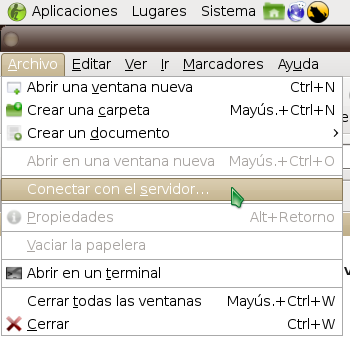
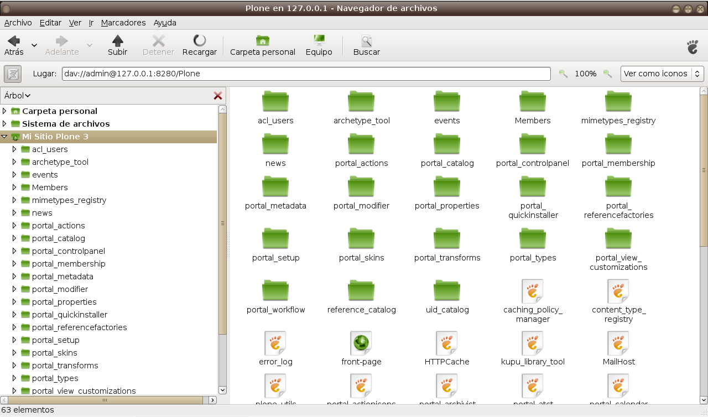

.. -*- coding: utf-8 -*-

.. _zope_como_webdav:

=======================================
Configurar Zope como un servidor WebDAV
=======================================

.. contents :: :local:

Descripción general
===================

Zope tiene a disposición su propio servidor WebDAV, usted solo necesita
activarlo y configurarlo.

`WebDAV`_, es un protocolo relativamente nuevo de Internet basado
en el protocolo subyacente de la Web, el HTTP. DAV significa en Ingles
Distributed Authoring and Versioning. Porque es relativamente nuevo es
posible qu no sea soportado por muchos editores de texto y editores HTML como
es el caso del protocolo FTP.

Configuración
=============

La forma más adecuada de configuración del servidor WebDAV de Zope va a
depender del tipo de instalación de Zope/Plone realizada:

Primero que nada detenga la instancia del servicio de Zope con el siguiente
comando:

.. code-block:: sh

  ./bin/instance stop

Instalaciones No-Buildout
-------------------------

Para instalaciones basadas en paquetes de distros, instalador de MS Windos,
entre otros que no soporte Buildout:

Modifica tu archivo zope.conf con el siguiente comando:

.. code-block:: sh

  vim $INSTANCE_HOME/etc/zope.conf

Y luego asigna la siguiente definición:

.. code-block:: cfg

  <webdav-source-server>
    # valid keys are "address" and "force-connection-close"
    # address IP:PORT
    address 127.0.0.1:8280
    # force-connection-close off
  </webdav-source-server>

Instalaciones con Buildout
--------------------------

Para instalaciones de Zope/Plone basadas en Buildout, se configura de la
siguiente forma:

Modifica tu archivo buildout.cfg con el siguiente comando:

.. code-block:: sh

  vim DIRECTORIO_INSTALACION/buildout.cfg

Y luego busca la tarea llamada "[instance]" dentro de tu configuración
buildout de asigna la siguiente definición:

.. code-block:: cfg

  [instance]
  recipe = plone.recipe.zope2instance

  ...

  zope-conf-additional =
      <webdav-source-server>
          # valid keys are "address" and "force-connection-
          close"
          # address IP:PORT
          address 127.0.0.1:8280
          # force-connection-close off
      </webdav-source-server>

Ejecución del servidor WebDAV
=============================

Luego guarde los cambios y inicie de nuevo la instancia del servicio de
Zope en modo depuración para verificar que inicio el servidor WebDAV, con el
siguiente comando:

.. code-block:: sh

  $ ./bin/instance fg

  /home/zope/Plone/zinstance/parts/instance/bin/runzope -X debug-mode=on
  2010-03-23 10:44:54 INFO ZServer HTTP server started at Tue Mar  23 10:44:54 2010
      Hostname: 0.0.0.0
      Port: 8080
  2010-03-23 10:44:54 INFO ZServer WebDAV server started at Tue Mar  23 10:44:54 2010
      Hostname: localhost
      Port: 8280

   ...

   2010-03-23 10:45:59 INFO Zope Ready to handle requests

Desde aquí, simplemente accedemos a conectarse por el cliente WebDAV que
dispone el Navegador Nautilius de GNOME de la siguiente forma:

Acceda desde el menú principal llamado "Lugares": ::

  Lugares -> Carpeta personal

Luego haga clic en  el menú principal llamado "Archivo"

Archivo -> Conectar con el servidor...

.. image:: ./images/access-server-webdav-from-gnome1.png
  :alt: Definir parámetros de conexión al WebDAV
  :align: center

Definir parámetros de conexión al WebDAV

- ***Tipo de Servidor:*** Debe definir el tipo de servidor al cual se
  va a conectar en nuestro caso WebDAV (HTTP).
- ***Servidor:*** la dirección pública o privada para conectarse al
  servidor WebDAV, en nuestro caso es ***127.0.0.1***.
- ***Puerto:*** el n?mero del puerto para conectarse al servidor
  WebDAV, en nuestro caso es ***8280***.
- ***Carpeta:*** es la ruta relativa al directorio raíz de Zope desde
  tendrá acceso a los archivos del sitio Plone, en nuestro caso es el
  nombre de mi sitio llamado ***Plone***.
- ***Usuario:*** el nombre del usuario de Zope/Plone para conectarse al
  servidor WebDAV, en nuestro caso es ***admin***, (usuario por defecto de
  administración Zope). Si es quieres definir otro usuario para subir
  archivos WebDAV debes otorgar los permisos de WebDAV.
- ***Nombre de la conexión:*** el nombre del icono de la conexión en el
  escritorio y sistema de archivos de GNOME, en nuestro caso es ***Mi Sitio
  Plone 3***.

Luego haga clic en el icono de acceso al WebDAV llamado ***Mi Sitio Plone
3***.

.. image:: ./images/access-server-webdav-from-gnome2.png
  :alt: Icono de acceso al WebDAV
  :align: center

Ahora tiene que colocar contraseña de conexión

.. image:: ./images/access-server-webdav-from-gnome3.png
  :alt: Colocar contraseña de conexión
  :align: center

WebDAV con Plone a través de GNOME

Referencias
===========

- `Authoring Content with WebDAV and FTP`_
- `Managing Zope Objects Using External Tools`_
- `Using WebDAV`_
- `More WebDAV`_

.. _WebDAV: http://es.wikipedia.org/wiki/WebDAV
.. _Authoring Content with WebDAV and FTP: http://www.zope.org/Documentation/Articles/WebDAV%20
.. _Managing Zope Objects Using External Tools: http://www.zope.org/Documentation/Books/ZopeBook/2_6Edition/ExternalTools.stx
.. _Using WebDAV: http://plone.org/documentation/kb/webdav/
.. _More WebDAV : http://plone.org/documentation/kb/more-webdav/
