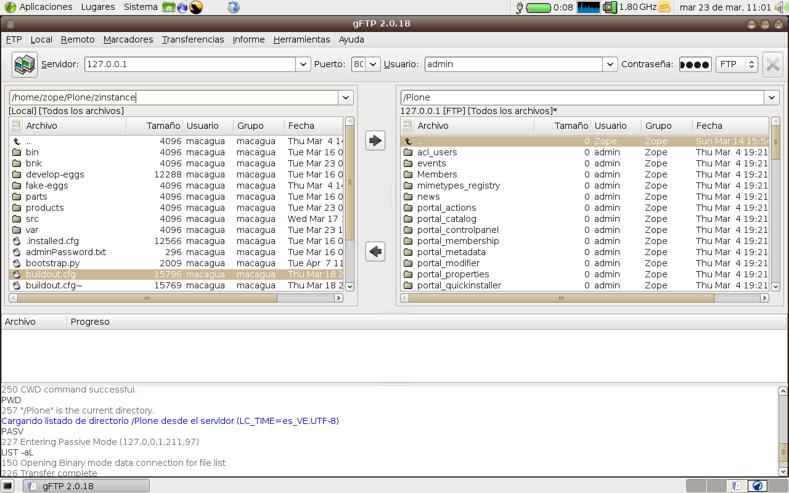

.. -*- coding: utf-8 -*-

====================================
Configurar Zope como un servidor FTP
====================================

Descripción general
--------------------

Zope tiene a disposición su propio servidor FTP, usted solo necesita
activarlo y configurarlo.

**FTP**, significa en Ingles File Transfer Protocol, es decir, Protocolo de
Transferencia de Archivos. Este protocolo es usado para trasferir archivos
desde un computador a otro. Muchos editores de texto y editores HTML soportan
protocolo FTP.

Configuración
--------------

La forma más adecuada de configuración del servidor FTP de Zope va a depender
del tipo de instalación de Zope/Plone realizada:

Primero que nada detenga la instancia del servicio de Zope con el siguiente
comando: 

.. code-block:: sh

  ./bin/instance stop

Instalaciones No-Buildout
~~~~~~~~~~~~~~~~~~~~~~~~~~~~~~

Para instalaciones basadas en paquetes de distros, instalador de MS Windos,
entre otros que no soporte Buildout:

Debe modificar su archivo de configuración zope.conf con el siguiente comando:

.. code-block:: sh

  vim $INSTANCE_HOME/etc/zope.conf

Y luego asigna la siguiente definición:

.. code-block:: cfg

  <ftp-server>
    # valid key is "address"
    # address IP:PORT
    address 127.0.0.1:8021
  </ftp-server>

Instalaciones Buildout
~~~~~~~~~~~~~~~~~~~~~~~

Para instalaciones de Zope/Plone basadas en Buildout, se configura de la
siguiente forma:

Debe modificar su archivo de configuración buildout.cfg con el siguiente comando:

.. code-block:: sh

  vim DIRECTORIO_INSTALACION/buildout.cfg

Y luego busca la tarea llamada "[instance]" dentro de tu configuración
buildout de asigna la siguiente definición:

.. code-block:: cfg

  [instance]
  recipe = plone.recipe.zope2instance
  
  ...
  
  zope-conf-additional =
    <ftp-server>
        # valid key is "address"
        # address IP:PORT
        address 127.0.0.1:8021
    </ftp-server>

Ejecución del servidor FTP
---------------------------

Luego guarde los cambios y inicie de nuevo la instancia del servicio de
Zope en modo depuración para verificar que inicio el servidor FTP, con el
siguiente comando:

.. code-block:: sh

  $ ./bin/instance fg

  /usr/local/Plone/zinstance/parts/instance/bin/runzope -X debug-mode=on
  2010-03-23 10:44:54 INFO ZServer HTTP server started at Tue Mar  23 10:44:54 2010
  	Hostname: 0.0.0.0
  	Port: 8080
  2010-03-23 10:44:54 INFO ZServer FTP server started at Tue Mar  23 10:44:54 2010
  	Hostname: localhost
  	Port: 8021
  ...
  2010-03-23 10:45:59 INFO Zope Ready to handle requests

Desde allí, simplemente apunte su manipular un cliente FTP definiendo la
conexión con los siguientes datos:

- ***Dirección IP:*** la dirección pública o privada para conectarse al
  servidor FTP, en nuestro caso es ***127.0.0.1***.

- ***Puerto:*** el número del puerto para conectarse al servidor FTP,
  en nuestro caso es ***8021***.
- ***Usuario:*** el nombre del usuario de Zope/Plone para conectarse al
  servidor FTP, en nuestro caso es ***admin***, (usuario por defecto de
  administración Zope). Si es quieres definir otro usuario para subir
  archivos FTP debes otorgar los permisos de FTP.
- ***Contraseña:*** la contraseña del usuario de Zope/Plone.

**Figura 1: Cliente FTP conectado a un sitio Plone**

Referencias
-----------

- `Authoring Content with WebDAV and FTP`_
- `Managing Zope Objects Using External Tools`_

.. _Authoring Content with WebDAV and FTP: http://www.zope.org/Documentation/Articles/WebDAV%20
.. _Managing Zope Objects Using External Tools: http://www.zope.org/Documentation/Books/ZopeBook/2_6Edition/ExternalTools.stx
